# FMSynthEnsembleV3

**[English version is here](README.md)**

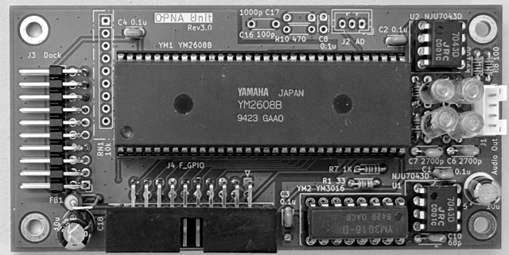

YAMAHAのFM音源LSIを使ったUSB MIDIシンセサイザ。

- システムコントローラ: **Raspberry Pi Pico**（RP2040 / RP2350A 対応）
- FM 音源 LSI: **YM2608 (OPNA)** または **YM2203 (OPN)** を最大 4 基搭載（混在可）
- MIDI: 16 チャンネル、最大 24 音のマルチティンバー・ポリフォニック
  - YM2608 × 4基の場合。YM2203は1基あたりFM3音
- CSM（複合正弦波）音声合成に対応

設計ドキュメント・回路図の一覧は [doc/README.md](doc/README.md) を参照。

## クイックスタート

VS Code と Raspberry Pi Pico 拡張を使う方法を推奨。  
pico-sdk・ツールチェーン・CMake・Ninja は拡張が自動で用意するため、個別のインストールが不要。拡張は **macOS / Windows / Linux** で利用できる。

### 1. 準備（初回のみ）

1. [VS Code](https://code.visualstudio.com/) をインストールする
2. VS Code に Raspberry Pi 公式拡張 **Raspberry Pi Pico**（ID: `raspberry-pi.raspberry-pi-pico`）をインストールし、VS Code を再起動する
3. リポジトリを取得し、サブモジュールを展開する

   ```bash
   git clone <このリポジトリ>
   cd FMSynthEnsembleV3
   git submodule update --init --recursive
   ```

   Windows では Git for Windows 付属の Git Bash、macOS / Linux では各 OS 標準のターミナルで実行する。

4. VS Code でこのフォルダを開き、サイドバーの Raspberry Pi Pico ビュー（Quick Access）から `Configure CMake` を実行する

### 2. ビルド

| OS | ビルド | コマンドパレット |
|---|---|---|
| macOS | `Cmd+Shift+B` | `Cmd+Shift+P` |
| Windows / Linux | `Ctrl+Shift+B` | `Ctrl+Shift+P` |

`Compile Project` を実行する。Quick Access の `Compile` でもよい。  
成功すると `build/FMSynthEnsembleV3.uf2` が生成される。

### 3. 書き込み

1. RaspberryPi Pico の `BOOTSEL` ボタンを押しながら USB ケーブルで PC に接続する（マスストレージ `RPI-RP2` として認識される）
2. `build/FMSynthEnsembleV3.uf2` を `RPI-RP2` へコピーする

   | OS | コピー先の例 |
   |---|---|
   | macOS | Finder の `RPI-RP2` ボリューム、または `/Volumes/RPI-RP2/` |
   | Windows | エクスプローラーの `RPI-RP2` ドライブ（例: `D:\`） |
   | Linux | ファイルマネージャのマウント先（例: `/media/<user>/RPI-RP2` や `/run/media/<user>/RPI-RP2`） |

3. コピー完了後に自動で再起動し、新しいファームウェアが起動する

以上で完了。PC からは USB MIDI デバイスとして見える。

> ボードのデフォルトは **Raspberry Pi Pico2 (RP2350A)**。Pico (RP2040) を使う場合は[ボードの切替](#ボードの切替)を参照。

## コマンドラインでビルドする場合

pico-sdk 2.2.0、ARM GCC 14.2、CMake 3.13+、Ninja を手動でインストールしていれば、VS Code なしでもビルドできる。

| OS | 補足 |
|---|---|
| macOS | Homebrew 等でツールチェーンを入れるか、Pico 拡張が配置した SDK / ツールチェーンを `PICO_SDK_PATH` 等で参照する |
| Linux | ディストリビューションのパッケージ、または [pico C SDK](https://www.raspberrypi.com/documentation/pico-sdk/) に従って導入する |
| Windows | **WSL2** または **MSYS2 / Git Bash** で以下のコマンドを実行するのが一般的。ネイティブ Windows シェルだけでは ARM GCC の導入が煩雑なため、CLI ビルドは WSL2 を推奨 |

```bash
git submodule update --init --recursive

# Configure（CMakePresets.json の "default" プリセットを使用）
cmake --preset default

# Build
ninja -C build
```

Configure で `build/compile_commands.json` も生成される。clangd はリポジトリ直下の `.clangd` 経由でこれを読み、pico-sdk と ARM GCC の include パスを解決する。

## デバッガを使う場合

[Raspberry Pi Debug Probe](https://www.raspberrypi.com/products/debug-probe/) を接続すると、SWD 経由の書き込みとシリアルコンソールが使える。

### ELF の書き込み（OpenOCD / picotool）

- コマンドパレット（macOS: `Cmd+Shift+P` / Windows・Linux: `Ctrl+Shift+P`）で `Raspberry Pi Pico: Flash Pico Project (SWD)` を実行する
- またはターミナルで `picotool load build/FMSynthEnsembleV3.elf -fx` を実行する（macOS / Linux / WSL2）

生成物の使い分け:

| ファイル | 用途 |
|---------|------|
| `build/FMSynthEnsembleV3.uf2` | BOOTSEL モードでのドラッグ＆ドロップ書き込み |
| `build/FMSynthEnsembleV3.elf` | OpenOCD / picotool でのデバッグ書き込み |

### シリアルコンソール接続

ボーレートは 115200 baud。

| Raspberry Pi Pico | Debug Probe |
|-------------------|------------|
| Pin1 (UART0 TX) | 黄 (RX) |
| Pin2 (UART0 RX) | 橙 (TX) |
| Pin3 (GND) | 黒 (GND) |

## ビルド構成の変更

### ボードの切替

デフォルトは `pico2`（RP2350）だが、`pico`（RP2040）にも切り替えられる。

VS Code の場合はコマンドパレット（macOS: `Cmd+Shift+P` / Windows・Linux: `Ctrl+Shift+P`）で `Raspberry Pi Pico: Switch Board` を実行して `pico2` / `pico` を選び、Configure と Build をやり直す。

手動の場合は `CMakeLists.txt` の次の行を変更してから再構成・再ビルドする。

```cmake
set(PICO_BOARD pico2 CACHE STRING "Board type")   # RP2350: pico2 / RP2040: pico
```

### ビルドオプション

主なオプションは以下のとおり。

| オプション | デフォルト | 説明 |
|---|:---:|---|
| `BUILD_MIDI_PANEL` | `ON` | MIDI パネルコントローラを有効にする |
| `BUILD_SD_CARD` | `OFF` | SD カードモジュールを有効にする |
| `USB_MIDI_IRQ_DRIVEN` | `ON` | TinyUSB を FreeRTOS 統合モード（割り込み駆動）で動作させる。`OFF` で Pico 標準のポーリングモード |

オプションの値は次の 2 か所で管理されており、**常に同じ値にそろえる**こと。

| 場所 | Configure の契機 | 用途 |
|---|---|---|
| `CMakeLists.txt` の `option()` デフォルト値 | Quick Access の `Configure CMake` | VS Code からの通常ビルド |
| `CMakePresets.json` の `cacheVariables` | Tasks `Configure: Default` / CLI `cmake --preset` | プリセット明示ビルド・構成仕様書 |

## ギャラリー

<table>
  <tr>
    <td align="center" width="33%">
      <a href="doc/image/overview_1.jpeg">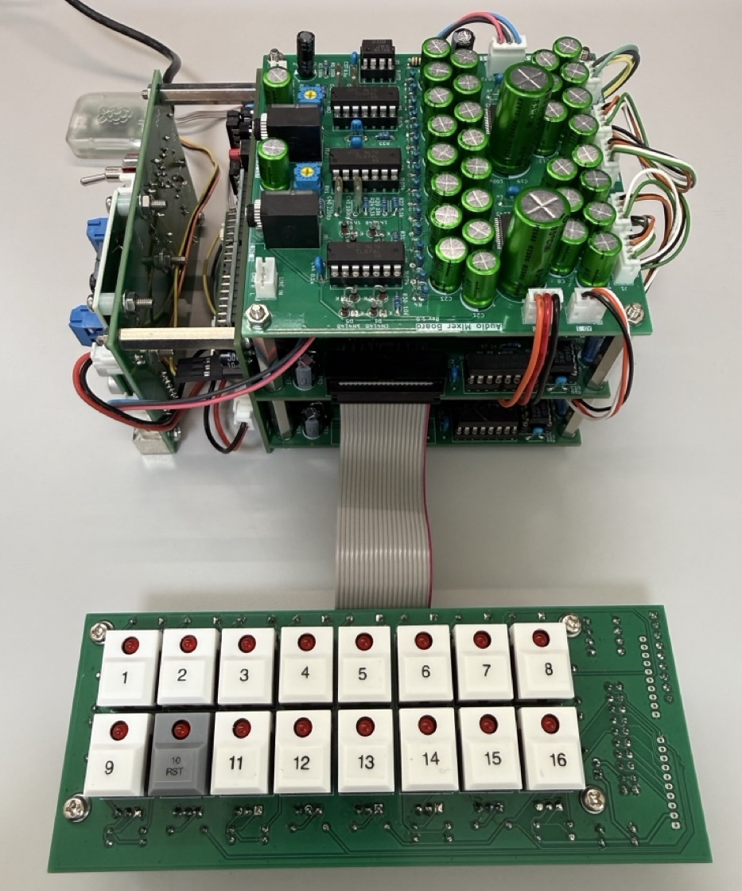</a><br>
    </td>
    <td align="center" width="33%">
      <a href="doc/image/overview_2.jpeg">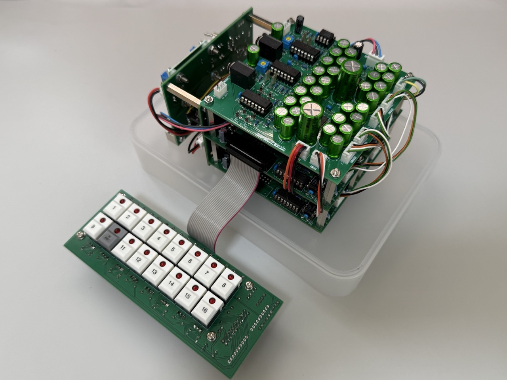</a><br>
    </td>
    <td align="center" width="33%">
      <a href="doc/image/overview_3.jpeg">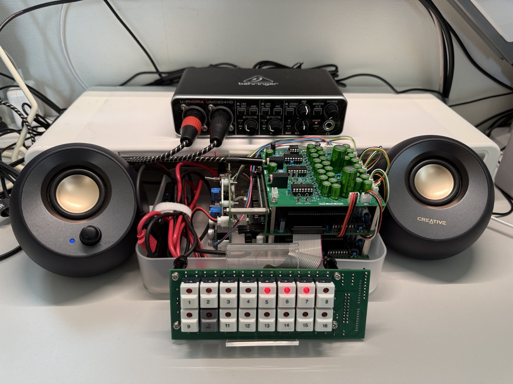</a><br>
      <sub>MIDI接続・再生</sub>
    </td>
  </tr>
</table>

### モジュール

<table>
  <tr>
    <td align="center" width="33%">
      <a href="doc/image/module_controller.jpeg">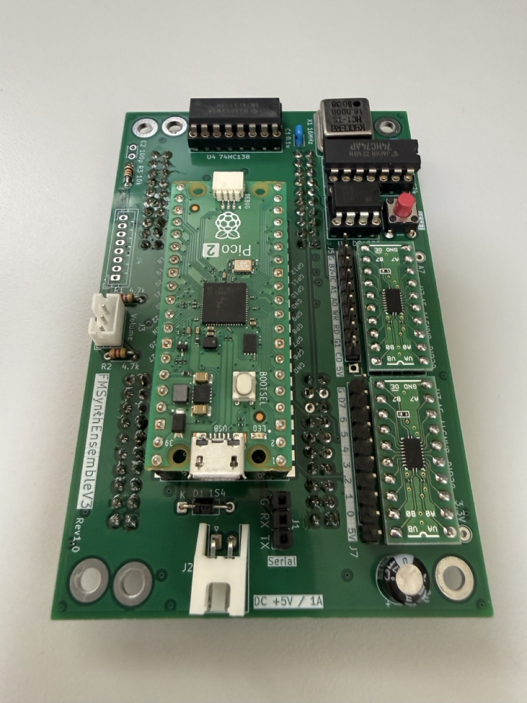</a><br>
      <b>コントローラモジュール</b><br>
      <sub>Raspberry Pi Pico2<br>OPNAモジュール用コネクタ(裏面)</sub>
    </td>
    <td align="center" width="33%">
      <a href="doc/image/module_ym2608.jpeg">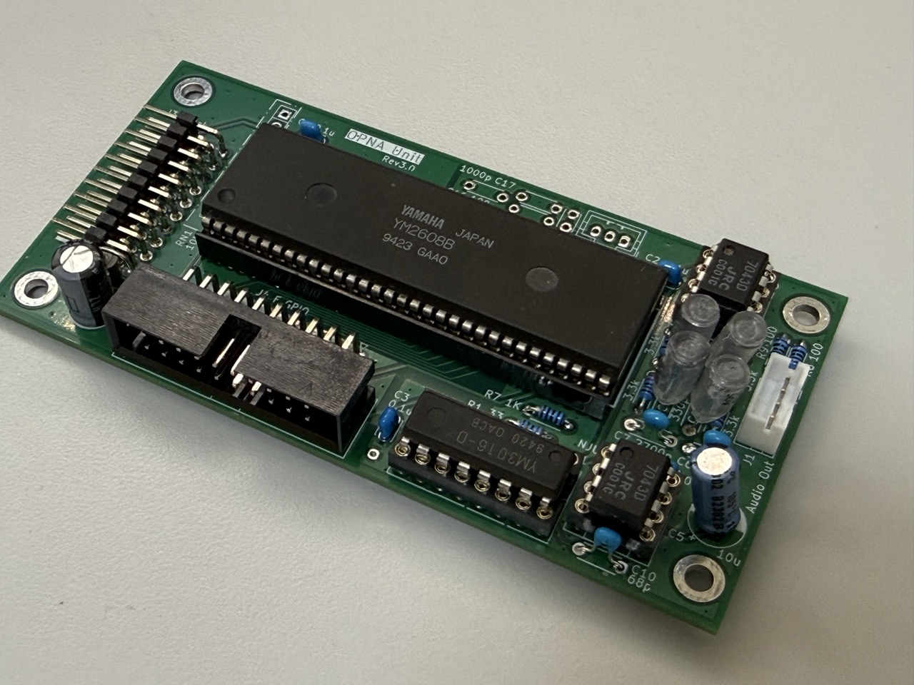</a><br>
      <b>OPNAモジュール</b><br>
      <sub>YM2608B + YM3016<br>MIDI Panel接続コネクタ</sub>
    </td>
    <td align="center" width="33%">
      <a href="doc/image/module_mixer.jpeg">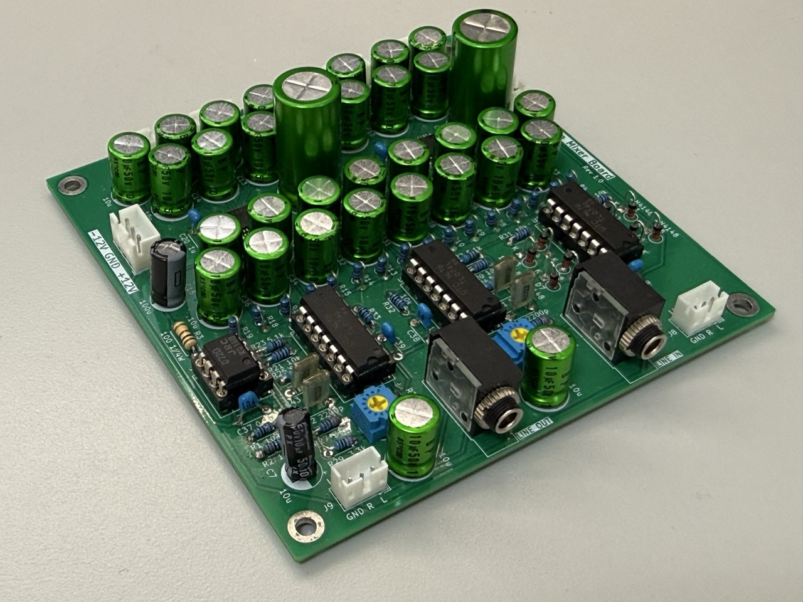</a><br>
      <b>ミキサーモジュール</b><br>
      <sub>OPNAモジュール出力の<br>オーディオミックス<br>LINE IN/OUT</sub>
    </td>
  </tr>
  <tr>
    <td align="center" width="33%">
      <a href="doc/image/module_power.jpeg">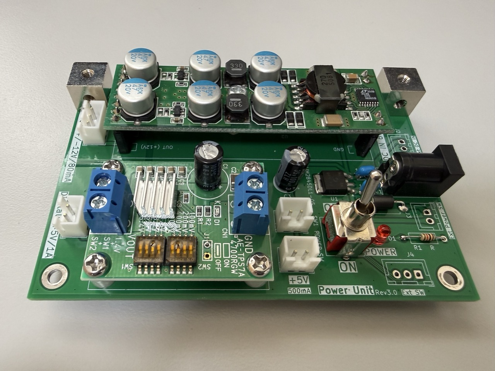</a><br>
      <b>電源モジュール</b><br>
      <sub>+6V, 2A入力<br>+5V / ±12V 出力</sub>
    </td>
    <td align="center" width="33%">
      <a href="doc/image/module_midi_panel.jpeg">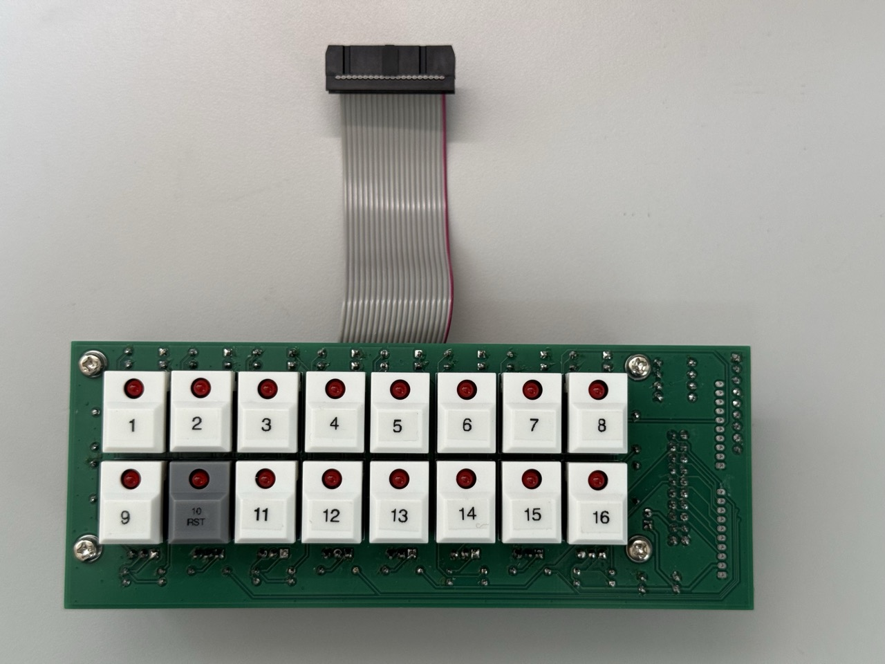</a><br>
      <b>MIDIパネルモジュール</b><br>
      <sub>16CH ON/OFF + LED<br>OPNAモジュールへ接続</sub>
    </td>
    <td></td>
  </tr>
</table>

### スタック構成　/ Dock接続

<table>
  <tr>
    <td align="center" width="33%">
      <a href="doc/image/stack_1.jpeg">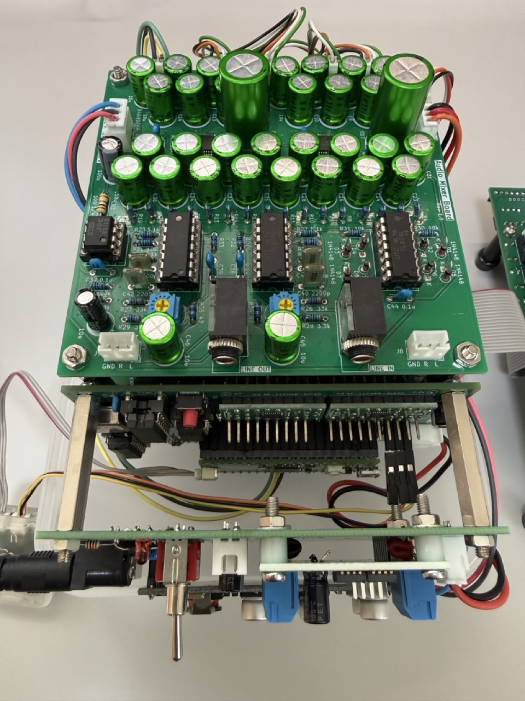</a><br>
      <b>上面</b><br>
      <sub>コントローラと電源モジュール<br>のサイドスタック</sub>
    </td>
    <td align="center" width="33%">
      <a href="doc/image/stack_2.jpeg">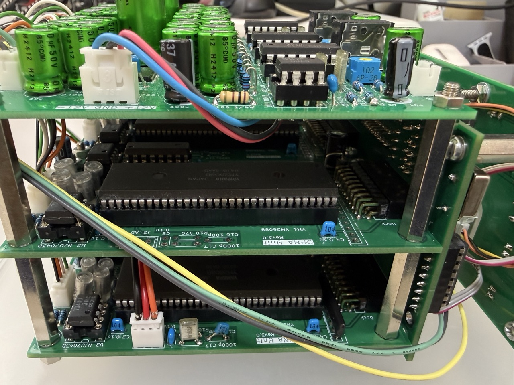</a><br>
      <b>側面</b><br>
      <sub>OPNAモジュールの接続</sub>
    </td>
    <td align="center" width="33%">
      <a href="doc/image/stack_3.jpeg">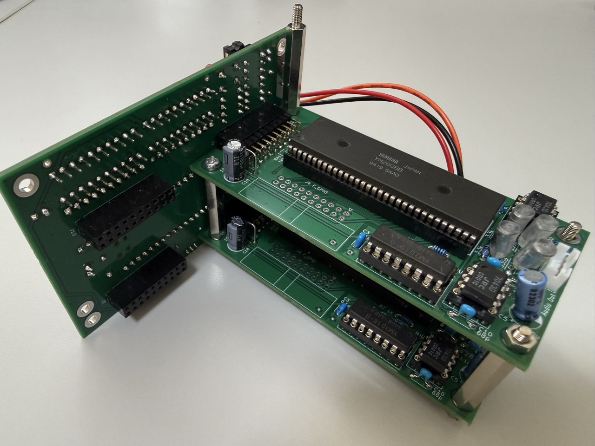</a><br>
      <b>Dock 接続</b><br>
      <sub>OPNAモジュールのDock接続</sub>
    </td>
  </tr>
</table>
