# FMSynthEnsembleV3

**[English version is here](README.md)**

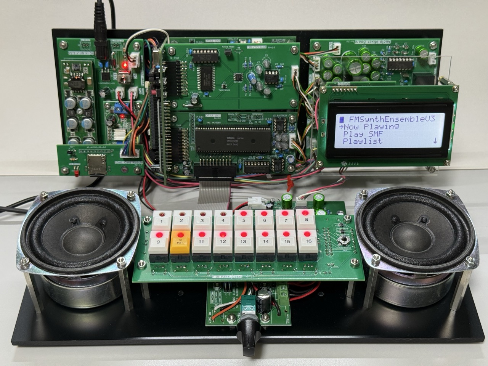

## 特徴

YAMAHAのOPN系FM音源LSIを使ったUSB MIDIシンセサイザ

- **FM音源LSI**
  - YAMAHA **YM2608（OPNA） / YM2203(OPN) / YMF288(OPN3-L)**
    - [最大4基（混在可・自動識別）](doc/spec_fm_chip.md)
  - CSM音声合成対応（YM2608 / YM2203）
- **MIDI**
  - [MIDIインプリメンテーションチャート](./doc/midi_implementation_chart.md)
  - **16 チャンネル** マルチティンバー、チャンネルごとのON/OFF
  - **最大24音同時発音**

- **システムコントローラ**
  - **Raspberry Pi Pico**（RP2040 / RP2350A）
  - Programmable I/O（PIO）によるFM音源LSIへの高速バスアクセス
  - FreeRTOSによるマルチコア(SMP)活用
- **オーディオ**
  - LINE OUT
  - LINE IN(ADPCM用・アンチエイリアスフィルタあり)
  - 電子ボリューム/LPF付きオーディオミキサー
- **モジュール形式のハードウェア**

## ドキュメント

- [ドキュメント一覧](./doc/README.md)
- [ファームウェアのビルドと書き込み方法](doc/build_ja.md)
- [回路図](./doc/schematics/README.md)

## ギャラリー

### モジュール

<table>
  <tr>
    <td align="center" width="33%">
      <a href="doc/image/YM2608_Module.jpeg">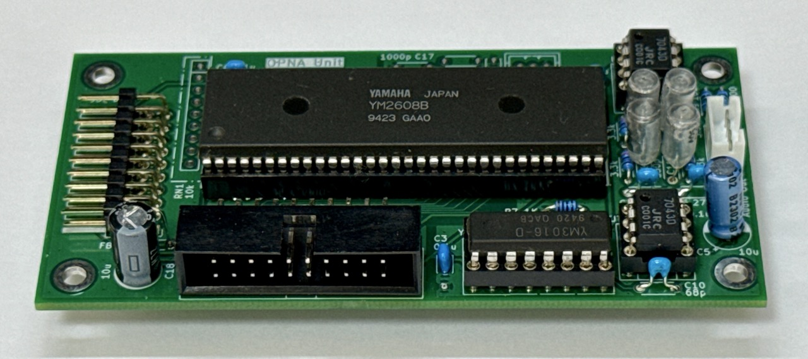</a> 
      <b>YM2608モジュール</b> 
      YM2608B + YM3016 MIDI Panel接続コネクタ
    </td>
    <td align="center" width="33%">
      <a href="doc/image/YM2203_Module.jpeg">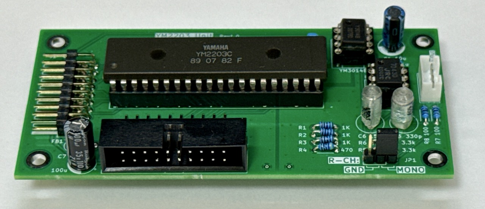</a> 
      <b>YM2203モジュール</b> 
      YM2203 + YM3014B MIDI Panel接続コネクタ
    </td>
    <td align="center" width="33%">
      <a href="doc/image/YMF288_Module.jpeg">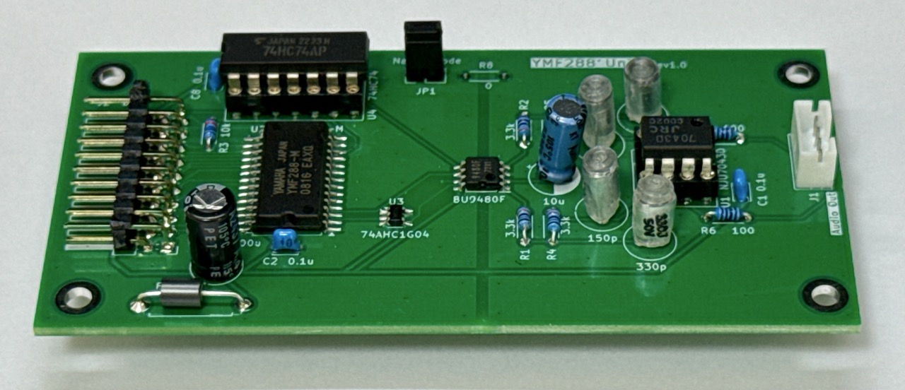</a> 
      <b>YMF288モジュール</b> 
      YMF288 + BU9480F
    </td>
  </tr>
  <tr>
    <td align="center" width="33%">
      <a href="doc/image/Main_Module.jpeg">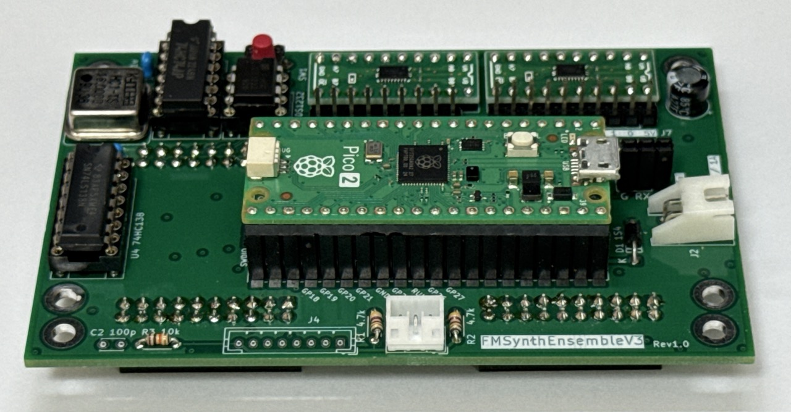</a> 
      <b>コントローラモジュール</b> 
      Raspberry Pi Pico2 FM音源モジュール用コネクタ(裏面)
    </td>
    <td align="center" width="33%">
      <a href="doc/image/AudioMixer_Module.jpeg">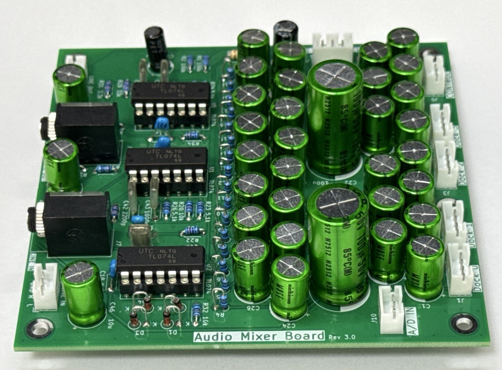</a> 
      <b>ミキサーモジュール</b> 
      FM音源モジュール出力の オーディオミックス
    </td>
    <td align="center" width="33%">
      <a href="doc/image/Power_Module.jpeg">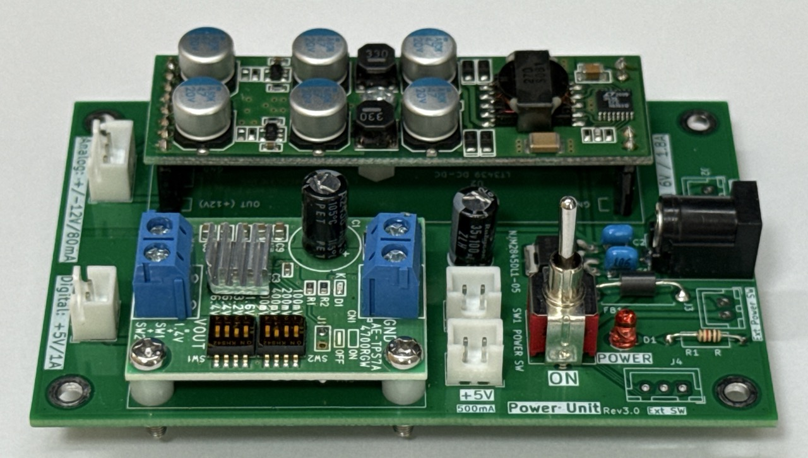</a> 
      <b>電源モジュール</b> 
      +6V, 2A入力 +5V / ±12V 出力
    </td>
  </tr>
  <tr>
    <td align="center" width="33%">
      <a href="doc/image/MIDIPanel.jpeg">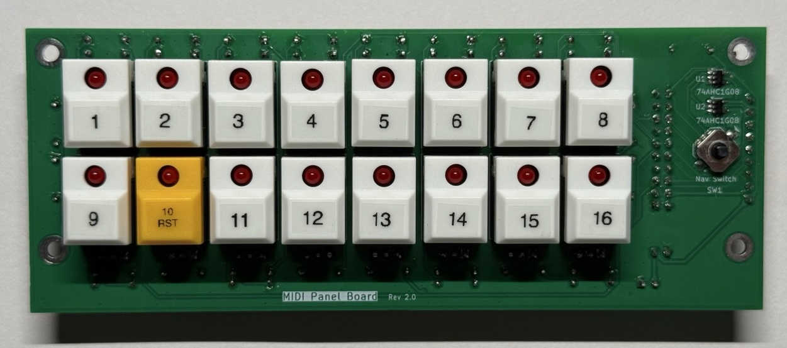</a> 
      <b>MIDIパネルモジュール</b> 
      16CH ON/OFF + LED YM2608/YM2203モジュールへ接続
    </td>
    <td></td>
    <td></td>
  </tr>
</table>

### モジュール接続

<table>
  <tr>
    <td align="center" width="33%">
      <a href="doc/image/StackedModules.jpeg">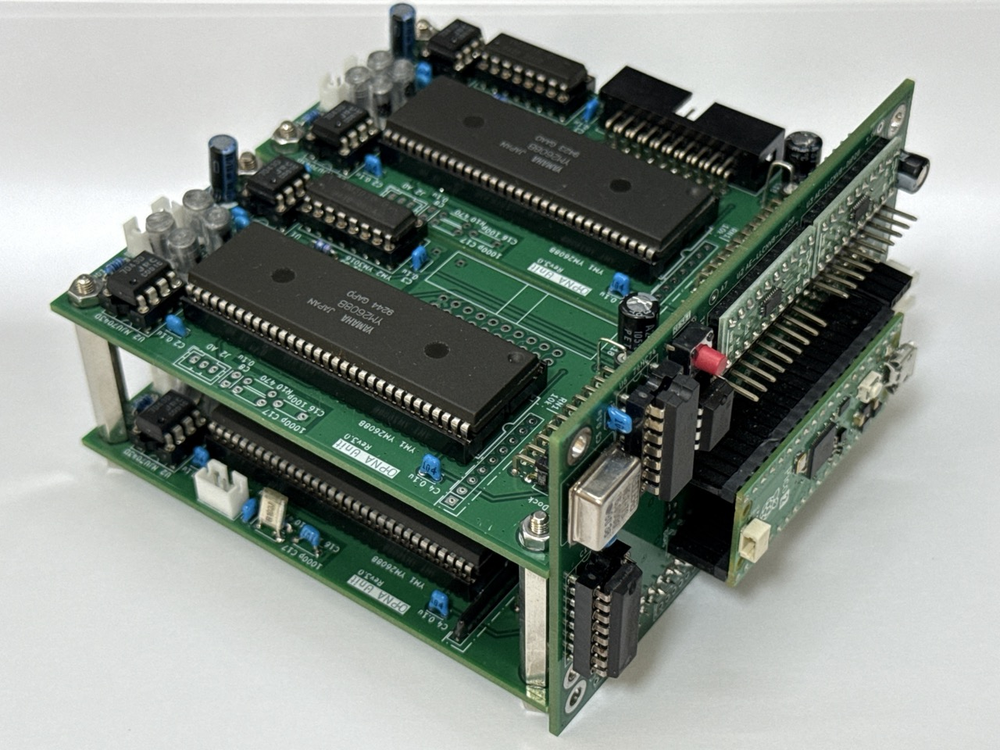</a> 
      <b>スタック</b> 
      FM音源モジュールを4枚まで接続可能 
    </td>
    <td align="center" width="33%">
      <a href="doc/image/BackPlane.jpeg">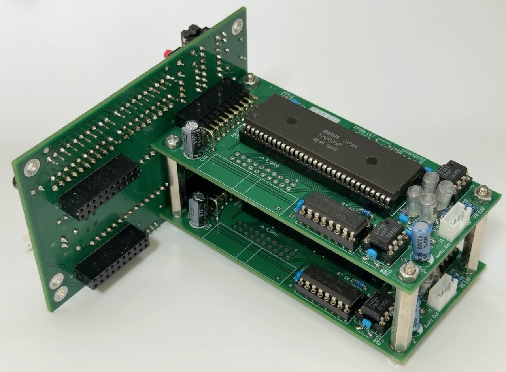</a> 
      <b>Dock 接続</b> 
      コントローラモジュールの裏面
    </td>
  </tr>
  <tr>
    <td align="center" width="33%">
      <a href="doc/image/ConnectedModules.jpeg">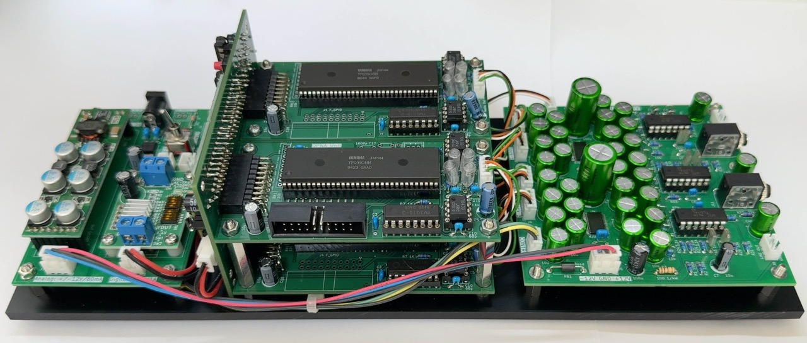</a> 
      <b>全体接続</b> 
      電源・コントローラ・ FM音源・ミキサー
    </td>
  </tr>
</table>
