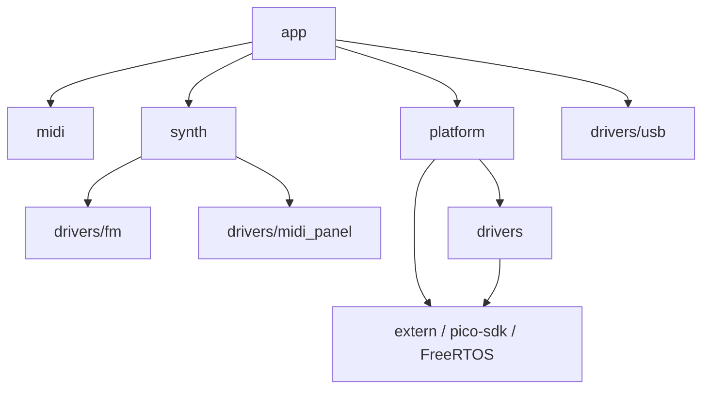

# アーキテクチャ設計仕様

プロジェクト全体の構成、各レイヤの役割、依存関係の制約を記述する。プロジェクト概要とビルド方法は [README.md](../README.md) を参照。

## 目次

1. [アーキテクチャコンセプト](#1-アーキテクチャコンセプト)
2. [ハードウェア構成](#2-ハードウェア構成)
3. [ディレクトリ構成とレイヤの役割](#3-ディレクトリ構成とレイヤの役割)
4. [依存関係](#4-依存関係)
5. [タスク構成](#5-タスク構成)
6. [拡張ガイドライン](#6-拡張ガイドライン)

---

## 1. アーキテクチャコンセプト

| コンセプト | 説明 |
|-----------|------|
| レイヤ構造 | `app` が機能を統合し、`synth` / `midi` / `platform` に委譲する。`synth` は音源抽象、`midi` は MIDI 処理、`platform` はボード統合を担当する |
| ハードウェア抽象化 | `drivers` は再利用可能な低レベル部品、`platform` はこの基板での資源所有・初期化順・ピン/PIO 割り当てを担当する |
| 外部ライブラリ分離 | `extern/` に集約し、本体コードと分離する |
| FreeRTOS SMP | RP2350 デュアルコアを FreeRTOS SMP ポートで稼働。Core0 に I/O タスク群、Core1 に音源エンジンタスクを固定配置する |
| 並列性設計 | 詳細は [design_concurrency.md](design_concurrency.md) を参照 |

各ドメインの主要クラスと依存関係は [domain/README.md](domain/README.md) のドメインチャートを参照。

---

## 2. ハードウェア構成

ハードウェアの詳細は [system_spec.md](./system_spec.md) を参照。

```
  Raspberry Pi Pico (RP2350 or RP2040)

  PIO0 ─── FM Bus (8-bit data, addr, CS×4, RD/WR, IRQ)
               ├── Dock0: YM2608 / YM2203
               ├── Dock1: YM2608 / YM2203
               ├── Dock2: YM2608 / YM2203
               └── Dock3: YM2608 / YM2203

  PIO1 ─── 2-wire serial → NJU72343 (電子ボリューム)

  SPI  ─── SD カード (FatFs / no-OS-FatFS)

  USB  ─── USB MIDI Device (TinyUSB)
```

MIDI Panel は FM 音源 LSI の I/O PortA/B を使用する外付けパネルであり、接続先 Dock はシステム仕様として固定しない。`src/app/main.cpp` の `CreateMidiPanelDriver(modules[n])` で Dock を選択する。`modules[n] == nullptr` のときは `NullMidiPanelDriver` が注入され、パネル機能は無効になる。詳細は [design_midi_panel.md](design_midi_panel.md)。

---

## 3. ディレクトリ構成とレイヤの役割

### ディレクトリ構成

```
FMSynthEnsembleV3/
├── src/
│   ├── app/               アプリケーションレイヤ
│   ├── midi/              MIDI パース・ルーティングレイヤ
│   ├── synth/             シンセサイザー抽象化レイヤ
│   ├── drivers/           デバイスドライバレイヤ
│   │   ├── fm/            FM音源ドライバ (YM2608, YM2203, OpnBase, opn_piolib)
│   │   ├── midi_panel/    MIDI パネルドライバ (FM 経由 LED matrix + スイッチ)
│   │   ├── storage/       ストレージドライバ (FatFs)
│   │   └── usb/           USB MIDI ドライバ (TinyUSB)
│   └── platform/          ボード統合レイヤ
├── extern/                外部ライブラリ (git submodule)
│   ├── NJU72343-library/
│   └── no-OS-FatFS-SD-SDIO-SPI-RPi-Pico/
└── doc/                   ドキュメント
```

### app/（アプリケーションレイヤ）

| ファイル | 役割 |
|---------|------|
| `main.cpp` | エントリポイント。初期化・マスターボリューム復帰・FreeRTOS タスク生成・`vTaskStartScheduler()` |
| `config.h` | アプリ層の実行時ポリシー定数（チャンネル数、ビブラート定数、リズムオフセット等） |
| `task_config.h` | タスク優先度・スタックサイズ・Core Affinity マスク・`MIDI_PANEL_PERIOD_MS` の定数定義。唯一の定義元 |
| `midi_ipc.h/cpp` | MIDI 用 Core 間キューと統計カウンタ |
| `csm_ipc.h/cpp` | CSM フレーム処理用イベントキュー |
| `*_task.h/cpp` | 各 FreeRTOS タスクの実装（usb_midi / midi_engine / midi_panel / csm_frame / debugger） |
| `debugger.h/cpp` | デバッグ用モジュール、対話型デバッガの提供 |

**ルール**: ハードウェアを直接操作しない。`Platform::*` と `synth` の API のみ使用する。

---

### midi/（MIDI パース・ルーティングレイヤ）

MIDI バイト列の解釈と転送先決定を担うレイヤ。[Single Parse Rule](design_midi_message.md#11-single-parse-rule) に従い、Core0 内でのみパースする。`synth/` レイヤの負荷軽減のため、ポリシーにしたがって扱わない MIDI メッセージをこのレイヤで破棄する。

| ファイル | 役割 |
|---------|------|
| `MidiMessage.h` | Core 間転送用の固定長構造体 (`MidiEvent`, `MidiControlEvent`, `MidiEventType`, `MidiControlType`) を定義 |
| `MidiParser.h/cpp` | MIDI バイト列を `MidiEvent` に変換 (`TryParseEvent`)。SysEx / Realtime の判定補助関数を提供 |
| `MidiRoutingPolicy.h/cpp` | 転送先 (`ForwardToEngine` / `HandleOnCore0` / `Drop`) を決定するポリシークラス |

**ルール**: `pico-sdk`・FreeRTOS・ドライバ層に依存しない。`MidiMessage.h` の型のみを依存関係として持ち、`app/` から利用される。

---

### synth/（シンセサイザー抽象化レイヤ）

MIDI メッセージをハードウェア非依存な形で FM 音源に変換するレイヤ。

```
synth/
├── MidiFactory.h/cpp          MidiChannel と Voice の生成・接続
├── MidiPanelController.h/cpp  MIDI Panel ドライバ API の仲介（IMidiPanelDriver）
├── MidiProcessor.h/cpp        MIDI メッセージの受信・ディスパッチ
├── VoiceLimits.h              Voice 数の静的上限（最大 4 モジュール × 6ch + CSM 1）
├── channel/                   MIDI チャンネルの抽象化 (Note/Rhythm)
│   ├── MidiChannel            チャンネル基底クラス
│   ├── NoteChannel            Note チャンネル
│   └── RhythmChannel          Rhythm チャンネル
└── voice/                     Voice（発音単位）の抽象化
    ├── Voice                  Voice 基底クラス
    ├── VoiceAllocator         Voice の動的割り当て
    ├── IVoiceReclaimable.h    Voice 回収インターフェース
    ├── NoteVoice              FM Note Voice
    ├── CsmVoice               CSM（複合正弦波音声合成）Voice
    └── csm/VOICE.dat          CSM Voice データ
```

**ルール**: FM 音源デバイスへのアクセスは `drivers/fm` のインターフェース経由とする。

---

### drivers/（低レベルデバイスドライバレイヤ）

個別 IC・バス・周辺機能を操作する再利用可能な低レベル部品を格納する。ここでは「この基板でどのピンを使うか」「起動時にどの順序で初期化するか」「システム全体で誰が所有するか」は決めない。

**ルール**: `drivers` は `platform` に依存しない。ボード固有のピン割り当て、PIO/SM の選択、起動順序、共有資源の所有ポリシーは `platform` 側で決める。

#### drivers/midi_panel/

16 CH の LED・スイッチを持つ PanelSubsystem を制御するドライバ層。FM 音源モジュールの PortA/B に接続する。詳細は [design_midi_panel.md](design_midi_panel.md)。

| ファイル | 役割 |
|---------|------|
| `IMidiPanelDriver.h` | 抽象インターフェース（LED ビットマップ・スイッチ・Tick・リセット） |
| `OpnMidiPanelDriver.h/cpp` | OPN PortA/B 経由のマトリックススキャン・トグル・LED 表示 |
| `NullMidiPanelDriver.h` | 未接続スタブ |
| `MidiPanelDriverFactory.h/cpp` | `CreateMidiPanelDriver(OpnBase*)` |

ハードウェア操作の責務はドライバに閉じ、`synth/MidiPanelController` は `IMidiPanelDriver` API のみ使用する。

#### drivers/fm/

| ファイル | 役割 |
|---------|------|
| `OpnBase.h/cpp` | YM2203/YM2608 共通インターフェース（抽象基底クラス） |
| `YM2203.h` | YM2203 固有実装 |
| `YM2608.h/cpp` | YM2608 固有実装（FM 6ch + Rhythm + ADPCM） |
| `tone/tone_table.inc` | FM パラメータテーブル（インクルードデータ） |
| `opn_piolib/` | PIO を使った FM 音源 LSI のバス操作ライブラリ |

`opn_piolib` は C API（`fm_bus_init`, `fm_device_init`, `write_reg`, `read_status`, `read_reg` 等）を提供し、PIO0 上の単一ステートマシン（`fm_bus`）で FM バスアクセスを実行するとともに、スピンロックにより CPU から見たトランザクション境界を保証する。仕様は [piolib_spec.md](../src/drivers/fm/opn_piolib/doc/piolib_spec.md)。

#### drivers/storage/

`hw_config.c` に SD カードの SPI ピン設定を記述する。no-OS-FatFS ライブラリが提供するコールバック構造体を実装する形式。

#### drivers/usb/

| ファイル | 役割 |
|---------|------|
| `tusb_config.h` | TinyUSB 設定（USB MIDI デバイスクラス有効化） |
| `usb_descriptors.cpp` | USB ディスクリプタ定義（VID/PID, string 等） |

TinyUSB の `tud_task()` 呼び出しと MIDI ストリーム読み出し (`tud_midi_n_stream_read`) はアプリケーション層の UsbMidiTask が担当し、このドライバ層は設定とディスクリプタのみを提供する。

---

### platform/（ボード統合レイヤ）

この基板で使うハードウェア資源の所有、初期化順、GPIO/PIO 割り当てを集約するレイヤ。必要に応じて `drivers` や `extern` の低レベル部品を利用し、上位レイヤ (`synth`, `app`) にはボード都合を隠した API を提供する。

`platform` は「低レベルドライバ」ではなく「ボード上の資源をどう組み合わせてシステムとして使うか」を決める場所である。例えば `VolumeController` は `extern/NJU72343-library` を使うが、PIO1/GPIO27/28 の選択、起動時ミュート、0dB 復帰という基板固有の所有ポリシーを持つため `platform` に配置する。

| ファイル | 役割 |
|---------|------|
| `init.h/cpp` | プラットフォーム初期化・FM モジュール検出の公開 API と `FmSystem` 定義。起動直後に `VolumeController` 経由で NJU72343 を全チャンネルミュートする |
| `volume_controller.h/cpp` | NJU72343 電子ボリューム制御のボード固有ラッパー。PIO1/GPIO27/28 の所有と音量 API を提供する |
| `isr.h/cpp` | GPIO 割り込みの登録・有効化 API（`FM_IRQ` 等） |
| `freertos_hooks.cpp` | FreeRTOS フック（スタックオーバーフロー・ヒープ枯渇） |
| `FreeRTOSConfig.h` | FreeRTOS カーネルのコンパイル時設定 |

#### Platform API（抜粋）

```cpp
// src/platform/init.h
namespace Platform {
    void Initialize();                          // NJU mute・GPIO・リセット・SD・USB 初期化
    std::unique_ptr<FmSystem> SetupFmModules(); // FM モジュール検出・初期化
}

// src/platform/volume_controller.h
namespace Platform {
    class VolumeController;  // GetInstance / InitializeEarlyMute / SetDockModuleTypes /
                             // MuteFmSsg / MuteLineIn / SetFmSsgVolumeDb ほか
}

// src/platform/isr.h
namespace Platform {
    void AttachIsrCallback(int gpio, void (*func)(void*), void* context);
    void EnableIsrCallback(int gpio);
    void DisableIsrCallback(int gpio);
}
```

`VolumeController` の API 詳細と NJU72343 の設定方針は [design_volume_controller.md](design_volume_controller.md) を参照。

---

### extern/（外部ライブラリ）

git submodule はここで管理する。本体コードとの変更衝突を防ぐため **extern/ 内のファイルを直接編集しない**。設定はラッパー経由で行う。

| ディレクトリ | ライブラリ | 用途 |
|------------|----------|------|
| `NJU72343-library/` | NJU72343-library | 電子ボリューム IC 制御 |
| `no-OS-FatFS-SD-SDIO-SPI-RPi-Pico/` | no-OS-FatFS | SD カード / FatFs |

FreeRTOS は `extern/` で管理せず、Raspberry Pi 公式レイアウトの `FreeRTOS-Kernel`（`pico-sdk` 隣接）を利用する。`PICO_PLATFORM=rp2350-arm-s` の場合は `FreeRTOS_Kernel_import.cmake` により **RP2350_ARM_NTZ** ポート（Community-Supported-Ports）が選択される。

`NJU72343-library` は汎用ドライバとして扱い、アプリケーション層から直接操作しない。基板固有のピン割り当て、PIO 選択、起動時ミュート、0dB 復帰、デバッグ用調整は `Platform::VolumeController` に集約する。

---

## 4. 依存関係

### CMake ライブラリ依存グラフ

```
FMSynthEnsembleV3 (実行ファイル)
  ├── synth
  │     ├── fm
  │     ├── midi_panel
  │     │     └── fm
  │     ├── platform
  │     ├── usb
  │     └── pico_stdlib
  ├── platform
  │     ├── pico_stdlib / hardware_gpio / hardware_irq / hardware_sync
  │     ├── tinyusb_device
  │     ├── nju72343
  │     ├── fm
  │     └── fatfs (BUILD_SD_CARD=ON の場合のみ)
  ├── drivers/fm
  │     └── opn_piolib
  ├── drivers/midi_panel
  │     └── fm (OpnBase)
  ├── drivers/usb
  │     ├── tinyusb_device
  │     ├── tinyusb_board
  │     └── pico_stdlib
  ├── drivers/storage
  │     └── no-OS-FatFS-SD-SDIO-SPI-RPi-Pico
  ├── nju72343
  ├── FreeRTOS-Kernel         (official FreeRTOS-Kernel から提供)
  └── FreeRTOS-Kernel-Heap4   (official FreeRTOS-Kernel から提供)
```

### ソースコードの依存方向



依存方向の制約:

- `drivers` は `platform` に依存しない
- `platform` は `synth` / `app` に依存しない
- `midi` は `pico-sdk`・FreeRTOS・ドライバ層に依存しない
- `synth` は必要な低レベル操作を `drivers` のインターフェース経由で行う。pico-sdk への直接依存は禁止
- `extern/` 内ファイルは直接編集しない（upstream との乖離を防ぐ）
- GPIO ピン番号は `platform` レイヤ内に閉じ込め、上位レイヤでハードコードしない。共有ハードウェア資源のピン割り当ては、その資源を所有する `platform` 実装または公開が必要な `platform` ヘッダに集約する
- `config.h` はアプリ層の実行時ポリシー定数に限定する。ドライバ/ミドル層の Build-time Switch は CMake `target_compile_definitions` で制御する

---

## 5. タスク構成

FreeRTOS SMP ポート（RP2350_ARM_NTZ）でデュアルコアタスクを管理する。タスク生成には `xTaskCreateAffinitySet()` を使用して Core を固定する。

```
タスク割り当て:
  Core0: UsbMidiTask    — TinyUSB + MIDI パース + Queue 投入
  Core0: MidiPanelTask  — Panel 固定周期 (MIDI_PANEL_PERIOD_MS)
  Core0: DebugTask      — デバッガコンソール（最低優先度）
  Core1: MidiEngineTask — MidiProcessor + OPN 書き込み + TickVibrato
  Core1: CsmFrameTask   — CSM フレーム処理（CSM 有効時）
```

優先度・スタックサイズ・Core Affinity の具体値は `src/app/task_config.h` を唯一の定義元とする。設計上は、Core1 の音源処理を Core0 の I/O 処理から分離し、CSM 有効時はフレーム処理を MIDI イベント処理より高い優先度に置く。

タスク間通信には FreeRTOS Queue を使用する。詳細は [design_concurrency.md](design_concurrency.md) を参照。

`platform/FreeRTOSConfig.h` の主要設定:

| 設定 | 値 | 説明 |
|-----|-----|------|
| `configNUMBER_OF_CORES` | 2 | SMP (dual-core) 有効 |
| `configTOTAL_HEAP_SIZE` | 64 KB | ヒープサイズ |
| `configENABLE_FPU` | 1 | FPU 有効 |
| `configUSE_TIMERS` | 1 | ソフトウェアタイマ有効 |

---

## 6. 拡張ガイドライン

### 新しいドライバを追加する

1. `drivers/<カテゴリ>/` ディレクトリと `CMakeLists.txt` を作成する
2. `drivers/CMakeLists.txt` に `add_subdirectory(<カテゴリ>)` を追加する
3. 必要に応じて `platform/init.cpp` に初期化処理を追記し、`Platform::Initialize()` から呼ぶ
4. 上位レイヤへの公開 API は `Platform` 名前空間のヘッダに追加する。初期化全体に関わるものは `platform/init.h`、個別の共有ハードウェア資源は専用ヘッダ（例: `platform/volume_controller.h`）に分ける

### 外部ライブラリを追加する

```bash
# extern/ 以下に submodule として追加
git submodule add <URL> extern/<ライブラリ名>
```

`extern/CMakeLists.txt` に `add_subdirectory()` を追記する。ライブラリが pico-sdk 初期化後のインクルードを必要とする場合は root `CMakeLists.txt` に直接記述する。

### MIDI チャンネルの動作をカスタマイズする

- 新しい発音方式: `synth/voice/` に `Voice` を継承したクラスを追加する
- 新しいチャンネル種別: `synth/channel/` に `MidiChannel` を継承したクラスを追加する
- チャンネル構成の変更: `MidiFactory` のコンストラクタやチャンネル生成ロジックを修正する

---

## 関連ドキュメント

| ドキュメント | 内容 |
|------------|------|
| [system_spec.md](system_spec.md) | システム仕様 |
| [spec_opn.md](spec_opn.md) | FM 音源 (OPN/OPNA) レジスタ仕様 |
| [design_concurrency.md](design_concurrency.md) | マルチコア・FreeRTOS タスク設計 |
| [design_midi_message.md](design_midi_message.md) | MIDI メッセージ処理設計 |
| [domain/README.md](domain/README.md) | ドメインチャート・クラス図 |
| [piolib_spec.md](../src/drivers/fm/opn_piolib/doc/piolib_spec.md) | PIO FM バスライブラリ仕様 |
| [datasheet/](datasheet/) | YM2608, YM2203, YM3014B, YM3016 データシート |
