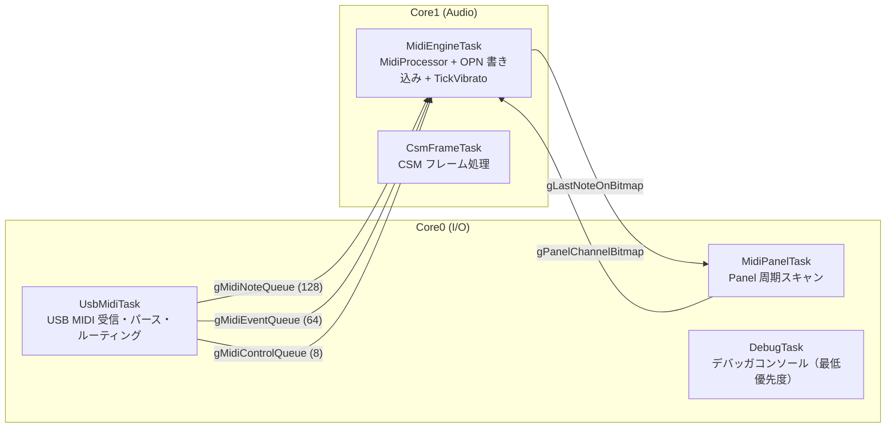
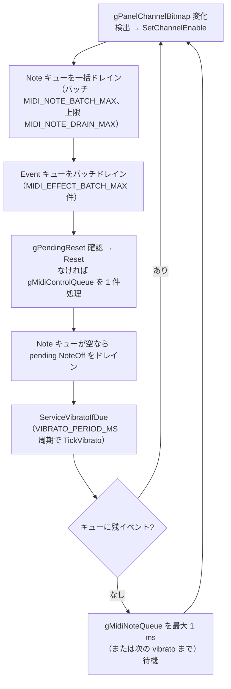
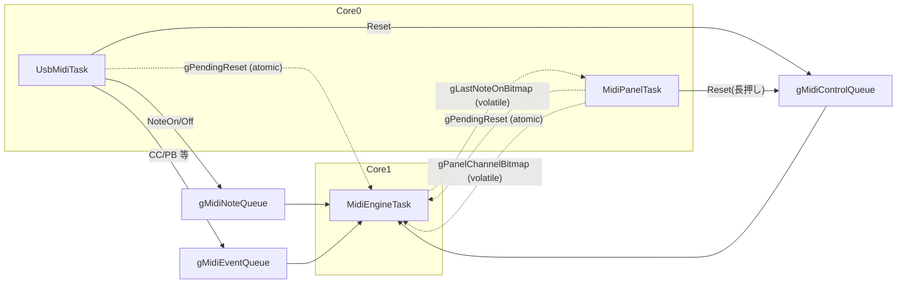

# 並列性設計仕様

FMSynthEnsembleV3 における RP2350 デュアルコアと FreeRTOS SMP を使った並列実行アーキテクチャを定義する。

MIDI メッセージのパース・ルーティング・構造化イベント定義の詳細は [design_midi_message.md](design_midi_message.md) を参照。システム全体のレイヤ構成・依存ルールは [architecture.md](architecture.md) を参照。

---

## 目次

1. [設計目標と制約](#1-設計目標と制約)
2. [Core 割り当ての基本方針](#2-core-割り当ての基本方針)
3. [タスク構成](#3-タスク構成)
4. [Core 間通信（IPC）](#4-core-間通信ipc)
5. [Single Writer Rule](#5-single-writer-rule)
6. [FreeRTOS 設定](#6-freertos-設定)
7. [トラブルシューティング指針](#7-トラブルシューティング指針)

---

## 1. 設計目標と制約

### 1.1 設計目標

| 目標 | 内容 |
|---|---|
| 低遅延音源応答 | USB MIDI 受信から OPN レジスタ書き込みまでのレイテンシを最小化する |
| I/O との干渉排除 | USB・Panel・Debugger が音源処理を妨げない |
| 実装の保守性 | Core 間の責務境界を明確にし、デッドロック・競合の原因を作らない |

### 1.2 プラットフォーム制約

- **CPU**: RP2350 Cortex-M33 デュアルコア、150 MHz
- **SRAM**: 264 KB（FreeRTOS ヒープ 64 KB 含む）
- **FreeRTOS ポート**: `RP2350_ARM_NTZ`（Community-Supported-Ports）、SMP 有効
- **FreeRTOS 配置**: 公式 `FreeRTOS-Kernel`（`pico-sdk` 隣接）を使用。配置ルールの詳細は [architecture.md](architecture.md) を参照
- **タスク固定**: `xTaskCreateAffinitySet()` で Core を固定し、スケジューラによる Core 間移動を禁止する

---

## 2. Core 割り当ての基本方針

### 2.1 Core0 の責務

- TinyUSB の `tud_task()` / `tud_task_ext()` 呼び出し（USB スタック維持）
- USB MIDI ストリームのパース・フィルタリング・キュー投入
- MIDI Panel のハードウェアスキャン（OPN PortA/B 経由）
- Panel 状態変化の検出と共有変数への書き込み
- Debugger コンソール入出力

**非責務**: OPN レジスタへの直接書き込み、Voice Allocator 操作、MidiProcessor 実行

### 2.2 Core1 の責務

- `gMidiNoteQueue` / `gMidiEventQueue` / `gMidiControlQueue` からのイベント受信
- `MidiProcessor` による Channel Voice / Mode / Reset 処理
- OPN レジスタ書き込み（FM バス操作）
- NoteOn 状態 bitmap の共有変数への書き込み

**非責務**: TinyUSB 操作、Panel ハードウェア制御、Debugger I/O、SysEx バイト列の解釈

---

## 3. タスク構成

### 3.1 タスク構成方針

タスクの優先度・スタックサイズ・Core Affinity の実際の値は `src/app/task_config.h` を唯一の定義元とする。本ドキュメントでは、実装値そのものではなく、守るべき相対関係と配置方針を定義する。

| タスク | Core 方針 | 優先度方針 | 周期/起床 |
|---|---|---|---|
| `CsmFrameTask` | Core1 | CSM 有効時は `MidiEngineTask` より高くする | FM IRQ/CSM イベント駆動 |
| `MidiEngineTask` | Core1 | 通常の MIDI 音源処理で最優先に近い位置に置く | MIDI イベント駆動 + `VIBRATO_PERIOD_MS` 周期で `TickVibrato` |
| `UsbMidiTask` | Core0 | MIDI 入力を取りこぼさない範囲で、音源処理より下に置く | USB イベント待機/ポーリング |
| `MidiPanelTask` | Core0 | USB より下でも周期を維持できる位置に置く | 固定周期（`MIDI_PANEL_PERIOD_MS`） |
| `DebugTask` | Core0 | デバッグ用の最低優先度タスクとする | イベント駆動 |
| TimerTask | Core0 | FreeRTOS 内部処理として、USB/Panel を阻害しない位置に置く | FreeRTOS 内部 |

数値設定を変更する場合は、上記の相対方針を満たしたうえで、`uxTaskGetStackHighWaterMark()` とレイテンシ計測により余裕を確認する。

### 3.2 MidiEngineTask（Core1 固定）

**役割**: 音源処理の専有タスク。Core1 上では `CsmFrameTask` 以外に割り込まれない。

メインループの処理順序（`src/app/midi_engine_task.cpp`）:

タスク起動直後（ループ前）には `gPanelChannelBitmap` を読み取り、`SetChannelEnable()` で初期状態を反映する。

本設計では演奏中のレイテンシを優先し、Reset / DebugDump / DebugStats などの制御イベントは MIDI イベント処理の後に扱う。Reset は多少の遅延を許容するが、各ループで最大 1 件の制御イベントを確認するため、連続 MIDI 受信中でも制御イベントが無期限に滞留することはない。

このほか、有効チャンネルがすべて無音のときは周期的に `VoiceAllocator::ReconcileIdleFmKeys()` を呼び、FM 側の KeyOn 残留を解消する（実装は `midi_engine_task.cpp`）。

### 3.3 UsbMidiTask（Core0 固定）

**役割**: TinyUSB スタック維持と MIDI メッセージの前処理。

処理フロー:

1. `USB_MIDI_IRQ_DRIVEN` に応じて `tud_task_ext(1, false)`（イベント待機）または `tud_task()`（ポーリング）を実行
2. `tud_midi_n_available()` を確認し、データがあれば `tud_midi_n_stream_read` で最大 32 バイトのチャンクを読み出してパース処理
3. `MidiParser` でパース、`MidiRoutingPolicy` でルーティング判定
4. NoteOn/Off は `gMidiNoteQueue`（`timestamp_us` 付与）、それ以外は `gMidiEventQueue` へ投入（ノンブロッキング）。満杯時の NoteOff 保護は [4.2 節](#42-gmidinotequeue) を参照
5. 標準リセット SysEx は `gMidiControlQueue` へ `MidiControlEvent::Reset` を投入
6. `HandleOnCore0` 判定の SysEx は Debugger SysEx ハンドラへ渡す
7. Realtime / 不明メッセージは Drop
8. データが空の場合: ポーリングモード（`USB_MIDI_IRQ_DRIVEN=OFF`）では `vTaskDelay(1ms)`。イベント待機モードでは `tud_task_ext` が待機済みのため追加待機なし

#### 3.3.1 USB スケジューリングモード

CMake オプション `USB_MIDI_IRQ_DRIVEN` で TinyUSB の OSAL モードを切り替える。既定は **ON**（`CMakeLists.txt` の `option()` と `CMakePresets.json` の `default` プリセットの両方）。

| 値 | OSAL | 動作 |
|---|---|---|
| `ON`（既定） | `OPT_OS_FREERTOS` | `tud_task_ext(1, false)` で USB イベントを最大 1 ms 待機 |
| `OFF` | `OPT_OS_PICO` | `tud_task()` ポーリング + RXFIFO 空時 `vTaskDelay(1ms)` |

補足:

- USB Full Speed の受信タイミングはホストの 1 ms フレーム境界に制約される。USB 受信自体はハードウェア割り込みで FIFO に到達し、`tud_task()` は FIFO 取り出しとクラス処理を進める役割であるため、モードを切り替えても受信タイミングの下限（1 ms フレーム境界）は変わらない。
- ポーリングモードで RXFIFO が空のとき `taskYIELD()` ではなく `vTaskDelay()` を使う。`taskYIELD()` は同優先度以上にしか CPU を譲らず、より低優先度の `MidiPanelTask` がタスクスタベーションするためである。

### 3.4 MidiPanelTask（Core0 固定）

**役割**: Panel ハードウェアの固定周期スキャンと状態共有。詳細は [design_midi_panel.md](design_midi_panel.md) の「アプリケーション統合」。

処理フロー:

1. `vTaskDelayUntil()` で `MIDI_PANEL_PERIOD_MS` 周期を維持
2. 未接続ならスキップ
3. `MidiPanelController::Tick(gLastNoteOnBitmap)` — 内部で `SetLedBitmap` → `driver->Tick()`（1 列スロット）
4. `gPanelChannelBitmap` ← `GetChannelEnableBitmap()`
5. `IsMidiReset()` の立ち上がりエッジで `MidiControlType::Reset` を IPC 送信

### 3.5 DebugTask（Core0 固定）

**役割**: Debugger コンソールコマンドの受付・実行。最低優先度で音源処理を妨げない。

---

## 4. Core 間通信（IPC）

### 4.0 用語（キュー・スケジューリング）

| 用語 | 意味 |
|---|---|
| **滞留** | キュー上でイベントが処理待ちのまま残ること |
| **Note キュー滞留** | `gMidiNoteQueue` に Note が溜まり、処理が追いつかない／特定 ch の Note が他 ch を遅らせること |
| **制御イベント滞留** | Reset / Debug 等が Note/Event 処理に押され、`gMidiControlQueue` で処理待ちが続くこと |
| **タスクスタベーション** | タスクが CPU 時間を割り当てられず実行できないこと |

### 4.1 全体構成

### 4.2 gMidiNoteQueue

| 項目 | 値 |
|---|---|
| 型 | `MidiEvent`（固定長） |
| 長さ | 128 要素（`kMidiNoteQueueLength`） |
| Producer | UsbMidiTask (Core0) |
| Consumer | MidiEngineTask (Core1) |
| 送信 | NoteOn / NoteOff とも `xQueueSendToBack` |
| 送信失敗時 | 下記の NoteOff 保護。NoteOn は Drop + `midi_note_queue_drop_count` 更新 |

キュー満杯時、NoteOff は音の止め漏れに直結するため Drop しない（`MidiIpcSendMidiNoteEvent`）:

1. キュー内の NoteOn を 1 件追い出して（evict）NoteOff を再投入する（`midi_note_on_evict_count` 更新）
2. それも失敗した場合はチャンネル × キーの pending ビットマップへ退避する（`midi_note_off_fallback_count` 更新）。MidiEngineTask は Note キューが空になったタイミングで退避分を NoteOff として処理する（`MidiIpcDrainPendingNoteOffs`）

### 4.3 gMidiEventQueue

| 項目 | 値 |
|---|---|
| 型 | `MidiEvent`（固定長） |
| 長さ | 64 要素（`kMidiEventQueueLength`） |
| Producer | UsbMidiTask (Core0) |
| Consumer | MidiEngineTask (Core1) |
| 送信失敗時 | Drop + `midi_event_queue_drop_count` 更新 |

### 4.4 gMidiControlQueue

| 項目 | 値 |
|---|---|
| 型 | `MidiControlEvent`（固定長） |
| 長さ | 8 要素（`kMidiControlQueueLength`） |
| Producer | UsbMidiTask（SysEx 標準リセット時）、MidiPanelTask（CH10 長押し） |
| Consumer | MidiEngineTask (Core1) |
| 処理優先度 | MIDI イベント処理後に最大 1 件処理 |

演奏中の MIDI イベントレイテンシを優先するため、`gMidiControlQueue` は Note/Event キューの処理後に確認する。Reset は多少の遅延を許容する一方、各ループで `gPendingReset` と `gMidiControlQueue` を確認することで、Queue Full 時の Reset 消失と制御イベント滞留を避ける。

Queue Full への耐性: Producer は `xQueueSend*(..., 0)` を使い、ブロックしない。過負荷時は Drop が発生するが、音源処理は継続する。

### 4.5 共有変数（volatile / atomic）

| 変数 | 書き手 | 読み手 | 型 |
|---|---|---|---|
| `gPanelChannelBitmap` | MidiPanelTask (Core0) | MidiEngineTask (Core1) | `volatile uint16_t` |
| `gLastNoteOnBitmap` | MidiEngineTask (Core1) | MidiPanelTask (Core0) | `volatile uint16_t` |
| `gPendingReset` | `MidiIpcSendMidiControl` (Core0) / `MidiEngineTask` (Core1) | MidiEngineTask (Core1) | `std::atomic<bool>` |

`gPanelChannelBitmap` / `gLastNoteOnBitmap` は 16-bit アライン済みの単純値であり、Cortex-M33 では 1 命令でアトミックに読み書きされる。複合操作を行う場合はクリティカルセクションを設けること。

`gPendingReset` は `gMidiControlQueue` が満杯で Reset イベントを投入できなかった場合のフォールバックフラグである。Core0 の `MidiIpcSendMidiControl()` が `store(true, release)` し、Core1 の `MidiEngineTask` が MIDI イベント処理後に `load(acquire)` で確認した後 `store(false, relaxed)` でクリアする。両コアから書き込まれるため、コンパイラ最適化の抑制だけでなく CPU 間メモリ可視性の保証も必要であり、`volatile bool` ではなく `std::atomic<bool>` を使用する。

---

## 5. Single Writer Rule

データ競合を防ぐための書き込み専有ルール。

| リソース | 書き込み専有タスク | 読み出し許可 |
|---|---|---|
| OPN レジスタ（FM バス） | Core1 の `MidiEngineTask` / `CsmFrameTask`（`fm_set_*` 経由）、Core0 の `MidiPanelTask`（PortA/B 経由） | なし（`opn_piolib` の spinlock でシリアライズ） |
| Panel ハードウェア (OPN PortA/B) | `MidiPanelTask`（Core0）のみ | なし |
| `gPanelChannelBitmap` | `MidiPanelTask` のみ | `MidiEngineTask` |
| `gLastNoteOnBitmap` | `MidiEngineTask` のみ | `MidiPanelTask` |
| `gMidiNoteQueue` への書き込み | `UsbMidiTask` のみ | `MidiEngineTask`（`xQueueReceive`） |
| `gMidiEventQueue` への書き込み | `UsbMidiTask` のみ | `MidiEngineTask`（`xQueueReceive`） |
| `gMidiControlQueue` への書き込み | `UsbMidiTask` + `MidiPanelTask` | `MidiEngineTask`（`xQueueReceive`） |

Core1 上の複数タスクから FM バスへ書き込むが、`opn_piolib` の **PIO バス spinlock** でレジスタトランザクションはシリアライズされる。同一 Voice への連続 `fm_set_pitch` は「最後の完全再計算が反映される」前提でよい（[design_effect.md](design_effect.md#4-アーキテクチャ) 参照）。

`opn_piolib` のスピンロックは Pico SDK の `spin_lock_blocking()` を使うため、保持中は**取得側コアの割り込みが禁止**される。ロック保持タスクは同一コアの他タスクに横取りされず、保持時間は 1 レジスタトランザクション分（数 µs〜数十 µs）に確定的に収まる。ロック待ちする側も、スピン中は自コアの割り込みが禁止される。したがって低優先度タスク（`MidiPanelTask`）がロックを保持している間、高優先度タスク（`MidiEngineTask`/`CsmFrameTask`）の FM バスアクセスはその保持時間だけ待たされる。

この待機中は Core1 自身の割り込みも禁止されるため、FM `/IRQ`（CSM フレームティック用、[design_csm_frame.md](design_csm_frame.md#7-isrcsmframetask-レイテンシと音質) 参照）が重なるとその処理はスピン終了まで遅延する（ロストはしない）。

`gPendingReset` は Core0 / Core1 双方から書き込まれるため Single Writer Rule の適用外であり、`std::atomic<bool>` のアトミック操作によって安全性を保証する（[4.5 共有変数](#45-共有変数volatile--atomic)）。

---

## 6. FreeRTOS 設定

設定ファイル: [src/platform/FreeRTOSConfig.h](../src/platform/FreeRTOSConfig.h)

| 設定 | 値 | 説明 |
|---|---|---|
| `configUSE_PREEMPTION` | 1 | プリエンプティブスケジューリング有効 |
| `configTICK_RATE_HZ` | 1000 | 1 ms Tick |
| `configMAX_PRIORITIES` | 32 | 優先度 0–31 |
| `configTOTAL_HEAP_SIZE` | 64 KB | Heap4 アロケータ |
| `configNUMBER_OF_CORES` | 2 | SMP デュアルコア |
| `configUSE_CORE_AFFINITY` | 1 | Core 固定有効 |
| `configTICK_CORE` | 0 | Tick は Core0 で発生 |
| `configRUN_MULTIPLE_PRIORITIES` | 1 | 両コアで異なる優先度タスクを同時実行 |
| `configCHECK_FOR_STACK_OVERFLOW` | 2 | スタックオーバーフロー全域チェック |
| `configUSE_MALLOC_FAILED_HOOK` | 1 | ヒープ枯渇フック有効 |
| `configENABLE_FPU` | 1 | Cortex-M33 FPU 有効 |

---

## 7. トラブルシューティング指針

| 症状 | 原因の可能性 | 対策 |
|---|---|---|
| MidiEngineTask が CPU 100% | Queue 満杯によるスピン | `MidiIpcGetStats()` の note/event drop 確認、Queue 長拡張を検討 |
| Panel LED ちらつき | MidiPanelTask の周期オーバーラン | `uxTaskGetStackHighWaterMark` で確認、処理軽量化 |
| MIDI 音が出ない | OPN への書き込みが Core0 から行われている | Single Writer Rule 違反の確認 |
| Reset が効かない | MidiEngineTask が完全ブロック中 | Queue Full 時は `gPendingReset` フォールバック（`std::atomic<bool>`）で保護済み。症状が続く場合は MidiEngineTask のスタックオーバーフロー・デッドロックを確認 |
| Stack Overflow ハング | タスクスタック不足 | `vApplicationStackOverflowHook` でタスク名を記録し、スタックサイズを拡張 |
| ビルドで FreeRTOS.h not found | platform ライブラリは FreeRTOS をリンクしない | FreeRTOS ヘッダが必要なファイルを FreeRTOS-Kernel をリンクするターゲット（app 等）に置く |
