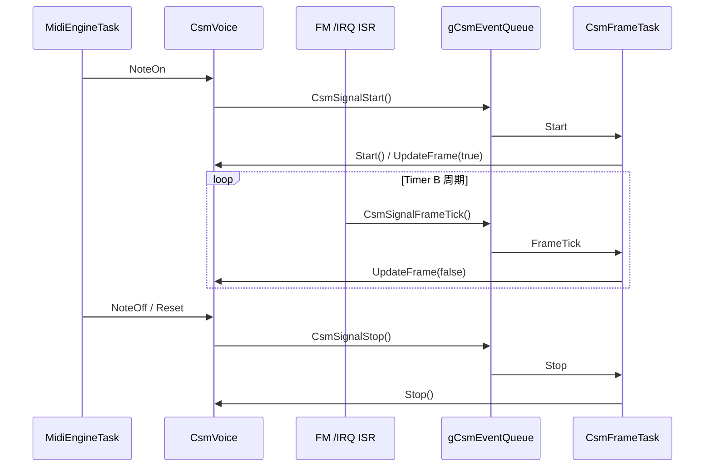

# CSM フレーム処理設計仕様

OPN の CSM（複合正弦波音声合成）におけるフレーム処理の設計仕様である。`MidiEngineTask` の Note On でトリガされるフレーム処理を、**専用タスクと FM `/IRQ` 割り込み**で並列実行するための設計をまとめる。

## 目次

1. [実装との対応](#1-実装との対応)
2. [前提: NoteVoice との相違点](#2-前提-notevoice-との相違点)
3. [並行性](#3-並行性)
4. [コンポーネント構成](#4-コンポーネント構成)
5. [データフロー](#5-データフロー)
6. [同期プリミティブ](#6-同期プリミティブ)
7. [ISR→CsmFrameTask レイテンシと音質](#7-isrcsmframetask-レイテンシと音質)
8. [アンチパターン（明示的な非目標）](#8-アンチパターン明示的な非目標)
9. [既知の制約](#9-既知の制約)

---

## 1. 実装との対応

本書の論理構成は、現行コードの次にマッピングできる。

| 論理 | 主な実装ファイル |
|------|------------------|
| CSM 用 IPC（キュー・シグナル API） | `src/app/csm_ipc.h`, `src/app/csm_ipc.cpp` |
| フレーム専用タスク | `src/app/csm_frame_task.h`, `src/app/csm_frame_task.cpp` |
| ボイス／ISR／`UpdateFrame` | `src/synth/voice/CsmVoice.h`, `CsmVoice.cpp` |
| FM IRQ GPIO・ISR 登録 | `src/platform/isr.h`（`FM_IRQ`）、`Platform::AttachIsrCallback` |
| タスク優先度・スタック・コア | `src/app/task_config.h`、`src/app/main.cpp` |

MIDI コア間キュー（`gMidiEventQueue` 等）は `midi_ipc.h` で定義され、CSM フレームティックとは別系統である（[3 章](#3-並行性)）。

---

## 2. 前提: NoteVoice との相違点

- **NoteOn まで**: `CsmVoice` は NoteOn がトリガになるまで、`NoteVoice` と同様の契約でよい（チャンネル／ボイス割当・パラメータ適用など）
- **NoteOn 以降**: 発音を FM 音源 LSI 任せにできる NoteVoice と異なり、CsmVoice ではフレーム制御が必要になる

---

## 3. 並行性

- **MidiEngineTask**: USB／midi_ipc 経由の MIDI イベント、`MidiProcessor::Exec`、パネル連動など
- **CSM フレーム処理**: FM 音源のタイマ周期にロックされた **リアルタイムストリーム**。「MidiEngineTask と別の並列処理」として扱う

したがって、Timer B に同期したフレーム処理を MIDI イベントキューに投入して順番に処理する発想は **設計上の誤り** とする（キューは MIDI のドメインであり、CSM のフレームティックではない）。

---

## 4. コンポーネント構成

### 4.1 CsmFrameTask（専用タスク）

| 項目 | 設計 | 実装 |
|------|------|------|
| 役割 | CSM の **再生開始・フレーム処理・停止** を担当する | `Start()`、`UpdateFrame(true/false)`、`Stop()` を集約 |
| アフィニティ | **Core1**（`MidiEngineTask` と同コアでよいが別タスク） | `main.cpp` で `AFFINITY_CORE1` |
| 優先度 | **`MidiEngineTask` より高い**（フレーム処理を MIDI 処理に食わせない） | `TASK_PRIORITY_CSM` > `TASK_PRIORITY_MIDI_ENGINE`（`task_config.h`） |
| 待機 | CSM 専用キューで複数イベントを順序付きで待つ（[6 章](#6-同期プリミティブ)） | `CsmIpcReceive(..., portMAX_DELAY)` |
| 起床時の動作 | イベント種別に応じて `Start()`・`UpdateFrame(false)`・停止処理を実行 | [5.3 節](#53-起床後の分岐) |

FreeRTOS 上のタスク名は `"CsmFrame"`（デバッグ用）。

CSM イベントは `FrameTick` / `Start` / `Stop` の順序が意味を持つため、EventGroup のビット合流は使わない。キュー長は実装側で固定する。

`ENABLE_CSM_START_PREEMPT != 0` の場合、`Start` は新しい発音の境界として扱う。Start 投入時に世代を進め、Start 処理が完了するまで FM IRQ 由来の `FrameTick` は投入しない。すでにキューに残っていた古い世代の `FrameTick` / `Stop` / `Start` は `CsmFrameTask` 側で無視する。`ENABLE_CSM_START_PREEMPT == 0` の場合は通常の FIFO 順で処理する。

### 4.2 MidiEngineTask（既存）

| 項目 | 内容 |
|------|------|
| CSM NoteOn 時 | MIDI 経路でのチャンネル／ボイス処理のうち MidiEngineTask に残す部分を実行したうえで、ボイス側が `CsmSignalStart` により CsmFrameTask へ再生開始を依頼する。初回フレーム処理とタイマ開始は CsmFrameTask 側で行う |
| しないこと | フレームティックを `gMidiEventQueue` に載せない。CSM 向けの開始／停止は `csm_ipc` で CsmFrameTask に渡す |

### 4.3 FM `/IRQ` 割り込み（ISR）

| 項目 | 内容 |
|------|------|
| トリガ | FM `/IRQ`（全 Dock の Wired-OR を GPIO26 に接続、`isr.h` の `FM_IRQ`） |
| ISR でやること | フレーム処理は行わない。`CsmSignalFrameTick()` で `FrameTick` イベントを投入し CsmFrameTask を起床させるのみ。実装では `CsmVoice::IrqTickThunk` → `CsmSignalFrameTick()` |
| ISR でやらないこと | 重い FM アクセス、長い処理、ミューテックス |

---

## 5. データフロー

再生データの終端・停止条件を満たせば CsmFrameTask 側で自動的に発音を停止する（フレーム終端・`stop_playback_locked` 等）。このループが CSM 再生中は Timer B に同期して繰り返される。

### 5.1 CSM 専用キューによる統合

`CsmFrameTask` は単一のブロック点で `gCsmEventQueue` を待ち、次のイベントを投入順に処理する。

| イベント | 公開 API | 発行元 | 意味 |
|----------|---------|--------|--------------|
| `FrameTick` | `CsmSignalFrameTick()` | ISR | Timer B 周期に相当する `UpdateFrame(false)` 用の 1 ステップ |
| `Stop` | `CsmSignalStop()` | `CsmVoice::NoteOff` / `Reset` 経路 | 再生中断・ボイス停止を CsmFrameTask に依頼（`voice->Stop()`） |
| `Start` | `CsmSignalStart()` | `CsmVoice::NoteOn` | 初回 `UpdateFrame(true)` を含む再生開始の起動 |

待ち合わせには `CsmIpcReceive()` を使用する。FreeRTOS の `xQueueReceive()` でイベントを 1 件ずつ取り出し、1 タスクが一本の待機ループでティック・停止・開始をまとめて扱う。

### 5.2 MidiEngineTask / CsmVoice から CsmFrameTask へ渡すもの

- NoteOff・リセット等の停止は `CsmSignalStop()` で順序付きイベントとして伝える。`CsmVoice::NoteOff` / `Reset` は停止イベントを投入し、実際の停止処理は `CsmFrameTask` が行う
- CSM の NoteOn は `CsmVoice::NoteOn` が `CsmSignalStart()` で開始イベントを投入し、`Start()` / `UpdateFrame(true)` を CsmFrameTask に集約する

### 5.3 起床後の分岐

`csm_frame_task.cpp` は `gCsmEventQueue` から `CsmEvent` を 1 件ずつ受け取り、投入順に処理する。

1. `FrameTick` → `voice->UpdateFrame(false)`
2. `Start` → `voice->Start(...)`
3. `Stop` → `voice->Stop()`

EventGroup のビット合流は使わないため、STOP→START、START→STOP、古い tick→START のような順序はキュー投入順のまま保持される。再生前または停止後に届いた `FrameTick` は `running == false` のため無視される。

`ENABLE_CSM_START_PREEMPT != 0` で新しい `Start` が来た場合は、現在の発音と残りのフレーム処理を捨てる。`Start` はキュー先頭へ投入され、世代番号が一致しない古い `FrameTick` は処理しない。キュー満杯で `Start` を投入できない場合は、古いキュー内容を破棄して `Start` を再投入する。

---

## 6. 同期プリミティブ

| 機構 | 順序保持 | 備考 |
|------|----------|------|
| FreeRTOS Queue | あり | `gCsmEventQueue`。ISR は `xQueueSendToBackFromISR`（`CsmSignalFrameTick`）。タスク側は `xQueueSendToBack`（`CsmSignalStop` / `CsmSignalStart`）。START/STOP/TICK の順序と回数を保持する |

初期化は `CsmIpcInitialize()`（`main` で `MidiIpcInitialize()` の後に呼ぶ）。

`ENABLE_CSM_START_PREEMPT != 0` の `Start` については通常 FIFO ではなく `xQueueSendToFront` を使う。音素片の再トリガを発音境界として扱い、古いフレーム更新より新しい発音開始を優先するためである。

---

## 7. ISR→CsmFrameTask レイテンシと音質

### 7.1 なぜレイテンシがクリティカルか

フレーム境界は FM音源LSI のタイマにロックされている。FM `/IRQ` ISR で通知してから `UpdateFrame(false)` が実際に走り始めるまでの時間（スケジューラ遅延＋コンテキストスイッチ）が揺れると、チップへのパラメータ書き込みタイミングがフレーム周期からずれ、**ジッタ／タイミング誤差として音質に直結する**。したがってこの経路は極小レイテンシ・極小ジッタを設計目標とする。評価指標としては、CSM 有効時のフレーム間隔ジッタ（IRQ エッジ発生から `UpdateFrame` 先頭までの分布）を用いる。

### 7.2 レイテンシの構成要素

おおまかに次の区間の和として捉える。

1. **ISR 内処理時間**: イベント投入（およびカーネルへの起床通知）のみとし、できるだけ短く固定長に近づける
2. **IRQ 終了から CsmFrameTask が実行可能になるまで**: 同一コア上のより高優先タスク・クリティカルセクションの有無
3. **CsmFrameTask へのコンテキストスイッチ**: 優先度・レディキュー実装・マルチコア時のコア間の関係

### 7.3 優先度・スケジューリング

- **CsmFrameTask は `MidiEngineTask` より必ず高優先度**とする。これにより、Core1 上で MIDI の長い処理列が `UpdateFrame` の開始を後ろへ押し出すことを避ける
- CSM 再生中に CsmFrameTask と同優先度のタスクを増やさない。同一コア上で同優先度が並ぶと時間分割になり、フレームごとの開始時刻がブレる
- ISR と CsmFrameTask は同一コア（Core1）に寄せる。クロスコアでのタスク割り当てはスケジューリングとキャッシュの観点で追加のばらつき要因になる

具体的な優先度値とスタックサイズは `task_config.h` を唯一の定義元とする。本書では「CsmFrameTask を MidiEngineTask より高優先度に置く」という相対方針だけを固定する。

### 7.4 ISR と通知プリミティブの実装方針

- ISR では CSM イベント投入＋起床に必要な最小のカーネル API のみを使う（`xQueueSendToBackFromISR` と適切な yield 処理）。長い割り込み禁止区間を増やさない
- FreeRTOS Queue は START/STOP/TICK の順序を保持するために使う
- ISR から複数タスクを無関係に起こさない（通知対象は CsmFrameTask に限定）

### 7.5 クリティカルセクション・ブロック要因の排除

- Core1／FM IRQ と共有するデータへの `portENTER_CRITICAL` の範囲と時間を監視する。長いクリティカルセクションは IRQ マスク時間を伸ばし、ISR→タスクのレイテンシ尾部を肥大化させる
- `MidiEngineTask` 側で FM バスを長時間ロックしない（NoteOn 時の設定バーストはタスク側だが、CSM 再生中のフレーム処理との競合がないよう責務を分離する）

---

## 8. アンチパターン（明示的な非目標）

- Timer B／FM IRQ のティックを `gMidiEventQueue` に詰め、`MidiEngineTask` が `UpdateFrame` を実行する設計
- ISR 内で `UpdateFrame` を直接呼ぶ設計（処理時間・再入・ロックの観点で分割する）
- レイテンシ要件を計測せずに起床プリミティブや優先度だけを決める設計
- 停止／開始を CsmFrameTask に伝えず、共有状態のみを変えてフレーム処理と競合させる設計

---

## 9. 既知の制約

- レイテンシ・ジッタの数値的な合格基準は定めていない（計測環境依存）
- `ENABLE_CSM == 0` ビルドでも `main` は `CsmFrameTask` と `CsmIpcInitialize` を無条件で呼ぶ
- CSM キュー満杯時は投入失敗を破棄する（`Start` のみ古いキュー内容を破棄して再投入）
