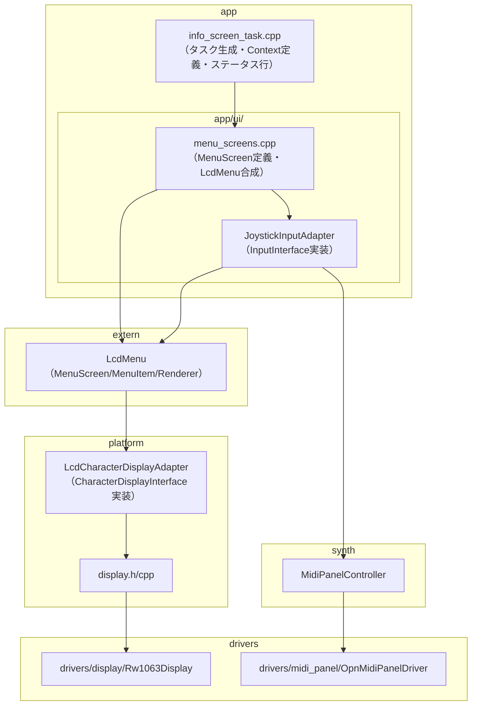
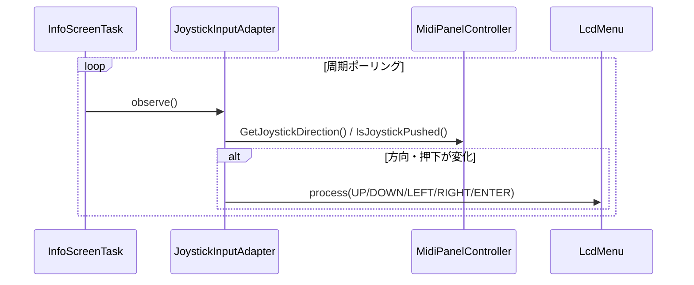
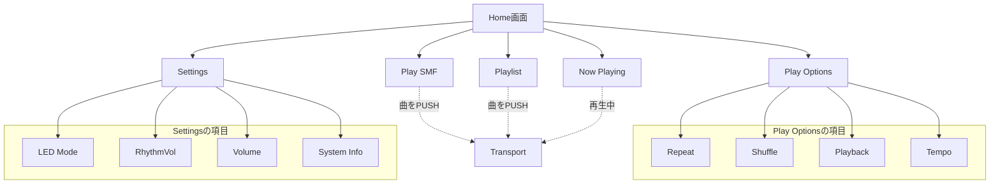
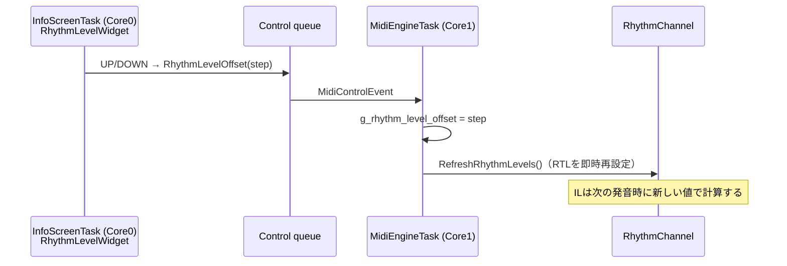

# LcdMenu UI設計仕様

I2C接続ディスプレイ（[spec_display_i2c.md](spec_display_i2c.md)）上で、外部ライブラリ [LcdMenu](https://github.com/forntoh/LcdMenu)（forntoh/LcdMenu, MIT License）を使ってメニュー画面をどのように実現するかを定義する設計書である。ジョイスティック（[spec_midi_panel.md 7章](spec_midi_panel.md#7-ジョイスティック)）で操作するメニューと、演奏状態のステータス行を扱う。

本書の役割は「UIの表示・入力・画面遷移・動作仕様」を定義することにあり、I2Cバスの物理接続やRW1063の基板基盤設計は [spec_display_i2c.md](spec_display_i2c.md) 側で扱う。LcdMenuの実装統合そのものも、画面設計の前提として必要な要素ではあるが、ハードウェア基盤設計ではない。

## 目次

- [LcdMenu UI設計仕様](#lcdmenu-ui設計仕様)
  - [目次](#目次)
  - [1. 背景と目的](#1-背景と目的)
  - [2. 全体構成](#2-全体構成)
  - [3. extern/ への統合](#3-extern-への統合)
    - [3.1 Arduino互換シムヘッダ](#31-arduino互換シムヘッダ)
  - [4. ディスプレイ側: CharacterDisplayInterfaceアダプタ](#4-ディスプレイ側-characterdisplayinterfaceアダプタ)
  - [5. 入力側: ジョイスティックInputInterfaceアダプタ](#5-入力側-ジョイスティックinputinterfaceアダプタ)
    - [5.1 デコードの配置](#51-デコードの配置)
    - [5.2 チャタリング対策](#52-チャタリング対策)
    - [5.3 InputInterface実装](#53-inputinterface実装)
  - [6. レイヤ配置](#6-レイヤ配置)
  - [7. 画面構成（MenuScreen）](#7-画面構成menuscreen)
    - [7.1 演奏状態の表示](#71-演奏状態の表示)
    - [7.2 初期メニュー構成](#72-初期メニュー構成)
    - [7.3 LED表示モード切替（Settings \> LED Mode）](#73-led表示モード切替settings--led-mode)
    - [7.4 音量調整（Settings \> Volume）](#74-音量調整settings--volume)
    - [7.5 リズム音量補正（Settings \> RhythmVol）](#75-リズム音量補正settings--rhythmvol)
  - [8. リソースと制約](#8-リソースと制約)
  - [9. 関連ドキュメント](#9-関連ドキュメント)

## 1. 背景と目的

ジョイスティックによる対話的なメニュー操作（一覧からの選択、設定値の切替など）では、ナビゲーション・カーソル・スクロール・項目種別ごとの操作が必要になる。これらを自前で実装するより、実績のあるメニューフレームワークに委譲する方が保守性が高いため、LcdMenuを採用する。

LcdMenuは以下の特性を持つ。

- MITライセンス。表示先（`DisplayInterface` / `CharacterDisplayInterface`）と入力元（`InputInterface`）を、自作アダプタで差し替えられる設計
- Arduinoライブラリとして配布されており、コアが`<Arduino.h>`に依存する。必要なシンボルは小さく、互換シムで賄える（[3.1節](#31-arduino互換シムヘッダ)）
- CMakeLists.txtを持たないため、`extern/`への統合には自前のビルド定義が必要

## 2. 全体構成



- `app/ui/`（[6章](#6-レイヤ配置)）がLcdMenuのオブジェクトグラフ（`LcdMenu`本体・`MenuScreen`・`MenuItem`・`Renderer`・入力アダプタ）を組み立てる合成ルートになる。何を表示しどう遷移するかはappの関心事
- `platform`はLcdMenuの`CharacterDisplayInterface`を実装するアダプタを持つ。ボード固有資源（I2Cバス・Rw1063Display）の所有はplatformに閉じる（[architecture.md](architecture.md)）
- ジョイスティック入力は`synth::MidiPanelController`経由で取得する。`InfoScreenTaskContext`が`MidiPanelController*`を保持している

## 3. extern/ への統合

```bash
git submodule add https://github.com/forntoh/LcdMenu.git extern/LcdMenu
```

LcdMenuはCMakeLists.txtを持たない（Arduinoの`library.json`/`library.properties`のみ）ため、`add_subdirectory()`で完結する既存のextern（NJU72343-library・no-OS-FatFS）とは異なり、`extern/CMakeLists.txt`に`add_library()`を直接記述して必要なソースを列挙する。サブモジュール内のファイルは編集しない。

```cmake
if(BUILD_I2C_DISPLAY)
    add_library(lcdmenu STATIC
        LcdMenu/src/LcdMenu.cpp
        LcdMenu/src/MenuItem.cpp
        LcdMenu/src/MenuScreen.cpp
        LcdMenu/src/renderer/MenuRenderer.cpp
        LcdMenu/src/renderer/CharacterDisplayRenderer.cpp
    )
    target_include_directories(lcdmenu PUBLIC LcdMenu/src)
    # 3.1節参照。LcdMenuの公開ヘッダからもincludeされるためPUBLIC
    target_include_directories(lcdmenu PUBLIC ${CMAKE_SOURCE_DIR}/src/platform/arduino_compat)
    target_link_libraries(lcdmenu PUBLIC pico_stdlib)  # pico/time.h解決に必要
endif()
```

### 3.1 Arduino互換シムヘッダ

LcdMenuのコア（`LcdMenu.h` → `MenuScreen.h` → `renderer/MenuRenderer.h` → `utils/lcd_menu_constants.h` / `lcd_menu_utils.h`）が`<Arduino.h>`を直接includeする。pico-sdk単体でビルドするため、必要なシンボルだけを持つ最小のシムを用意する。

| シンボル | 必要とする箇所 |
|---|---|
| `byte`型、`millis()` | 表示タイムアウト、ポーリング間隔の計測 |
| `<cstring>`系関数（`strlen`/`memcpy`/`memmove`/`strncpy`/`strcpy`/`strcat`） | `MenuItem.h`・`utils/lcd_menu_utils.h` |
| `constrain`マクロ | `MenuScreen.cpp` |
| `boolean`型（`bool`の別名） | `ItemToggle.h` |
| `__FlashStringHelper`型と`F()`マクロ | `widget/WidgetList.h`の`updateValue()`など、`DEBUG`ガードの外で無条件に`F()`を呼ぶウィジェット系ヘッダ |
| `USE_CUSTOM_PRINTF`の無効化（`0`を定義） | `utils/custom_printf.h`は既定でAVR等向けの簡易printf実装に`snprintf`等をマクロ置換する。newlibの`std::snprintf`と衝突するため無効化する |

`String`/`Serial`（`log()`関数本体）は`DEBUG`マクロを定義しない限りコンパイル対象にならないため不要。`DEBUG`は定義しない。`ItemToggle`等のウィジェット系ヘッダはヘッダオンリー実装（対応する.cppが無い）のため、テンプレートが実体化する利用側（`app/ui`）のコンパイルでもシムが必要になる。`std::vector`はpico-sdkのGNU ARM Embedded Toolchainで利用でき、`utils/std.h`の`ArduinoSTL`フォールバックには到達しない。

シム本体は`extern/`ではなく`src/platform/arduino_compat/Arduino.h`に置く。`extern/`はsubmoduleの実体のみを置く場所で、このシムは本プロジェクトが保守するコードのため。externを橋渡しする役割の`platform`に置き、`extern/CMakeLists.txt`の`lcdmenu`ターゲットから絶対パスでinclude指定する（[6章](#6-レイヤ配置)）。

```cpp
#pragma once
#include <cstdint>
#include <cstring>
#include "pico/time.h"

typedef uint8_t byte;
typedef bool boolean;

inline uint32_t millis() { return to_ms_since_boot(get_absolute_time()); }

#define constrain(amt, low, high) \
    ((amt) < (low) ? (low) : ((amt) > (high) ? (high) : (amt)))

class __FlashStringHelper;
#define F(stringLiteral) (reinterpret_cast<const __FlashStringHelper*>(stringLiteral))

#define USE_CUSTOM_PRINTF 0
```

## 4. ディスプレイ側: CharacterDisplayInterfaceアダプタ

`DisplayInterface` / `CharacterDisplayInterface`（LcdMenu側）は`stdint.h`のみに依存する純粋仮想クラスで、Arduino非依存。`platform`の`LcdCharacterDisplayAdapter`がこれを実装し、`Rw1063Display`（`drivers/display/`）をラップする。ボード資源の所有・初期化順を集約する方針（[architecture.md](architecture.md)）に従い、`VolumeController`と同様`platform`に置く。

`CharacterDisplayInterface`の各メソッドと、`Rw1063Display`が提供する機能の対応は次のとおり。

| メソッド | `Rw1063Display`の機能 |
|---|---|
| `begin` / `clear` | `Initialize()` / 行単位の空白書き込み（下記） |
| `setCursor(col, row)` + `draw(byte)` | DDRAMアドレス設定（`SetCursor`）+ 1文字書き込み（`WriteChar`）。書き込み後のカーソル進行はコントローラのオートインクリメントに任せる |
| `draw(const char*)` | `WriteChar`の繰り返し |
| `createChar(id, uint8_t*)` | CGRAM書き込み（HD44780系: `0x40 \| addr*8`コマンド）。`CharacterDisplayRenderer`が上下矢印アイコン用に使う |
| `show()` / `hide()` | Display ON/OFFコマンド（`0x08 \| D\|C\|B`）のDビット |
| `drawBlinker()` / `clearBlinker()` | 同コマンドのBビット（カーソル点滅）。D/C/Bは同一コマンドを共有するため、現在値を保持して該当ビットだけ書き換える |
| `setBacklight(bool)` | ACM2004D-FLW-FBW-IICはBL+/BL-がハード配線のみでソフト制御ピンが無いため no-op |

物理行0はステータス行として予約する（[7.1節](#71-演奏状態の表示)）。アダプタは`setCursor`で行を1つずらしてLcdMenuの行0〜2を物理行1〜3に対応させ、`clear()`は`Rw1063Display::Clear()`（全画面消去）を使わず、LcdMenuが所有する行だけを空白で上書きする。これにより、LcdMenuが画面遷移のたびに呼ぶ`clear()`でステータス行が消えない。

HD44780互換コマンドセットの範囲内（[spec_display_i2c.md 2章](spec_display_i2c.md#2-ディスプレイの仕様)）で、`drivers/display/Rw1063Display`側に実装する。

## 5. 入力側: ジョイスティックInputInterfaceアダプタ

### 5.1 デコードの配置

ジョイスティックのPB上位4bitは、`OpnMidiPanelDriver::Tick()`が列スキャンのたびに読む`pb_raw`（`io_.read_port_b()`）に含まれる。追加のバスアクセスなしに、[spec_midi_panel.md 7.4節](spec_midi_panel.md#74-ソフトウェアでのデコード)の`(PB >> 4) ^ 0x0F`でデコードして保持する。ジョイスティックはマトリックススキャンと無関係に常時有効なため、列に関わらず毎回デコードする。

`IMidiPanelDriver`はデコード済みの状態だけを公開する。生のPB4-7は公開しない。

```cpp
enum class JoystickDirection : uint8_t { None, Up, Down, Left, Right };

virtual JoystickDirection GetJoystickDirection() const = 0;
virtual bool IsJoystickPushed() const = 0;
```

`OpnMidiPanelDriver`が実装を持ち、`NullMidiPanelDriver`は常に`None`/`false`を返す。`MidiPanelController`がこれらを委譲する。ジョイスティックはPanelSubsystem基板の一部のため、**メニュー操作はMIDI Panelが接続されている場合のみ有効**になる。`BUILD_I2C_DISPLAY=ON`は`BUILD_MIDI_PANEL=ON`を前提とし、パネル無しの構成ではメニューを操作できない（仕様）。

### 5.2 チャタリング対策

ハードウェアにチャタリング除去回路は無く（プルアップのみ）、ソフトウェアでのデバウンスが必須になる。UP/DOWN/LEFT/RIGHT/PUSHの5系統すべてに一律のデバウンス（`joystick_debounce_ms`、60ms）を課す。マトリックススキャンのデバウンス（`debounce_ms`、20ms）とは別の値で、bit6（`/B`）とbit7（`/Center`）がANDゲートを介さない直結・高インピーダンスでノイズに弱いため、長めにしている。

UP/DOWN/LEFT/RIGHTの同時押しは単一レバー機構上あり得ない。したがって、[spec_midi_panel.md 7.5節](spec_midi_panel.md#75-既知の制約)の「UP+RIGHTがLEFTと同一コードになる」AND合成の性質に対する特別な誤認識対策は不要で、同時押しの組み合わせとして考慮するのはPUSHと方向の組み合わせだけになる。

**PUSH中の方向の扱い**: PUSH操作中に方向ビットへ電気的な回り込みが生じる現象（原因・対策の詳細は[design_midi_panel.md 5.3.1a節](design_midi_panel.md#531a-ジョイスティック)参照）を放置すると、PUSH操作のたびにカーソルが余分に動く。メニューにPUSH+方向の組み合わせ操作は無いため、`OpnMidiPanelDriver::UpdateJoystickInput()`がPUSH中は方向のサンプリングを止めて直前の安定値を保持し、これを防いでいる。

### 5.3 InputInterface実装

`InputInterface`（LcdMenu側）は`observe()`を呼ばれて`menu->process(code)`するだけの薄い抽象で、Arduino依存も無い。付属の`JoystickAdapter`は`analogRead()`前提のアナログ2軸ジョイスティック用で、このハードのデジタル4方向+PUSHには使えないため、`JoystickInputAdapter`を自作する。方向の変化とPUSHの立ち上がりエッジで`menu->process()`を呼ぶ。方向（UP/DOWN/LEFT/RIGHT）はオートリピートし、PUSHは対象外とする（下記）。

PUSHは`ENTER`相当として扱う。階層を上がる`BACK`は`LEFT`に割り当てる。LcdMenuの`LEFT`は横スクロール中（`renderer->viewShift > 0`）にしか意味を持たず、先頭に戻っていれば何も起きない空き入力のため、その状態の`LEFT`だけを`BACK`に変換する。

| `LEFT`を受けたときの状態 | 送るコマンド |
|---|---|
| `viewShift > 0`（横スクロール中） | `LEFT`（左スクロール） |
| `viewShift == 0`、最後の横スクロールから`kBackGuardMs`以上経過（または未スクロール） | `BACK` |
| `viewShift == 0`、最後の横スクロールから`kBackGuardMs`未満 | 送らない |

スクロールを先頭まで戻した直後の惰性押しで前画面へ戻る誤爆を、`kBackGuardMs`（`joystick_input_adapter.cpp`）のガードで防ぐ。横スクロールの時刻は`viewShift`が変化した`LEFT`/`RIGHT`で更新する。リピート由来の`LEFT`は`BACK`に変換しないため、押しっぱなしで階層を連続して抜けることはない。Home画面は親が無いため`BACK`は何も起こさない。編集モードを持つ項目は`BACK`を自分で処理して編集を抜ける。

**オートリピート**: 方向を押し続けると、初回遅延`kRepeatDelayMs`の後、`kRepeatIntervalMs`間隔で同じ方向を繰り返し送る（`joystick_input_adapter.cpp`、暫定値）。PUSH中は方向値が保持されるだけなので、リピートを止め、PUSH解除後は初回遅延から数え直す。



## 6. レイヤ配置

各コンポーネントの配置と依存方向は次のとおり。既存の依存制約（[architecture.md 4章](architecture.md#4-依存関係)）に対し、`app`が`extern/`の型を直接扱う点だけが新しい。

| コンポーネント | 配置 | 依存 |
|---|---|---|
| Arduino互換シムヘッダ（[3.1節](#31-arduino互換シムヘッダ)） | `platform/arduino_compat/` | なし（`extern/LcdMenu`ビルド用のinclude pathとして`extern/CMakeLists.txt`から参照） |
| `LcdCharacterDisplayAdapter` | `platform` | `extern/LcdMenu`（インターフェースのみ）、`drivers/display` |
| `IMidiPanelDriver`のジョイスティック・LEDモードAPI | `drivers/midi_panel` | 追加依存なし |
| `MidiPanelController`の委譲メソッド | `synth` | 追加依存なし |
| `JoystickInputAdapter` | `app/ui/` | `extern/LcdMenu`、`synth::MidiPanelController` |
| LcdMenuオブジェクトグラフの組み立て（`MenuScreen`/`MenuItem`定義） | `app/ui/` | `extern/LcdMenu`、`platform::LcdCharacterDisplayAdapter` |
| `VolumeDbWidget` / `VolumeItem`（[7.4節](#74-音量調整settings--volume)、Mute/N/A表示と編集不可ガードを追加する拡張） | `app/ui/` | `extern/LcdMenu`（`WidgetRange` / `ItemWidget`を継承）、`platform::VolumeController` |
| `RhythmLevelWidget`（[7.5節](#75-リズム音量補正settings--rhythmvol)、0.75dB刻み表示とN/A表示の拡張） | `app/ui/` | `extern/LcdMenu`（`WidgetRange`を継承）、`synth::RhythmChannel`（`g_rhythm_level_offset`の読み取りと上限定数のみ） |

**`app`が`extern/`の型を直接扱う根拠**: `app`はハードウェアを直接操作せず、`Platform::*`と`synth` APIのみを使うのが原則で、NJU72343-libraryやno-OS-FatFSのような`extern/`のライブラリは`platform`/`drivers`が仲介する（[architecture.md「app（アプリケーションレイヤ）」](architecture.md#3-ディレクトリ構成とレイヤの役割)）。LcdMenuは「何を表示しどう遷移するか」というUIロジックそのもので、ハードウェア操作ではないため、`app`が直接扱ってよいとする。ハードウェア資源（I2C・Rw1063Display）の所有は`platform`に閉じ、`app/ui/`が触るのは`DisplayInterface`実装のポインタと`InputInterface`基底クラスに限る。UIの規模が大きくなりうるため、タスク生成・`InfoScreenTaskContext`・ステータス行だけを`app/`直下（`info_screen_task.h/cpp`）に置き、画面定義と入力アダプタは`app/ui/`に分ける。

```text
src/app/
├── info_screen_task.h/cpp          # タスク生成・InfoScreenTaskContext・ステータス行
└── ui/
    ├── menu_screens.h/cpp          # MenuScreen/MenuItem定義
    ├── volume_db_widget.h          # VolumeDbWidget / RhythmLevelWidget / VolumeItem
    └── joystick_input_adapter.h/cpp
```

## 7. 画面構成（MenuScreen）

### 7.1 演奏状態の表示

通常時はメニュー画面を表示する。MIDI演奏はメニュー操作と無関係にバックグラウンドで発生するため、**演奏状態は行0を専用のステータス行として常時固定表示し、メニューのどの階層にいても見えるようにする**。ルート画面でのみ表示する方式は、サブメニュー操作中に演奏開始へ気づく手段が無くなるため採らない。

`Platform::kDisplayRows`（4行）のうち行0をステータス行とし、LcdMenuには残り3行（`maxRows=3`）だけを使わせる。行のずらしは`LcdCharacterDisplayAdapter`が持つ（[4章](#4-ディスプレイ側-characterdisplayinterfaceアダプタ)）。行0はLcdMenuの描画サイクルと独立に、`InfoScreenTask`が`Platform::DisplayWrite`で直接更新する。メニューの表示行数は3行になる。LcdMenuの`renderer.updateTimer()`（無操作で全画面を消す機能）は、ステータス行まで消えてしまうため使わない。

`InfoScreen::NotifyPlay` / `NotifyTrackStart` / `NotifyStop` / `NotifyError`は他タスクから呼ばれ、メールボックスと`xTaskNotifyGive()`で`InfoScreenTask`に渡す。`NotifyPlay`は演奏イベントごとに呼んでよく、「最初の1件だけ伝える」重複排除（`gPerformanceActive`）は`InfoScreen`内部で行う。ただし曲名を伴う呼び出しはゲートに関わらず常に伝える（曲名がNoteOnより後に判明する場合がある）。

| 状態 | 行0の表示 | 終了条件 |
|---|---|---|
| Play | 曲名（未確定なら`Playing`） | `NotifyStop`（SMF再生セッションの終了）、または演奏イベントが5秒途絶（Timeout） |
| Error | `NotifyError`のメッセージ | 5秒経過（Timeoutと同じ仕組み） |
| MIDI Reset | `MIDI Reset` | 2秒経過 |
| なし | Home画面ではタイトル表示、Home以外では空白 | - |

`NotifyStop`は、SMF再生セッションが終了したとき（最後の曲のEnd of File、`Stop`コマンド）に発行する。次の曲へ続く曲の終了では発行せず、曲が切り替わるたびに`NotifyTrackStart`で前の曲名を消して`Playing`に戻す。エラーでセッションが終わったときは、エラー表示を残すため`NotifyStop`を発行しない。SMF再生中（`Playing`/`Paused`）は、演奏イベントが5秒途絶してもTimeoutで表示を消さない。詳細は [design_smf_playback.md](design_smf_playback.md#7-lcd-への通知) を参照。

**デフォルト表示**: ステータス表示（Play/Error）が出ていない間、`InfoScreenTask`が毎周期、現在の画面に応じて行0を更新する。ステータス表示の終了もHomeとサブメニューの間の遷移も、この同じ処理で賄える。ステータス表示は行を20桁の空白埋めで上書きするため、デフォルト表示の残骸は残らない。

**MIDI Reset表示**: `MidiEngineTask`がMIDI Resetを実際に適用するたびに増える`gResetPulseSeq`（[design_midi_panel.md 11.5節](design_midi_panel.md#115-reset-通知点滅)と同じ通知）の変化を`InfoScreenTask`が検出し、`MIDI Reset`を2秒間表示する。パネルのCH10長押しでも、USB/SMF経由のSysEx Resetでも、パネルの接続有無にかかわらず同じ表示になる。表示中も裏ではPlay/Stop/Error/デフォルト表示の更新を続け、2秒経ったらその時点の最新のステータス行に戻す。

**エラー表示（`InfoScreen::NotifyError`）**: `SmfPlayerTask`のエラーはシリアルデバッガの`std::printf`に出るだけでは、LCDだけで使っているときに成否を確認する手段が無い。そのため、SDカードアクセスの失敗を短いメッセージでステータス行に即座に表示する。メッセージは20桁に収まる固定文字列とする。

| 失敗の種類 | 表示 |
|---|---|
| 指定インデックスのファイルが無い | `SD: not found` |
| SDカードのファイル列挙に失敗 | `SD: scan failed` |
| ファイル/トラックを開けない | `SD: open failed` |
| フォーマットエラー | `SD: bad format` |
| トラック数超過 | `SD: too many trk` |
| 再生中のI/Oエラー・パーサー内部エラー | `SD: I/O error` |

### 7.2 初期メニュー構成



戻る操作は、ジョイスティックのLEFT（[5.3節](#53-inputinterface実装)）が担う。専用の戻る項目は置かない。各画面の詳細は下表、`Play Options`と`Settings`配下の各項目の詳細はそれぞれの節（[7.3節](#73-led表示モード切替settings--led-mode)、[7.4節](#74-音量調整settings--volume)、[7.5節](#75-リズム音量補正settings--rhythmvol)、[design_smf_playback.md](design_smf_playback.md#8-lcd-メニューとの連携)）を参照。

| 画面 | 内容 |
|---|---|
| **Play SMF** | `Platform::ForEachSmfFile()`で列挙したSDカード上のファイルを、ファイルごとに1行の`ItemCommand`として並べる。PUSHで再生を始め、Transport画面へ移る。シリアルデバッガの`Ls`/`Play <index>`と同じ番号体系 |
| **Playlist** | `Platform::ForEachPlaylistFile()`で列挙した`playlist`フォルダ内のファイルを名前昇順で並べる。PUSHで`SmfPlayer::RequestPlayPlaylist(position)`を呼び、Transport画面へ移る。フォルダが無い、または空のときは`(no files)` |
| **Now Playing** | 再生中（`Playing`/`Paused`）なら Transport 画面へ直接移る（`OpenTransport(g_rootScreen)`）。`Idle` のときは何もしない |
| **Play Options** | `Repeat`（`ItemCommand`: Off/1/Loop）・`Shuffle`（`ItemCommand`: Off/On）・`Playback`（`ItemCommand`: Single/Cont.）・`Tempo`（`VolumeItem`: 曲開始時の既定テンポ倍率）の再生制御設定 |
| **Transport** | `Pause`/`Resume`・`Stop`・`Next`・`Prev`・`Tempo`。曲を選んだときに移り、再生が終わると元の一覧へ戻る |
| **Settings** | `LED Mode`（`ItemToggle`、[7.3節](#73-led表示モード切替settings--led-mode)）・`RhythmVol`（`VolumeItem`、[7.5節](#75-リズム音量補正settings--rhythmvol)）・`Volume`（[7.4節](#74-音量調整settings--volume)）・`System Info`（`ItemLabel`） |
| **Volume** | NJU72343の全16CHを1行1CHで並べ、`PUSH`で編集モードに入り0.5dB単位（Mute含む）で個別調整する読み取り/書き込み画面。常時ミュート対象CHは表示のみで編集不可（[7.4節](#74-音量調整settings--volume)） |
| **System Info** | Dock毎のFMモジュール種別、MIDIパネル接続有無、Voice/CSM数を表示する読み取り専用画面。Dock構成は起動時に確定し、Voice/CSM数は`RefreshSystemInfo()`が1000ms周期（`INFO_SCREEN_SYSINFO_REFRESH_MS`）で更新する |

Play SMF・Playlist・Transport・Repeat・Shuffleの動作は [design_smf_playback.md](design_smf_playback.md#8-lcd-メニューとの連携) で定義する。

**Play SMFの設計判断**:

- **1ファイル1行の`ItemCommand`**: ファイル名だけをラベルにして1行を専有できる。ラベルと値を1行で共有する`ItemList`では、「Play SMF: 」のラベルが約10桁を占めて20桁の画面に値が収まらず、常に横スクロールが必要になる。`ItemList`は編集モードで「押して選ぶ→もう一度押して確定」の2段階操作になる。`ItemCommand`ならPUSH一発で再生でき、これらの問題が無い
- **表示はファイル名のみ**: `ForEachSmfFile()`が返すSDボリューム上のフルパス（例: `0:/MIDI/Misc/xxx.mid`）はディレクトリ部分で20桁を超えるため、最後の`/`より後ろだけを表示する。異なるディレクトリの同名ファイルは区別できない
- **コールバックのテンプレート生成**: `ItemCommand`のコールバックは引数を取らない関数ポインタ（`void(*)()`）でファイル位置を渡せない。そのため、ファイル位置ごとの関数`PlaySmfFileAt<Index>()`をテンプレートで機械的に生成し、コンパイル時に関数ポインタ表を作る
- **ファイル数の上限**: `config.h`の`MENU_MAX_SMF_FILES`は既定値255で、LcdMenuの項目位置（`cursor`・`view`）が`uint8_t`で1画面の項目数が最大256のため。256件でも収まる計算だが、`uint8_t`の境界を実機で検証していないため、1件の余裕を残して255件を上限にしている。超えたファイルはメニューに出ない（シリアルデバッガの`smf play`からは再生できる）。SDカードの走査は`InfoScreenTask`の起動時に1回だけ行い、ファイル数に比例して時間がかかる

### 7.3 LED表示モード切替（Settings > LED Mode）

MIDI PanelのLED表示モード（[design_midi_panel.md 11章](design_midi_panel.md#11-led-表示モード)）は、`Settings`画面から切り替える。PB bit7はジョイスティックのPUSHに割り当てられておりモード切替に使える入力が無いため、ハードスイッチではなくソフトウェアで切り替える。`IMidiPanelDriver`にモード設定APIを持つ。

```cpp
virtual void SetLedMode(bool note_reflect) = 0;
virtual bool GetLedMode() const = 0;
```

`OpnMidiPanelDriver`はこれをメンバ変数`led_mode_note_`として保持し、`Tick()`内のLEDソース選択（`ResolveEffectiveLedBitmap()`）に使う。既定値は`true`（Note、演奏に追従するモードB）。`NullMidiPanelDriver`は保持のみ、`MidiPanelController`は委譲する。

`Settings`画面の項目は`ItemToggle("LEDmode", "CH-Toggle", "Note", callback)`。表示ラベルは、内部名の「モードA/B」ではなく、動作が伝わる語にしている。

| 表示ラベル | 対応する内部状態 | 動作 |
|---|---|---|
| `Note`（既定、`enabled=false`） | モードB | Note Onが来たチャンネルのLEDが光る（演奏に追従） |
| `CH-Toggle`（`enabled=true`） | モードA | ソフトトグルのON/OFF状態をそのままLEDに表示（演奏に関係なく点きっぱなし） |

### 7.4 音量調整（Settings > Volume）

NJU72343の全16チャンネル（[spec_volume_controller.md 1.2節](spec_volume_controller.md#12-ミキサー基板とfm音源モジュールの信号接続)のCH表）を、`Settings`画面から`Volume`で個別に調整する。値の取得・設定は`Platform::VolumeController`の個別チャンネルAPI（[design_volume_controller.md 5節](design_volume_controller.md#5-api設計方針)）を使う。

**行構成**: 1CH = 1行の`VolumeItem`（`VolumeDbWidget`を持つ`ItemWidget`）。16行を1つの`MenuScreen`に並べ、`UP`/`DOWN`で行選択する（5.3節と同じオートリピート）。行の並び順とラベルは次の通り。

- 並び順: dock番号（0〜3）順、dock内は`FM-L`→`FM-R`→`SSG`の順。最後にdockに紐付かない`LineMix-L`→`LineMix-R`→`LineSmp-L`→`LineSmp-R`を置く。
- ラベル: dock番号を先頭に置き、信号名と`-`でつなぐ（例: `0-FM-L`、`0-SSG`）。L/Rも`-`でつなぐ（例: `LineMix-L`）。`LineSmp`は`LineSample`（`SetLineSampleVolumeDb()`等のAPI名）の10桁制限に合わせた省略表記。信号とdockの対応は[spec_volume_controller.md 1.2節](spec_volume_controller.md#12-ミキサー基板とfm音源モジュールの信号接続)のCH表を参照。

**編集モードの出入り**: 5.3節の既存規約をそのまま使う。`UP`/`DOWN`は行選択にも値編集にも使うため、両者を区別するために`PUSH`（`ENTER`相当）による編集モード開始は必須。`PUSH`で編集モードに入ったあとは、`UP`/`DOWN`のたびに`VolumeDbWidget`の`onChange`コールバックが呼ばれ、NJU72343へ即座に書き込む（リアルタイム反映）。編集を終えるときは、`BACK`（横スクロールしていない状態の`LEFT`）でも、編集中にもう一度`PUSH`（`extern/LcdMenu`の`BaseItemManyWidgets::process()`が1行1Widget構成のENTERを確定として扱う）でも、どちらでも現在の値を保持したまま抜けられる。`WidgetRange`標準の「`BACK`で編集開始時点の値に巻き戻す」動作（`cancelEdit()`）は、`VolumeDbWidget`でオーバーライドして無効化している。`UP`/`DOWN`の時点で既にNJU72343へ反映済みの値を、表示だけ巻き戻すと不整合になるため。この画面専用の入力ハンドリングは追加しない。

`UP`/`DOWN`のたびにPIO 2-wire serial書き込みが発生する（オートリピート中は連続）。Zero Cross Detectionは既定でONのため、頻繁な書き込みでもポップノイズは抑制される（[design_volume_controller.md 3節](design_volume_controller.md#3-zero-cross-detection)）。シリアルクロックは100kHzで、書き込み頻度に対して十分高速。

**値の範囲とMute表現**: `VolumeController`の公開定数`kMinDb`/`kMaxDb`/`kStepDb`（`-95.0dB`〜`+31.5dB`、0.5dBステップ）をそのまま使う。Muteは数値レンジの外側の状態のため、レンジの下限をさらに1ステップ拡張し、その値をMute専用の特別な値として扱うことで表現する。`-95.0dB`から`DOWN`するとMuteに入り、Muteから`UP`すると`-95.0dB`に戻る。Mute専用の値からさらにもう1段下げた値を、編集不可チャンネル用の表示（`"N/A"`、後述）専用に予約する。UP/DOWNで到達することはなく、`available=false`の行の初期値としてのみ使う。

`extern/LcdMenu`の`WidgetRange::draw()`は`snprintf(buffer, size, format, value)`で単一の数値をそのまま描画するだけで、レンジ外の値を任意の文字列（`Mute`/`N/A`）として描画する機能を持たない。`extern/`は直接編集しないため、`app/ui/`側に`WidgetRange<int16_t>`を継承したWidget（例: `VolumeDbWidget`、`app/ui/volume_db_widget.h`）を追加し、`draw()`をオーバーライドして、編集不可専用の値のときは`"N/A"`、Mute専用の値のときは`"Mute"`、それ以外は常に`+`/`-`符号を付け、整数部を2桁幅（0埋めなし、1桁の値は空白埋め）にした0.5dB表示に`dB`を付けて出す（例: `+31.5dB`、`+ 5.0dB`、`-95.0dB`）。デバッガの`vol`コマンド（`debugger_task.cpp`の`c_volume_table()`）は正符号を付けず値ごとに`dB`も付けない別書式のため、両者は一致しない。

**常時ミュートCHの扱い**: 未接続dock、およびYMF288搭載dockのSSG入力（[design_volume_controller.md 1節](design_volume_controller.md#1-制御方針)）は、`VolumeController::IsChannelAvailable()`で判定する。該当行は一覧に表示するが編集不可にする。行の種類は他のCHと同じ`VolumeItem`のままとし、`VolumeItem::process()`内で`PUSH`（編集モード開始）を無視するガードを入れる（可否で行の種類自体を分けない方が、画面初期化ロジックがシンプルになる）。表示値も`"N/A"`（上記）にして、ユーザーが自分でMuteに設定した行と区別できるようにする。

**初期値と再同期**: 画面構築時（`BuildRootScreen()`）に、編集可能な行は`VolumeController::GetChannelVolume()`の戻り値で初期化する。編集不可の行（上記）は、シャドウ値に関わらず`"N/A"`用の特別値で固定する。Volume画面を表示中かつ編集中でない場合は、`InfoScreenTask`の周期処理から`RefreshVolumeUi()`を呼び、デバッガなどによる変更後のシャドウ値へ表示を再同期する。再同期はWidgetの値だけを更新し、`onChange`を呼ばないためNJU72343への重複書き込みは発生しない。

**リソース影響**: 16行分の`VolumeDbWidget`＋`VolumeItem`は、他の画面と同様`BuildRootScreen()`内で起動時に1回だけ構築する（8節の「起動後の追加ヒープ確保は発生しない」方針の範囲内）。使用するMenuItemは`VolumeItem`のみで、8節が列挙する許可Item種別にこれを加える。

### 7.5 リズム音量補正（Settings > RhythmVol）

リズム音源（ch10、[design_rhythm.md](design_rhythm.md)）のFMに対する音量バランスを、`Settings`画面の`RhythmVol`行で調整する。調整するのはデバッガの`rmix`コマンドと同じ`g_rhythm_level_offset`（RTL/ILの両方から差し引く追加減衰、1 step = 0.75dB、0〜31 step）で、NJU72343は操作しない。両者は同じ変数を書き換えるため、後から設定した側の値が有効になる。設定値は保存せず、再起動すると`config.h`の`RHYTHM_LEVEL_OFFSET`に戻る（Volume画面と同じ）。

**行構成**: サブメニューを挟まず、`Settings`画面の`LED Mode`と`Volume`の間に1行の`VolumeItem`として直接置く。ラベルは`RhythmVol`。カーソル1桁 + ラベル9桁 + `:` + 値8桁（`-23.25dB`）の19桁で、上下矢印アイコン用の1桁を除いた表示幅（19桁）に収まる。

**編集モードの出入り**: [7.4節](#74-音量調整settings--volume)と同じ。`PUSH`で編集モードに入り、`UP`/`DOWN`のたびに`onChange`で即座に反映し、`BACK`と再度の`PUSH`のどちらでも値を保持したまま抜ける。`cancelEdit()`による巻き戻しは無効化する。

**値の範囲と表示**: Widgetは`WidgetRange<int16_t>`を継承した`RhythmLevelWidget`とし、減衰step数の符号を反転した値（`-RHYTHM_LEVEL_OFFSET_MAX`〜`0`）を保持する。これにより`UP`で音量が上がり（減衰が減り）、`DOWN`で下がる。Volume画面と向きを揃えるためである。上限`RHYTHM_LEVEL_OFFSET_MAX`（31、ILレジスタの最大値）は`RhythmChannel.h`に定数として置き、デバッガの`rmix`の範囲チェックと共用する。Mute状態は持たない。表示は`draw()`をオーバーライドし、Volume画面と同じく常に`+`/`-`符号を付け整数部を2桁幅にした書式で、0.75dB刻みのため小数部を2桁にして`dB`を付ける（例: `+ 0.00dB`、`- 0.75dB`、`-23.25dB`）。

**編集不可の扱い**: リズム音源を持つモジュール（`OpnBase::rhythm() != nullptr`、YM2608/YMF288）が1台も無い構成では、Volume画面の編集不可CHと同じく`N/A`を表示し、`PUSH`を無視する。判定は`BuildRootScreen()`で`InfoScreenTaskContext::modules`から行う（Dock構成は起動時に確定するため、以降は再判定しない）。`N/A`は下限の1つ下の値を専用に予約して表現する。行の型は`VolumeItem`をそのまま使い、コンストラクタが受け取るWidgetの型を`VolumeDbWidget`から`RhythmLevelWidget`との共通基底に広げる。`cancelEdit()`の無効化と`syncValue()`はこの共通基底に置き、2つのWidgetで共用する。

**反映経路**: `g_rhythm_level_offset`の更新と`RhythmChannel::RefreshRhythmLevels()`によるFMレジスタ書き込みは、FMバスを扱うCore1の`MidiEngineTask`で行う必要がある。そのため`onChange`は値を直接書き換えず、`rmix`と同じMIDI Control Eventを`MidiIpcSendMidiControl()`で送る。UIが常用する経路のため、種別名はデバッグ用の`Debug*`ではなく`MidiControlType::RhythmLevelOffset`とする。イベントは他のタスク（`UsbMidiTask`・`SmfPlayerTask`・`MidiPanelTask`）と同じく`onChange`内で組み立てて直接送り、専用の送信APIは設けない。`MidiEngineTask`側では範囲外の値を無視する。



RTL（リズム全体の音量）は変更時に全モジュールへ即時反映する。IL（楽器ごとの音量）は発音のたびにベロシティから計算して書き込む方式のため、次の発音から反映される（[design_rhythm.md](design_rhythm.md)）。

**初期値と再同期**: 画面構築時に`g_rhythm_level_offset`から初期化する。`Settings`画面を表示中かつ編集中でない場合は、`RefreshVolumeUi()`の周期処理で`g_rhythm_level_offset`を読み、デバッガの`rmix`による変更などを表示へ再同期する（`onChange`は呼ばない）。Control キューが満杯で送信に失敗した場合、編集中は表示とエンジン側の値がずれるが、編集を抜けた後の再同期で実際の値に戻る。

**リソース影響**: 追加は`RhythmLevelWidget`＋`VolumeItem`の1行分のみで、`BuildRootScreen()`で起動時に1回だけ構築する。

## 8. リソースと制約

- **スタック**: `TASK_STACK_INFO_SCREEN`は768 word（3KB）。LcdMenuの`MenuScreen`構築と`CharacterDisplayRenderer`の文字列組み立てに余裕を持たせる。SDカードのディレクトリ走査（`ForEachSmfFile()`）はバッファを静的配列で持つため、ファイル数が増えてもスタックは増えない
- **ヒープフラグメンテーション**: LcdMenu内の`std::vector`は`MenuScreen::items`（`MenuScreen`構築時に一度だけ渡される`MenuItem*`配列）が唯一のコア利用箇所で、`addItem`/`removeItemAt`/`clear`等による実行時の再構築は使わないため、起動後の追加ヒープ確保は発生しない。使う`MenuItem`は`ItemCommand`/`ItemToggle`/`ItemSubMenu`/`ItemLabel`、および音量調整（[7.4節](#74-音量調整settings--volume)、[7.5節](#75-リズム音量補正settings--rhythmvol)）とTempo行（Play Options・Transport画面、[design_smf_playback.md 8](design_smf_playback.md#8-lcd-メニューとの連携)）の`VolumeItem`（`VolumeDbWidget`・`RhythmLevelWidget`・`TempoPercentWidget`・`TempoScaleWidget`のいずれか付き）に限る。`ItemWidget`が内部で持つ`std::vector<BaseWidget*>`・`WidgetRange`（`VolumeDbWidget`/`RhythmLevelWidget`/`TempoPercentWidget`/`TempoScaleWidget`）は構築時に1回だけ確保され、編集操作（`UP`/`DOWN`/`PUSH`/`BACK`）は数値の増減のみでヒープ再確保を伴わない。`ItemInput`/`ItemInputCharset`（自由テキスト編集項目）は、編集セッション中にキー入力のたびに`new char[]`を再確保する実装のため使わない
- **Play SMFのファイル数とメモリ**: `MENU_MAX_SMF_FILES`に比例して、ファイル名バッファ（RAM）、再生コールバック表と再生関数（flash）、メニュー項目（`ItemCommand`、1件ずつヒープに確保）が増える。上限の255件でも合計は数KBから十数KBに収まり、RP2350のSRAM（520KB）に対して問題にならない。1件あたりの概算は`config.h`のコメントに記載する
- **`InfoScreenTask`の周期**: 演奏状態に関わらず`INFO_SCREEN_POLL_PERIOD_MS`（20ms）で起床し、ジョイスティックのポーリング、ステータス行の更新、`menu.poll()`を行う。`OpnMidiPanelDriver`のデバウンス確定周期（4列 × `MIDI_PANEL_PERIOD_MS` = 16ms）より短く、取りこぼしは無い。System InfoのVoice/CSM数の再描画は、I2C書き込み量を抑えるため1000ms周期に分けている
- **`drivers/midi_panel`**: `OpnMidiPanelDriver`はPB bit7をLEDモードとして読まず、上位4bitをジョイスティックとしてデコードする。LEDモードは`SetLedMode`/`GetLedMode`（[7.3節](#73-led表示モード切替settings--led-mode)）で保持する

## 9. 関連ドキュメント

| ファイル | 内容 |
|---|---|
| [spec_display_i2c.md](spec_display_i2c.md) | I2C接続ディスプレイの接続基盤・レイヤ配置方針 |
| [design_midi_panel.md](design_midi_panel.md) | MIDI Panel設計。ジョイスティックのデコード・デバウンス（5.3.1a節）、LED表示モード（11章） |
| [spec_midi_panel.md](spec_midi_panel.md) | ジョイスティックのハード仕様（7章）・PB信号定義（4章） |
| [design_volume_controller.md](design_volume_controller.md) | NJU72343の制御方針・音量API |
| [spec_volume_controller.md](spec_volume_controller.md) | NJU72343の配線・レジスタ仕様 |
| [design_rhythm.md](design_rhythm.md) | リズム音源（ch10）。`g_rhythm_level_offset`によるRTL/ILの減衰 |
| [design_smf_player.md](design_smf_player.md) | SMF再生（Play SMFの再生要求の受け側） |
| [architecture.md](architecture.md) | レイヤ・依存制約 |
