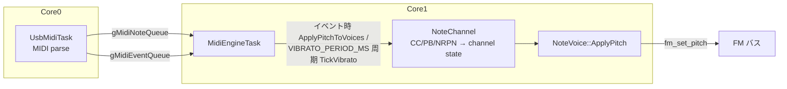

# エフェクト設計仕様（ピッチ・ビブラート）

MIDI チャンネル単位のピッチエフェクト（Pitch Bend、coarse tune、ビブラート）の設計を定義する。

基本方針:

- ビブラートは **ソフトウェア LFO のみ** とする。YM2608 ハードウェア LFO は使用しない
- GM / XG 等の MIDI 機器のパラメータモデルに合わせる。OPNA の PMS 曲線・8 段レートには合わせない
- ピッチ適用経路は 1 本に統合する（PB・ビブラート・coarse tune を同じ計算で `fm_set_pitch` へ）

関連: [design_concurrency.md](design_concurrency.md)、[design_midi_message.md](design_midi_message.md)

---

## 目次

1. [背景と設計判断](#1-背景と設計判断)
2. [スコープ](#2-スコープ)
3. [MIDI 入出力](#3-midi-入出力)
4. [アーキテクチャ](#4-アーキテクチャ)
5. [データ構造](#5-データ構造)
6. [ビブラート（チャンネル LFO）](#6-ビブラートチャンネル-lfo)
7. [ピッチ合成](#7-ピッチ合成)
8. [イベント処理](#8-イベント処理)
9. [MidiEngineTask 内 TickVibrato](#9-midienginetask-内-tickvibrato)
10. [発音直後の FM 書き込み抑制](#10-発音直後の-fm-書き込み抑制)
11. [YM2608 ハードウェア LFO の扱い](#11-ym2608-ハードウェア-lfo-の扱い)
12. [ビルド設定](#12-ビルド設定)

---

## 1. 背景と設計判断

### 1.1 ハードウェア LFO を使わない理由

YM2608 の LFO は **チップ 1 個につき 1 系統**（レジスタ `0x22`）であり、PMS/AMS は FM チャンネルごとの設定である。

| 問題 | 内容 |
|------|------|
| レート共有 | 複数 Voice / 複数 MIDI ch が同一チップに載ると、ビブラート速度を奪い合う |
| 動的割当 | Voice の割当先モジュールが変わると、同じ MIDI 設定でも聴感が変わる |
| MIDI 表現 | GM/XG は ch ごとに CC#1・NRPN 1:8/1:9（0〜127 連続）を想定する。ハードウェアの 8 段レート・PMS 曲線とは一致しない |

ソフトウェア LFO により MIDI チャンネルごとに独立したレート・深さ・位相を持てる。YM2203 など HW LFO を持たないモジュールでも同じ実装が使える。

### 1.2 主要な設計判断

| ID | 内容 |
|----|------|
| D1 | **無音**（`activeQueue` + `holdQueue` が空）からの Note On のみ LFO 位相を 0 にリセットする。和音中の新音では既存 Voice の位相を維持する |
| D2 | `vbrate = 0` は最小 Hz を意味する。NRPN 未送信（初期値 0）と Data Entry 0 は区別しない |
| D3 | Pitch Bend は active + hold の全 Voice に即時反映する（`MidiEngineTask`） |
| D4 | ビブラート更新周期は `VIBRATO_PERIOD_MS`（既定 20 ms）。`MidiEngineTask` ループ内で `time_us_64()` ベースの周期実行 |
| D5 | 深さは線形セント（`vbdepth` 0〜127 → 0〜`VIBRATO_DEPTH_MAX_CENTS`） |
| D6 | 発音直後は TickVibrato による FM ピッチ更新を抑制する（[10 章](#10-発音直後の-fm-書き込み抑制)） |

### 1.3 聴感に基づく判断の経緯

D1 / D6 と位相停止の各判断は、実機での同一曲試聴により確定した。要点は次のとおり。

**和音中は LFO 位相をリセットしない（D1）。** 毎回の Note On で位相を 0 に戻すと、同一 ch で既に鳴っている Voice のビブラート波形が不連続になり、旋律パートの切り替えや和音への新音追加で息切れ・うねりの乱れが生じた。同一 ch の和音は同位相（[3.3 節](#33-midi-セマンティクス)）であるため、チャンネル無音時のみ位相をリセットし、和音中の追加音は進行中の LFO に載せる。

**発音直後はピッチ変化を保留する（D6）。** KeyOn 直後から `TickVibrato` が F-Number を周期更新すると、FM エンベロープの立ち上がりと干渉し、アタック中に音程が揺れる・ビリビリするという症状が出た。KeyOn 直後は当該 Voice への TickVibrato 経由の `fm_set_pitch` を抑制し、PB / CC の即時経路では `VIBRATO_ATTACK_DELAY_MS` の間ビブラート成分を 0 にして適用する。チャンネル内の全 Voice が Attack 中のときは LFO 位相も進めない（`ShouldAdvanceLfoPhase`）。

**無音中は LFO を進めない。** 無音中も位相を進めると、休符の長さによって次の Note On 時の位相が音によってばらつく。`IsActive()` でないチャンネルは `TickVibrato` を早期 return し、無音からの Note On で位相 0 から再開する。休符明けのビブラート開始位置が予測可能になり、和音中の位相連続性とも両立する。

---

## 2. スコープ

### 2.1 対象

- `NoteChannel`（MIDI ch 1〜16、ch 10 を除く）
- 発音中の `NoteVoice`（`activeQueue` / `holdQueue`）

### 2.2 非対象

| 項目 | 理由 |
|------|------|
| `RhythmChannel`（MIDI ch 10） | リズム専用。ビブラート対象外 |
| `CsmVoice` | CH3 複数モジュール制約のため、ビブラート・PB 非対応 |
| 振幅ビブラート（AMS / トレモロ） | ソフトウェア未実装 |
| GM2 RPN 0,0,5（Modulation Depth Range） | 未実装。ビブラート深さは固定レンジ |
| XG NRPN 1:10（ビブラート遅延） | 未実装 |
| Voice ごとに独立した LFO 位相 | MIDI チャンネル LFO のセマンティクスに合わせるため持たない |

---

## 3. MIDI 入出力

### 3.1 チャンネル状態へのマッピング

| ソース | MIDI | フィールド | 備考 |
|--------|------|------------|------|
| Pitch Bend | PB メッセージ | `pbv` | −8192〜8191 |
| RPN 0:0 | Data Entry MSB | `pbs` | Pitch Bend Sensitivity |
| RPN 0:2 | Data Entry MSB | `coarse_tune` | `ENABLE_COARSE_TUNE` 時 |
| Modulation | CC#1 | `vbdepth` | ビブラート深さ |
| NRPN 1:8 | Data Entry MSB | `vbrate` | XG Vibrato Rate。64 中心の相対値（プリセットレートを 64 とみなし値を直接使用） |
| NRPN 1:9 | Data Entry MSB | `vbdepth` | XG Vibrato Depth。64 中心の相対値（64 以下→0、65 以上→`(val-64)*2` を CC#1 相当の深さとして使用） |
| Pan | CC#10 | `outputLR` | ピッチとは分離 |

### 3.2 音響出力

- 最終ピッチは `fm_set_pitch` → `fm_set_freq`（Block + F-Number、チップあたり 2 レジスタ）
- ハードウェア PMS / レジスタ `0x22` による変調は常に無効

### 3.3 MIDI セマンティクス

- ビブラートのレート・深さ・位相は MIDI チャンネル共通（同一 ch の和音は同位相）
- チャンネル間は独立

---

## 4. アーキテクチャ



| コンポーネント | 責務 |
|----------------|------|
| `MidiChannel::effect`（`ChannelEffects`） | MIDI 論理値: `pbv`, `pbs`, `vbrate`, `vbdepth`, `coarse_tune` |
| `NoteChannel::lfo_`（`ChannelLfoState`） | 位相・位相増分（駆動用） |
| `NoteChannel` | イベント時の状態更新、全発音 Voice へのピッチ再適用 |
| `MidiEngineTask` | MIDI イベント処理 + `TickVibrato()` 周期呼び出し |
| `NoteVoice` | `ApplyPitch(...)` / Pan。HW LFO は呼ばない |

Pitch Bend は `TickVibrato` の責務にしない。ホイールは `MidiEngineTask` で即時 `ApplyPitchToVoices` する。

FM バス書き込みについて: Core1 では `MidiEngineTask`・`CsmFrameTask` が `fm_set_*` を呼ぶが、PIO バス spinlock で直列化される（[design_concurrency.md](design_concurrency.md#5-single-writer-rule) 参照）。

---

## 5. データ構造

### 5.1 チャンネルエフェクト（`Voice.h` の `ChannelEffects`）

```cpp
struct ChannelEffects {
    int16_t pbv;          // Pitch Bend (-8192〜8191)
    uint8_t pbs;          // PB sensitivity (default 2)
    uint8_t vbrate;       // 0..127 → vibrato rate
    uint8_t vbdepth;      // 0..127 → vibrato depth
    int8_t  coarse_tune;  // semitones offset (optional)

    void Init();  // pbs=2、他 0
};
```

- `MidiChannel::effect` として 1 チャンネル 1 個保持する
- MIDI セマンティクス上はチャンネル状態だが、Voice API の引数型として `Voice.h` に置く

### 5.2 チャンネル LFO 状態（`NoteChannel.h`）

```cpp
struct ChannelLfoState {
    uint32_t phase;       // 上位 8 bit が sin LUT インデックス
    uint32_t phase_inc;   // VIBRATO_PERIOD_MS あたりの位相増分
};
```

- `vbrate` 変更時および `Init()` / `ResetAllController` で `phase_inc` を再計算する（`VibratoCalcPhaseInc`）
- `ResetAllController` で `phase = 0`

### 5.3 NoteVoice 側

- 発音キー `key`、モジュール参照、`fm_ch` を保持する
- Voice ごとの `pbv` キャッシュは持たない（チャンネルの `effect` を常に参照する）

sin LUT・`VibratoCalcPhaseInc`・`ComputeVibCents` は `NoteChannel.cpp` 内の `static` に閉じる。PB / ビブラート合成は `NoteVoice.cpp` の `ApplyPitch` に集約する。`NoteVoice` は `NoteChannel` を include しない（依存の向き: channel → voice）。

---

## 6. ビブラート（チャンネル LFO）

### 6.1 波形と位相

- **sin LUT**: 256 点、`int16_t` Q15（−32767〜+32767）。`NoteChannel.cpp` 内 `static constexpr`
- インデックス: `index = (phase >> 24) & 0xFF`
- `phase` は `uint32_t`。1 周期 = `phase` の 2³² ラップ

### 6.2 位相増分（レート）

```
rate_hz   = VIBRATO_RATE_MIN_HZ + (VIBRATO_RATE_MAX_HZ - VIBRATO_RATE_MIN_HZ) * (vbrate / 127.0)
phase_inc = (uint32_t)(rate_hz * VIBRATO_DT_SEC * 16777216.0)   // 2^24
```

- `vbrate` 変更（NRPN 1:8）で `phase_inc` を再計算する
- 例: `vbrate=64`, `MIN=3`, `MAX=12` → 約 7.5 Hz

#### `VIBRATO_PERIOD_MS` への依存

`VIBRATO_PERIOD_MS` はコンパイル時定数（[12 章](#12-ビルド設定)）。調整時はこの値だけを変え、以下をマクロ／共通関数経由で導出する。値の直書きはしない。

| 項目 | `PERIOD_MS` からの導出 | 備考 |
|------|----------------------|------|
| `phase_inc` | 必須 | `dt = VIBRATO_DT_SEC` を式に使用 |
| `ServiceVibratoIfDue` の周期 | 必須 | `VIBRATO_PERIOD_MS`（`time_us_64()` ベース） |
| 更新レート | 必須 | `VIBRATO_TICK_HZ = 1000 / VIBRATO_PERIOD_MS` |
| `vbrate` → `rate_hz` | 独立 | MIDI のみに依存。PERIOD を変えても Hz は不変 |
| 深さ（セント・sin LUT） | 独立 | |
| Pitch Bend / coarse tune | 独立 | イベント駆動 |

不変関係: `PERIOD_MS` を 2 倍にすると `phase_inc` も 2 倍・tick 数は半分となり、1 秒あたりの位相進み（= `rate_hz`）は変わらない。

更新周期の目安（サンプリング定理）: `VIBRATO_PERIOD_MS < 1000 / (2 × VIBRATO_RATE_MAX_HZ)`。`MAX=12 Hz` なら約 42 ms 未満であり、既定の 20 ms は十分である。

### 6.3 深さ（線形セント）

```
peak_cents = (vbdepth * VIBRATO_DEPTH_MAX_CENTS) / 127
vib_cents  = (peak_cents * sin_lut[index]) >> 15
```

### 6.4 位相ライフサイクル

聴感上の根拠は [1.3 節](#13-聴感に基づく判断の経緯)を参照。

| イベント | 位相 | FM 書き込み |
|----------|------|-------------|
| 無音からの Note On（active+hold 空） | 0 にリセット（D1） | あり（[8.3 節](#83-note-on--retrigger-時)） |
| 和音中の Note On | リセットしない | あり |
| 全 Note Off（`vbdepth>0`） | 停止（`TickVibrato` は `!IsActive()` で return） | なし |
| `vbdepth` 0→非 0 | リセットしない | 次回 `TickVibrato` / イベント |
| `vbdepth` 非 0→0 | — | 即時、全 Voice で vib=0 のピッチ（[8.2 節](#82-vbdepth-が-0-になったとき)） |
| `ResetAllController` | 0 | 全 Voice 再適用 |
| Attack 遅延中（D6） | 全 Voice が Attack 中なら位相も進めない | Attack 中 Voice は vib=0 |

---

## 7. ピッチ合成

### 7.1 合成順序と `ApplyPitch`（1 Voice）

`NoteVoice::ApplyPitch(const ChannelEffects& fx, int16_t vib_cents)` は、同じ `k` / `oct` / `p` に対して PB 偏差とビブラート偏差を加算する。

1. `adjusted_key = key + coarse_tune`（`ENABLE_COARSE_TUNE` 時）
2. PB 分岐で `k`, `oct`, `p`, `diff_pb` を求める。`pbs == 0 || pbv == 0` のときは `diff_pb = 0` とし、`k`, `oct` は `key` から算出する
3. ビブラート偏差: `diff_vib = PitchCalcVibDiff(k, vib_cents)`
4. `fm_set_pitch(fm_ch, p, oct, diff_pb + diff_vib)` — クランプは `OpnBase::fm_set_pitch` 内（0〜0x7ff）

`vib_cents` は呼び出し側（`NoteChannel` / `TickVibrato`）が `ComputeVibCents()` で計算して渡す。`!IsActive()` または `vbdepth==0` なら `TickVibrato` は `ApplyPitch` を呼ばない。

#### `PitchCalcVibDiff`（セント → F-Number 偏差）

PB と同じ `fnum[]` テーブル・同じ索引 `k` を使う。100 cents = 1 半音の線形近似。

```
semitone = fnum[k + 1] - fnum[k]
diff_vib = (int32_t)semitone * vib_cents / 100
```

- `vib_cents` は符号付き（sin 乗算結果）。0 なら `diff_vib = 0`
- `k` がテーブル参照範囲外のときは `diff_vib = 0` とする（`NoteVoice.cpp` の範囲ガード）
- PB あり・なしのどちらでも、手順 2 で得た `k` を共有する

### 7.2 API

```cpp
// NoteChannel.h / .cpp
int16_t NoteChannel::ComputeVibCents() const;
void    NoteChannel::ApplyPitchToVoices(int16_t vib_cents, bool skip_attack_voices = false);
void    NoteChannel::TickVibrato(uint32_t phase_ticks);

// NoteVoice.h / .cpp（Voice.h の ChannelEffects を使用）
void NoteVoice::ApplyPitch(const ChannelEffects& fx, int16_t vib_cents);

// NoteVoice.cpp 内 static
static int16_t PitchCalcVibDiff(int k, int16_t vib_cents);
```

`CsmVoice::ApplyPitch` は no-op。Pan は `SetPan` / `SetOutputLR` のみ。

### 7.3 Pan

- CC#10 / `outputLR` は `fm_set_output_lr` のみで反映する（`SetPan`）
- ビブラート深さとは無関係

---

## 8. イベント処理

いずれも `MidiEngineTask`（Core1）内。状態更新後、必要なら active + hold の全 `NoteVoice` に `ApplyPitch` を呼ぶ。

| イベント | 状態更新 | 即時 `ApplyPitch` |
|----------|----------|-------------------|
| Pitch Bend | `pbv` | active + hold（D3） |
| CC#1 | `vbdepth` | `vbdepth→0` のとき必須（vib=0）。非 0 時も即時 1 回 `ApplyPitchToVoices(ComputeVibCents())` |
| NRPN 1:8 | `vbrate` + `phase_inc` 再計算 | 不要 |
| NRPN 1:9 | `vbdepth`（64 中心相対値を変換） | CC#1 と同様 |
| PBS / coarse (Data Entry) | `pbs` / `coarse_tune` | active + hold |
| ResetAllController | `effect.Init()` + `lfo.phase=0` | active + hold |
| Note On / Retrigger | `MarkPitchAttackStart()`（D6） | 必須（[8.3 節](#83-note-on--retrigger-時)） |
| SetPan (CC#10) | `outputLR` | active + hold（Pan のみ `SetPan`） |

### 8.1 `ApplyPitchToVoices`

`activeQueue` と `holdQueue` の全 Voice に `ApplyPitch(effect, vib_cents)` を適用する。`vib_cents` は呼び出し側で計算する（イベント時は `vbdepth` から、TickVibrato 時は LFO から）。`skip_attack_voices = true` のとき Attack 遅延中の Voice は FM を触らない。

### 8.2 `vbdepth` が 0 になったとき

```cpp
effect.vbdepth = 0;
ApplyPitchToVoices(0);  // ビブラート成分を除去したピッチへ即復帰
```

以降の `TickVibrato` は当該 ch をスキップする。

### 8.3 Note On / Retrigger 時

`NoteVoice` は `NoteChannel` を知らないため、ピッチ適用はチャンネルが `NoteOn` / `TryRetrigger` 成功後に行う。

```cpp
// NoteChannel::NoteOn / TryRetrigger 成功時の処理末尾（CSM モード除く）
voice->MarkPitchAttackStart();   // D6: NoteOn / TryRetrigger の直前（全経路）
voice->NoteOn(...);              // または TryRetrigger
last_vib_cents_sent_ = ComputeVibCents();
ApplyPitchToVoices(last_vib_cents_sent_);
```

適用箇所は、新規 Allocate、`freeQueue` 再利用、`activeQueue` / `holdQueue` からの `TryRetrigger` 成功の全経路。CSM モード（`bCsmVoiceMode`）は対象外。

KeyOn 直後からビブラート付きピッチに揃え、次の `TickVibrato` 周期を待たない。

---

## 9. MidiEngineTask 内 TickVibrato

独立したビブラートタスクは設けない。`MidiEngineTask` のメインループから `ServiceVibratoIfDue()` が `VIBRATO_PERIOD_MS` 周期で各 `NoteChannel::TickVibrato()` を呼ぶ。

| 項目 | 値 |
|------|-----|
| 実行タスク | `MidiEngineTask`（Core1） |
| 周期 | `VIBRATO_PERIOD_MS`（既定 20 ms） |
| タイミング | `time_us_64()` + `next_vibrato_us`（MIDI キュードレインと同一ループ）。軽い遅れは周期を維持し、周期以上の遅れのみ再同期する（LFO のうねりを保つ） |
| 対象 ch | ch 10（`RhythmChannel`）を除く、チャンネル有効ビットが ON の ch |

`NoteChannel::TickVibrato()` の動作:

1. `vbdepth == 0` または `!IsActive()` なら return
2. `ShouldAdvanceLfoPhase()` なら `lfo_.phase += lfo_.phase_inc`
3. `ApplyPitchToVoices(ComputeVibCents(), true)` — Attack 遅延中の Voice は FM を触らない

負荷の目安: 最大 24 Voice × `VIBRATO_TICK_HZ`（既定 50 Hz）で、典型 8 音なら CPU 数 % 未満。

---

## 10. 発音直後の FM 書き込み抑制

### 10.1 背景

KeyOn 直後から `TickVibrato` が `fm_set_pitch` で F-Number を更新すると、FM エンベロープの立ち上がりと干渉し、息切れ・途切れ・ビリつきが出やすい（[1.3 節](#13-聴感に基づく判断の経緯)）。特に KeyOn から NoteOff までが短い発音（スタッカート的な単音）と高音域で顕著である。

試聴での切り分けでは、CC#1=0（ビブラート無効）では症状が出にくく、CC#1>0 の短い発音で出やすかった。原因は MIDI のビブラート設定そのものではなく、有効な CC#1 下で `TickVibrato` が FM ピッチ更新を送るタイミングにある。

対策として `NoteChannel::VibratoFmStartDelayMs()` が「KeyOn から何 ms 経過するまで TickVibrato 経由の `fm_set_pitch` を送らないか」を返す。発音時間がこの値より短い発音では、NoteOff まで一度も TickVibrato による FM ピッチ更新が行われず、聴感は CC#1=0 のとき（KeyOn 時の基準ピッチ 1 回のみ）に近づく。

### 10.2 定数一覧（`config.h`）

| 定数 | 現値 | 役割 |
|------|------|------|
| `VIBRATO_ATTACK_DELAY_MS` | 12 | 計算の起点（ms）。PB / CC 等の即時 `ApplyPitch` でも、KeyOn 後この時間はビブラート成分 0（PB / coarse tune は反映） |
| `VIBRATO_HIGH_NOTE_KEY` | 72 (C5) | この MIDI ノート番号以上を高音域とみなす |
| `VIBRATO_HIGH_NOTE_EXTRA_MS` | 16 | 高音域のみ、起点に加算（ms） |
| `VIBRATO_MIN_SOUNDING_MS` | 50 | 全音域の FM 抑制時間の下限（ms） |
| `VIBRATO_HIGH_MIN_SOUNDING_MS` | 75 | 高音域の FM 抑制時間の下限（ms） |

「加算」と「下限（フロア）」の二段構造。最終的な抑制時間は `VibratoFmStartDelayMs(voice)` が返す。

### 10.3 計算式（`NoteChannel.cpp`）

```
delay_ms ← VIBRATO_ATTACK_DELAY_MS

if key >= VIBRATO_HIGH_NOTE_KEY:
    delay_ms += VIBRATO_HIGH_NOTE_EXTRA_MS
    if delay_ms < VIBRATO_HIGH_MIN_SOUNDING_MS:
        delay_ms ← VIBRATO_HIGH_MIN_SOUNDING_MS

if delay_ms < VIBRATO_MIN_SOUNDING_MS:
    delay_ms ← VIBRATO_MIN_SOUNDING_MS
```

現設定での実効値:

| 音域 | 計算 | 実効 `delay_ms` |
|------|------|-----------------|
| 中低音（key < 72） | max(12, 50) | 50 ms |
| 高音（key ≥ 72） | max(12+16, 75) | 75 ms |

`VIBRATO_HIGH_NOTE_EXTRA_MS` の +16 ms は、現状 `VIBRATO_HIGH_MIN_SOUNDING_MS=75` のフロアに吸収され実質無効である。`HIGH_MIN` を下げたときだけ差が出る。

### 10.4 2 つのピッチ更新経路

同じ定数群でも TickVibrato 経路と MIDI イベント即時経路で参照が異なる。

| 経路 | 判定 | 現設定 |
|------|------|--------|
| `TickVibrato` | `IsVoiceInVibratoFmDelay` → `VibratoFmStartDelayMs` | 中低音 50 ms / 高音 75 ms まで FM 更新なし |
| PB / CC 即時 | `IsVoiceInAttackDelay` → `VIBRATO_ATTACK_DELAY_MS` のみ | KeyOn 後 12 ms までビブラート成分 0。PB / coarse tune は反映 |

起点はいずれも `MarkPitchAttackStart()` が記録する KeyOn 時刻。

### 10.5 チューニング指針

| 症状 | 調整候補 |
|------|----------|
| 短い高音がまだ途切れる | `VIBRATO_HIGH_MIN_SOUNDING_MS` を増やす |
| 長い高音でビブラート開始が遅すぎる | `VIBRATO_HIGH_MIN_SOUNDING_MS` を減らす（試聴必須） |
| 中低音の短い発音のみ問題 | `VIBRATO_MIN_SOUNDING_MS` を調整する |
| PB 直後の立ち上がりだけ問題 | `VIBRATO_ATTACK_DELAY_MS`（即時経路。TickVibrato 下限とは独立） |

数値は `config.h` を正とし、実機試聴で更新する。

---

## 11. YM2608 ハードウェア LFO の扱い

ソフトウェア LFO 採用後もチップには LFO レジスタが存在するため、寄生変調の防止のみ行う。

| タイミング | 動作 |
|------------|------|
| `YM2608::init()` | `fm_turnoff_LFO()`（`0x22=0`） |
| 発音・CC#1 | HW LFO は触らない |

YM2203 等 LFO 未実装ドライバでは no-op。

---

## 12. ビルド設定

`src/app/config.h` のビブラート関連定数（現行値）:

```c
#define VIBRATO_PERIOD_MS            20
#define VIBRATO_DT_SEC               (VIBRATO_PERIOD_MS / 1000.0f)
#define VIBRATO_TICK_HZ              (1000 / VIBRATO_PERIOD_MS)
#define VIBRATO_RATE_MIN_HZ          3.0f
#define VIBRATO_RATE_MAX_HZ          12.0f
#define VIBRATO_DEPTH_MAX_CENTS      50
#define VIBRATO_ATTACK_DELAY_MS      12
#define VIBRATO_HIGH_NOTE_KEY        72
#define VIBRATO_HIGH_NOTE_EXTRA_MS   16
#define VIBRATO_MIN_SOUNDING_MS      50
#define VIBRATO_HIGH_MIN_SOUNDING_MS 75
```

- `VIBRATO_PERIOD_MS` を調整する場合、`phase_inc`・Task 周期・負荷見積の tick レートはすべてこの値から導出されるため、他の変更は不要（[6.2 節](#62-位相増分レート)）
- ビブラートのソフトウェア／ハードウェア切替スイッチは設けない（常にソフトウェア LFO）
