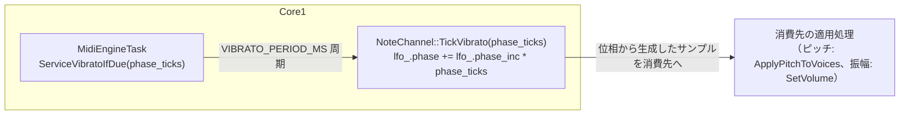

# ソフトウェア LFO 設計仕様（チャンネル共有 LFO）

MIDI チャンネル単位のソフトウェア LFO（位相・レート）の生成部分の設計を定義する。
LFO が生成する変調量をどの合成先（ピッチ／振幅等）に適用するかは、この文書のスコープ外とする。

現時点での唯一の消費先はビブラート（ピッチ変調）であり、詳細は [design_pitch_effect.md](design_pitch_effect.md) を参照する。
本書は LFO 生成部分（位相・レート・ライフサイクル・周期実行）を消費先非依存の形で切り出したものであり、
`design_pitch_effect.md`（ピッチへの合成・MIDI マッピング）とは記述を重複させない（経緯は [10. 位置づけ](#10-位置づけ) 参照）。

関連: [design_pitch_effect.md](design_pitch_effect.md)、[design_voice_allocation.md](design_voice_allocation.md)、[design_concurrency.md](design_concurrency.md)

---

## 目次

1. [背景と設計判断](#1-背景と設計判断)
2. [スコープ](#2-スコープ)
3. [データ構造](#3-データ構造)
4. [波形と位相](#4-波形と位相)
5. [位相増分（レート）](#5-位相増分レート)
6. [位相ライフサイクル](#6-位相ライフサイクル)
7. [周期実行（MidiEngineTask）](#7-周期実行midienginetask)
8. [ハードウェア LFO の扱い](#8-ハードウェア-lfo-の扱い)
9. [ビルド設定](#9-ビルド設定)
10. [位置づけ](#10-位置づけ)

---

## 1. 背景と設計判断

YM2608 / YMF288 の LFO は **チップ 1 個につき 1 系統**（レジスタ `0x22`、`OpnLfo` として実装を共有）で、PMS/AMS は FM チャンネルごとに設定できてもレート・位相はチップ全体で共有する。YM2203 にはこの機能自体がない。

本システムは FM チップを最大 4 基混在させ、`VoiceAllocator` が Voice をチップ横断で動的に割り当てる（[design_voice_allocation.md](design_voice_allocation.md)）。同一 MIDI チャンネルの発音が複数チップに分散したり、時間とともに別チップへ移ったりするため、「チップ単位」の HW LFO を「MIDI チャンネル単位」のビブラートの実体として使うことができない。この構造的な非両立が、HW LFO を採用しない理由である。

| 問題 | 内容 |
|------|------|
| レート共有 | 同一チップ上の複数 Voice / 複数 MIDI ch が変調速度を奪い合う |
| MIDI 表現 | GM/XG は ch ごとの連続値（CC・NRPN）を想定し、ハードウェアの段階的レート・PMS/AMS 曲線とは一致しない |

代わりに、チップに紐づかず MIDI チャンネルの状態として持てるソフトウェア LFO を採用する。Voice の割当先チップによらず、MIDI チャンネルごとに一貫したレート・位相を保てる。YM2203 のような HW LFO 非搭載チップでも同じ実装で扱える。

1 MIDI チャンネル = 1 LFO インスタンス（`ChannelLfoState`）。チャンネル間は独立し、同一チャンネル内の複数 Voice（和音）は位相を共有する。

---

## 2. スコープ

### 2.1 対象

- `NoteChannel`（MIDI ch 1〜16、ch 10 を除く）が保持する LFO 位相・位相増分そのもの
- 位相からのサンプル抽出（sin LUT 参照）までの生成ロジック

### 2.2 非対象（消費側の責務）

| 項目 | 参照先 |
|------|--------|
| LFO サンプルをピッチ偏差（セント）に変換する処理 | [design_pitch_effect.md 7章](design_pitch_effect.md#7-cc1--nrpn-19-ビブラート深さ) |
| ピッチへの合成順序・`ApplyPitch` | [design_pitch_effect.md 9章](design_pitch_effect.md#9-ピッチ合成) |
| `RhythmChannel`（MIDI ch 10）、`CsmVoice` | ビブラート非対応。[design_pitch_effect.md 2.2節](design_pitch_effect.md#22-非対象) |

---

## 3. データ構造

`NoteChannel.h` の `ChannelLfoState`:

```cpp
struct ChannelLfoState {
    uint32_t phase;      // 上位 8 bit が sin LUT インデックス
    uint32_t phase_inc;  // VIBRATO_PERIOD_MS あたりの位相増分
};
```

- `NoteChannel::lfo_` として 1 チャンネル 1 個保持する
- `effect.vbrate`（NRPN 1:8）変更時および `Init()` / `ResetAllController` で `phase_inc` を再計算する（`NoteChannel::updateLfoPhaseInc()`）
- `ResetAllController` で `phase = 0`

現在の唯一の消費先であるビブラートの深さ・レートは `MidiChannel::effect`（`ChannelEffects`、`Voice.h`）にある `vbrate` / `vbdepth` で表現される。LFO 自体（本書のスコープ）が持つのは位相・位相増分のみで、深さのような消費先固有のパラメータは持たない。

---

## 4. 波形と位相

- **sin LUT**: 256 点、`int16_t` Q15（−32767〜+32767）。`NoteChannel.cpp` 内 `static constexpr kSinLut`
- インデックス: `index = (phase >> 24) & 0xFF`
- `phase` は `uint32_t`。1 周期 = `phase` の 2³² ラップ

---

## 5. 位相増分（レート）

```
rate_hz   = VIBRATO_RATE_MIN_HZ + (VIBRATO_RATE_MAX_HZ - VIBRATO_RATE_MIN_HZ) * (vbrate / 127.0)
phase_inc = (uint32_t)(rate_hz * VIBRATO_DT_SEC * 4294967296.0)  // 2^32
```

- `vbrate`（NRPN 1:8）変更で `phase_inc` を再計算する
- 例: `vbrate=64`, `MIN=3`, `MAX=12` → 約 7.5 Hz

現在のレート決定パラメータ（`vbrate`）はビブラート専用の NRPN（1:8）を経由するが、これは消費先の命名であり LFO 自体のレート計算式（上記）は消費先を問わない。

### `VIBRATO_PERIOD_MS` への依存

`VIBRATO_PERIOD_MS` はコンパイル時定数（[9 章](#9-ビルド設定)）。調整時はこの値だけを変え、以下をマクロ／共通関数経由で導出する。値の直書きはしない。

| 項目 | `PERIOD_MS` からの導出 | 備考 |
|------|----------------------|------|
| `phase_inc` | 必須 | `dt = VIBRATO_DT_SEC` を式に使用 |
| 周期実行の間隔 | 必須 | `VIBRATO_PERIOD_MS`（`time_us_64()` ベース） |
| 更新レート | 必須 | `1000 / VIBRATO_PERIOD_MS`（既定 50 Hz） |
| `vbrate` → `rate_hz` | 独立 | MIDI のみに依存。PERIOD を変えても Hz は不変 |

不変関係: `PERIOD_MS` を 2 倍にすると `phase_inc` も 2 倍・tick 数は半分となり、1 秒あたりの位相進み（= `rate_hz`）は変わらない。

更新周期の目安（サンプリング定理）: `VIBRATO_PERIOD_MS < 1000 / (2 × VIBRATO_RATE_MAX_HZ)`。`MAX=12 Hz` なら約 42 ms 未満であり、既定の 20 ms は十分である。

---

## 6. 位相ライフサイクル

| イベント | 位相 |
|----------|------|
| 無音からの Note On（active+hold 空） | 0 にリセット |
| 和音中の Note On | リセットしない |
| 全 Note Off | 停止（`!IsActive()` の間は位相を進めない） |
| `ResetAllController` | 0 |

**和音中は位相をリセットしない。** 毎回の Note On で位相を 0 に戻すと、同一 ch で既に鳴っている Voice の変調波形が不連続になる。同一 ch の和音は同位相であるため、チャンネル無音時のみ位相をリセットし、和音中の追加音は進行中の LFO に載せる。

**無音中は位相を進めない。** 無音中も位相を進めると、休符の長さによって次の Note On 時の位相が音によってばらつく。休符明けの変調開始位置を予測可能にするため、無音中は位相を止め、無音からの Note On で位相 0 から再開する。

この判断は、ビブラート（ピッチ変調、現時点での唯一の消費先）を対象とした実機での同一曲試聴により確定した経緯を持つ。

---

## 7. 周期実行（MidiEngineTask）

独立した LFO タスクは設けない。`MidiEngineTask` のメインループから `ServiceVibratoIfDue()` が `VIBRATO_PERIOD_MS` 周期で各 `NoteChannel::TickVibrato()` を呼ぶ。

| 項目 | 値 |
|------|-----|
| 実行タスク | `MidiEngineTask`（Core1） |
| 周期 | `VIBRATO_PERIOD_MS`（既定 20 ms） |
| タイミング | `time_us_64()` + `next_vibrato_us`（MIDI キュードレインと同一ループ）。軽い遅れは周期を維持し、周期以上の遅れのみ再同期する（LFO のうねりを保つ） |
| 対象 ch | ch 10（`RhythmChannel`）を除く、チャンネル有効ビットが ON の ch |



`NoteChannel::TickVibrato(phase_ticks)` の動作:

1. ビブラート（`vbdepth`）・トレモロ（`trdepth`）のいずれも深さ 0、または `!IsActive()` なら return（消費先がピッチ・振幅の 2 系統に増えたため、どちらか一方が有効なら継続する）
2. `phase_ticks` は呼び出し間隔の遅れを補正する引数（1 周期分の呼び出しなら 1）。`lfo_.phase += lfo_.phase_inc * phase_ticks`
3. 位相から生成したサンプルを、有効な消費先（ピッチ・振幅）へそれぞれ適用する。振幅側は [design_tremolo.md](design_tremolo.md) を参照

関数名は当初ビブラート専用だった名残でビブラートのままだが、実体はビブラート・トレモロ共有の LFO ティック関数である。

負荷の目安: 最大 24 Voice × 更新レート（既定 50 Hz）で、典型 8 音なら CPU 数 % 未満（消費先の適用処理・FM レジスタ書き込みのコストは含まない。ピッチへの適用コストは [design_pitch_effect.md](design_pitch_effect.md) を参照）。

---

## 8. ハードウェア LFO の扱い

ソフトウェア LFO 採用後も YM2608 / YMF288 には LFO レジスタが存在するため、寄生変調の防止のみ行う。

| タイミング | 動作 |
|------------|------|
| `YM2608::init()` / `YMF288::init()` | `lfo_feature_->Reset()`（内部で `TurnOff()` により `0x22=0`。PMS/AMS 設定値も 0 に戻す） |
| 発音・変調パラメータ変更 | HW LFO は触らない |

YM2203 は `lfo_feature_` が null のため、`fm_turnon_LFO()` / `fm_turnoff_LFO()` 等の呼び出しはすべて no-op になる。

---

## 9. ビルド設定

`src/app/config.h` の LFO 関連定数（現行値）:

```c
#define VIBRATO_PERIOD_MS            20
#define VIBRATO_DT_SEC               (VIBRATO_PERIOD_MS / 1000.0f)
#define VIBRATO_RATE_MIN_HZ          3.0f
#define VIBRATO_RATE_MAX_HZ          12.0f
```

- `VIBRATO_PERIOD_MS` を調整する場合、`phase_inc`・周期実行間隔・負荷見積の tick レートはすべてこの値から導出されるため、他の変更は不要（[5章](#5-位相増分レート)）
- 深さ・遅延（`VIBRATO_DEPTH_MAX_CENTS` / `VIBRATO_DELAY_MAX_MS`）はピッチ変調固有のパラメータのため、[design_pitch_effect.md 13章](design_pitch_effect.md#13-ビルド設定)を参照
- LFO のソフトウェア／ハードウェア切替スイッチは設けない（常にソフトウェア LFO）

---

## 10. 位置づけ

本書は、`design_pitch_effect.md`（ビブラート・ピッチエフェクト設計）から LFO 生成部分（位相・レート・ライフサイクル・周期実行）を消費先非依存の形で切り出したものである。`design_pitch_effect.md` 側は本書の内容を再掲せず、必要箇所からこの文書へリンクする形に整理済みである。

境界: 「位相がいつ・どう進むか」（生成）は本書、「その位相サンプルを深さ・遅延と組み合わせてどうピッチへ合成するか」（消費）は `design_pitch_effect.md` が扱う。
