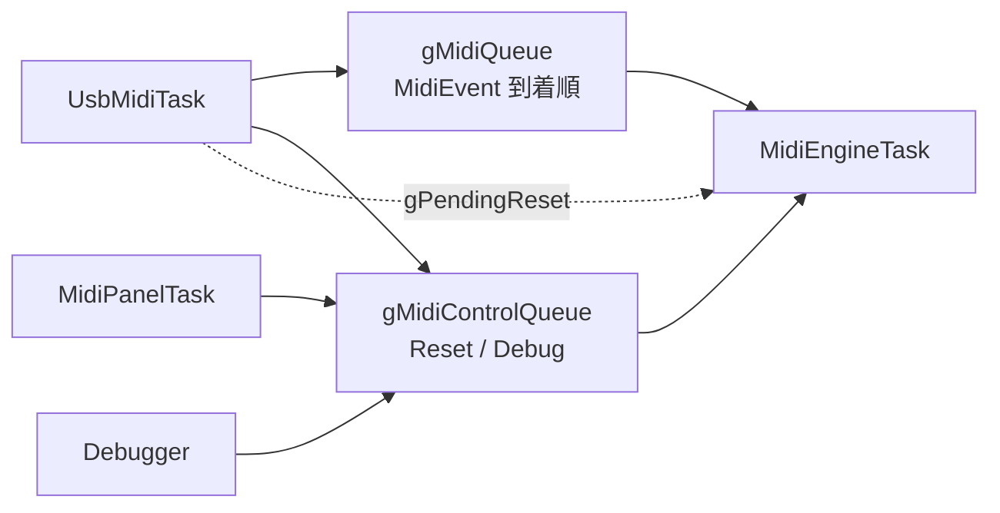

# MIDI IPC 設計方針

演奏イベントの Core 間転送を単一 FIFO とする方針を固定する。複数キューによる Note 優先は採用しない。

本ファイルには単一 FIFO を採用した判断経緯と計測結果を記録する。現在のタスク構成は [design_concurrency.md](design_concurrency.md)、メッセージ処理は [design_midi_message.md](design_midi_message.md) を参照。

MIDI バイト列のパース・SysEx・Realtime 破棄は従来どおり [design_midi_message.md](design_midi_message.md)。タスク配置と制御キューは [design_concurrency.md](design_concurrency.md)。受信 CC の範囲は [midi_implementation_chart.md](midi_implementation_chart.md)。

---

## 目次

1. [位置づけ](#1-位置づけ)
2. [方針](#2-方針)
3. [判断の根拠](#3-判断の根拠)
4. [キュー構成](#4-キュー構成)
5. [Core0 ルーティング](#5-core0-ルーティング)
6. [Core1 消費](#6-core1-消費)
7. [現状](#7-現状)
8. [関連ドキュメント](#8-関連ドキュメント)

---

## 1. 位置づけ

以前は発音不安定の対策として Note / Effect を別キューに分け、Note を優先し Effect を間引けるようにしていた。その後、SSG Port アクセスが FM レジスタを壊す不具合を修正したところ発音は格段に安定した。複数キューが必須だったかは検証が残っていた。

`feature/simplified-queue` で単一 FIFO に戻し、3 曲で Drop・滞留・実行時間を計測した。結果、キュー分割より単純さの方がメリットが大きいと判断した。本ファイルはその方針を文書化したものである。

---

## 2. 方針

| 項目 | 方針 |
|---|---|
| 演奏イベント | Core1 へ渡す `MidiEvent` は到着順の単一 FIFO（`gMidiQueue`） |
| 制御イベント | Reset / デバッグ / パネルは型も Producer も異なるため `gMidiControlQueue` を維持する |
| Core0 フィルタ | Realtime / SysEx は従来どおり Core0。加えて **音源が扱わない Channel Voice は Core0 で破棄**し、キューには積まない |
| Note 優先・Effect 間引き | 行わない。到着順を崩さない |
| 詳細計測 | 通常ロジックから分離し、`ENABLE_MIDI_TIMING_STATS=ON` の診断ビルドだけに含める |
| 既知のボトルネック | キュー構造ではなく NoteOn の直列処理時間 |

Reset 用の `gPendingReset` フォールバックは維持する。

---

## 3. 判断の根拠

計測は `ENABLE_MIDI_TIMING_STATS=ON` の診断ビルドにおける `stats`
（`MidiIpcGetStats`）による。Drop 数、キュー high water、Note / Effect / NoteOff
の最大滞留、Note / Effect / ビブラートの最大実行時間、遅延・実行の上位イベントを見た。
CSM 発音は対象曲では起きていない前提で切り分けから除外した。

3 曲とも Drop は 0、high water は 8〜16 / 192 で、キュー満杯は起きていない。NoteOff 最大滞留は 0.4〜2.1 ms で、止め漏れの主因にはならない。ビブラート 1 周期は 0.12〜0.19 ms で、数 ms の Note 遅れを説明しない。

遅れの本体は Core1 の NoteOn 実行（0.7〜1.0 ms / 件）である。和音が続くと直列に積もり、3〜8 ms 遅れる。これは Note 同士の待ちなので、旧 Note キューでも同じ遅れは出る。

計測時点では未対応 CC も同一 FIFO に乗っていた。無効 CC（例: CC#74）が Note と同じ列に並ぶ、Effect が NoteOn の後ろで 1.6〜4.6 ms 待つ、NoteOff が最大 2.1 ms 遅れる、といった二次効果はあったが、大きさは NoteOn コストより小さい。その後、未対応 Channel Voice は Core0 で破棄するようにした（[5. Core0 ルーティング](#5-core0-ルーティング)）。複数キューは到着順を壊し、実装（振り分け・予約スロット・二重ドレイン）が重い。MIDI は順序付きストリームであり、演奏イベントを到着順のまま渡す方が意味としても素直である。

---

## 4. キュー構成

| キュー | 要素 | 役割 |
|---|---|---|
| `gMidiQueue` | `MidiEvent` | Note / CC / PC / PitchBend など、Core1 が `MidiProcessor::Exec` する演奏イベント。FIFO |
| `gMidiControlQueue` | `MidiControlEvent` | Reset、デバッグ dump / stats / ビブラート強制。パネル長押し Reset も含む |

`gMidiControlQueue` を演奏 FIFO に混ぜない理由は、要素型が違うことと、Producer が UsbMidiTask 以外（MidiPanelTask、Debugger）にもあること。Reset は演奏レイテンシより後回しでよいが、消失してはならない（`gPendingReset`）。

旧 `gMidiNoteQueue` / `gMidiEventQueue`、NoteOff 予約スロット、pending NoteOff ビットマップは廃止する。

容量の目安は旧 Note(128) + Event(64) の合計 192。実測 high water は 16 以下なので、この長さで足りている。

---

## 5. Core0 ルーティング

Single Parse Rule は維持する。対応 CC の番号と意味は `MidiController.h` の
`ClassifyMidiController()` に集約し、`IsSupportedMidiEvent()` が Core1 への転送可否を決める。
`MidiProcessor` も同じ `MidiControllerAction` を使うため、CC 番号を二重管理しない。

`IsSupportedMidiEvent()` が true になるのは、[midi_implementation_chart.md](midi_implementation_chart.md) で受信 ◯、かつ `MidiProcessor::Exec` が実際にディスパッチするものである。

| 種別 | 判定 |
|---|---|
| NoteOn / NoteOff | Forward |
| Program Change | Forward |
| Pitch Bend | Forward |
| CC#0, 1, 6, 7, 10, 11, 32, 38, 64, 98–101 | Forward |
| CC#120, 121, 123（Channel Mode） | Forward |
| Poly / Channel Aftertouch | Drop |
| 上記以外の CC / Channel Mode（CC#74 等、CC#124–127 等） | Drop |
| Realtime / System Common | Drop（従来どおり Assembler / Parser） |
| GM / XG / GS Reset SysEx | `gMidiControlQueue` へ Reset（従来どおり） |
| ベンダー SysEx `F0 7D 46 4D …` | Core0 の `Debugger::HandleSysEx`。Reset / dump / stats 等は `gMidiControlQueue` へ |

CC#38（Data Entry LSB）は音響には使わないが、RPN/NRPN 経路として受信するため Forward する。

---

## 6. Core1 消費

`MidiEngineTask` は `gMidiQueue` を到着順にドレインし、分類しない。1 ループあたりの上限は `MIDI_EVENT_BATCH_MAX`。その後に `gPendingReset` / `gMidiControlQueue` を最大 1 件、続けて周期ビブラート（`VIBRATO_PERIOD_MS`）を処理する。

アイドル時のブロック待機先は `gMidiQueue` とする。Effect 専用キューは持たない。

### 6.1 診断計測の分離

`ENABLE_MIDI_TIMING_STATS` の既定値は OFF とする。OFF では次をコンパイル対象から外す。

- dequeue / 完了時刻の取得
- キュー high water、最大滞留・最大実行時間の更新
- 遅延・実行時間の上位イベント保持
- ビブラート実行時間の計測
- `stats` の詳細タイミング表示

Queue Full の Drop カウンタと通常の `stats` 表示は常に残す。診断計測を有効にしても
演奏イベントの順序やドレイン処理は変えない。

---

## 7. 現状

| 項目 | 現状 |
|---|---|
| 演奏イベントの単一 FIFO（`gMidiQueue`） | 実装済み |
| `gMidiControlQueue` / `gPendingReset` | 維持 |
| NoteOff 予約・pending 退避 | 廃止 |
| `MidiController` による未対応 CC / Aftertouch の Drop | 実装済み |
| SysEx の `MidiSysEx::Classify` 集中分類 | 実装済み |
| 滞留・実行時間の `stats` 計測 | `ENABLE_MIDI_TIMING_STATS=ON` の診断ビルドのみ。本方針の必須要件ではない |

未対応メッセージは Core0 で Drop し、単一 FIFO に無効 CC が混入しないようにした。

実測上の遅れの本体は NoteOn 内の SetProgram、KeyOn 前後のレジスタ書き込み、チャンネル内全 Voice への `ApplyPitchToVoices` にある。キュー分割ではこの直列処理時間を解消できない。

---

## 8. 関連ドキュメント

| ファイル | 内容 |
|---|---|
| [design_concurrency.md](design_concurrency.md) | `gMidiQueue` / `gMidiControlQueue` と MidiEngineTask の実行順 |
| [design_midi_message.md](design_midi_message.md) | Core0 の分類、`MidiController` / `MidiSysEx`、統計フィールド |
| [domain/domain_app.md](domain/domain_app.md) | app 層の IPC モジュールとタスク関係 |
