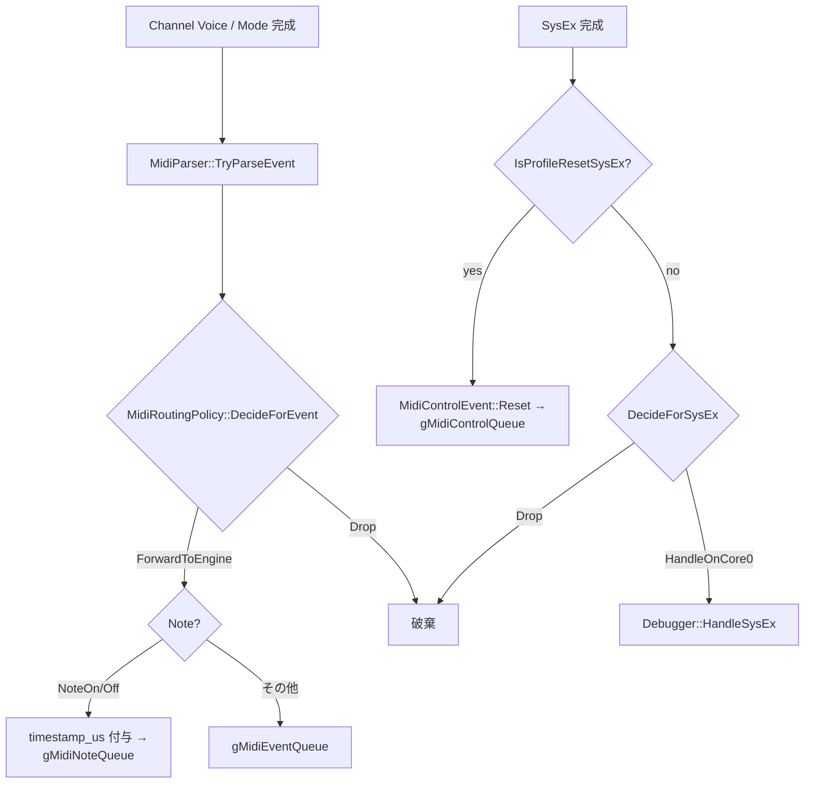

# MIDI メッセージ処理設計仕様

FMSynthEnsembleV3 における MIDI メッセージ処理（パース・ルーティング・Core 間転送）の設計を定義する。

本ドキュメントは [design_concurrency.md](design_concurrency.md) の IPC 基盤の上に成立する。システム全体のレイヤ構成・依存ルールは [architecture.md](architecture.md) を参照。

---

## 目次

1. [設計方針](#1-設計方針)
2. [メッセージ分類とルーティング](#2-メッセージ分類とルーティング)
3. [データ構造](#3-データ構造)
4. [Parser / RoutingPolicy API](#4-parser--routingpolicy-api)
5. [Core0 処理フロー](#5-core0-処理フロー)
6. [Core1 処理フロー](#6-core1-処理フロー)
7. [SysEx 対応方針](#7-sysex-対応方針)
8. [Build-time Switch 方針](#8-build-time-switch-方針)
9. [エラー処理と監視](#9-エラー処理と監視)
10. [動作保証](#10-動作保証)

---

## 1. 設計方針

### 1.1 Single Parse Rule

- MIDI バイト列の解釈は Core0 の `MidiParser` で **1 回のみ** 行う
- Core1 は構造化済みイベントのみを受け取り、バイト列を再解釈しない

### 1.2 Real-time Safe Path

- Core1 へ送るのは **固定長イベントのみ**
- SysEx のような可変長・高コスト処理は Core0 側に閉じる

### 1.3 Policy / Data 分離

- 何を Core1 に送るかの判断は `MidiRoutingPolicy` に集約する
- Parse と Route を分離することで、ルーティング変更が Parser に影響しない

---

## 2. メッセージ分類とルーティング

| 種別 | 例 | Core0 処理 | Core1 転送 |
|---|---|---|---|
| Channel Voice（Note） | NoteOn/Off | パース → Forward | `gMidiNoteQueue`（`timestamp_us` 付与） |
| Channel Voice（その他） | CC, PC, PitchBend 等 | パース → Forward | `gMidiEventQueue` |
| Channel Mode | CC 120–127 | パース → Forward | `gMidiEventQueue` |
| SysEx 標準リセット | GM_SYSTEM_ON / XG_RESET / GS_RESET | `MidiControlEvent::Reset` に変換 | `gMidiControlQueue` |
| SysEx 独自拡張 | `F0 7D 46 4D <cmd>…F7` | Debugger ハンドラへ渡す | なし |
| SysEx その他 | 上記以外 | Drop | なし |
| System Realtime | 0xF8, 0xFA–0xFC, 0xFE | Drop | なし |
| System Common | Song Position 等 | Drop | なし |
| 不正フォーマット | — | Drop | なし |

---

## 3. データ構造

ファイル位置: `src/midi/MidiMessage.h`

### 3.1 Core 間イベント（固定長）

```cpp
enum class MidiEventType : uint8_t {
    NoteOff,
    NoteOn,
    PolyAftertouch,
    ControlChange,
    ProgramChange,
    ChannelAftertouch,
    PitchBend,
    ChannelMode,
};

struct MidiEvent {
    MidiEventType type;
    uint8_t channel;        // 0–15
    uint8_t data1;          // note / cc / program 等
    uint8_t data2;          // velocity / value 等
    uint8_t size;           // 2 or 3
    uint32_t timestamp_us;  // Note キュー投入時に time_us_64() を付与
};
```

### 3.2 制御イベント（SysEx 等）

```cpp
enum class MidiControlType : uint8_t {
    Reset,             // GM_SYSTEM_ON / XG_RESET / GS_RESET
    DebugDumpChannel,  // デバッグ: チャンネルダンプ
    DebugDumpVoice,    // デバッグ: Voice ダンプ
    DebugStats,        // デバッグ: 統計情報
    // ほかデバッグ用種別は MidiMessage.h を参照
};

struct MidiControlEvent {
    MidiControlType type;
    uint8_t         channel;    // 対象 MIDI チャンネル (0–15)
    uint8_t         reserved0;
    uint8_t         reserved1;
    uint32_t        timestamp_us;
};
```

---

## 4. Parser / RoutingPolicy API

ファイル位置: `src/midi/MidiParser.h/.cpp`, `src/midi/MidiRoutingPolicy.h/.cpp`

```cpp
class MidiParser {
public:
    static bool TryParseEvent(const uint8_t* raw, uint8_t len, MidiEvent& out);
    static bool IsSysEx(const uint8_t* raw, uint8_t len);
    static bool IsRealtimeStatus(uint8_t status);
};

enum class MidiRouteDecision : uint8_t {
    ForwardToEngine,   // gMidiNoteQueue または gMidiEventQueue へ投入
    HandleOnCore0,     // Core0 で処理（Debugger SysEx）
    Drop,
};

class MidiRoutingPolicy {
public:
    static MidiRouteDecision DecideForEvent(const MidiEvent& event);
    static MidiRouteDecision DecideForSysEx(const uint8_t* raw, uint16_t len);
    static bool IsProfileResetSysEx(const uint8_t* raw, uint16_t len);
};
```

---

## 5. Core0 処理フロー

UsbMidiTask（`src/app/usb_midi_task.cpp`）は `tud_midi_n_stream_read` で最大 32 バイトのチャンクを一度に読み出し、バイトストリームを 1 バイトずつ `handle_stream_byte()` でアセンブルする。これにより Running Status、SysEx の途中分割受信、長い SysEx（最大 256 バイト）を正しく処理できる。

`handle_stream_byte()` のバイト処理規則:

| バイト種別 | 処理 |
|---|---|
| Realtime (0xF8–0xFF, SysEx/EOX 除く) | 即 Drop（Running Status に影響しない） |
| SysEx 開始 (0xF0) | SysEx 蓄積モードに入り Running Status をクリア |
| SysEx 終了 (0xF7) | SysEx 蓄積完了 → `handle_complete_sysex()` 呼び出し |
| **SysEx 受信中** の非リアルタイムステータス (0x80–0xF6) | SysEx を暗黙終了（バッファ破棄）し、受信バイトを新規メッセージの先頭として処理（MIDI 1.0 仕様準拠） |
| その他 System (0xF1–0xF6) | Running Status クリア |
| Channel Status (0x80–0xEF) | Running Status に保存、メッセージ長を設定 |
| Data byte (0x00–0x7F) | Running Status のメッセージに蓄積。揃ったら下記ルーティングへ |

メッセージ完成後のルーティング:



キュー投入はすべてノンブロッキングで行う。満杯時の扱い（NoteOff 予約スロット / pending NoteOff 退避）は [design_concurrency.md](design_concurrency.md#42-gmidinotequeue) を参照。

---

## 6. Core1 処理フロー

Core1（MidiEngineTask）は構造化された `MidiEvent` を受け取り、`MidiProcessor::Exec(const MidiEvent&)` をエントリポイントとして処理する。メインループの構造と処理順序は [design_concurrency.md](design_concurrency.md#32-midienginetaskcore1-固定) を参照。

- `gPanelChannelBitmap` は「パネルのチャンネル有効状態」を表す 16 bit ビットマップ（`bit0 = MIDI ch1` … `bit15 = MIDI ch16`、`1 = 有効`）
- 処理順序は「演奏イベント（Note 優先）→ 制御 → ビブラート」という方針に基づく。Reset を Note/Event キューより先に割り込ませる設計ではない

---

## 7. SysEx 対応方針

### 7.1 標準リセット SysEx

| 名称 | バイト列 |
|---|---|
| GM System ON | `F0 7E 7F 09 01 F7` |
| XG RESET | `F0 43 10 4C 00 00 7E 00 F7` |
| GS RESET | `F0 41 10 42 12 40 00 7F 00 41 F7` |

処理規則:

- Core0 で完全一致判定
- 一致時は `MidiControlEvent::Reset` を `gMidiControlQueue` へ投入
- 実際の Reset 実行は Core1 の `MidiProcessor::Reset()` が担当

### 7.2 独自拡張 SysEx

フォーマット:

```
F0 7D 46 4D <cmd> <payload...> F7
```

処理規則:

- Core0 で完結処理。Core1 へ転送しない
- 最大長制限あり（256 バイト、`kMaxSysExLength`）
- F7 欠落などの異常フレームは破棄

---

## 8. Build-time Switch 方針

| スイッチ名 | 制御方法 | 用途 |
|---|---|---|
| `USB_MIDI_IRQ_DRIVEN` | CMake `option()` + `CMakePresets.json` | TinyUSB OSAL モード切替（既定 ON = `OPT_OS_FREERTOS`。[design_concurrency.md](design_concurrency.md#331-usb-スケジューリングモード) 参照） |
| `BUILD_MIDI_PANEL` | CMake `option()` | MIDI パネルコントローラの有効化 |
| `BUILD_SD_CARD` | CMake `option()` | SD カードスタックの有効化 |
| `ENABLE_DEBUG_PRINT` | `src/app/config.h` `#define` | midi_ipc Drop カウンタのシリアル出力有効化 |
| `ENABLE_CSM` | `src/app/config.h` `#define` | CSM Voice の有効化 |

`config.h` はアプリ層の実行時ポリシー定数に限定し、ドライバ/ミドル層の Build-time Switch は CMake で制御する（[architecture.md](architecture.md#4-依存関係) の制約参照）。

---

## 9. エラー処理と監視

### 9.1 統計カウンタ（`MidiIpcStats` 構造体）

| フィールド名 | 内容 |
|---|---|
| `midi_note_queue_drop_count` | `gMidiNoteQueue` Full による Drop 数 |
| `midi_event_queue_drop_count` | `gMidiEventQueue` Full による Drop 数 |
| `midi_control_queue_drop_count` | `gMidiControlQueue` Full による Drop 数（Reset 以外） |
| `midi_reset_queue_drop_count` | Reset の Queue Full Drop 数（`gPendingReset` フォールバック発火回数） |
| `midi_note_on_reserve_drop_count` | NoteOff 予約スロット確保のため受け付けなかった NoteOn 数 |
| `midi_note_off_fallback_count` | キュー満杯時に pending ビットマップへ退避した NoteOff 数 |

`MidiIpcGetStats()` で取得し、`MidiControlType::DebugStats` コマンドで出力する。種別ごとの詳細な Drop カウント（Realtime Drop、パースエラー等）は持たない。

### 9.2 監視方針

- 通常運用では統計は出力しない
- Debugger コンソールで `stats` コマンド（`MidiControlType::DebugStats`）を実行すると MidiEngineTask が `MidiIpcGetStats()` の結果を出力する
- `ENABLE_DEBUG_PRINT=1`（`config.h`）でビルドした場合のみ出力が有効

---

## 10. 動作保証

本設計が保証する不変条件。

- Core1 は SysEx 生バイト列を処理しない
- GM_SYSTEM_ON / XG_RESET / GS_RESET を受信したとき、Core1 側で `MidiProcessor::Reset()` が実行される
- Realtime メッセージが `gMidiNoteQueue` / `gMidiEventQueue` / `gMidiControlQueue` へ投入されない
- Queue Full 時は Drop + `MidiIpcStats` カウンタ更新（NoteOff は予約スロット / pending 退避で必ず届ける）
- 独自拡張 SysEx は Core0 の `Debugger::HandleSysEx()` で処理される
- `gMidiControlQueue` が満杯でも Reset は `gPendingReset` フォールバックで失われず、MIDI イベント処理後に実行される
