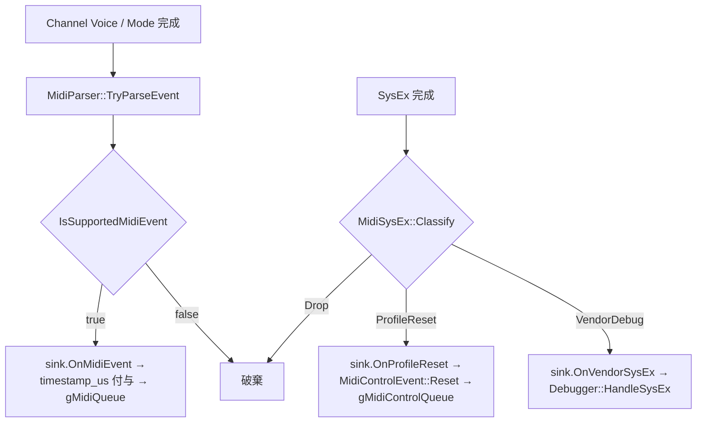

# MIDI メッセージ処理設計仕様

FMSynthEnsembleV3 における MIDI メッセージ処理（パース・ルーティング・Core 間転送）の設計を定義する。

本ドキュメントは [design_concurrency.md](design_concurrency.md) の IPC 基盤の上に成立する。システム全体のレイヤ構成・依存ルールは [architecture.md](architecture.md) を参照。

演奏イベント IPC は単一 FIFO とする。判断経緯と実測結果は [design_midi_ipc.md](design_midi_ipc.md) を参照。

---

## 目次

1. [設計方針](#1-設計方針)
2. [メッセージ分類とルーティング](#2-メッセージ分類とルーティング)
3. [データ構造](#3-データ構造)
4. [Parser / Controller / SysEx / StreamAssembler API](#4-parser--controller--sysex--streamassembler-api)
5. [Core0 処理フロー](#5-core0-処理フロー)
6. [Core1 処理フロー](#6-core1-処理フロー)
7. [SysEx 対応方針](#7-sysex-対応方針)
8. [エラー処理と監視](#8-エラー処理と監視)
9. [動作保証](#9-動作保証)

---

## 1. 設計方針

### 1.1 Single Parse Rule

- MIDI バイト列の解釈は Core0 の `MidiParser` で **1 回のみ** 行う
- Core1 は構造化済みイベントのみを受け取り、バイト列を再解釈しない

### 1.2 Real-time Safe Path

- Core1 へ送るのは **固定長イベントのみ**
- SysEx のような可変長・高コスト処理は Core0 側に閉じる

### 1.3 Policy / Data 分離

- 対応 CC の番号と意味は `MidiController` に集約し、Core0 と Core1 で共有する
- SysEx の分類は `MidiSysEx::Classify()` に集約する
- Parse と Route を分離することで、ルーティング変更が Parser に影響しない

---

## 2. メッセージ分類とルーティング

| 種別 | 例 | Core0 処理 | Core1 転送 |
|---|---|---|---|
| Channel Voice（Note） | NoteOn/Off | パース → Forward | `gMidiQueue`（`timestamp_us` 付与） |
| Channel Voice（その他） | 対応 CC, PC, PitchBend | パース → Forward | `gMidiQueue`（`timestamp_us` 付与） |
| 未対応 Channel Voice | Aftertouch、CC#74 等 | Drop | なし |
| Channel Mode | CC#120, #121, #123 | パース → Forward | `gMidiQueue`（`timestamp_us` 付与） |
| SysEx 標準リセット | GM_SYSTEM_ON / XG_RESET / GS_RESET | `MidiControlEvent::Reset` に変換 | `gMidiControlQueue` |
| SysEx 独自拡張 | `F0 7D 46 4D <cmd>…F7` | `Debugger::HandleSysEx` | Reset / dump / stats 等は `gMidiControlQueue` |
| SysEx その他 | 上記以外 | Drop | なし |
| System Realtime | 0xF8, 0xFA–0xFC, 0xFE | Drop | なし |
| System Common | Song Position 等 | Drop | なし |
| 不正フォーマット | — | Drop | なし |

---

## 3. データ構造

ファイル位置: `src/midi/MidiMessage.h`

### 3.1 Core 間イベント（固定長）

```cpp
enum class MidiEventType : uint8_t {
    NoteOff,
    NoteOn,
    PolyAftertouch,
    ControlChange,
    ProgramChange,
    ChannelAftertouch,
    PitchBend,
    ChannelMode,
};

struct MidiEvent {
    MidiEventType type;
    uint8_t channel;        // 0–15
    uint8_t data1;          // note / cc / program 等
    uint8_t data2;          // velocity / value 等
    uint8_t size;           // 2 or 3
    uint32_t timestamp_us;  // gMidiQueue 投入時に time_us_64() を付与
};
```

### 3.2 制御イベント（SysEx 等）

```cpp
enum class MidiControlType : uint8_t {
    Reset,                 // GM_SYSTEM_ON / XG_RESET / GS_RESET
    DebugDumpChannel,      // デバッグ: チャンネルダンプ
    DebugDumpVoice,        // デバッグ: Voice ダンプ
    DebugStats,            // デバッグ: 統計情報
    DebugVibratoOverride,  // デバッグ: ビブラート強制モード
};

struct MidiControlEvent {
    MidiControlType type;
    uint8_t         channel;    // 意味は type ごとに異なる（下表）
    uint8_t         reserved0;
    uint8_t         reserved1;
    uint32_t        timestamp_us;
};
```

`channel` はイベント種別ごとに意味が異なる汎用フィールドで、対象 MIDI チャンネルに限らない。

| `type` | `channel` の意味 |
|---|---|
| `Reset` | 未使用 |
| `DebugDumpChannel` | 対象 MIDI チャンネル (0–15)。`0xff` は全チャンネル |
| `DebugDumpVoice` | 未使用（全 Voice をダンプ） |
| `DebugStats` | 未使用 |
| `DebugVibratoOverride` | ビブラート強制モード値（`VibOverride` 列挙） |

---

## 4. Parser / Controller / SysEx / StreamAssembler API

ファイル位置: `src/midi/MidiParser.h/.cpp`, `src/midi/MidiController.h`,
`src/midi/MidiSysEx.h/.cpp`, `src/midi/MidiStreamAssembler.h/.cpp`

```cpp
class MidiParser {
public:
    static bool TryParseEvent(const uint8_t* raw, uint8_t len, MidiEvent& out);
    static uint8_t MessageSizeForStatus(uint8_t status);
    static bool IsRealtimeStatus(uint8_t status);
};

enum class MidiControllerAction : uint8_t {
    Unsupported,
    BankSelectMsb,
    Modulation,
    // ...
    AllNotesOff,
};

constexpr MidiControllerAction ClassifyMidiController(uint8_t controller);
constexpr bool IsSupportedMidiEvent(const MidiEvent& event);

enum class MidiSysExKind : uint8_t {
    Drop,
    ProfileReset,
    VendorDebug,
};

namespace MidiSysEx {
MidiSysExKind Classify(const uint8_t* raw, uint16_t len);
}

class IMidiStreamSink {
public:
    virtual void OnMidiEvent(const MidiEvent& event) = 0;
    virtual void OnProfileReset() = 0;
    virtual void OnVendorSysEx(const uint8_t* raw, uint16_t len) = 0;
};

class MidiStreamAssembler {
public:
    explicit MidiStreamAssembler(IMidiStreamSink& sink);
    void PushByte(uint8_t value);
};
```

---

## 5. Core0 処理フロー

UsbMidiTask（`src/app/usb_midi_task.cpp`）は `tud_midi_n_stream_read` で最大 32 バイトのチャンクを一度に読み出し、バイトストリームを 1 バイトずつ `MidiStreamAssembler::PushByte()`（`src/midi/MidiStreamAssembler.h/.cpp`）でアセンブルする。これにより Running Status、SysEx の途中分割受信、長い SysEx（最大 256 バイト）を正しく処理できる。

`MidiStreamAssembler` は pico-sdk / FreeRTOS に依存しない（AGENTS.md の `midi/` レイヤ制約）。確定したイベント/SysEx は `IMidiStreamSink` インターフェース経由で通知し、IPC キュー送信・`Debugger::HandleSysEx` 呼び出し・タイムスタンプ付与など副作用を伴う処理は、実装（`UsbMidiTask` 内の `UsbMidiStreamSink`）側に閉じる。

`PushByte()` のバイト処理規則:

| バイト種別 | 処理 |
|---|---|
| Realtime (0xF8–0xFF, SysEx/EOX 除く) | 即 Drop（Running Status に影響しない） |
| SysEx 開始 (0xF0) | SysEx 蓄積モードに入り Running Status をクリア |
| SysEx 終了 (0xF7) | SysEx 蓄積完了 → `handle_complete_sysex()` 呼び出し |
| **SysEx 受信中** の非リアルタイムステータス (0x80–0xF6) | SysEx を暗黙終了（バッファ破棄）し、受信バイトを新規メッセージの先頭として処理（MIDI 1.0 仕様準拠） |
| その他 System (0xF1–0xF6) | Running Status クリア |
| Channel Status (0x80–0xEF) | Running Status に保存、メッセージ長を設定 |
| Data byte (0x00–0x7F) | Running Status のメッセージに蓄積。揃ったら下記ルーティングへ |

メッセージ完成後のルーティング:


```mermaid
flowchart TD
    A["Channel Voice / Mode 完成"] --> B["MidiParser::TryParseEvent"]
    B --> C{"IsSupportedMidiEvent"}
    C -- true --> D["sink.OnMidiEvent →<br>timestamp_us 付与 → gMidiQueue"]
    C -- false --> G["破棄"]

    H["SysEx 完成"] --> I{"MidiSysEx::Classify"}
    I -- ProfileReset --> J["sink.OnProfileReset →<br>MidiControlEvent::Reset →<br>gMidiControlQueue"]
    I -- VendorDebug --> L["sink.OnVendorSysEx →<br>Debugger::HandleSysEx"]
    I -- Drop --> G
```

`sink` は `MidiStreamAssembler` が受け取る `IMidiStreamSink&`。タイムスタンプ付与と
`gMidiQueue` への投入は `sink.OnMidiEvent` の実装（app 層）が行う。

キュー投入はすべてノンブロッキングで行い、満杯時は Drop と統計更新で処理を継続する。

---

## 6. Core1 処理フロー

Core1（MidiEngineTask）は構造化された `MidiEvent` を受け取り、`MidiProcessor::Exec(const MidiEvent&)` をエントリポイントとして処理する。メインループの構造と処理順序は [design_concurrency.md](design_concurrency.md#32-midienginetaskcore1-固定) を参照。

- `gPanelChannelBitmap` は「パネルのチャンネル有効状態」を表す 16 bit ビットマップ（`bit0 = MIDI ch1` … `bit15 = MIDI ch16`、`1 = 有効`）
- 処理順序は「到着順の演奏イベント → 制御 → ビブラート」とする。Reset を演奏イベントより先に割り込ませる設計ではない

---

## 7. SysEx 対応方針

### 7.1 標準リセット SysEx

| 名称 | バイト列 |
|---|---|
| GM System ON | `F0 7E 7F 09 01 F7` |
| XG RESET | `F0 43 10 4C 00 00 7E 00 F7` |
| GS RESET | `F0 41 10 42 12 40 00 7F 00 41 F7` |

処理規則:

- Core0 で完全一致判定
- 一致時は `MidiControlEvent::Reset` を `gMidiControlQueue` へ投入
- 実際の Reset 実行は Core1 の `MidiProcessor::Reset()` が担当

### 7.2 独自拡張 SysEx

フォーマット:

```
F0 7D 46 4D <cmd> <payload...> F7
```

処理規則:

- 生バイト列は Core0 の `Debugger::HandleSysEx` で処理する。Reset / dump / stats 等に変換した場合のみ `gMidiControlQueue` へ投入する
- 最大長制限あり（256 バイト、`kMaxSysExLength`）
- F7 欠落などの異常フレームは破棄

---

## 8. エラー処理と監視

### 8.1 統計カウンタ（`MidiIpcStats` 構造体）

| フィールド名 | 内容 |
|---|---|
| `midi_queue_drop_count` | `gMidiQueue` Full による Drop 数 |
| `midi_control_queue_drop_count` | `gMidiControlQueue` Full による Drop 数（Reset 以外） |
| `midi_reset_queue_drop_count` | Reset の Queue Full Drop 数（`gPendingReset` フォールバック発火回数） |
| `midi_queue_high_water_mark` | `gMidiQueue` の最大滞留要素数（詳細計測時のみ） |
| `midi_*_queue_delay_max_us` | Note / NoteOff / Effect の最大キュー滞留時間（詳細計測時のみ） |
| `midi_*_execution_max_us` | Note / Effect / Vibrato の最大実行時間（詳細計測時のみ） |
| `delay_outliers` / `execution_outliers` | 遅延・実行時間の上位イベント（詳細計測時のみ） |

`MidiIpcGetStats()` で取得し、`MidiControlType::DebugStats` コマンドで出力する。
先頭 3 個の Drop カウンタは常にコンパイルする。それ以外のフィールドと更新処理は
`ENABLE_MIDI_TIMING_STATS=ON` の診断ビルドだけに含める。OFF では時刻取得、上位値管理、
詳細表示をコンパイル対象から外し、通常の MIDI 処理経路へ計測コストを持ち込まない。
種別ごとの詳細な Drop カウント（Realtime Drop、パースエラー等）は持たない。

### 8.2 監視方針

- 通常運用では統計は出力しない
- Debugger コンソールで `stats` コマンド（`MidiControlType::DebugStats`）を実行すると MidiEngineTask が `MidiIpcGetStats()` の結果を出力する
- `ENABLE_MIDI_TIMING_STATS=OFF`（既定）では Drop カウンタとチャンネル統計だけを出力する
- `ENABLE_MIDI_TIMING_STATS=ON` ではキュー滞留・実行時間・上位イベントを追加表示する
- `ENABLE_DEBUG_PRINT=1`（`config.h`）は Queue Full 発生時の即時ログを制御する

---

## 9. 動作保証

本設計が保証する不変条件。

- Core1 は SysEx 生バイト列を処理しない
- GM_SYSTEM_ON / XG_RESET / GS_RESET を受信したとき、Core1 側で `MidiProcessor::Reset()` が実行される
- Realtime メッセージが `gMidiQueue` / `gMidiControlQueue` へ投入されない
- 未対応 CC / Channel Mode / Aftertouch は Core0 で Drop される
- Queue Full 時はイベント種別を問わず Drop + `MidiIpcStats` カウンタ更新
- 独自拡張 SysEx の生バイト列は Core0 の `Debugger::HandleSysEx()` で処理される。Reset / dump / stats 等は `gMidiControlQueue` 経由で Core1 が実行する
- `gMidiControlQueue` が満杯でも Reset は `gPendingReset` フォールバックで失われず、MIDI イベント処理後に実行される
