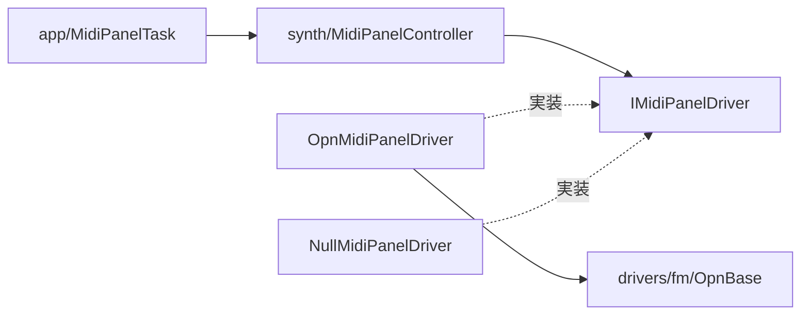
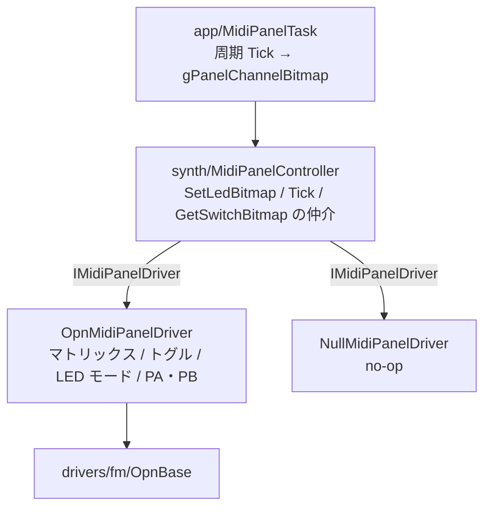
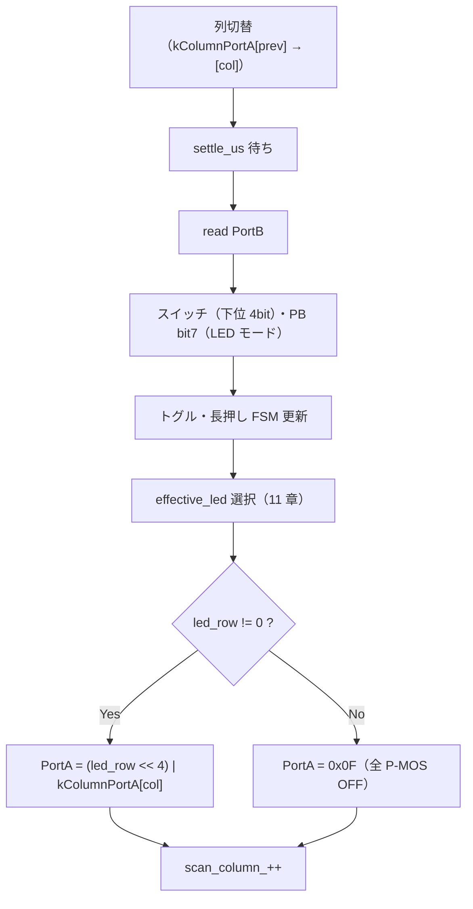
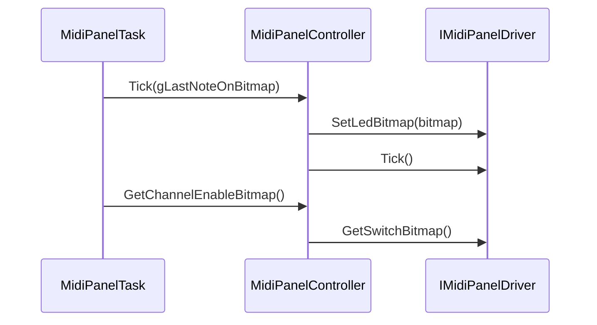
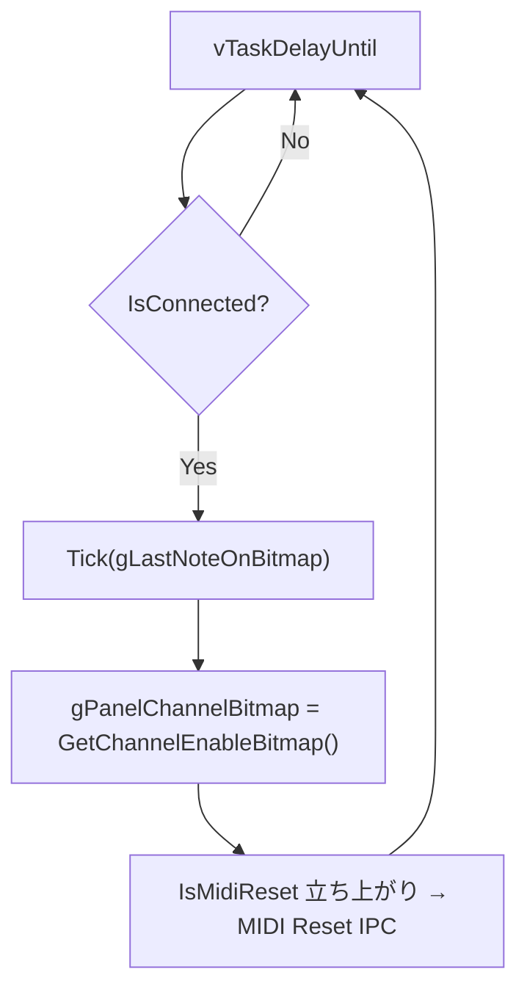
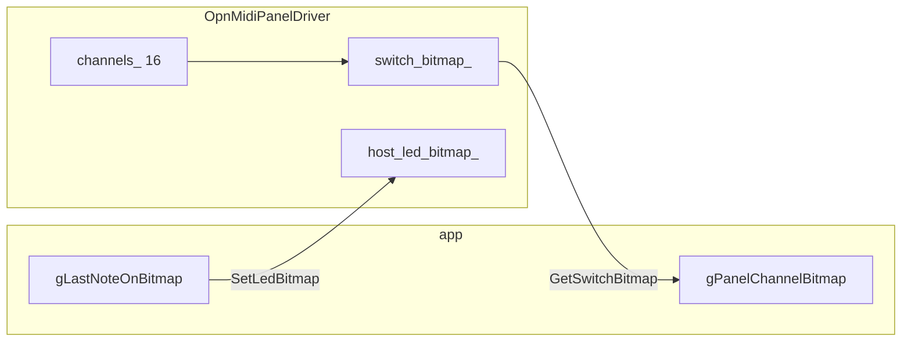

# MIDI Panel ソフトウェア設計書

PanelSubsystem（MIDI Panel）制御のソフトウェア設計。ハードウェア仕様は [spec_midi_panel.md](spec_midi_panel.md)。

| 文書 | 役割 |
|------|------|
| [spec_midi_panel.md](spec_midi_panel.md) | 回路・PA/PB 信号・マトリックス・PB4-7 割り当て |
| **本書** | レイヤ構成、API、ドライバ実装、タスク統合、タイミング |

---

## 目次

1. [目的とスコープ](#1-目的とスコープ)
2. [参照ドキュメント](#2-参照ドキュメント)
3. [設計原則と機能要件](#3-設計原則と機能要件)
4. [レイヤ構成](#4-レイヤ構成)
5. [ドライバレイヤ](#5-ドライバレイヤdriversmidi_panel)
6. [シンセレイヤ](#6-シンセレイヤmidipanelcontroller)
7. [アプリケーション統合](#7-アプリケーション統合)
8. [並行性・所有権](#8-並行性所有権)
9. [データモデル](#9-データモデル)
10. [テスト方針](#10-テスト方針)
11. [LED 表示モード](#11-led-表示モード)

---

## 1. 目的とスコープ

### 1.1 目的

- [spec_midi_panel.md](spec_midi_panel.md) に基づき MIDI Panel を制御する
- `drivers/midi_panel` + `synth/MidiPanelController` のレイヤで、ハード詳細とアプリを分離する
- `IMidiPanelDriver` により、パネルの接続方式が変わっても具象ドライバの差し替えだけで対応できるようにする

### 1.2 スコープ内

| レイヤ | 内容 |
|--------|------|
| `drivers/midi_panel/` | `IMidiPanelDriver`、`OpnMidiPanelDriver`、`NullMidiPanelDriver` |
| `synth/` | `MidiPanelController` |
| `app/` | `MidiPanelTask` |

### 1.3 スコープ外

- PanelSubsystem 基板・配線の変更
- `MidiEngine` / MIDI パースの内部実装

---

## 2. 参照ドキュメント

| 文書 | 内容 |
|------|------|
| [spec_midi_panel.md](spec_midi_panel.md) | ハードウェア仕様 |
| [architecture.md](architecture.md) | レイヤ規約 |
| [design_concurrency.md](design_concurrency.md) | `MidiPanelTask` 周期・共有変数 |

### 2.1 ハード仕様との対応

| ハード仕様（spec_midi_panel.md） | 本設計 |
|-----------|--------|
| マトリックス・CH 番号 | 列/行 → CH 変換（[5.3 節](#53-opnmidipaneldriver)） |
| PA/PB・PB4-7 | Port 読書き（5.3 節） |
| PB bit7 | LED モード（[5.3.1 節](#531-led-モード)・[11 章](#11-led-表示モード)） |
| スキャン・押下論理化 | `OpnMidiPanelDriver::Tick()`（5.3 節） |
| LED 出力フォーマット | PA 組み立て（5.3 節） |
| モーメンタリスイッチ | トグル FSM（[3.3 節](#33-ソフトウェア機能要件)） |
| PortA 接続 | `OpnMidiPanelDriver`（5.3 節） |

---

## 3. 設計原則と機能要件

### 3.1 原則

1. **インターフェースは Panel の機能単位** — `IMidiPanelDriver` は LED 点灯・スイッチ状態取得程度の抽象度。PA/PB・トグルは具象ドライバ内部
2. **厚いドライバ、薄い synth** — `OpnMidiPanelDriver` がマトリックス・トグル・PB bit7 LED モードを担当。`MidiPanelController` は API 仲介のみ
3. **LED モードはハード UI** — PB bit7（SW1 / PB4-7）。`IMidiPanelDriver` にモード設定 API は持たない
4. **依存方向** — `synth` は `OpnBase` / `drivers/fm` に依存しない



### 3.2 ビットマップ規約

- `uint16_t` 16bit、**bit0 = CH1 … bit15 = CH16**
- **bit = 1** … ON（LED 点灯 / スイッチ ON / チャンネル有効）
- `gPanelChannelBitmap` / `gLastNoteOnBitmap` と同じ意味

### 3.3 ソフトウェア機能要件

#### マトリックススキャン

一定周期でハード仕様のスキャン手順を繰り返し、16 CH の押下状態を更新する。

#### ソフトウェアトグル

モーメンタリスイッチをソフトでラッチトグル化する（押下ホールド → ON、再度ホールド → OFF）。`debounce_ms` / `toggle_hold_ms` は `MidiPanelHardwareConfig` で設定する。

#### LED 表示モード

| モード | 動作 | PB bit7（[spec_midi_panel.md](spec_midi_panel.md#43-sw1-割り当てpb4-7)） |
|--------|------|------|
| **A** トグル反映 | ソフトトグル ON → LED 点灯 | High |
| **B** MIDI 反映 | `gLastNoteOnBitmap` に LED 追従 | Low |

モード B のルール: CH n ↔ MIDI ch n（1:1）。CH1–9 / CH11–16 は有効な Note On があれば点灯し、vel=0 は消灯扱い。CH10（リズム）のみ例外で、vel>0 のヒットごとに短いパルス点灯する（vel=0 は消灯しない。詳細は [design_rhythm.md](design_rhythm.md#10-未実装既知の限界)）。詳細は [11 章](#11-led-表示モード)。

#### 長押し・MIDI Reset

| 項目 | 仕様 |
|------|------|
| 対象 | 16 CH 各ボタン個別 |
| 長押しビットマップ | `long_press_bitmap_`（bit i = CH(i+1)）。長押し中のみ 1 |
| 長押し時間 | `config_.long_press_ms`（現状 2000 ms） |
| トグルとの関係 | 長押し成立時はトグル反転しない |
| MIDI Reset | `IsMidiReset()` = `long_press_bitmap_` bit9（CH10）のレベル |
| Reset 発火 | `MidiPanelTask` が立ち上がりエッジで `MidiControlType::Reset` を IPC 送信 |

---

## 4. レイヤ構成



---

## 5. ドライバレイヤ（`drivers/midi_panel/`）

### 5.1 ファイル構成

| ファイル | 役割 |
|----------|------|
| `IMidiPanelDriver.h` | 抽象インターフェース |
| `OpnMidiPanelDriver.h` / `.cpp` | OPN PortA/B 具象実装 |
| `NullMidiPanelDriver.h` | 未接続スタブ |
| `MidiPanelDriverFactory.h` / `.cpp` | ファクトリ |

### 5.2 `IMidiPanelDriver`

```cpp
class IMidiPanelDriver {
public:
    virtual ~IMidiPanelDriver() = default;
    virtual bool IsAvailable() const = 0;
    virtual void Initialize() = 0;
    virtual void SetLedBitmap(uint16_t led_bitmap) = 0;   // bit i = CH(i+1)
    virtual uint16_t GetSwitchBitmap() const = 0;         // トグル後 ON/OFF
    virtual void Tick() = 0;                              // 1 回 = 1 列スロット
    virtual bool IsMidiReset() const = 0;                 // CH10 長押し（レベル）
};
```

インターフェースに含めないもの: `OpnBase`、デバウンスパラメータ、PB4-7 生データ。

### 5.3 `OpnMidiPanelDriver`

#### 責務

| 責務 | 参照 |
|------|------|
| PortA/B 初期化 | ハード仕様（システム接続） |
| マトリックススキャン・極性反転 | ハード仕様（スキャン手順） |
| ソフトトグル・長押し | [3.3 節](#33-ソフトウェア機能要件) |
| LED 出力・モード切替（PB bit7） | [5.3.1 節](#531-led-モード)・[11 章](#11-led-表示モード) |
| CH10 長押し → MIDI Reset | 3.3 節 |
| PortA 組み立て（上位=行、下位=列） | ハード仕様（PA/PB 信号定義） |

#### 内部状態

| メンバ | 役割 |
|--------|------|
| `host_led_bitmap_` | `SetLedBitmap`（モード B 用） |
| `switch_bitmap_` | トグル後 CH ON/OFF |
| `long_press_bitmap_` | 長押し中 CH（bit i = CH(i+1)） |
| `channels_[16]` | デバウンス・トグル・長押し per CH |

#### 5.3.1 LED モード

`OpnMidiPanelDriver::Tick()` では列選択後の `read_port_b()` で PB bit7 を読み、同一スロット内で LED ソースを選択する。

```cpp
const bool led_mode_midi = (pb_raw & 0x80u) == 0u;
const uint16_t effective_led = led_mode_midi ? host_led_bitmap_ : switch_bitmap_;
```

#### 5.3.2 `Tick()`（1 列スロット）

4 回の `Tick()` で 1 スキャンフレーム。



#### 5.3.3 Tick 周期

`T_tick` = `MIDI_PANEL_PERIOD_MS`、`T_frame` = `4 × T_tick`、`f_led` = `1 / T_frame`。デューティ 25%（4 列多重化）。

| `T_tick` | `T_frame` | `f_led` | FM バス占有目安 |
|----------|-----------|---------|----------------|
| 1 ms | 4 ms | 250 Hz | 約 2% |
| 2 ms | 8 ms | 125 Hz | 約 1% |
| **4 ms** | **16 ms** | **62.5 Hz** | **約 0.5%** |

**設定値（現行コード）**: `MIDI_PANEL_PERIOD_MS = 4`、`settle_us = 100`、`debounce_ms = 20`、`toggle_hold_ms = 100`、`long_press_ms = 2000`。これらのパラメータは実機での操作感に合わせて調整する。`settle_us` 待ちは FM バスロック外で行う。衝突時の追加待ちは数十 µs 程度。

`MidiPanelController::Tick()` は 1 周期あたり `driver->Tick()` を **1 回**呼ぶ。

#### 5.3.4 PortA の設定

列選択はアクティブ Low で当該列のビットをセットする:

```cpp
constexpr uint8_t kColumnPortA[4] = {0x0E, 0x0D, 0x0B, 0x07};  // 列 0〜3

port_a = static_cast<uint8_t>((led_row << 4) | kColumnPortA[col]);  // LED 点灯
port_a = 0x0F;  // ブランク（全 P-MOS OFF）
```

| PortA ビット | 意味 | 極性 |
|--------------|------|------|
| bit0〜3 | 列 c（Q5〜Q8） | Active **Low** |
| bit4〜7 | 行 r（Q1〜Q4） | Active **High** |

#### 5.3.5 `SetLedBitmap` / `GetSwitchBitmap`

- `SetLedBitmap` は同周期の `Tick()` より **先**に呼ぶ。モード B のみ LED に使用。最大 1 フレーム遅延を許容する
- `GetSwitchBitmap` はトグル後の CH ON/OFF を返す

### 5.4 `NullMidiPanelDriver`

| メソッド | 動作 |
|----------|------|
| `IsAvailable()` | `false` |
| `GetSwitchBitmap()` | `0xFFFF`（全 CH 有効） |
| その他 | no-op / `false` |

### 5.5 ファクトリ

```cpp
std::unique_ptr<IMidiPanelDriver> CreateMidiPanelDriver(OpnBase* opn);
// opn == nullptr → NullMidiPanelDriver
// else           → OpnMidiPanelDriver
```

`BUILD_MIDI_PANEL=OFF` 時も `NullMidiPanelDriver` を返す。

---

## 6. シンセレイヤ（`MidiPanelController`）

### 6.1 責務

| 担当 | 非担当 |
|------|--------|
| `SetLedBitmap` / `Tick` / `GetSwitchBitmap` の委譲 | マトリックス・トグル・PB4-7・PortA 変換 |

### 6.2 公開 API

```cpp
class MidiPanelController {
public:
    explicit MidiPanelController(std::unique_ptr<IMidiPanelDriver> driver);
    bool IsConnected() const;
    void Tick(uint16_t midi_ch_active_bitmap);
    uint16_t GetChannelEnableBitmap() const;
    bool IsMidiReset() const;
};
```

### 6.3 呼び出し順序



---

## 7. アプリケーション統合

### 7.1 `MidiPanelTask`



### 7.2 `main.cpp`

```cpp
auto driver = CreateMidiPanelDriver(modules[1]);
static MidiPanelController panelController(std::move(driver));
```

---

## 8. 並行性・所有権

| 項目 | 方針 |
|------|------|
| 呼び出し元 | `MidiPanelTask`（Core0）のみ |
| `IMidiPanelDriver` | 単一タスク前提（スレッドセーフ不要） |
| FM バス | Port 操作はロック下。`settle_us` はロック外 |
| `gPanelChannelBitmap` | Panel タスクのみが書き込み |

---

## 9. データモデル



| データ | 所在 |
|--------|------|
| `midi_ch_active` | app → `SetLedBitmap` |
| トグル・デバウンス・長押し | `OpnMidiPanelDriver` |
| LED モード | `OpnMidiPanelDriver`（PB bit7、[11 章](#11-led-表示モード)） |

---

## 10. テスト方針

| レベル | 内容 |
|--------|------|
| ユニット | 列パターン（`kColumnPortA`）、PortA 組み立て、トグル FSM |
| 結合 | `MidiPanelController` の呼び順 |
| 実機 | 全 CH トグル、長押し Reset、PB bit7 による LED モード A/B |

---

## 11. LED 表示モード

ハード入力・極性・読取りタイミング・LED ソース選択の詳細。概要は [3.3 節](#33-ソフトウェア機能要件)、ドライバ実装は [5.3.1 節](#531-led-モード)。回路定義は [spec_midi_panel.md](spec_midi_panel.md#43-sw1-割り当てpb4-7)。

### 11.1 ハード入力（PB bit7）

| 項目 | 内容 |
|------|------|
| 信号 | PortB bit7（SW1、PB4-7 のモード選択ライン） |
| 極性 | Active Low（スイッチ ON = Low、OFF = High） |
| 読取り | 列選択・`settle_us` 待ち後の `read_port_b()` と同一タイミング |
| 更新周期 | スキャンスロットごと（列 0〜3 の各 Tick） |

PB4-7 の bit4〜6 は未割当。

### 11.2 モード定義

| PB bit7 | モード | 名称 | LED ソース | 表示内容 |
|---------|--------|------|------------|----------|
| **High** | A | トグル反映 | `switch_bitmap_` | ソフトトグル ON の CH を点灯 |
| **Low** | B | MIDI 反映 | `host_led_bitmap_` | `SetLedBitmap` で渡された発音状態を反映 |

モード B の CH 対応・vel=0 の扱いは [3.3 節](#33-ソフトウェア機能要件)に従う。`MidiPanelTask` が `gLastNoteOnBitmap` を `SetLedBitmap` へ渡す。

### 11.3 ソフトウェア判定

`OpnMidiPanelDriver::Tick()` では、スイッチ下位 4bit と PB bit7 を同じ `pb_raw` から解釈する。

```cpp
const uint8_t pb_raw = opn_.read_port_b();
const uint8_t pressed_rows = static_cast<uint8_t>((~pb_raw) & 0x0Fu);
const bool led_mode_midi = (pb_raw & 0x80u) == 0u;
const uint16_t effective_led = led_mode_midi ? host_led_bitmap_ : switch_bitmap_;
```

| 要件 | 内容 |
|------|------|
| 判定マスク | `0x80`（PB bit7） |
| キャッシュ | モード状態をメンバに保持しない（毎スロット再判定） |
| 再読取り | LED 用 `write_port_a` の後に PB を読み直さない |
| `led_row` 組み立て | `effective_led` の当列 4bit を PA 上位ニブルへ反映（[5.3.4 節](#534-porta-の設定)） |

### 11.4 モード別動作要件

**モード A（トグル反映）**

- `UpdateChannelInput` で更新した `switch_bitmap_` が LED に反映される
- 押下中の生状態ではなく、ラッチ後の ON/OFF を表示する

**モード B（MIDI 反映）**

- `SetLedBitmap` で受け取った `host_led_bitmap_` が LED に反映される
- トグル状態（`switch_bitmap_`）は表示に使わない。チャンネル ON/OFF のソフト状態は維持される

**共通**

- 点灯する LED がないスロットでは `PortA = 0x0F`（全 P-MOS OFF）とする（[5.3.4 節](#534-porta-の設定)）
- PB bit7 の切替は次スロット以降の `effective_led` 選択に即反映される
