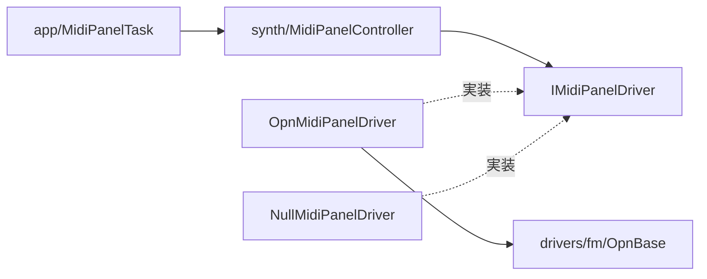
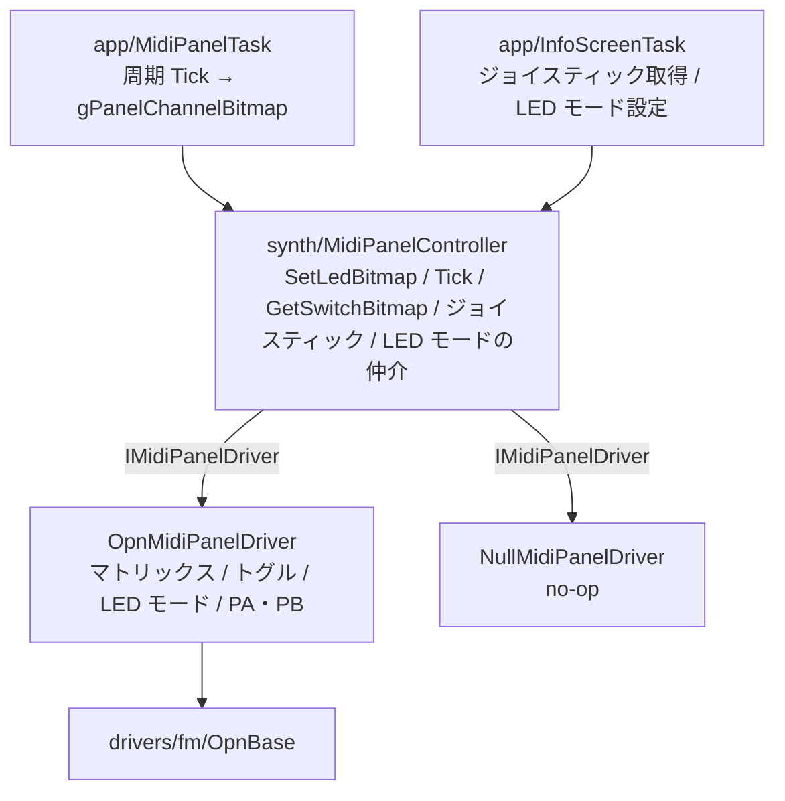
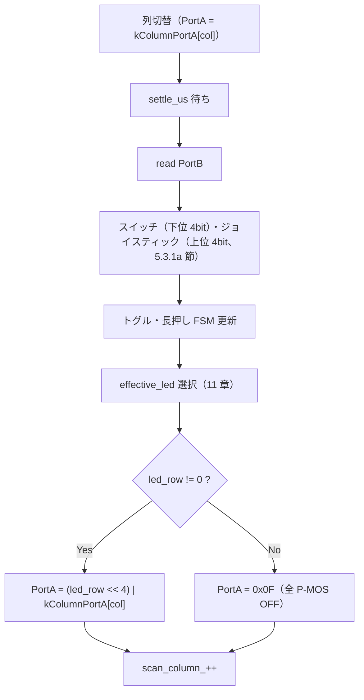
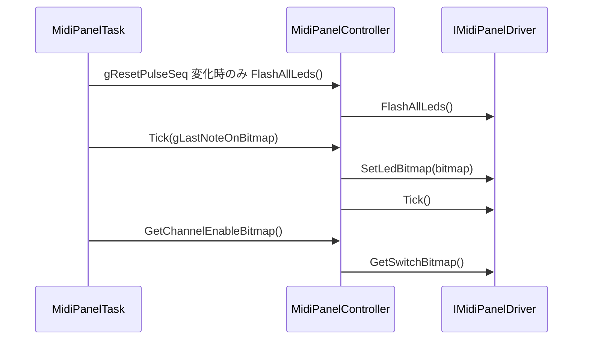
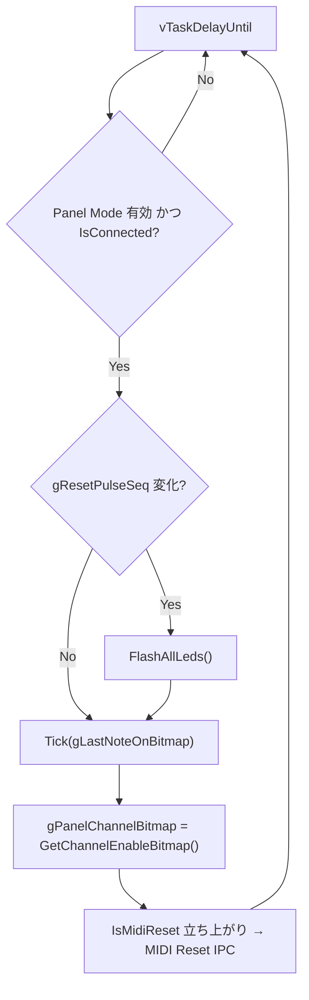
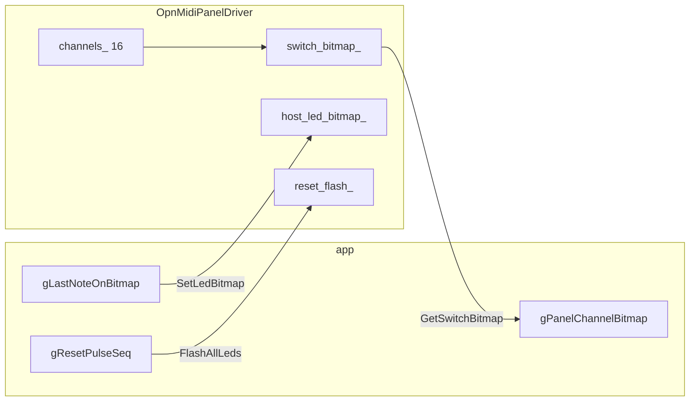

# MIDI Panel ソフトウェア設計書

PanelSubsystem（MIDI Panel）制御のソフトウェア設計。ハードウェア仕様は [spec_midi_panel.md](spec_midi_panel.md)。I/O ポート付きチップが必要なこと、現行の接続先が Dock3 であることは [spec_fm_chip.md](spec_fm_chip.md) を参照。

| 文書 | 役割 |
|------|------|
| [spec_midi_panel.md](spec_midi_panel.md) | 回路・PA/PB 信号・マトリックス・PB4-7 割り当て |
| **本書** | レイヤ構成、API、ドライバ実装、タスク統合、タイミング |

---

## 目次

1. [目的とスコープ](#1-目的とスコープ)
2. [参照ドキュメント](#2-参照ドキュメント)
3. [設計原則と機能要件](#3-設計原則と機能要件)
4. [レイヤ構成](#4-レイヤ構成)
5. [ドライバレイヤ](#5-ドライバレイヤdriversmidi_panel)
6. [シンセレイヤ](#6-シンセレイヤmidipanelcontroller)
7. [アプリケーション統合](#7-アプリケーション統合)
8. [並行性・所有権](#8-並行性所有権)
9. [データモデル](#9-データモデル)
10. [テスト方針](#10-テスト方針)
11. [LED 表示モード](#11-led-表示モード)

---

## 1. 目的とスコープ

### 1.1 目的

- [spec_midi_panel.md](spec_midi_panel.md) に基づき MIDI Panel を制御する
- `drivers/midi_panel` + `synth/MidiPanelController` のレイヤで、ハード詳細とアプリを分離する
- `IMidiPanelDriver` により、パネルの接続方式が変わってもドライバのインスタンス差し替えだけで対応できるようにする

### 1.2 スコープ内

| レイヤ | 内容 |
|--------|------|
| `drivers/midi_panel/` | `IMidiPanelDriver`、`OpnMidiPanelDriver`、`NullMidiPanelDriver` |
| `synth/` | `MidiPanelController` |
| `app/` | `MidiPanelTask` |

### 1.3 スコープ外

- PanelSubsystem 基板・配線の変更
- `MidiEngine` / MIDI パースの内部実装

---

## 2. 参照ドキュメント

| 文書 | 内容 |
|------|------|
| [spec_midi_panel.md](spec_midi_panel.md) | ハードウェア仕様 |
| [architecture.md](architecture.md) | レイヤ規約 |
| [design_concurrency.md](design_concurrency.md) | `MidiPanelTask` 周期・共有変数 |

### 2.1 ハード仕様との対応

| ハード仕様（spec_midi_panel.md） | 本設計 |
|-----------|--------|
| マトリックス・CH 番号 | 列/行 → CH 変換（[5.3 節](#53-opnmidipaneldriver)） |
| PA/PB・PB4-7 | Port 読書き（5.3 節） |
| PB bit7 | ジョイスティックの PUSH（Center）。LED モードは PB からは読まず、`IMidiPanelDriver::SetLedMode()`によるソフトウェア制御（[11 章](#11-led-表示モード)） |
| スキャン・押下論理化 | `OpnMidiPanelDriver::Tick()`（5.3 節） |
| LED 出力フォーマット | PA 組み立て（5.3 節） |
| モーメンタリスイッチ | トグル FSM（[3.3 節](#33-ソフトウェア機能要件)） |
| PortA 接続 | `OpnMidiPanelDriver`（5.3 節） |

---

## 3. 設計原則と機能要件

### 3.1 原則

1. **インターフェースは Panel の機能単位** — `IMidiPanelDriver` は LED 点灯・スイッチ状態取得・ジョイスティック状態取得程度の抽象度。PA/PB・トグルはドライバインスタンス内部
2. **厚いドライバ、薄い synth** — `OpnMidiPanelDriver` がマトリックス・トグル・ジョイスティック・LED モードを担当。`MidiPanelController` は API 仲介のみ
3. **LED モードはソフトウェア制御** — `IMidiPanelDriver::SetLedMode()`/`GetLedMode()`で明示的に設定する。PB bit7 はジョイスティックの PUSH に割り当てられており、モード切替に使える入力が無いため（[11 章](#11-led-表示モード)）
4. **依存方向** — `synth` は `OpnBase` / `drivers/fm` に依存しない


```mermaid
flowchart LR
    app["app/MidiPanelTask"] --> synth["synth/MidiPanelController"]
    synth --> iface["IMidiPanelDriver"]
    opn["OpnMidiPanelDriver"] -.実装.-> iface
    null["NullMidiPanelDriver"] -.実装.-> iface
    opn --> fm["drivers/fm/OpnBase"]
```

### 3.2 ビットマップ規約

- `uint16_t` 16bit、**bit0 = CH1 … bit15 = CH16**
- **bit = 1** … ON（LED 点灯 / スイッチ ON / チャンネル有効）
- `gPanelChannelBitmap` / `gLastNoteOnBitmap` と同じ意味

### 3.3 ソフトウェア機能要件

#### マトリックススキャン

一定周期でハード仕様のスキャン手順を繰り返し、16 CH の押下状態を更新する。

#### ソフトウェアトグル

モーメンタリスイッチをソフトでラッチトグル化する（押下ホールド → ON、再度ホールド → OFF）。`debounce_ms` / `toggle_hold_ms` は `MidiPanelHardwareConfig` で設定する。

#### LED 表示モード

| モード | 動作 | 設定方法 |
|--------|------|------|
| **A** トグル反映 | ソフトトグル ON → LED 点灯 | `SetLedMode(false)` |
| **B** MIDI 反映（既定） | `gLastNoteOnBitmap` に LED 追従 | `SetLedMode(true)` |

`IMidiPanelDriver::SetLedMode(bool note_reflect)` で切替える。PB bit7 はジョイスティックの PUSH に割り当てられており、モード切替用のハード入力は無いため、ソフトウェアのみの制御になる。呼び出し元は [design_display_menu.md](design_display_menu.md#54-led表示モード切替settings--led-mode) の `Settings > LED Mode` メニュー項目。

モード B のルール: CH n ↔ MIDI ch n（1:1）。CH1–9 / CH11–16 は有効な Note On があれば点灯し、vel=0 は消灯扱い。CH10（リズム）のみ例外で、vel>0 のヒットごとに短いパルス点灯する（vel=0 は消灯しない。詳細は [design_rhythm.md](design_rhythm.md#10-未実装既知の限界)）。詳細は [11 章](#11-led-表示モード)。

#### 長押し・MIDI Reset

| 項目 | 仕様 |
|------|------|
| 対象 | 16 CH 各ボタン個別 |
| 長押しビットマップ | `long_press_bitmap_`（bit i = CH(i+1)）。長押し中のみ 1 |
| 長押し時間 | `config_.long_press_ms`（現状 2000 ms） |
| トグルとの関係 | 長押し成立時はトグル反転しない |
| MIDI Reset | `IsMidiReset()` = `long_press_bitmap_` bit9（CH10）のレベル |
| Reset 発火 | `MidiPanelTask` が立ち上がりエッジで `MidiControlType::Reset` を IPC 送信 |
| Reset 適用通知 | `MidiEngineTask` が Reset を実適用したタイミングで全 LED 点滅（[11.5 節](#115-reset-通知点滅)） |

---

## 4. レイヤ構成


```mermaid
flowchart TD
    task["app/MidiPanelTask<br>周期 Tick → gPanelChannelBitmap"]
    info["app/InfoScreenTask<br>ジョイスティック取得 / LED モード設定"]
    ctrl["synth/MidiPanelController<br>SetLedBitmap / Tick / GetSwitchBitmap / ジョイスティック / LED モードの仲介"]
    task --> ctrl
    info --> ctrl
    ctrl -- IMidiPanelDriver --> opn["OpnMidiPanelDriver<br>マトリックス / トグル / LED モード / PA・PB"]
    ctrl -- IMidiPanelDriver --> null["NullMidiPanelDriver<br>no-op"]
    opn --> fm["drivers/fm/OpnBase"]
```

---

## 5. ドライバレイヤ（`drivers/midi_panel/`）

### 5.1 ファイル構成

| ファイル | 役割 |
|----------|------|
| `IMidiPanelDriver.h` | 抽象インターフェース |
| `OpnMidiPanelDriver.h` / `.cpp` | OPN PortA/B インスタンス実装 |
| `NullMidiPanelDriver.h` | 未接続スタブ |
| `MidiPanelDriverFactory.h` / `.cpp` | ファクトリ |

### 5.2 `IMidiPanelDriver`

```cpp
enum class JoystickDirection : uint8_t { None, Up, Down, Left, Right };

class IMidiPanelDriver {
public:
    virtual ~IMidiPanelDriver() = default;
    virtual bool IsAvailable() const = 0;
    virtual void Initialize() = 0;
    virtual void SetLedBitmap(uint16_t led_bitmap) = 0;   // bit i = CH(i+1)
    virtual uint16_t GetSwitchBitmap() const = 0;         // トグル後 ON/OFF
    virtual void Tick() = 0;                              // 1 回 = 1 列スロット
    virtual bool IsMidiReset() const = 0;                 // CH10 長押し（レベル）
    virtual void FlashAllLeds() = 0;                      // Reset 通知の全 LED 点滅トリガー
    virtual JoystickDirection GetJoystickDirection() const = 0;  // デバウンス済み
    virtual bool IsJoystickPushed() const = 0;                   // デバウンス済み
    virtual void SetLedMode(bool note_reflect) = 0;              // true=モードB(既定)
    virtual bool GetLedMode() const = 0;
};
```

インターフェースに含めないもの: `OpnBase`、デバウンスパラメータ、PB4-7 生データ（ジョイスティックはデコード済みの`JoystickDirection`/PUSHのみを公開する）。

### 5.3 `OpnMidiPanelDriver`

#### 責務

| 責務 | 参照 |
|------|------|
| PortA/B 初期化 | ハード仕様（システム接続） |
| マトリックススキャン・極性反転 | ハード仕様（スキャン手順） |
| ソフトトグル・長押し | [3.3 節](#33-ソフトウェア機能要件) |
| LED 出力・モード切替（ソフトウェア API） | [5.3.1 節](#531-led-モード)・[11 章](#11-led-表示モード) |
| ジョイスティックのデコード・デバウンス | [5.3.1a 節](#531a-ジョイスティック) |
| CH10 長押し → MIDI Reset | 3.3 節 |
| Reset 通知点滅（`FlashAllLeds`） | [11.5 節](#115-reset-通知点滅) |
| PortA 組み立て（上位=行、下位=列） | ハード仕様（PA/PB 信号定義） |

#### 内部状態

| メンバ | 役割 |
|--------|------|
| `host_led_bitmap_` | `SetLedBitmap`（モード B 用） |
| `switch_bitmap_` | トグル後 CH ON/OFF |
| `long_press_bitmap_` | 長押し中 CH（bit i = CH(i+1)） |
| `channels_[16]` | デバウンス・トグル・長押し per CH |
| `reset_flash_`（`ResetFlashState`） | Reset 通知点滅の進行状態（[11.5 節](#115-reset-通知点滅)） |
| `joystick_`（`JoystickInputState`） | ジョイスティック方向・PUSHのデバウンス状態（[5.3.1a 節](#531a-ジョイスティック)） |
| `led_mode_note_` | 現在のLEDモード（`true`=モードB、既定） |

#### 5.3.1 LED モード

`led_mode_note_`メンバで判定する。`SetLedMode()`で設定するソフトウェア状態で、PB bit7（ジョイスティックの PUSH）は LED モードの判定に使わない。

```cpp
const uint16_t effective_led = led_mode_note_ ? host_led_bitmap_ : switch_bitmap_;
```

#### 5.3.1a ジョイスティック

`Tick()`が読む`pb_raw`の上位4bitを、列スキャンとは独立に毎回デコードする（[spec_midi_panel.md 7.5節](spec_midi_panel.md#75-既知の制約)のとおりジョイスティックはマトリックススキャンと無関係に常時有効）。

```cpp
const uint8_t decoded = static_cast<uint8_t>((pb_raw >> 4) ^ 0x0Fu);
// bit2=DOWN(/B直結)、bit3=PUSH(/Center直結)。bit0/bit1はUP・LEFT・RIGHTのAND合成で、
// 両方立つとLEFT（spec_midi_panel.md 7.4節）。
```

UP/DOWN/LEFT/RIGHT/PUSHはそれぞれ独立に`config_.joystick_debounce_ms`（既定60ms）でデバウンスする。マトリックス読取り用の`debounce_ms`（20ms）とは別の値を使う。方向は単一レバー機構上排他だが、PUSHは方向と独立な接点のため別個に扱う（同時押しの組み合わせはPUSH+方向のみ想定）。

**PUSH中の方向の扱い**: bit6/bit7 は AND ゲートを介さない直結・高インピーダンスでノイズに弱く（[spec_midi_panel.md 7.5節](spec_midi_panel.md#75-既知の制約)）、PUSH操作中に方向ビット（bit4-6）へ電気的な回り込みが生じて幽霊DOWN等が安定値として確定すると、カーソルが意図せず動く。そのため、**PUSHの生ビットが立っている間は方向の生値サンプリング自体を止め、直前の安定値を保持する**（`UpdateJoystickInput()`）。PUSH中の方向変化は仕様上不要なため、単純に無視してよい。

#### 5.3.2 `Tick()`（1 列スロット）

4 回の `Tick()` で 1 スキャンフレーム。


```mermaid
flowchart TD
    A["列切替（PortA = kColumnPortA[col]）"] --> B["settle_us 待ち"]
    B --> C["read PortB"]
    C --> D["スイッチ（下位 4bit）・ジョイスティック（上位 4bit、5.3.1a 節）"]
    D --> E["トグル・長押し FSM 更新"]
    E --> F["effective_led 選択（11 章）"]
    F --> G{"led_row != 0 ?"}
    G -- Yes --> H["PortA = (led_row << 4) | kColumnPortA[col]"]
    G -- No --> I["PortA = 0x0F（全 P-MOS OFF）"]
    H --> J["scan_column_++"]
    I --> J
```

#### 5.3.3 Tick 周期

`T_tick` = `MIDI_PANEL_PERIOD_MS`、`T_frame` = `4 × T_tick`、`f_led` = `1 / T_frame`。デューティ 25%（4 列多重化）。

| `T_tick` | `T_frame` | `f_led` | FM バス占有目安 |
|----------|-----------|---------|----------------|
| 1 ms | 4 ms | 250 Hz | 約 2% |
| 2 ms | 8 ms | 125 Hz | 約 1% |
| **4 ms** | **16 ms** | **62.5 Hz** | **約 0.5%** |

**設定値（現行コード）**: `MIDI_PANEL_PERIOD_MS = 4`、`settle_us = 100`、`debounce_ms = 20`、`toggle_hold_ms = 30`、`long_press_ms = 2000`、`joystick_debounce_ms = 60`。これらのパラメータは実機での操作感に合わせて調整する。`settle_us` 待ちは FM バスロック外で行う。衝突時の追加待ちは数十 µs 程度。

`MidiPanelController::Tick()` は 1 周期あたり `driver->Tick()` を **1 回**呼ぶ。

#### 5.3.4 PortA の設定

列選択はアクティブ Low で当該列のビットをセットする:

```cpp
constexpr uint8_t kColumnPortA[4] = {0x0E, 0x0D, 0x0B, 0x07};  // 列 0〜3

port_a = static_cast<uint8_t>((led_row << 4) | kColumnPortA[col]);  // LED 点灯
port_a = 0x0F;  // ブランク（全 P-MOS OFF）
```

| PortA ビット | 意味 | 極性 |
|--------------|------|------|
| bit0〜3 | 列 c（Q5〜Q8） | Active **Low** |
| bit4〜7 | 行 r（Q1〜Q4） | Active **High** |

#### 5.3.5 `SetLedBitmap` / `GetSwitchBitmap`

- `SetLedBitmap` は同周期の `Tick()` より **先**に呼ぶ。モード B のみ LED に使用。最大 1 フレーム遅延を許容する
- `GetSwitchBitmap` はトグル後の CH ON/OFF を返す

### 5.4 `NullMidiPanelDriver`

| メソッド | 動作 |
|----------|------|
| `IsAvailable()` | `false` |
| `GetSwitchBitmap()` | `0xFFFF`（全 CH 有効） |
| その他 | no-op / `false` |

### 5.5 ファクトリ

```cpp
std::unique_ptr<IMidiPanelDriver> CreateMidiPanelDriver(OpnBase* opn);
// opn == nullptr → NullMidiPanelDriver
// else           → OpnMidiPanelDriver
```

`BUILD_MIDI_PANEL=OFF` 時も `NullMidiPanelDriver` を返す。

---

## 6. シンセレイヤ（`MidiPanelController`）

### 6.1 責務

| 担当 | 非担当 |
|------|--------|
| `SetLedBitmap` / `Tick` / `GetSwitchBitmap` / ジョイスティック取得 / LED モード設定の委譲 | マトリックス・トグル・PB4-7 のデコード・PortA 変換 |

### 6.2 公開 API

```cpp
class MidiPanelController {
public:
    explicit MidiPanelController(std::unique_ptr<IMidiPanelDriver> driver);
    bool IsConnected() const;
    void Tick(uint16_t midi_ch_active_bitmap);
    uint16_t GetChannelEnableBitmap() const;
    bool IsMidiReset() const;
    void FlashAllLeds();  // Reset 通知点滅トリガー（11.5 節）
    JoystickDirection GetJoystickDirection() const;  // 未接続時は None
    bool IsJoystickPushed() const;                   // 未接続時は false
    void SetLedMode(bool note_reflect);              // 未接続時は no-op
    bool GetLedMode() const;                         // 未接続時は true
};
```

### 6.3 呼び出し順序


```mermaid
sequenceDiagram
    participant Task as MidiPanelTask
    participant Ctrl as MidiPanelController
    participant Drv as IMidiPanelDriver

    Task->>Ctrl: gResetPulseSeq 変化時のみ FlashAllLeds()
    Ctrl->>Drv: FlashAllLeds()
    Task->>Ctrl: Tick(gLastNoteOnBitmap)
    Ctrl->>Drv: SetLedBitmap(bitmap)
    Ctrl->>Drv: Tick()
    Task->>Ctrl: GetChannelEnableBitmap()
    Ctrl->>Drv: GetSwitchBitmap()
```

---

## 7. アプリケーション統合

### 7.1 `MidiPanelTask`


```mermaid
flowchart TD
    A[vTaskDelayUntil] --> B{Panel Mode 有効 かつ IsConnected?}
    B -- No --> A
    B -- Yes --> F{"gResetPulseSeq 変化?"}
    F -- Yes --> G["FlashAllLeds()"]
    F -- No --> C
    G --> C["Tick(gLastNoteOnBitmap)"]
    C --> D["gPanelChannelBitmap = GetChannelEnableBitmap()"]
    D --> E["IsMidiReset 立ち上がり → MIDI Reset IPC"]
    E --> A
```

Panel Mode はデバッガコマンドで無効化できる（[design_concurrency.md](design_concurrency.md#34-midipaneltaskcore0-固定) 3.4節）。無効時は `IsConnected()` の結果によらずスキップする。

### 7.2 `main.cpp`

```cpp
auto driver = CreateMidiPanelDriver(modules[3]);
static MidiPanelController panelController(std::move(driver));
```

---

## 8. 並行性・所有権

| 項目 | 方針 |
|------|------|
| 呼び出し元 | `Tick` / `GetChannelEnableBitmap` / `IsMidiReset` / `FlashAllLeds`: `MidiPanelTask`（Core0）のみ。`GetJoystickDirection` / `IsJoystickPushed` / `SetLedMode` / `IsConnected`: `InfoScreenTask`（Core0） |
| `IMidiPanelDriver` | 2 タスクから呼ばれるが排他制御はしない。タスク間で共有するのは`joystick_`の安定値・`led_mode_note_`の単一バイト値で、片方のタスクが書き、もう片方が読むだけ（読み書きは Cortex-M33 で単一命令） |
| FM バス | Port 操作はロック下。`settle_us` はロック外 |
| `gPanelChannelBitmap` | Panel タスクのみが書き込み |

PortA/B（0x0e/0x0f）への書き込みには、`opn_piolib` が実機固有の制約として FM 相当のアドレスライト後待ち（W1=17）を常時適用する（[spec_opn.md](spec_opn.md#io-portab-書き込みの待ち時間) 参照）。

---

## 9. データモデル


```mermaid
flowchart LR
    subgraph app_data ["app"]
        LN["gLastNoteOnBitmap"]
        PC["gPanelChannelBitmap"]
        RP["gResetPulseSeq"]
    end
    subgraph driver_data ["OpnMidiPanelDriver"]
        HL["host_led_bitmap_"]
        SW["switch_bitmap_"]
        CH["channels_ 16"]
        RF["reset_flash_"]
    end
    LN -->|SetLedBitmap| HL
    SW -->|GetSwitchBitmap| PC
    CH --> SW
    RP -->|FlashAllLeds| RF
```

| データ | 所在 |
|--------|------|
| `midi_ch_active` | app → `SetLedBitmap` |
| トグル・デバウンス・長押し | `OpnMidiPanelDriver` |
| LED モード | `OpnMidiPanelDriver`（`led_mode_note_`、[11 章](#11-led-表示モード)） |
| ジョイスティック方向・PUSH | `OpnMidiPanelDriver`（`joystick_`、[5.3.1a 節](#531a-ジョイスティック)） |
| Reset 通知点滅の進行状態 | `OpnMidiPanelDriver`（`reset_flash_`、[11.5 節](#115-reset-通知点滅)） |

---

## 10. テスト方針

| レベル | 内容 |
|--------|------|
| ユニット | 列パターン（`kColumnPortA`）、PortA 組み立て、デバウンス、トグル FSM、長押し Reset、LED モード A/B 切替、ジョイスティックのデコード・デバウンス（`tests/unit/drivers/midi_panel/test_opn_midi_panel_driver.cpp`。`IIoPort` フェイクと pico-sdk 時刻 API のフェイクで実機非依存に検証） |
| 結合 | `MidiPanelController` の呼び順 |
| 実機 | 全 CH トグル、長押し Reset、`Settings > LED Mode` による LED モード A/B 切替、ジョイスティック方向・PUSH |

---

## 11. LED 表示モード

LED ソース選択の詳細。概要は [3.3 節](#33-ソフトウェア機能要件)、ドライバ実装は [5.3.1 節](#531-led-モード)。

モードの切替は、`IMidiPanelDriver::SetLedMode(bool note_reflect)` によるソフトウェアのみで行う。PB bit7 はジョイスティックの PUSH に割り当てられており、モード切替に使えるハード入力が無いため（[spec_midi_panel.md 7 章](spec_midi_panel.md#7-ジョイスティック)）。呼び出し元は [design_display_menu.md](design_display_menu.md#54-led表示モード切替settings--led-mode) の `Settings > LED Mode` メニュー項目（既定はモード B）。

### 11.1 モード定義

| `led_mode_note_` | モード | 名称 | LED ソース | 表示内容 |
|---------|--------|------|------------|----------|
| `false` | A | トグル反映 | `switch_bitmap_` | ソフトトグル ON の CH を点灯 |
| `true`（既定） | B | MIDI 反映 | `host_led_bitmap_` | `SetLedBitmap` で渡された発音状態を反映 |

モード B の CH 対応・vel=0 の扱いは [3.3 節](#33-ソフトウェア機能要件)に従う。`MidiPanelTask` が `gLastNoteOnBitmap` を `SetLedBitmap` へ渡す。

### 11.2 ソフトウェア判定

```cpp
const uint16_t effective_led = led_mode_note_ ? host_led_bitmap_ : switch_bitmap_;
```

| 要件 | 内容 |
|------|------|
| 状態保持 | `led_mode_note_`メンバに保持する（`SetLedMode()`で書き換わるまで維持） |
| 既定値 | `true`（モード B） |
| `led_row` 組み立て | `effective_led` の当列 4bit を PA 上位ニブルへ反映（[5.3.4 節](#534-porta-の設定)） |

### 11.3 モード別動作要件

**モード A（トグル反映）**

- `UpdateChannelInput` で更新した `switch_bitmap_` が LED に反映される
- 押下中の生状態ではなく、ラッチ後の ON/OFF を表示する

**モード B（MIDI 反映）**

- `SetLedBitmap` で受け取った `host_led_bitmap_` が LED に反映される
- トグル状態（`switch_bitmap_`）は表示に使わない。チャンネル ON/OFF のソフト状態は維持される

### 11.5 Reset 通知点滅

CH10 長押しで MIDI Reset が発火してから、`MidiEngineTask` が実際に Reset を適用するまでには
IPC 経由の遅延がある（[design_concurrency.md](design_concurrency.md#4-core-間通信ipc)）。パネル操作側では
「Reset が実際にかかったタイミング」を知りようがないため、`MidiEngineTask` 側から
`gResetPulseSeq`（[design_concurrency.md](design_concurrency.md#44-共有変数volatile--atomic)）で通知し、
`MidiPanelTask` がその変化を検出して `FlashAllLeds()` を呼ぶ。

| 項目 | 内容 |
|------|------|
| トリガー | `MidiPanelTask` が `gResetPulseSeq` の変化を検出した Tick |
| 実装箇所 | `OpnMidiPanelDriver`（`reset_flash_`、`ResetFlashState`） |
| 点滅回数 | 2 回（静的定数 `kResetFlashBlinkCount`） |
| 点滅周期 | 1 秒あたり 4 回（静的定数 `kResetFlashRateHz`。ON/OFF 各半周期 `kResetFlashHalfPeriodMs`。トリガーから 500ms で 2 回点滅が完了する） |
| LED ソースとの関係 | `led_mode_note_`（モード A/B）の判定より **優先**する。点滅中は `effective_led` を強制的に全 ON/全 OFF にする |
| 終了後 | 通常の `effective_led` 選択（モード A/B）に復帰する |

点滅回数・周期はすべて `OpnMidiPanelDriver.cpp` 内の名前付き定数（`kResetFlashBlinkCount` /
`kResetFlashRateHz`）で決まる。実行時設定にはしていない。

**共通**

- 点灯する LED がないスロットでは `PortA = 0x0F`（全 P-MOS OFF）とする（[5.3.4 節](#534-porta-の設定)）
- `SetLedMode()` の切替は次スロット以降の `effective_led` 選択に即反映される
