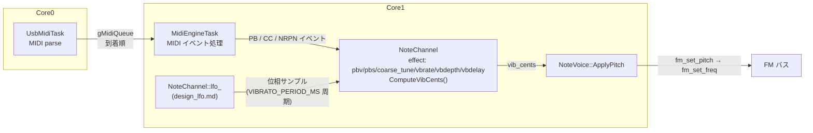
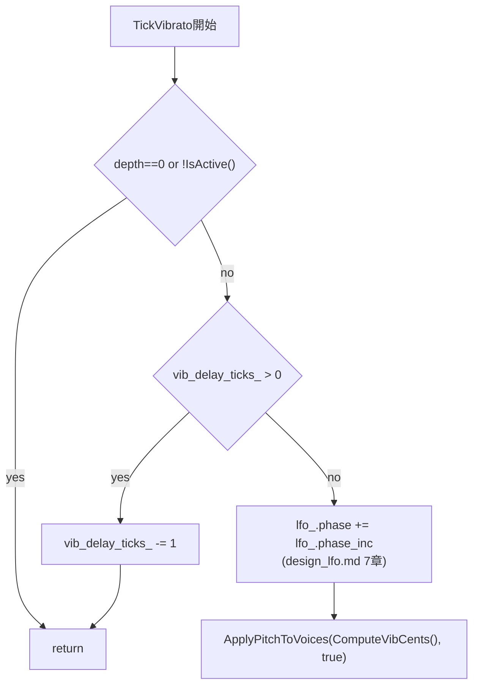

# ピッチエフェクト設計仕様（Pitch Bend・ビブラート）

MIDI チャンネル単位のピッチエフェクト（Pitch Bend、coarse tune、ビブラート）の設計を定義する。あわせて、同じ `NoteChannel` / `NoteVoice` の状態・イベント経路に乗る Pan（CC#10）も本書で扱う。

ビブラートの位相・レートを生成するソフトウェア LFO そのものは [design_lfo.md](design_lfo.md) が扱う。
本書は、その LFO が生成する変調サンプルを MIDI パラメータ（NRPN 1:8/1:9/1:10 等）と組み合わせて
どうピッチへ合成するか、MIDI からどう設定するかを定義する。

基本方針:

- ビブラートは [design_lfo.md](design_lfo.md) のソフトウェア LFO を用いる
- GM / XG 等の MIDI 機器のパラメータモデルに合わせる。OPNA の PMS 曲線・8 段レートには合わせない
- ピッチ適用経路は 1 本に統合する（PB・ビブラート・coarse tune を同じ計算で `fm_set_pitch` へ）

関連: [design_lfo.md](design_lfo.md)、[design_concurrency.md](design_concurrency.md)、[design_midi_message.md](design_midi_message.md)

---

## 目次

1. [背景と設計判断](#1-背景と設計判断)
2. [スコープ](#2-スコープ)
3. [アーキテクチャ](#3-アーキテクチャ)
4. [データ構造](#4-データ構造)
5. [Pitch Bend / Coarse Tune](#5-pitch-bend--coarse-tune)
6. [NRPN 1:8 ビブラートレート](#6-nrpn-18-ビブラートレート)
7. [CC#1 / NRPN 1:9 ビブラート深さ](#7-cc1--nrpn-19-ビブラート深さ)
8. [NRPN 1:10 ビブラート遅延](#8-nrpn-110-ビブラート遅延)
9. [ピッチ合成](#9-ピッチ合成)
10. [イベント処理](#10-イベント処理)
11. [Note On / Retrigger 時の適用](#11-note-on--retrigger-時の適用)
12. [Pan（CC#10）](#12-pancc10)
13. [ビルド設定](#13-ビルド設定)

---

## 1. 背景と設計判断

### 1.1 本書の範囲

LFO の生成理由・位相のリセット規則（無音時リセット・和音中維持）は [design_lfo.md](design_lfo.md) が扱う。本書が定義するのは、その LFO が生成する位相サンプルを **どのくらいの深さで・どのタイミングから** ピッチに反映するか、という消費側の設計である。

ビブラートの深さ・遅延は MIDI チャンネル共通（同一 ch の和音は同じ深さ・同じ遅延状態で鳴る）。レート・位相の共有ルールは LFO 側の設計であり、[design_lfo.md 1章](design_lfo.md#1-背景と設計判断)を参照する。チャンネル間はすべて独立する。

### 1.2 主要な設計判断

| ID | 内容 |
|----|------|
| D1 | Pitch Bend は active + hold の全 Voice に即時反映する（`MidiEngineTask`、[5章](#5-pitch-bend--coarse-tune)） |
| D2 | 深さは線形セント（`vbdepth` 0〜127 → 0〜`VIBRATO_DEPTH_MAX_CENTS`、[7章](#7-cc1--nrpn-19-ビブラート深さ)） |
| D3 | ビブラート遅延（`vbdelay`、NRPN 1:10）は、深さ（NRPN 1:9）と同じ理由（音色プリセットの遅延を持たない）で、64 中心の相対値のうち 65 以上の超過分だけを遅延量として使う。遅延中は LFO 位相の進行そのものを止め、遅延終了後に位相 0 から滑らかに変調が始まるようにする（[8章](#8-nrpn-110-ビブラート遅延)） |

---

## 2. スコープ

### 2.1 対象

- `NoteChannel`（MIDI ch 1〜16、ch 10 を除く）
- 発音中の `NoteVoice`（`activeQueue` / `holdQueue`）
- Pitch Bend・coarse tune・ビブラートレート/深さ/遅延の MIDI からの設定とピッチへの合成
- Pan（CC#10）の MIDI からの設定と Voice への反映（[12章](#12-pancc10)。ピッチ合成とは独立）

### 2.2 非対象

| 項目 | 理由 |
|------|------|
| `RhythmChannel`（MIDI ch 10） | リズム専用。ビブラート対象外 |
| `CsmVoice` | CH3 複数モジュール制約のため、ビブラート・PB 非対応 |
| 振幅ビブラート（AMS / トレモロ） | ソフトウェア未実装 |
| GM2 RPN 0,0,5（Modulation Depth Range） | 非サポート。ビブラート深さは XG（NRPN 1:9）準拠の固定レンジ・相対値モデルに一本化し、GM2 の絶対値（半音+セント）モデルとは混在させない |
| LFO の位相・レート生成そのもの | [design_lfo.md](design_lfo.md) を参照 |

---

## 3. アーキテクチャ



| コンポーネント | 責務 |
|----------------|------|
| `MidiChannel::effect`（`ChannelEffects`） | MIDI 論理値: `pbv`, `pbs`, `vbrate`, `vbdepth`, `vbdelay`, `coarse_tune` |
| `NoteChannel` | イベント時の状態更新、`ComputeVibCents()` によるセント変換、全発音 Voice へのピッチ再適用 |
| `MidiEngineTask` | MIDI イベント処理。LFO の周期呼び出し自体は [design_lfo.md 7章](design_lfo.md#7-周期実行midienginetask)を参照 |
| `NoteVoice` | `ApplyPitch(...)` / Pan |

最終ピッチは `fm_set_pitch` → `fm_set_freq`（Block + F-Number、チップあたり 2 レジスタ）で書き込む。

Pitch Bend は LFO の周期処理の責務にしない。ホイールは `MidiEngineTask` で即時 `ApplyPitchToVoices` する。

FM バス書き込みについて: Core1 では `MidiEngineTask`・`CsmFrameTask` が `fm_set_*` を呼ぶが、PIO バス spinlock で直列化される（[design_concurrency.md](design_concurrency.md#5-single-writer-rule) 参照）。

---

## 4. データ構造

### 4.1 チャンネルエフェクト（`Voice.h` の `ChannelEffects`）

```cpp
struct ChannelEffects {
    int16_t pbv;          // Pitch Bend (-8192〜8191)
    uint8_t pbs;          // PB sensitivity (default 2)
    uint8_t vbrate;       // 0..127 → LFO レート（6章、design_lfo.md 5章）
    uint8_t vbdepth;      // 0..127 → vibrato depth（7章）
    uint8_t vbdelay;      // 0..126 → vibrato delay（8章）
    int8_t  coarse_tune;  // semitones offset (optional)

    void Init();  // pbs=2、他 0
};
```

- `MidiChannel::effect` として 1 チャンネル 1 個保持する
- MIDI セマンティクス上はチャンネル状態だが、Voice API の引数型として `Voice.h` に置く

### 4.2 ビブラート遅延カウンタ（`NoteChannel`）

```cpp
// NoteChannel 私有メンバ。ChannelLfoState（design_lfo.md）とは別に持つ。
uint32_t vib_delay_ticks_;  // 残り遅延 tick 数。0 なら遅延なし
```

`ChannelLfoState`（位相・位相増分）には含めない。遅延はビブラート固有のゲート条件であり、LFO 自体の生成ロジックからは独立させる（詳細は [8章](#8-nrpn-110-ビブラート遅延)）。

### 4.3 NoteVoice 側

- 発音キー `key`、モジュール参照、`fm_ch` を保持する
- Voice ごとの `pbv` キャッシュは持たない（チャンネルの `effect` を常に参照する）

sin LUT は [design_lfo.md 4章](design_lfo.md#4-波形と位相)が定義する生成側のテーブルである。`ComputeVibCents`（セント変換）・`PitchCalcVibDiff`（セント→F-Number 差分）は本書（消費側）の変換ロジックとして `NoteChannel.cpp` / `NoteVoice.cpp` 内の `static` に閉じる。PB / ビブラート合成は `NoteVoice.cpp` の `ApplyPitch` に集約する。`NoteVoice` は `NoteChannel` を include しない（依存の向き: channel → voice）。

---

## 5. Pitch Bend / Coarse Tune

| ソース | MIDI | フィールド | 備考 |
|--------|------|------------|------|
| Pitch Bend | PB メッセージ | `pbv` | −8192〜8191。D1（[1.2節](#12-主要な設計判断)）により active + hold へ即時反映 |
| RPN 0:0 | Data Entry MSB | `pbs` | Pitch Bend Sensitivity |
| RPN 0:2 | Data Entry MSB | `coarse_tune` | `ENABLE_COARSE_TUNE` 時のみ |

ピッチへの合成方法は [9章](#9-ピッチ合成)を参照。

---

## 6. NRPN 1:8 ビブラートレート

| MIDI | フィールド | 値の扱い |
|------|------------|----------|
| NRPN 1:8（Data Entry MSB） | `vbrate` | XG Vibrato Rate。受信値 `val`（0〜127）をそのまま `vbrate` に格納する（64 中心の相対値としては扱わない） |

`vbrate` の消費（LFO レートへの変換、`phase_inc` 再計算）は本書のスコープ外であり、[design_lfo.md 5章](design_lfo.md#5-位相増分レート)が定義する。本書の責務は、NRPN 1:8 を受信して `effect.vbrate` を更新し、LFO 側の再計算をトリガすることのみである（[10章](#10-イベント処理)）。

---

## 7. CC#1 / NRPN 1:9 ビブラート深さ

### 7.1 MIDI 値のマッピング

| MIDI | フィールド | 値の扱い |
|------|------------|----------|
| CC#1（Modulation） | `vbdepth` | 受信値 `val`（0〜127）をそのまま `vbdepth` に格納する |
| NRPN 1:9（Data Entry MSB） | `vbdepth` | XG Vibrato Depth。64 中心の相対値（64 以下→0、65 以上→`(val-64)*2`）を CC#1 相当の深さとして格納する |

CC#1 と NRPN 1:9 は同じ `vbdepth` を更新する。後から送られた方が有効になる。

### 7.2 セント変換

LFO の位相サンプル（[design_lfo.md 4章](design_lfo.md#4-波形と位相)の `index`）を、`vbdepth` に応じたセント偏差へ変換する。

```
peak_cents = (vbdepth * VIBRATO_DEPTH_MAX_CENTS) / 127
vib_cents  = (peak_cents * sin_lut[index]) >> 15
```

`ComputeVibCents()` はこの変換に加えて、深さ 0 とビブラート遅延中（[8章](#8-nrpn-110-ビブラート遅延)）を 0 として扱うゲートを持つ。

```cpp
int16_t NoteChannel::ComputeVibCents() const {
    const uint8_t depth = EffectiveVbdepth(effect.vbdepth);
    if (depth == 0 || vib_delay_ticks_ > 0) {
        return 0;
    }
    const uint32_t index = (lfo_.phase >> 24) & 0xFFu;
    const int32_t peak_cents = (static_cast<int32_t>(depth) * VIBRATO_DEPTH_MAX_CENTS) / 127;
    return static_cast<int16_t>((peak_cents * kSinLut[index]) >> 15);
}
```

---

## 8. NRPN 1:10 ビブラート遅延

### 8.1 目的

無音からの Note On 後、指定時間だけビブラートの適用を遅らせる。ピアノやギターの「発音直後はストレートピッチ、伸ばすうちに揺れ始める」表現に使う。XG の NRPN 1:10（Vibrato Delay）に対応する。

### 8.2 MIDI 値のスケーリング

| MIDI | フィールド | 値の扱い |
|------|------------|----------|
| NRPN 1:10（Data Entry MSB） | `vbdelay` | XG Vibrato Delay。音色プリセットの遅延を持たないため、NRPN 1:9（深さ）と同じ変換式を採用する。64 中心の相対値（64 以下→0、65 以上→`(val-64)*2`）を遅延量として格納する |

```
effect.vbdelay = (val > 64) ? (val - 64) * 2 : 0;   // 0..126
delay_ms       = effect.vbdelay * VIBRATO_DELAY_MAX_MS / 127;
delay_ticks    = round(delay_ms / VIBRATO_PERIOD_MS);  // VIBRATO_PERIOD_MS は design_lfo.md 9章
```

`VIBRATO_DELAY_MAX_MS` は `vbdelay=126` のときの遅延量上限（[13章](#13-ビルド設定)）。`vbdelay=0`（NRPN 未送信時の初期値）は遅延なしを意味し、既存の（遅延機能導入前の）挙動と一致する。

### 8.3 状態とライフサイクル

`vib_delay_ticks_`（[4.2節](#42-ビブラート遅延カウンタnotechannel)）のライフサイクル。

| イベント | `vib_delay_ticks_` |
|----------|---------------------|
| 無音からの Note On（active+hold 空） | `VibratoCalcDelayTicks(effect.vbdelay)` にセット |
| 和音中の Note On | 変更しない（進行中のカウントダウンを維持） |
| `TickVibrato` 呼び出し時、`> 0` | 1 減算するのみ。位相は進めず、ピッチ再適用もしない |
| カウント 0 到達後 | 通常の `TickVibrato`（位相進行 → `ComputeVibCents` → 適用）に戻る |
| `ResetAllController` | 0（遅延なし状態へ即座に戻す） |
| NRPN 1:10 による `vbdelay` 変更 | `vib_delay_ticks_` を再計算しない。次回の無音→Note On から新しい遅延量が適用される |

無音からの Note On で `vib_delay_ticks_` をセットするのは、LFO 位相リセット（[design_lfo.md 6章](design_lfo.md#6-位相ライフサイクル)）と同じトリガである。和音中の新音でリセットしない理由も同様（進行中の変調状態を不連続にしない）。

### 8.4 `TickVibrato` への追加ゲート

`NoteChannel::TickVibrato()`（既存の早期 return 条件は [design_lfo.md 7章](design_lfo.md#7-周期実行midienginetask)参照）に、遅延カウントダウンの分岐を追加する。



遅延中は位相そのものを進めない。無音中に位相を止める設計（[design_lfo.md 6章](design_lfo.md#6-位相ライフサイクル)）と同じ考え方で、遅延終了時点の位相を毎回 0 から始め、予測可能にする。

### 8.5 Note On 時点の扱い

[11章](#11-note-on--retrigger-時の適用)の KeyOn 前適用でも `ComputeVibCents()` を呼ぶため、遅延成立前は自動的に `vib_cents=0` のピッチで KeyOn する。無音からの Note On で `vib_delay_ticks_` をセットするタイミングは、この KeyOn 前適用より先に行う。

---

## 9. ピッチ合成

### 9.1 合成順序と `ApplyPitch`（1 Voice）

`NoteVoice::ApplyPitch(const ChannelEffects& fx, int16_t vib_cents)` は、同じ `k` / `oct` / `p` に対して PB 偏差とビブラート偏差を加算する。

1. `adjusted_key = key + coarse_tune`（`ENABLE_COARSE_TUNE` 時）
2. PB 分岐で `k`, `oct`, `p`, `diff_pb` を求める。`pbs == 0 || pbv == 0` のときは `diff_pb = 0` とし、`k`, `oct` は `key` から算出する
3. ビブラート偏差: `diff_vib = PitchCalcVibDiff(k, vib_cents)`
4. `fm_set_pitch(fm_ch, p, oct, diff_pb + diff_vib)` — クランプは `OpnBase::fm_set_pitch` 内（0〜0x7ff）

`vib_cents` は呼び出し側（`NoteOn` / `TryRetrigger` / `TickVibrato` / PB・CC）が `ComputeVibCents()` で計算して渡す。`!IsActive()` または `vbdepth==0` または遅延中なら `TickVibrato` は `ApplyPitch` を呼ばない。

#### `PitchCalcVibDiff`（セント → F-Number 偏差）

PB と同じ `fnum[]` テーブル・同じ索引 `k` を使う。100 cents = 1 半音の線形近似。

```
semitone = fnum[k + 1] - fnum[k]
diff_vib = (int32_t)semitone * vib_cents / 100
```

- `vib_cents` は符号付き（sin 乗算結果）。0 なら `diff_vib = 0`
- `k` がテーブル参照範囲外のときは `diff_vib = 0` とする（`NoteVoice.cpp` の範囲ガード）
- PB あり・なしのどちらでも、手順 2 で得た `k` を共有する

### 9.2 API

```cpp
// NoteChannel.h / .cpp
int16_t NoteChannel::ComputeVibCents() const;
void    NoteChannel::ApplyPitchToVoices(int16_t vib_cents, bool allow_vib_dedup = false);
void    NoteChannel::TickVibrato(uint32_t phase_ticks);

// NoteVoice.h / .cpp（Voice.h の ChannelEffects を使用）
void NoteVoice::NoteOn(..., int16_t vib_cents);
bool NoteVoice::TryRetrigger(..., int16_t vib_cents);
void NoteVoice::ApplyPitch(const ChannelEffects& fx, int16_t vib_cents);

// NoteChannel.cpp 内 static（8章）
static uint32_t VibratoCalcDelayTicks(uint8_t vbdelay);

// NoteVoice.cpp 内 static
static int16_t PitchCalcVibDiff(int k, int16_t vib_cents);
```

`CsmVoice::ApplyPitch` は no-op。Pan は `SetPan` / `SetOutputLR` のみ。

---

## 10. イベント処理

いずれも `MidiEngineTask`（Core1）内。PB / CC / NRPN / TickVibrato は状態更新後に active + hold の全 `NoteVoice` へ `ApplyPitch` する。Note On / Retrigger は当該 Voice のみ KeyOn 前に適用する。

| イベント | 状態更新 | 即時 `ApplyPitch` |
|----------|----------|-------------------|
| Pitch Bend | `pbv` | active + hold（D1） |
| CC#1 | `vbdepth` | `vbdepth→0` のとき必須（vib=0）。非 0 時も即時 1 回 `ApplyPitchToVoices(ComputeVibCents())` |
| NRPN 1:8 | `vbrate` + LFO `phase_inc` 再計算（[design_lfo.md 5章](design_lfo.md#5-位相増分レート)） | 不要 |
| NRPN 1:9 | `vbdepth`（64 中心相対値を変換） | CC#1 と同様 |
| NRPN 1:10 | `vbdelay`（64 中心相対値を変換）。`vib_delay_ticks_` は再計算しない（[8.3節](#83-状態とライフサイクル)） | 不要 |
| PBS / coarse (Data Entry) | `pbs` / `coarse_tune` | active + hold |
| ResetAllController | `effect.Init()` + LFO 位相 0（design_lfo.md）+ `vib_delay_ticks_=0` | active + hold |
| Note On / Retrigger | — | 当該 Voice のみ、KeyOn 前（[11章](#11-note-on--retrigger-時の適用)） |
| SetPan (CC#10) | `outputLR` | 不要（次回 Note On から反映。[12章](#12-pancc10)） |

### 10.1 `ApplyPitchToVoices`

`activeQueue` と `holdQueue` の全 Voice に `ApplyPitch(effect, vib_cents)` を適用する。`vib_cents` は呼び出し側で計算する（イベント時は `vbdepth` から、`TickVibrato` 時は LFO から）。`allow_vib_dedup = true` のとき、Voice 側で直前と同じ `vib_cents` なら FM 書き込みを省略する（[9.1節](#91-合成順序と-applypitch1-voice)、`NoteVoice::ApplyPitch`）。

### 10.2 `vbdepth` が 0 になったとき

```cpp
effect.vbdepth = 0;
ApplyPitchToVoices(0);  // ビブラート成分を除去したピッチへ即復帰
```

以降の `TickVibrato` は当該 ch をスキップする。

---

## 11. Note On / Retrigger 時の適用

`NoteVoice` は `NoteChannel` を知らないため、チャンネルが `ComputeVibCents()` を計算して `NoteOn` / `TryRetrigger` に渡す。適用は当該 Voice の KeyOn 前に 1 回だけ行い、既存の active / hold Voice は書き換えない（PB・LFO 状態は NoteOn では変わらない。無音時の位相リセット時は他 Voice がいない）。

```cpp
// NoteChannel::NoteOn（CSM モード除く）
const int16_t vib_cents = ComputeVibCents();
voice->NoteOn(..., vib_cents);   // または TryRetrigger
// ApplyPitchToVoices は呼ばない
```

```cpp
// NoteVoice::NoteOn / TryRetrigger
ApplyPitch(effect, vib_cents, false);  // KeyOn 前。PB・coarse tune・ビブラートを一度に設定
module.fm_turnon_key(fm_ch);
```

適用箇所は、新規 Allocate、`freeQueue` 再利用、`activeQueue` / `holdQueue` からの `TryRetrigger` 成功の全経路。CSM モード（`bCsmVoiceMode`）は `vib_cents=0` を渡し、ピッチは適用しない。

KeyOn 時点でビブラート付きピッチに揃え、アタック直後の 0→vib 跳びと次の `TickVibrato` 待ちを避ける。無音からの Note On では、この適用より先に LFO 位相リセット（design_lfo.md）と `vib_delay_ticks_` のセット（[8.3節](#83-状態とライフサイクル)）が行われるため、遅延成立前の KeyOn は自動的に `vib_cents=0` になる。

---

## 12. Pan（CC#10）

- CC#10 / `outputLR` は `fm_set_output_lr` のみで反映する（`SetPan`）
- ビブラート深さとは無関係
- ハード（`fm_set_output_lr`）は L/R/LR の3値切替のみで連続パンを表現できない。
  サステイン中の Voice に即座に反映すると音像が不自然に切り替わるため、
  `SetPan` は `outputLR` の更新のみ行い、既存の active/hold Voice には反映しない。
  反映は次回 Note On から
- CC#10 未設定時（`pan == -1`）の初期値はセンター出力（`LR`）とする。

---

## 13. ビルド設定

`src/app/config.h` のビブラート深さ・遅延関連定数（現行値）:

```c
#define VIBRATO_DEPTH_MAX_CENTS      50
#define VIBRATO_DELAY_MAX_MS         500   // vbdelay=126 のときの遅延量上限（ms）
```

LFO のレート・周期関連定数（`VIBRATO_PERIOD_MS` / `VIBRATO_RATE_MIN_HZ` / `VIBRATO_RATE_MAX_HZ`）は [design_lfo.md 9章](design_lfo.md#9-ビルド設定)を参照。

ビブラートのソフトウェア／ハードウェア切替スイッチは設けない（常にソフトウェア LFO）。
