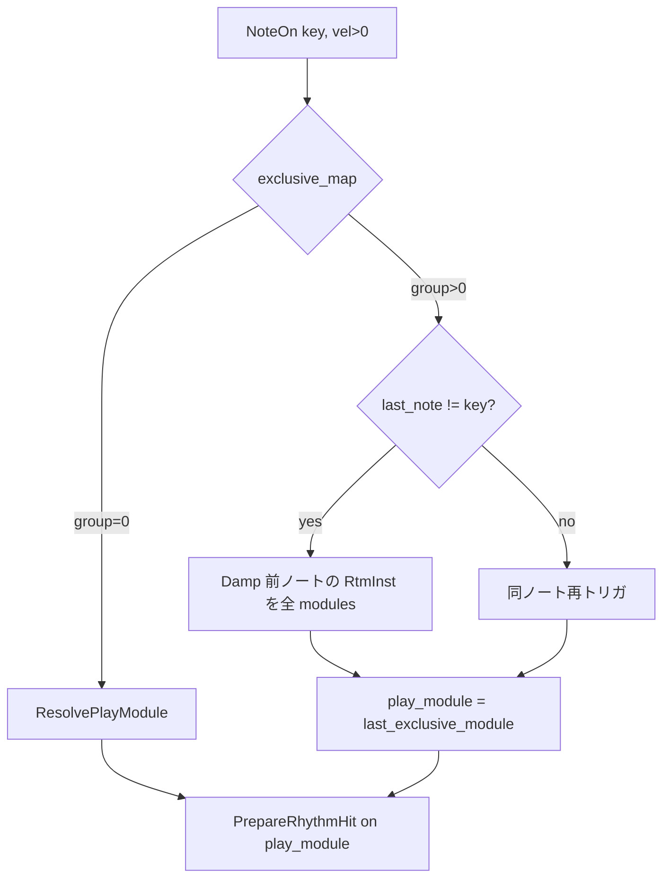

# リズム音源設計仕様（RhythmChannel / YM2608）

本ドキュメントは、FMSynthEnsembleV3 における **MIDI ch 10（GM パーカッション）** と **YM2608 リズム音源** の設計を定義する。

**方針**

- ハードウェアは **YM2608 の 6 種リズム** のみ。GM の 40 種超のノートは **ソフトウェアのパーカッションマップ** で折り畳む。
- 複数 YM2608 がある場合、**打楽器種別（BD/SD/…）ごとに 1 チップへバインド**する。
- **GM 準拠**で個別 Note Off / velocity=0 は音響に効かせない。チョークは **排他グループの Note On 切替** と **AllNoteOff** のみ。

関連: [midi_implementation_chart.md](midi_implementation_chart.md)、[spec_opn.md](spec_opn.md)（RTL/IL・FM とのバランス）、[architecture.md](architecture.md)

---

## 目次

1. [スコープとチャンネル対応](#1-スコープとチャンネル対応)
2. [YM2608 リズム音源の制約](#2-ym2608-リズム音源の制約)
3. [モジュール構成と識別](#3-モジュール構成と識別)
4. [複数 YM2608 の分散ポリシー](#4-複数-ym2608-の分散ポリシー)
5. [パーカッションマップ](#5-パーカッションマップ)
6. [排他ノートマップ](#6-排他ノートマップ)
7. [発音シーケンスと damp 方針](#7-発音シーケンスと-damp-方針)
8. [Note Off / AllNoteOff（GM）](#8-note-off--allnoteoffgm)
9. [音量（RTL / IL）と FM バランス](#9-音量rtl--ilと-fm-バランス)
10. [未実装・既知の限界](#10-未実装既知の限界)

---

## 1. スコープとチャンネル対応

| 項目 | 内容 |
|------|------|
| 実装クラス | `RhythmChannel`（`src/synth/channel/RhythmChannel.cpp`） |
| MIDI | **ch 10**（1-based）。内部 index **9**（`RhythmChannel::MIDI_RHYTHM_CHANNEL`） |
| 音源 | `OpnBase::rtm_*` を実装する **YM2608 のみ**（`fm_get_channels() == 6`） |
| Voice | 使用しない（`Reclaim` は常に `nullptr`） |
| ピッチ系 | PB / CC#1 / NRPN 等は **音響無効**（`MidiChannel` 基底で保持するのみ） |
| パン | `SetOutputLR(LR)` で **両チャンネル固定**。CC#10 はリズム IL に未反映 |

`MidiFactory` は全 `modules_` から YM2608 を列挙し、`RhythmChannel` コンストラクタが `modules` ベクタを構築する。FM の `NoteVoice` 割当とは独立。

---

## 2. YM2608 リズム音源の制約

ハードウェア仕様の要約（詳細は [spec_opn.md](spec_opn.md#rhythm音源)）。

### 2.1 楽器とレジスタ

| `RtmInst` | ビット | レジスタ | GM 上の代表 |
|-----------|--------|----------|-------------|
| BD | 0x01 | 0x18 | バスドラム |
| SD | 0x02 | 0x19 | スネア |
| TOP | 0x04 | 0x1a | シンバル系 |
| HH | 0x08 | 0x1b | ハイハット |
| TOM | 0x10 | 0x1c | タム |
| RIM | 0x20 | 0x1d | リム |

- **同時に独立した「ノート番号」ごとのボイスは存在しない。** 6 種それぞれが 1 系統の減衰音源。
- **Key On / Dump** はレジスタ **0x10** 共有（D7=DM, D5–D0=RKON）。

### 2.2 ドライバ層の制約（`YM2608.cpp`）

| 操作 | 制約 | 理由 |
|------|------|------|
| `rtm_turnon_key` | **単一ビット** のみ有効（`inst & (inst-1) == 0`） | 複数ビット（例: 0x3f）の誤 Key On を拒否 |
| `rtm_damp_key` | **複数ビット可**（OR で同時 Dump） | `AllNoteOff` で全楽器 damp |
| RTL (0x11) | チップ **1 本あたり 1 値** | チャンネル全体のゲイン |
| IL (0x18–0x1d) | 楽器 **6 種それぞれ** L/R + 5bit IL | 発音ごとの強さ・出力先 |

RTL/IL は FM の TL と **逆方向**（値が大きいほど大きい音）。MIDI からの換算式は [spec_opn.md](spec_opn.md#音量制御) と同一（0.75 dB/step）。

### 2.3 ソフトウェアが補う必要がある点

1. **`init_volume` は 6 種すべてに IL を書く**  
   未使用楽器の IL が残ると、別楽器 Key On 時に **音色が置き換わって聞こえる**（例: SD 発音中に TOM の IL が有効なまま）。  
   → 発音チップでは **対象以外の IL を 0 にする**（`SetInstLevelsOnModule`）。

2. **1 チップ上で別楽器を連続発音すると減衰が干渉する**  
   → `last_rtm_on_module[chip]` で直前楽器を追跡し、楽器切替時のみ前楽器を damp。

3. **毎ヒット `DampAll` は連打で誤音色になりうる**  
   → `PrepareRhythmHit` は **必要最小限の damp** のみ。

4. **排他 MIDI ノートが同じ `RtmInst` にマップされる場合**（HH 42/44/46 など）  
   → ハードウェア上は同一スロットのため、**別ノート On で明示 damp** が必要（排他マップ）。

---

## 3. モジュール構成と識別

```
MidiFactory(modules_[0..3])
        │
        ▼
RhythmChannel ──► modules[]  … fm_get_channels()==6 の OpnBase のみ
        │
        ├── NoteVoice/FM … 各チップ ch0–5 を VoiceAllocator が使用
        └── リズム … チップ単位で RTL/IL/Key を直接操作（Voice なし）
```

- 最大 **4 台**のスロットから、接続されている **YM2608 の台数 N**（1〜4）を `modules.size()` とする。
- **YM2203**（3ch）は `fm_get_channels() != 6` のため **リズム対象外**。

---

## 4. 複数 YM2608 の分散ポリシー

### 4.1 基本方針：**打楽器種別バインド**

| 状態 | 変数 | 意味 |
|------|------|------|
| 種別 → チップ | `inst_module_[6]` | BD/SD/TOP/HH/TOM/RIM ごとに **初回 NoteOn で決まる** `modules[]` 添字 |
| チップ上の直前楽器 | `last_rtm_on_module[4]` | 各チップで最後に鳴らした `RtmInst`（別楽器 damp 判定） |
| 次の候補 | `next_assign_module_` | 未割当種別の順次割当（`(next_assign_module_++) % N`）用インデックス |
| 排他グループの拠点 | `last_exclusive_module[6]` | グループ内 2 発目以降は **同じチップ** に固定 |

### 4.2 `ResolvePlayModule(rtm_inst)` のアルゴリズム

`inst_module_[slot]` が未設定（-1）のときのみ割当:

1. **優先**: `last_rtm_on_module[i] == -1`（そのチップで未使用）または `== rtm_inst`（同種が既に鳴っているチップ）の **最初の i**。
2. **なければ**: `next_assign_module_` を使い `(next_assign_module_++) % N` で 1 台を選ぶ。
3. 以降、同じ `rtm_inst` は **常に同じ `inst_module_[slot]`** を使う（`ResetRouting` まで）。

排他グループ（`group > 0`）では、グループの **2 回目以降の NoteOn** は `last_exclusive_module` に記録されたチップを **強制**（HH 切替でチップがぶれないようにする）。

### 4.3 メリット（N > 1 のとき）

| メリット | 説明 |
|----------|------|
| **減衰の並列化** | BD と SD を別チップに分けると、一方の減衰中でも他方をフルに叩ける |
| **IL クロストーク低減** | 1 チップ 1 種に近づくため、`SetInstLevelsOnModule` の負荷と誤音色リスクが下がる |
| **聴感の安定** | 同じ MIDI ノート（例: #40 SD）は常に同じチップ → 音色・レベルが演奏中に変わらない |
| **FM との共存** | チップごとに FM ch とリズムが共存するが、種別バインドで「リズムが次のヒットで別チップに飛ぶ」事象を防ぐ |

### 4.4 N = 1 のとき

- 全種が **同一 YM2608** にバインドされる。
- `PrepareRhythmHit` の **楽器切替 damp** と **IL ミュート** が必須（[7 章](#7-発音シーケンスと-damp-方針)）。
- 複数チップ向けの排他処理（全チップ damp）は、1 台でも **漏れ防止**のため同じ処理で動作する。

### 4.5 ルーティングのリセット

| タイミング | 動作 |
|------------|------|
| `Reset()` / `ResetAllController()` | `ResetRouting()` — `inst_module_`・排他状態・`last_rtm_on_module` をクリア |
| `AllNoteOff()` | 全チップ damp + `last_rtm_on_module` クリア（`inst_module_` は維持） |

---

## 5. パーカッションマップ

- ソース: `RhythmChannel.cpp` の `percussion_map[54]`（MIDI **#35–#88**、GM1 + GM2 先頭）。
- `#35` 未満・マップ外・`NONE` は **無音**（`NoteOn` 戻り値 -1。シーケンサにはエラーにしない）。

### 5.1 設計原則

1. YM2608 の **6 種だけ**で表現できる打楽器を優先する。
2. 代替が破綻しやすい小物・効果音は **`NONE`**（無理に HH/TOM で鳴らさない）。
3. 複数 MIDI ノートが **同一 `RtmInst`** に寄るのは意図的（例: #35/#36→BD、#49–#59 のシンバル→TOP）。

### 5.2 マップ一覧

| MIDI | 名前（GM） | RtmInst |
|------|------------|---------|
| 35 | Acoustic Bass Drum | BD |
| 36 | Bass Drum 1 | BD |
| 37 | Side Stick | RIM |
| 38 | Acoustic Snare | SD |
| 39 | Hand Clap | SD |
| 40 | Electric Snare | SD |
| 41 | Low Floor Tom | TOM |
| 42 | Closed Hi-Hat | HH |
| 43 | High Floor Tom | TOM |
| 44 | Pedal Hi-Hat | HH |
| 45 | Low Tom | TOM |
| 46 | Open Hi-Hat | HH |
| 47 | Low-Mid Tom | TOM |
| 48 | High Mid Tom | TOM |
| 49 | Crash Cymbal 1 | TOP |
| 50 | High Tom | TOM |
| 51 | Ride Cymbal 1 | TOP |
| 52 | Chinese Cymbal | TOP |
| 53 | Ride Bell | TOP |
| 54 | Tambourine | HH |
| 55 | Splash Cymbal | TOP |
| 56 | Cowbell | **NONE** |
| 57 | Crash Cymbal 2 | TOP |
| 58 | Vibra Slap | **NONE** |
| 59 | Ride Cymbal 2 | TOP |
| 60–61 | Bongo Hi/Lo | TOM |
| 62 | Mute Hi Conga | RIM |
| 63–64 | Conga | TOM |
| 65 | High Timbale | RIM |
| 66 | Low Timbale | TOM |
| 67–70 | Agogo / Cabasa / Maracas | **NONE** |
| 71–79 | Whistle / Guiro / Wood / Cuica | **NONE** |
| 80 | Mute Triangle | HH |
| 81 | Open Triangle | HH |
| 82 | Shaker (GM2) | HH |
| 83–87 | GM2 効果音 | **NONE** |
| 88 | (未定義) | **NONE** |

---

## 6. 排他ノートマップ

### 6.0 排他ノートマップとは

**パーカッションマップ**（[5 章](#5-パーカッションマップ)）は「MIDI ノート番号 → YM2608 の 6 種のどれで鳴らすか」を決める。**排他ノートマップ**（`exclusive_map`）は別の次元で、「**どの MIDI ノート同士が同時には鳴らせないか**」を決める。

| 観点 | パーカッションマップ | 排他ノートマップ |
|------|---------------------|------------------|
| 役割 | 音色の割当（BD / SD / HH …） | 同時発音の禁止・チョーク |
| 例 | #42 → HH、#40 → SD | #42 と #46 は **同じグループ** |
| 値 | `RtmInst` または `NONE` | グループ ID（0 = 排他なし、1〜5 = 同一グループ） |

#### GM での背景

GM ドラムセットでは、**物理的に 1 つの奏法しか持てない**打楽器が複数の MIDI ノートに分かれている。

- 例: クローズド HH（#42）、ペダル HH（#44）、オープン HH（#46）は **別ノート** だが、実際のハイハットは **1 枚**。
- シーケンサは「オープン HH の Note On」のあと、古いクローズド HH を **Note Off しない** ことが多い（GM ドラムモジュール仕様）。
- そのためシンセ側は、**新しい排他ノートの Note On が来たら、グループ内の前の音を止める（チョーク）** 必要がある。

本実装ではこれを GM の **Exclusive Class** に倣い、ソフトウェアの `exclusive_map[]` で表現する。

#### 本機でソフトウェアが必要な理由

YM2608 のリズム音源は **HH など 1 スロット 1 系統** しかない。[5 章](#5-パーカッションマップ)のとおり #42 / #44 / #46 は **すべて `RtmInst::HH`** にマップされる。

- MIDI 上は別ノートでも、チップ上は **同じ HH** の減衰が重なる。
- Note Off でチョークしない（[8 章](#8-note-off--allnoteoffgm)、GM 準拠）ため、**別ノートの Note On 時に `rtm_damp_key(HH)` で明示的に止める** のが排他マップの役割。

#### マップの見方

- 対象範囲: MIDI **#42–#81** のみ（`exclusive_map[key - 42]`）。
- **0**: 排他なし。前のノートはチョークしない（通常の `PrepareRhythmHit` のみ）。
- **1〜5**: 同じ番号のノートは 1 グループ。グループ内で **別 key** の Note On が来たら、前ノートに対応する `RtmInst` を **接続中の全 YM2608** で damp してから新規発音する。
- 状態は `last_exclusive_note[]`（直前の MIDI ノート）と `last_exclusive_module[]`（そのグループの発音チップ）に保持する。

### 6.1 グループ定義

| グループ ID | MIDI ノート | GM 上の意味 | 実効 |
|-------------|-------------|-------------|------|
| **1** | 42, 44, 46 | Closed / Pedal / Open Hi-Hat | いずれも **HH**。切替時に前ノートの HH を **全チップ damp** |
| **2** | 71, 72 | Short / Long Whistle | マップ上 **NONE** → 排他コードはあるが **発音しない** |
| **3** | 73, 74 | Short / Long Guiro | 同上 |
| **4** | 78, 79 | Mute / Open Cuica | 同上 |
| **5** | 80, 81 | Mute / Open Triangle | いずれも **HH** |

`exclusive_map` の配列（コメント抜粋）:

```text
/* 42-46 */ 1, 0, 1, 0, 1,
/* 47-70 */ 0 × 24,
/* 71-72 */ 2, 2,
/* 73-74 */ 3, 3,
/* 75-77 */ 0, 0, 0,
/* 78-79 */ 4, 4,
/* 80-81 */ 5, 5
```

### 6.2 NoteOn 時の排他処理



- **チョーク条件**: 同一グループで **別 key** の Note On（`last_note != -1 && last_note != key`）。
- **同じ key の再トリガ**: 全チップ damp は **しない**（通常の `PrepareRhythmHit` のみ）。
- damp 対象楽器は **前の MIDI ノート**の `percussion_map[last_note - 35]`（ノート番号ではなく **RtmInst**）。

### 6.3 実装していない排他

| 例 | 理由 |
|----|------|
| Crash / Ride / Splash（49, 51, 55, 57…） | すべて **TOP** だが `exclusive_map` は 0。GM シンバル排他は未実装 |
| #54 Tambourine → HH | グループ 1 に含めていない（42/44/46 のみ） |
| Note Off によるチョーク | GM 準拠で **意図的に無効**（[8 章](#8-note-off--allnoteoffgm)） |

---

## 7. 発音シーケンスと damp 方針

### 7.1 NoteOn 全体フロー

1. `percussion_map` で `RtmInst` 決定（`NONE` / vel=0 は別処理）。
2. `EffectiveVolume(velocity)` → `ILvolume[]` → `RhythmLevelWithOffset`（`g_rhythm_level_offset` / `rmix`）。
3. `velocity > 0` かつ IL 換算が 0 のとき **IL=1**（低ベロシティ + rmix で無音化しない）。
4. 排他処理（[6 章](#6-排他ノートマップ)）→ `ResolvePlayModule` → `PrepareRhythmHit` → `rtm_turnon_key`。
5. `last_rtm_on_module[play_module] = rtm_inst` を更新。

### 7.2 `PrepareRhythmHit(module, rtm_inst, il, prev_on_chip)`

| 条件 | 処理 |
|------|------|
| `prev_on_chip < 0` または `prev_on_chip != rtm_inst` | 1) 前楽器があれば `rtm_damp_key(prev)`<br>2) `SetInstLevelsOnModule`（対象のみ IL、他 0）<br>3) `rtm_damp_key(rtm_inst)`<br>4) `rtm_turnon_key(rtm_inst)` |
| 同一楽器の再トリガ | IL 更新 → `rtm_damp_key` → `rtm_turnon_key`（**DampAll しない**） |

### 7.3 damp の使い分け

| API / 状況 | 範囲 | 目的 |
|------------|------|------|
| `DampOnModule` | 1 チップ・1 楽器 | 楽器切替・再トリガ |
| `DampInstrumentOnAllModules` | 全チップ・1 楽器 | **排他**で前ノートを確実に止める |
| `AllNoteOff` → `kAllRtmInst` | 全チップ・全楽器 | CC#120/#123、リセット系 |

### 7.4 L/R

- `rtm_set_inst_level(..., lr = 0xc0)` **デフォルト**（L+R 両方）。チップ間の「ステレオ分散」は **行わない**。
- `RhythmChannel::SetOutputLR(LR)` はチャンネル属性として設定するが、**CC#10 パンは IL に未反映**。

---

## 8. Note Off / AllNoteOff（GM）

| 操作 | 音響 | 実装 |
|------|------|------|
| Note Off | **無効**（減衰任せ） | `NoteOff` は no-op（戻り 0） |
| Note On velocity=0 | 同上 | damp しない（音響無視）。**パネル LED も vel=0 では消灯しない**（[10 章](#10-未実装既知の限界)） |
| 排他グループの別ノート On | **チョーク** | [6 章](#6-排他ノートマップ) |
| CC#120 / CC#123 | **全リズム damp** | `AllNoteOff()` |

シンバル（TOP）も **Note Off では切れない**。GM ドラムモジュールと同様、減衰完了まで鳴り続ける。

---

## 9. 音量（RTL / IL）と FM バランス

| パラメータ | ソース | レジスタ | 反映 |
|------------|--------|----------|------|
| RTL | CC#7 × CC#11（`EffectiveVolume`） | 0x11、全 `modules` | `RefreshRhythmLevels()`。`rmix` 変更時も即時 |
| IL | Note On velocity | 0x18–0x1d、**発音チップのみ** | 次回以降のヒット（発音中 IL は追跡しない） |

- 換算テーブル: `RTLvolume[128]` / `ILvolume[128]`（[spec_opn.md](spec_opn.md#音量制御) と同式）。
- **FM よりリズムが前に出やすい**問題 → `RHYTHM_LEVEL_OFFSET`（既定 **6** ≈ 4.5 dB）を RTL/IL 双方から減算。実行時はデバッガ **`rmix [0-31]`**（`g_rhythm_level_offset`）。

詳細な調整ポリシーは [spec_opn.md の「FMとリズムの音量バランス」](spec_opn.md#fmとリズムの音量バランス) を参照。

---

## 10. 未実装・既知の限界

| 項目 | 状態 |
|------|------|
| シンバル系の相互排他（TOP 同士） | 未実装 |
| 排他グループ 2–4（71–79） | マップが NONE のため実質無効 |
| リズムの L/R パン（CC#10） | 未実装 |
| `ReclaimAll()` | キュー相当なし。現状 **空実装** |
| パネル LED（CH10） | **音源状態ではない**。`MidiEngineTask` が vel>0 ヒットを短時間（2× LED スキャンフレーム）だけ `gLastNoteOnBitmap` bit9 に反映（**パネル CH10 ON かつ MidiProcessor で有効なときのみ**）。`gLastNoteOnBitmap` は `gPanelChannelBitmap` でマスク。CH10 OFF 遷移でホールド消灯。vel=0・個別 Note Off は無視。CC#120/#123・Reset で消灯 |
| Program Change / バンク | 受信しても **音響無効** |
| YM2203 リズム | 非対応（6ch 判定で除外） |
