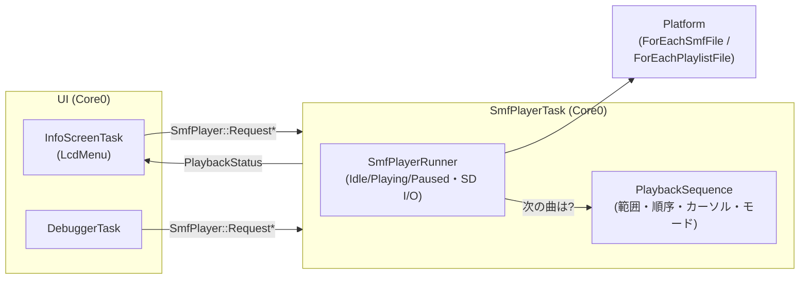
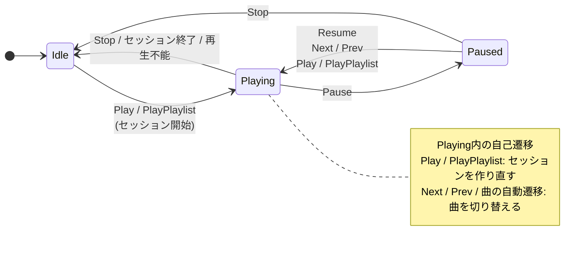
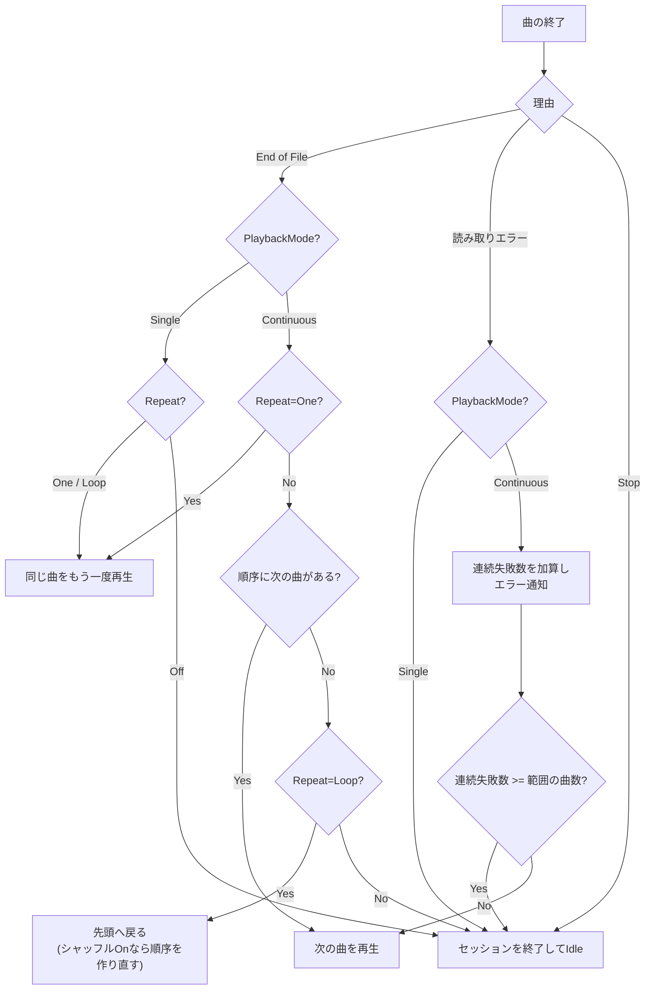
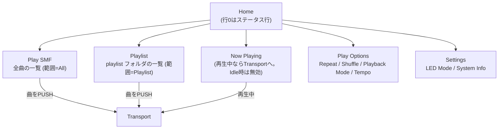

# SMF再生制御設計（Stop/Pause・プレイリスト・リピート・シャッフル・単発/連続）

SDカード上のSMFを連続して再生するための制御仕様を定義する設計書である。単一ファイルの再生機構（パース・スケジューリング・SD I/O）は [design_smf_player.md](design_smf_player.md) が扱う。本書は、その上に載る「次にどの曲を再生するか」の決定と、Stop/Pause/Next/Prev・リピート・シャッフルの意味づけ、および LCD メニューとの連携（[design_display_menu.md](design_display_menu.md)）を定める。

Stop/Pause は単独で決めると、再生列の概念が入ったときに意味が変わる。そのため本書は再生列を前提に、すべてのコマンドの意味を一度に定義する。

## 目次

- [SMF再生制御設計（Stop/Pause・プレイリスト・リピート・シャッフル・単発/連続）](#smf再生制御設計stoppauseプレイリストリピートシャッフル単発連続)
  - [目次](#目次)
  - [1. 用語](#1-用語)
  - [2. 全体構成と責務分担](#2-全体構成と責務分担)
  - [3. コマンドと状態の公開](#3-コマンドと状態の公開)
    - [3.1 コマンド](#31-コマンド)
    - [3.2 コマンドキュー](#32-コマンドキュー)
    - [3.3 状態スナップショット](#33-状態スナップショット)
  - [4. 再生範囲](#4-再生範囲)
    - [4.1 All](#41-all)
    - [4.2 Playlist](#42-playlist)
    - [4.3 Single（組み込みフィクスチャ）](#43-single組み込みフィクスチャ)
  - [5. セッションと状態遷移](#5-セッションと状態遷移)
    - [5.1 コマンドごとの動作](#51-コマンドごとの動作)
    - [5.2 曲の終了時の動作](#52-曲の終了時の動作)
  - [6. リピートとシャッフルと再生モードとテンポ倍率](#6-リピートとシャッフルと再生モードとテンポ倍率)
    - [6.1 リピート](#61-リピート)
    - [6.2 シャッフル](#62-シャッフル)
    - [6.3 再生モード（PlaybackMode）](#63-再生モードplaybackmode)
    - [6.4 テンポ倍率](#64-テンポ倍率)
  - [7. LCD への通知](#7-lcd-への通知)
  - [8. LCD メニューとの連携](#8-lcd-メニューとの連携)
    - [8.1 メニュー構成](#81-メニュー構成)
    - [8.2 Transport 画面](#82-transport-画面)
    - [8.3 Play Options](#83-play-options)
  - [9. リソースと制約](#9-リソースと制約)
  - [10. 関連ドキュメント](#10-関連ドキュメント)

## 1. 用語

| 用語 | 意味 |
|---|---|
| 範囲（scope） | 再生列の対象となるファイル集合。`All`（SDカード全体）、`Playlist`（`playlist`フォルダ内）、`Single`（組み込みフィクスチャ1件） |
| セッション | 1回の連続再生。範囲・順序・カーソル（現在位置）を持つ。再生を開始すると作られ、終了すると破棄される |
| 順序 | セッション中の再生順。シャッフルOffなら範囲内の自然順、Onなら並べ替えた順列 |
| カーソル | 順序の中で現在再生している位置 |
| 位置 | 範囲内での1始まりの番号。`All`では`Ls`と同じ連番、`Playlist`ではファイル名昇順の番号 |

## 2. 全体構成と責務分担

セッションの所有と「次の曲を決める」処理は`SmfPlayerTask`に置く。SDカードアクセスが`SmfPlayerTask`に一元化されている（[design_smf_player.md 4.3](design_smf_player.md#43-fatfsアクセスの一元化とff_fs_reentrant)）ことと、曲間の遷移でタスク間の往復を避けるためである。UI（`InfoScreenTask`・Debugger）は、コマンドの送信と状態の読み出しだけを行い、再生列を持たない。

| 要素 | 配置 | 責務 |
|---|---|---|
| `SmfPlayerRunner` | `app/smf_player_task.cpp` | 再生状態（Idle/Playing/Paused）、曲の開始・停止、SDアクセス、コマンドの実行。曲が終わったら`PlaybackSequence`に次の曲を問い合わせる |
| `PlaybackSequence` | `src/smf/` | 範囲の大きさ・順序・カーソル・リピート・シャッフルの状態を持ち、次/前の位置を決める純粋ロジック。pico-sdk・FreeRTOS・ファイルI/Oに依存しない。乱数の種は呼び出し側が渡す。ホスト上でユニットテストできる |
| `ForEachPlaylistFile` | `platform/smf_directory.h/cpp` | `playlist`フォルダ内を名前昇順で列挙する（[4.2節](#42-playlist)） |

## 3. コマンドと状態の公開

### 3.1 コマンド

すべて fire-and-forget（[design_smf_player.md 4.1](design_smf_player.md#41-コマンドの受け渡し)）。LCD と Debugger は同じ`SmfPlayer::Request*()`を使う。

| コマンド | 引数 | 動作 |
|---|---|---|
| `Play` | 位置（`Ls`の連番） | 範囲`All`（フィクスチャの連番なら`Single`）で新しいセッションを開始し、その位置から再生する |
| `PlayPlaylist` | 位置 | 範囲`Playlist`で新しいセッションを開始し、その位置から再生する |
| `Stop` | なし | セッションを終了して`Idle`へ戻る |
| `Pause` / `Resume` | なし | 無音で保持 / 無音から再開する |
| `Next` / `Prev` | なし | 順序上の次 / 前の曲へ移る |
| `SetRepeat` | Off / One / Loop | リピートモードを設定する |
| `SetShuffle` | On / Off | シャッフルを設定する |
| `SetPlaybackMode` | Single / Continuous | 再生モードを設定する |
| `SetTempoScale` | 倍率（%、50〜200） | 再生中の曲のテンポ倍率を設定する（[6.4](#64-テンポ倍率)）。範囲外は無視する |
| `SetDefaultTempoScale` | 倍率（%、50〜200） | 曲の開始時に読み込むテンポ倍率（既定倍率）を設定する。範囲外は無視する |
| `Ls` / `Mount` | なし | 従来どおり |

`SetRepeat`・`SetShuffle`・`SetPlaybackMode`・`SetDefaultTempoScale`はグローバル設定で、セッションの有無に関わらず保持する。電源投入時は Repeat=Off、Shuffle=Off、PlaybackMode=Single、既定倍率=100% とし、永続化はしない。

Debugger からは`play <n>`（Play）、`pl <n>`（PlayPlaylist）、`stop`/`pause`/`resume`/`next`/`prev`、`repeat <0-2>`、`shuffle <0|1>`、`playmode <0|1>`（0=Single、1=Continuous）で同じコマンドを送れる。

### 3.2 コマンドキュー

従来の`SmfCommandMailbox`は1件だけを保持し、後から来たコマンドが先のコマンドを上書きする。Stop 直後の Play のような連続操作や、Next の連打で取りこぼしが起きうるため、コマンドを深さ`kCommandQueueDepth`（8）の固定長リングバッファに積む。`SmfPlayerTask`は通知で起床したとき、積まれているコマンドをすべて順に処理する。満杯のときは新しいコマンドを捨てる。人の操作とデバッガ入力の速度では、実際に満杯になることは想定しない。

### 3.3 状態スナップショット

UI は`SmfPlayer::GetStatus()`で、次の内容を持つ`PlaybackStatus`を読む。`SmfPlayerTask`が状態を変えるたびに、クリティカルセクションで保護された1つの構造体を更新し、読み出しは同じ保護のもとでコピーする。

| フィールド | 内容 |
|---|---|
| `state` | `Idle` / `Playing` / `Paused` |
| `scope` | `All` / `Playlist` / `Single`（`Idle`では無効） |
| `position` | 現在の曲の位置（1始まり。`Idle`では無効） |
| `count` | 範囲内の曲数 |
| `repeat` / `shuffle` | 現在のモード（セッションの有無に関わらず有効） |
| `playback_mode` | `Single` / `Continuous`（セッションの有無に関わらず有効） |
| `tempo_us_per_qn` | 曲の現在のテンポ（倍率適用前のµs/四分音符）。Set Tempoのたびに更新する。`Idle`では0 |
| `tempo_scale_percent` | 再生中の曲のテンポ倍率（%） |
| `default_tempo_scale_percent` | 既定倍率（%、セッションの有無に関わらず有効） |
| `track_serial` | 曲を開始するたびに進む通し番号。UIが既定倍率の読み込みを検知するのに使う |

## 4. 再生範囲

### 4.1 All

`Platform::ForEachSmfFile()`（SDカードのルートから再帰走査）の走査順が自然順になる。位置は`Ls`の連番と同じで、対象はSD上のファイルのみとする。組み込みフィクスチャは含めない。

- 曲数の上限は`MENU_MAX_SMF_FILES`（255）。LCDの Play SMF 一覧と同じ集合になる。
- `playlist`フォルダ内のファイルも`All`に含まれる。`All`と`Playlist`の重複は許容する。
- 位置からパスへの解決は、従来の`Play <index>`と同じく走査のやり直しで行い、キャッシュしない（[design_smf_player.md 4.2](design_smf_player.md#42-lsとインデックス指定)）。曲が変わるたびに走査が1回入るため、曲間の空きにその時間が乗る。`Play`でセッションを開始するときは、範囲の曲数を得るために全ファイルを走査する。
- 連番が`MENU_MAX_SMF_FILES`を超えるファイルを`Play`で指定したときは、範囲`Single`の1曲として再生する。

### 4.2 Playlist

SDボリューム直下の`playlist`フォルダ（`0:/playlist`）の直下にある`.mid`/`.midi`/`.smf`ファイルを対象とする。サブフォルダは辿らない。macOS が生成する`._`始まりのファイルは除外する。

- **順序**: ファイル名の昇順。比較はASCII範囲で大文字小文字を区別せず、同値ならバイト順にする。FatFs のディレクトリ順は名前順ではないため、列挙時に並べ替える。
- **`ForEachPlaylistFile(visitor, context)`**: `ForEachSmfFile`と同じ形のAPIで、`playlist`フォルダを読み、名前昇順にして、順番に visitor を呼ぶ。位置は1始まり。内部に固定長の作業表を持ち、これに名前を集めて並べ替える。フォルダが無い、または空なら visitor は呼ばれない。
- **上限**: `Platform::kPlaylistMaxFiles`（`smf_directory.h`、64）件。ファイル名は`Platform::kPlaylistNameMax`（63バイト、UTF-8）まで。超えたファイル、および名前が長すぎるファイルは列挙から外れる（[9章](#9-リソースと制約)）。`platform`は`app`の`config.h`に依存できないため、定数は`platform`側に置く。
- 位置からパスへの解決は、`ForEachPlaylistFile`で位置Nまで走査して行う。

### 4.3 Single（組み込みフィクスチャ）

`Play`の連番がSD側の総数を超えた場合の組み込みフィクスチャ（[design_smf_player.md 4.2](design_smf_player.md#42-lsとインデックス指定)）は、大きさ1の範囲`Single`として扱う。`Next`/`Prev`は移動先が無く、曲の終了時はリピートモードだけに従う（Off なら終了、One/Loop なら繰り返す）。

## 5. セッションと状態遷移

再生状態は従来の`Idle`/`Playing`/`Paused`を維持し、セッションはそれとは別に「あるか無いか」を持つ。`Playing`/`Paused`のときは必ずセッションがあり、`Idle`のときは無い。

`Idle`へ抜けるすべての経路で、All Notes Off 相当のクリーンアップを行う（[design_smf_player.md 8章](design_smf_player.md#8-状態遷移)の原則を踏襲）。曲の切り替え（Next/Prev/自動遷移）でも、前の曲の発音中ノートを止めてから次を開始する。

### 5.1 コマンドごとの動作

| コマンド | Idle | Playing | Paused |
|---|---|---|---|
| `Play` / `PlayPlaylist` | 新セッションを開始し再生 | 現在のセッションを破棄して新セッションを開始 | 同左（`Playing`になる） |
| `Stop` | 何もしない | セッションを終了し`Idle` | 同左 |
| `Pause` | 何もしない | `Paused`へ（順序・カーソルは保持） | 何もしない |
| `Resume` | 何もしない | 何もしない | `Playing`へ |
| `Next` / `Prev` | 何もしない | 順序上の次 / 前の曲を再生（端の扱いは下記） | 同左（`Playing`になり、移動先の曲を再生する） |
| `SetRepeat` / `SetShuffle` | モードだけ保持 | モードを更新（[6章](#6-リピートとシャッフルと再生モードとテンポ倍率)） | 同左 |
| `SetTempoScale` | 何もしない | 再生中の曲の倍率を更新（[6.4節](#64-テンポ倍率)） | 同左 |
| `SetDefaultTempoScale` | 既定倍率だけ保持 | 既定倍率を更新（再生中の曲の倍率は変えない） | 同左 |

- **Stop**: セッションごと終了する。カーソル位置は残さない。次の`Play`は新しいセッションになる。
- **Pause**: 順序とカーソルを保持する。`Resume`は無音から曲の続きを再開する。
- **Next/Prev の端**: 順序の最後で`Next`を押したとき、Repeat=Off なら何もせず再生を続け、One/Loop なら先頭へ戻る。順序の先頭で`Prev`を押したとき、Repeat=Off なら現在の曲を最初から再生し直し、One/Loop なら末尾へ移る。
- **Prev**: 「曲の先頭へ戻る」判定は持たず、それ以外では常に順序上の前の曲へ移る。

### 5.2 曲の終了時の動作

曲が終了するとき、その理由（End of File / ユーザー操作 / 読み取りエラー）を区別して、次の動作を決める。

- **Singleモードのエラー**: 他曲へ移動せず即座にセッションを終了する。
- **Continuousモードのエラー**: 開けない・形式不正・I/Oエラーの曲は、エラーをステータス行に通知したうえで次の曲へ進む（Repeat=One でも同じ曲を繰り返さず次へ進む）。曲が最後まで正常に再生できたら（End of File）連続失敗数を0に戻す。連続失敗数が範囲の曲数に達したら、全曲が再生不能とみなしてセッションを終了する。
- Next/Prev による曲の切り替えは、Repeat=One でも「次/前の曲へ移る」。移った先で曲が終わったら、その曲を Repeat=One に従って繰り返す。

## 6. リピートとシャッフルと再生モードとテンポ倍率

### 6.1 リピート

| モード | 曲の終了時 |
|---|---|
| Off | 順序の最後の曲が終われば、セッションを終了する |
| One | 現在の曲を繰り返す |
| Loop | 順序の最後の曲が終われば、先頭へ戻る（範囲を一巡し続ける） |

範囲は起動元で決まる（[8.1節](#81-メニュー構成)）。`Playlist`から始めた Loop は playlist 内のリピート、`All`から始めた Loop は全曲リピートになる。

### 6.2 シャッフル

Shuffle=On のセッションでは、順序は範囲内の位置を並べ替えた順列になる。順序のバッファは範囲の曲数ぶん（最大255）の位置番号を持つだけで、パスは持たない。

- **開始**: 選んだ曲を順序の先頭に置き、残りの曲をランダムに並べる。選んだ曲から再生が始まり、その後はランダムに進む。
- **一巡**: Repeat=Off では、順序を最後まで再生するとセッションが終わる（各曲を1回ずつ再生する）。Loop では、一巡ごとに順序を作り直す。作り直した先頭の曲が、直前に再生していた曲と同じにならないようにする。
- **Prev**: 順序の中で1つ前へ戻る。順序を作り直すまで、前の曲を辿れる。
- **順列の生成**: Fisher-Yates 法。乱数はxorshift系の軽量な擬似乱数で、種は`SmfPlayerTask`がセッション開始時と作り直しのたびに`time_us_64()`から渡す。`PlaybackSequence`自身は時刻を読まない。
- **再生中に切り替えたとき**:
  - Off→On: 現在の曲を先頭に、順序を作り直す。
  - On→Off: 順序を自然順に戻し、カーソルを現在の曲の自然順の位置へ合わせる。

### 6.3 再生モード（PlaybackMode）

電源投入時は`Single`。永続化はしない。

| モード | 曲の終了時 | 再生失敗時 |
|---|---|---|
| `Single` | Repeat=Off: セッション終了。Repeat=One/Loop: 同曲を繰り返す（1曲の範囲では One と Loop は同義） | 他曲へ移動せず、即セッション終了 |
| `Continuous` | Repeat に従って連続再生（[6.1節](#61-リピート)） | 次の候補へ進み、全曲失敗でセッション終了（[5.2節](#52-曲の終了時の動作)） |

Shuffle の自動順序と Next/Prev は両モードで共通して有効。Single では TrackEnded/TrackFailed で自動的に次へ進まないため、Shuffle は Next/Prev で手動移動したときだけ並べ替えた順序が意味を持つ。

Next/Prev の動作は PlaybackMode に依存しない（常に順序上の移動）。Next/Prev で移動した後の曲が終了したとき、それは改めて PlaybackMode に従って処理される（Single なら停止、Continuous なら次へ進む）。

組み合わせ表:

| PlaybackMode | Repeat | 曲終了時の動作 |
|---|---|---|
| Single | Off | 停止 |
| Single | One | 同曲繰り返し |
| Single | Loop | 同曲繰り返し（Loop は Single 範囲では One と同義） |
| Continuous | Off | 次へ進む → 末尾でセッション終了 |
| Continuous | One | 同曲繰り返し |
| Continuous | Loop | 次へ進む → 末尾で先頭に戻る |

### 6.4 テンポ倍率

曲本来のテンポに倍率を掛けて、再生の速さを変える。倍率は曲中のSet Tempoと掛け合わせるため、曲中のテンポ変化（リタルダンドなど）は保たれる。BPMを直接指定する方式は、曲中のテンポ変化との関係が決まらないため採らない。

- **範囲**: 50〜200%（`SmfPlayer::kTempoScaleMinPercent`/`kTempoScaleMaxPercent`）。上限を大きくすると、密度の高い曲で単位時間あたりのイベント数が増え、`gMidiQueue`とFMバスの負荷が上がるため200%に留める。
- **既定倍率**: 曲を開始するたびに（Next/Prev・連続再生・Repeatによる再再生を含む）、再生中の曲の倍率を既定倍率（`SetDefaultTempoScale`、Play Options の`Tempo`）で初期化する。以後の`SetTempoScale`はその曲の再生中だけ効き、次の曲はまた既定倍率から始まる。
- **既定倍率と再生中の倍率は掛け合わせない**: 既定倍率は曲開始時の初期値にすぎず、再生中の倍率は常に曲本来のテンポに対する倍率である。既定倍率を変えても、再生中の曲の倍率は変わらない。
- **反映**: delta-time→µs変換で`delta_ticks × tempo × 100 / (TPQN × 倍率)`とし、次に取り出すイベントから効く。発火待ちのイベントの残り時間も新しい倍率で換算し直すため、長い休符の途中で変えても即座に効く。`Paused`中は保持している残り時間を換算し直す。

## 7. LCD への通知

曲が切り替わるたびに`InfoScreen::NotifyPlay()`を呼び、ステータス行に新しい曲名を出す（曲名が判明した時点でも従来どおり呼ぶ）。

曲が切り替わるたびに`InfoScreen::NotifyTrackStart()`を呼ぶ。前の曲の曲名表示を消し、新しい曲の曲名が判明するまでは`Playing`を表示する。

`InfoScreen::NotifyStop()`は、**セッションが終了して`Idle`に戻ったとき**にだけ呼ぶ。次の曲へ続く曲の終了では呼ばない。呼ばないと、曲間でステータス行が「停止」を経由してちらつく。従来は`Stop`コマンド（手動停止）で`NotifyStop`を発行せず、演奏イベントが5秒途絶えたタイムアウトに任せていたが、`Stop`もセッションの終了として`NotifyStop`を呼ぶ。

エラーの通知は従来の`NotifyError`（[design_display_menu.md 7.1](design_display_menu.md#71-演奏状態の表示)）を使う。ステータス行の通知は1件しか保持されず後の通知が前を上書きするため、連続失敗でセッションが終了したときは、エラー表示を残すために`NotifyStop`を呼ばない（エラー表示は従来どおり5秒で消える）。

SMF再生中（`Playing`/`Paused`）は、演奏イベントが5秒途絶えてもステータス行を消さない。休符やPauseで曲名が消えるのを避けるため、演奏イベント途絶のタイムアウトは`Idle`のときだけ働く。

## 8. LCD メニューとの連携

### 8.1 メニュー構成

範囲は「どの一覧から再生を始めたか」で決まる。専用の「プレイリスト起動」コマンドは持たない。

| 画面 | 内容 |
|---|---|
| **Play SMF** | SD上の全ファイルを1行ずつ並べる。曲をPUSHすると`Play(位置)`で再生を始め、Transport 画面へ移る |
| **Playlist** | `playlist`フォルダ内のファイルを名前昇順で1行ずつ並べる。曲をPUSHすると`PlayPlaylist(位置)`で再生を始め、Transport 画面へ移る。フォルダが無い、または空なら`(no files)`を表示する |
| **Now Playing** | 再生中（`Playing`/`Paused`）なら Transport 画面へ直接移る。`Idle` のときは何もしない |
| **Play Options** | `Repeat`・`Shuffle`・`Playback`・`Tempo`（再生制御の設定） |
| **Settings** | `LED Mode`・`System Info`（機器設定） |

Home は5項目で、先頭3行が表示され、DOWNで Play Options / Settings に届く。

一覧と Transport 画面の間には、次の約束を置く。

- 再生中（`Playing`/`Paused`）に、現在再生している曲（同じ範囲・同じ位置）をPUSHしたときは、再生を再開始せず Transport 画面へ移る。これが Transport 画面へ戻る手段になる。
- 別の曲をPUSHしたときは、その曲で新しいセッションを開始する。
- Transport 画面でLEFT（BACK）を押すと、元の一覧に戻る。再生は続く。

### 8.2 Transport 画面

固定5項目の`MenuScreen`。3行の画面に対し2行あふれ、UP/DOWNのスクロールで最後の項目に届く。

| 項目 | 動作 |
|---|---|
| `Pause` / `Resume` | `ItemCommand`。押すと`Pause`または`Resume`を送る。ラベルは`setText()`で状態に合わせて切り替える（`Playing`のときは`Pause`、`Paused`のときは`Resume`） |
| `Stop` | `Stop`を送り、元の一覧に戻る |
| `Next` | `Next`を送る |
| `Prev` | `Prev`を送る |
| `Tempo` | `VolumeItem`＋`TempoScaleWidget`。再生中の曲の倍率を、倍率適用後のBPMと並べて`Tempo:132bpm 110%`のように表示する。曲の開始時は既定倍率が入っている。PUSHで編集モードに入り、UP/DOWNで5%刻みに倍率を変え、そのたびに`SetTempoScale`を送る。編集の出入りと巻き戻し無効化はRhythmVol行と同じ（[design_display_menu.md 7.5](design_display_menu.md#75-リズム音量補正settings--rhythmvol)） |

`InfoScreenTask`は周期処理で`GetStatus()`を読み、次を行う。

- `Pause`/`Resume`のラベルを状態に合わせて更新する。
- `Tempo`行のBPMを`tempo_us_per_qn`と`tempo_scale_percent`から計算し直す（曲中のSet Tempoに追従する）。倍率はUIが正として持つが、`track_serial`が変わったら（曲が変わって既定倍率を読み込んだ）編集中でも`tempo_scale_percent`に合わせる。編集中でなければ、コマンドの取りこぼしに備えて常に合わせる。
- Transport 画面の表示中に`state`が`Idle`になったら（曲が終わってセッションが終了した、または連続失敗）、元の一覧へ戻る。

### 8.3 Play Options

- `Repeat`: 3値の`ItemCommand`。押すたびに Off→One→Loop→Off と切り替え、ラベル（`Repeat: Off`/`Repeat: 1`/`Repeat: Loop`）を`setText()`で更新して`SetRepeat`を送る。
- `Shuffle`: `ItemCommand`。押すたびに Off↔On を切り替え、ラベル（`Shuffle: Off`/`Shuffle: On`）を`setText()`で更新して`SetShuffle`を送る。
- `Playback`: 2値の`ItemCommand`。押すたびに Single↔Continuous を切り替え、ラベル（`Playback: Single`/`Playback: Cont.`）を`setText()`で更新して`SetPlaybackMode`を送る。
- `Tempo`: `VolumeItem`＋`TempoPercentWidget`。既定倍率を`Tempo:    100%`のように表示し、PUSHで編集モードに入ってUP/DOWNで5%刻み（50〜200%）に変え、そのたびに`SetDefaultTempoScale`を送る。次に開始する曲から効き、再生中の曲の倍率は変えない。
- モードと既定倍率は`SmfPlayerTask`が保持する。`InfoScreenTask`は毎周期`GetStatus()`から現在値を読み、ラベルが食い違っていれば合わせる（デバッガからの変更も反映される）。

## 9. リソースと制約

- **`Playlist`の上限**: 64件、ファイル名は63バイトまで。作業表は約4KBの静的領域で、`ForEachPlaylistFile`の呼び出しごとにフォルダを読み直して並べ替える。この上限を超えるファイルは一覧・再生の対象にならない。
- **Transport 画面の自動復帰**: 曲を選んだ直後は再生状態がまだ公開されていないため、再生中の状態を一度観測するまで、または5秒経つまでは`Idle`でも一覧へ戻らない。全曲が再生不能なときは、5秒後に一覧へ戻る。
- **`ForEachPlaylistFile`の同時呼び出し**: 内部の作業表を共有するため、同時に複数の呼び出しはできない。呼び出し元は起動時のメニュー構築と`SmfPlayerTask`だけで、逐次的にしか走らない前提とする（`ForEachSmfFile`と同じ扱い）。
- **`All`の曲間の空き**: 位置からパスへの解決に毎回SDの再帰走査が入るため、ファイル数が多いほど曲間の空きが長くなる。`Playlist`は1階層の走査で済む。
- **`All`と`Playlist`の重複**: `playlist`フォルダ内のファイルは`All`にも含まれる。`All`のシャッフルでは`playlist`フォルダ内の曲も対象になる。
- **一覧は起動時のスナップショット**: LCDの Play SMF・Playlist の一覧は`InfoScreenTask`起動時に1回だけ走査して作る（[design_display_menu.md 7.2](design_display_menu.md#72-初期メニュー構成)）。SDカードを差し替えたときは、電源の入れ直しで一覧が更新される。セッションの位置は再生のたびに走査で解決するため、一覧と実際のファイルがずれると、意図しない曲を再生することがある。
- **Prev**: 曲の先頭へ戻る動作は無い。Repeat=Off で順序の先頭にいるときの Prev は、現在の曲を最初から再生し直す。
- **テンポ倍率の刻み**: UIは5%刻み。`SetTempoScale`自体は範囲内の任意の整数%を受け付ける。
- **モードの永続化**: しない。電源投入のたびに Repeat=Off、Shuffle=Off、PlaybackMode=Single、既定テンポ倍率=100% から始まる。
- **`src/smf/`の責務**: `PlaybackSequence`の追加により、`smf/`は「SMFファイルの解釈」に加えて「再生順序の決定」を持つ。どちらもpico-sdk・FreeRTOS・ドライバに依存しない純粋ロジックであり、依存制約は変わらない（[architecture.md](architecture.md)）。

## 10. 関連ドキュメント

| ファイル | 内容 |
|---|---|
| [design_smf_player.md](design_smf_player.md) | 単一ファイルの再生機構（SmfPlayerTask・パーサー・SD I/O） |
| [design_display_menu.md](design_display_menu.md) | LcdMenuのメニュー設計・ジョイスティック入力 |
| [architecture.md](architecture.md) | レイヤ・依存制約 |
