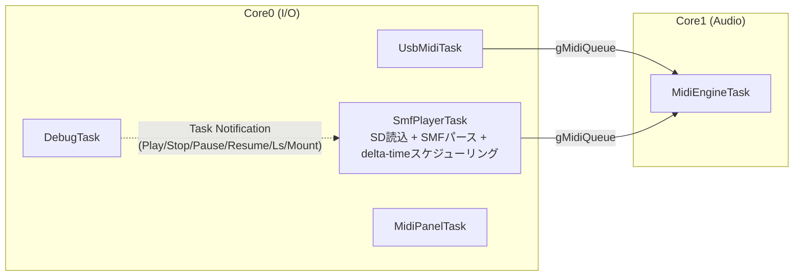
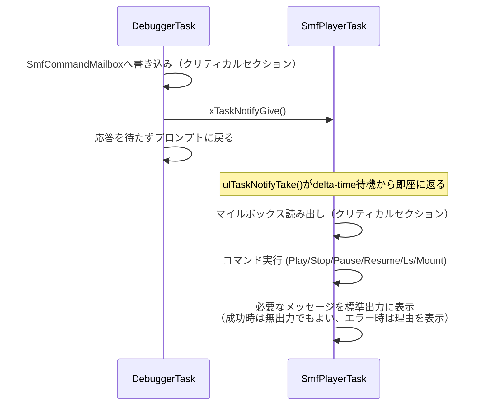
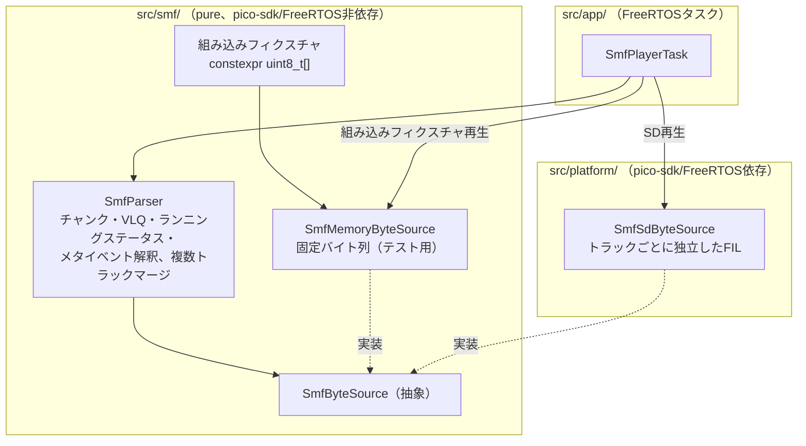
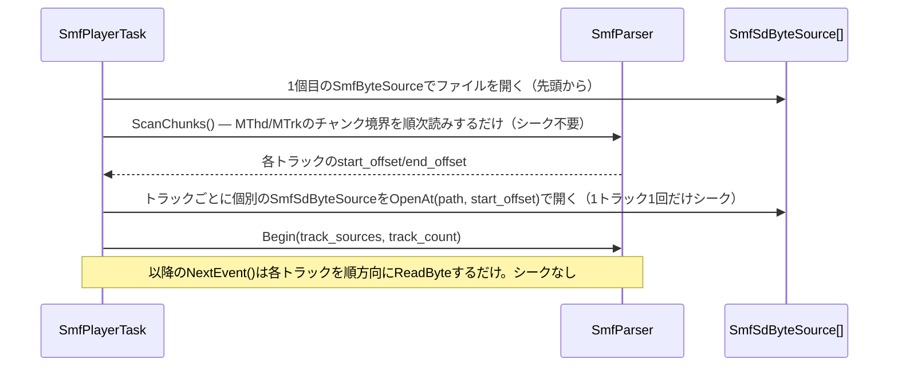
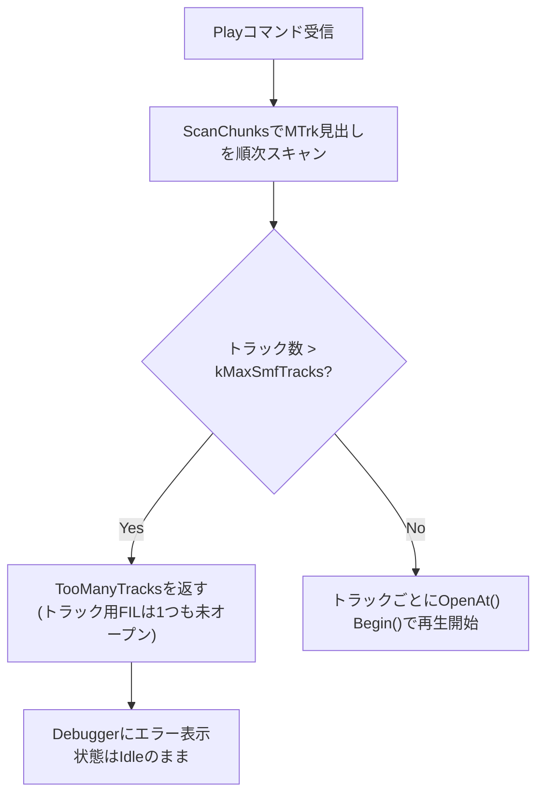
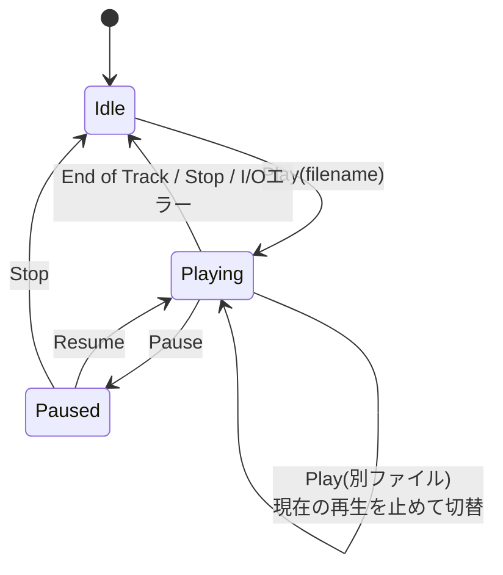

# SMF Player 設計仕様

SDカード上のStandard MIDI File（SMF）を読み込み、既存のMIDI受信パイプラインに合流させて再生する `SmfPlayerTask` の設計を定義する。

背景・検討経緯（SDカード読み取り速度の見積もり、メモリ余裕の実測）は本ドキュメントには含めない。ここでは決定した設計のみを記録する。並列実行基盤は [design_concurrency.md](design_concurrency.md)、MIDI受信パイプラインは [design_midi_message.md](design_midi_message.md) / [design_midi_ipc.md](design_midi_ipc.md) を参照。

---

## 目次

- [SMF Player 設計仕様](#smf-player-設計仕様)
  - [目次](#目次)
  - [1. 位置づけ](#1-位置づけ)
  - [2. 全体構成](#2-全体構成)
    - [2.1 優先度](#21-優先度)
  - [3. SmfPlayerTask の責務](#3-smfplayertask-の責務)
  - [4. Debugger ↔ SmfPlayerTask 制御](#4-debugger--smfplayertask-制御)
    - [4.1 コマンドの受け渡し](#41-コマンドの受け渡し)
    - [4.2 Lsとインデックス指定](#42-lsとインデックス指定)
    - [4.3 FatFsアクセスの一元化とFF_FS_REENTRANT](#43-fatfsアクセスの一元化とff_fs_reentrant)
  - [5. gMidiQueue への合流](#5-gmidiqueue-への合流)
  - [6. SDカードI/O・バッファリング](#6-sdカードioバッファリング)
  - [7. SMFパーサー設計](#7-smfパーサー設計)
    - [7.1 レイヤ配置](#71-レイヤ配置)
    - [7.2 SmfByteSource（バイト列抽象化）](#72-smfbytesourceバイト列抽象化)
    - [7.3 SmfParser（フォーマット解釈）](#73-smfparserフォーマット解釈)
    - [7.4 マルチトラックマージ（Format 1）とSDアクセス設計](#74-マルチトラックマージformat-1とsdアクセス設計)
    - [7.5 テストベンチとしての利用](#75-テストベンチとしての利用)
  - [8. 状態遷移](#8-状態遷移)
  - [9. メモリ使用量見積もり](#9-メモリ使用量見積もり)
  - [10. 既知の制約](#10-既知の制約)
  - [11. 関連ドキュメント](#11-関連ドキュメント)

---

## 1. 位置づけ

USB MIDIキーボードからのライブ入力と、SDカード上のSMFファイル再生を**混在演奏**を許容する。両者は対等な入力ソースとして `gMidiQueue` に合流し、Core1（MidiEngineTask）は入力元を区別しない。

SMF再生の起動・停止・一時停止はDebuggerコンソールから行う。同時に再生できるファイルは1つまでとする。

---

## 2. 全体構成

`SmfPlayerTask` はCore0に置く。SDカードI/O・ファイルパースはI/O処理であり、Core1は音源処理専有という原則（[design_concurrency.md 2.2](design_concurrency.md#22-core1-の責務)）を崩さない。



### 2.1 優先度

現行の `task_config.h` は優先度が連番で隙間がないため、`SmfPlayerTask` を `UsbMidiTask` と `MidiPanelTask` の間に挿入するには既存定数のリナンバーが要る。

| タスク | 現行 | 変更後 |
|---|---|---|
| `TASK_PRIORITY_CSM` | `configMAX_PRIORITIES - 1` (31) | 変更なし |
| `TASK_PRIORITY_MIDI_ENGINE` | `configMAX_PRIORITIES - 2` (30) | 変更なし |
| `TASK_PRIORITY_USB` | `configMAX_PRIORITIES - 3` (29) | 変更なし |
| `TASK_PRIORITY_SMF_PLAYER`（新設） | — | `configMAX_PRIORITIES - 4` (28) |
| `TASK_PRIORITY_MIDI_PANEL` | `configMAX_PRIORITIES - 4` (28) | `configMAX_PRIORITIES - 5` (27) |
| `TASK_PRIORITY_DEBUG` | 1 | 変更なし |

USBライブ入力の取りこぼしを最優先に防ぎつつ、SDカードのブロッキングI/Oが `MidiPanelTask` の周期スキャンより優先される位置に置く。

---

## 3. SmfPlayerTask の責務

| 項目 | 内容 |
|---|---|
| SDカードアクセス | `Platform::`経由（`SmfSdByteSource`、[7.1](#71-レイヤ配置)）でのファイルオープン・ディレクトリ列挙・ストリーミング読み込み。**SDボリュームへの実アクセスを要求するのはこのタスクに一元化する**（[4.3](#43-fatfsアクセスの一元化とff_fs_reentrant) 参照）。FatFs APIそのものは直接呼ばない |
| SMFフォーマット解釈 | `MThd`/`MTrk` チャンク読み取り、可変長数値（VLQ）のdelta-timeデコード、メタイベント（Tempo, End of Track）の解釈 |
| タイミングスケジューリング | delta-time × 現在のtempoをµsに変換し、実時間で発火する。Format 1（複数トラック）は次イベント時刻が最も早いトラックから順にマージする |
| チャンネルメッセージのバイトストリーム化 | メタイベントを除いた生のMIDIチャンネルメッセージ（ランニングステータス込み）を `MidiStreamAssembler::PushByte()` に投入する。**MIDIバイト列の意味解釈は既存の `MidiParser`/`MidiController` に委譲し、SMF側で独自に再実装しない**（Single Parse Ruleの趣旨を踏襲） |
| IPC投入 | `IMidiStreamSink` 実装（`UsbMidiStreamSink` と同様の構造）経由で `MidiIpcSendMidiEvent()` を呼び出し、`gMidiQueue` へ送信する。タイムスタンプ付与のタイミングもUSB経路と同じ（`sink.OnMidiEvent` 内で `time_us_64()` を取得） |
| 再生制御 | Debuggerからの Play/Stop/Pause/Resume/Ls/Mount を受け付ける（[4](#4-debugger--smfplayertask-制御)） |

非責務は既存タスクと同様、FMレジスタへの直接書き込み・Voice Allocator操作・`MidiProcessor::Exec` の直接呼び出し（すべてCore1の専管）、USBスタック操作、Panel制御。

---

## 4. Debugger ↔ SmfPlayerTask 制御

DebuggerTaskとSmfPlayerTaskは同一Core（Core0）上の別タスクとする。両者ともCore0に閉じるため、**新規のグローバル `QueueHandle_t` は追加せず、FreeRTOSのDirect-to-Task Notification（`xTaskNotify`/`ulTaskNotifyTake`）を使う**。

### 4.1 コマンドの受け渡し

各タスクは生成時にすでにTCB内蔵の通知スロットを1つ持つため、コマンド用のキューオブジェクトを新設する必要がない。`Play`はファイル名ではなく`Ls`が表示した連番（インデックス）で対象を指定するため（[4.2](#42-lsとインデックス指定)）、マイルボックスは可変長データを持たない固定サイズの小さな構造体で済む。

```cpp
enum class SmfCommand : uint8_t { Play, Stop, Pause, Resume, Ls, Mount };

struct SmfCommandMailbox {
    SmfCommand type;
    uint16_t   index;  // Play のときのみ有効。Lsが表示した連番（1始まり）
};
```

- DebuggerTaskは `taskENTER_CRITICAL()`/`taskEXIT_CRITICAL()` で保護した短い区間で `SmfCommandMailbox` を書き込み、`xTaskNotifyGive(gSmfPlayerTaskHandle)` で起床させる
- SmfPlayerTaskのメインループは `ulTaskNotifyTake(pdTRUE, waitTicks)` で待機する。`waitTicks` は「次のSMFイベントまでの残りdelta-time」（Stop中は `portMAX_DELAY`）。通知が来れば即座に返るため、Stop/Pauseは次のSMFイベントを待たずに即時反映される。タイムアウト（戻り値0）はそのまま「次のSMFイベント発火時刻に到達した」を意味する
- コマンドは**fire-and-forget**とする。既存の`stats`/`dc`等のDebuggerコマンド（`src/app/debugger_task.cpp`）も`Debugger::SendCommand()`で送信するだけで応答を待たず、Core1側の処理結果は非同期に標準出力へ現れる。SmfPlayerTask側のコマンドもこの既存の流儀に合わせる。DebuggerTaskはコマンド送信後、応答を待たずに直ちにプロンプトへ戻る。実行結果（成功・エラー理由）はSmfPlayerTaskが自分の判断で標準出力に書くタイミングで表示され、プロンプトの表示と前後する可能性があるが、これは`stats`等の既存コマンドも同じであり新しい制約ではない



`ulTaskNotifyTake()` をdelta-timeの待機とコマンド受信待ちの両方に使うことで、`vTaskDelay` と別途のコマンドポーリングを両立させる必要がない。fire-and-forgetのため、`main.cpp`で現在破棄している`xTaskCreateAffinitySet()`の出力ハンドル引数は、SmfPlayerTaskの分だけ保持すればよい（DebuggerTask側は不要）。

### 4.2 Lsとインデックス指定

`Play`はファイル名を直接指定せず、直前の`Ls`が表示した連番で対象を指定する。ファイル名を毎回入力する煩雑さを避けるための設計判断であり、副次的に[3](#3-smfplayertask-の責務)で懸念していたDebuggerコンソールの制約（コマンド行バッファ32バイト、`Debugger::fgets()`が非ASCII文字を捨てる）を回避できる。日本語ファイル名の**入力**は発生しない（`Ls`の**出力**に日本語ファイル名を表示することは問題なく、`std::printf`はバイト列をそのまま書き出すだけなので影響を受けない）。

**インデックスはキャッシュしない**。`Ls`はSDカードのルートから再帰的に`.mid`/`.smf`ファイルを`Platform::`経由で走査し、見つけた順に1始まりの連番を振って`"N: path"`を標準出力に列挙する。`Play <index>`は、指定されたインデックスを覚えておくのではなく、**同じ走査を（何も表示せず）もう一度最初からやり直し**、N番目に到達したファイルを開く。走査順序はFatFsのディレクトリエントリ順で決定的なので、`Ls`と`Play`の間でSDカードの内容が変わらない限り同じ結果になる。この設計により、インデックスとパスの対応表を保持するための専用メモリが不要になる（トラック数のように上限を決めて確保する必要がない）。`Ls`と`Play`の間でファイルを増減させた場合はインデックスがずれるが、通常の利用では起こらない前提とする。

組み込みフィクスチャ（[7.5](#75-テストベンチとしての利用)）もこのインデックス空間に含める。`Ls`はSD上のファイルを列挙し終えたあとに組み込みフィクスチャを追加で列挙し（例: `"F1: (builtin) test_scale"`）、`Play`はインデックスがSD側の総数を超えていれば組み込みフィクスチャ側とみなす。

### 4.3 FatFsアクセスの一元化とFF_FS_REENTRANT

設計ルールとして、**FatFsへのアクセスはSmfPlayerTaskからのみ行う**。DebuggerTaskはディレクトリ列挙も含めてすべてSmfPlayerTaskへコマンドとして委譲し、直接 `f_open`/`f_readdir` 等を呼ばない。この一元化により、複数タスクからの同時呼び出しはそもそも起こり得ない。

`FF_FS_REENTRANT` は既定の `0` のまま変更しない。当初は「一元化ルールが崩れた場合の事故検出用の保険」として `1` へ変更する案だったが、実装時に`ffsystem.c`のミューテックス実装が`OS_TYPE`（0:Win32〜4:CMSIS-RTOS）を`#ifndef`ガードなしの無条件`#define OS_TYPE 0`（Win32）に固定しており、`FreeRTOS`向けの分岐（`OS_TYPE==3`）が実装されているにもかかわらず選択できないことが判明した。`FF_FS_REENTRANT=1`にすると`<windows.h>`を含むWin32分岐がそのままコンパイルされ、ARM GCCでビルドできない。`ffconf.h`と異なり`ffsystem.c`は`no-OS-FatFS-SD-SDIO-SPI-RPi-Pico`の`CMakeLists.txt`で`target_sources`に直接パス指定されているため、インクルードパスの優先順位による上書きも効かない。`extern/`は直接編集禁止のため、この値は変更できない。

事故検出の保険1つのために`extern/`のパッチ運用やライブラリのフォークといった重い対応を取るのは本末転倒なので、`FF_FS_REENTRANT`は既定値のまま、[4.3](#43-fatfsアクセスの一元化とff_fs_reentrant)冒頭の一元化ルールのみで安全性を担保する。同時呼び出しがそもそも起こり得ない設計になっているため、事故検出の保険がなくても一元化ルール自体が守られている限り安全性に問題はない。

`ffconf.h` は `extern/no-OS-FatFS-SD-SDIO-SPI-RPi-Pico/src/include/` に置かれており、AGENTS.mdの制約（`extern/` は直接編集禁止）により直接変更できない。`src/drivers/storage/ffconf.h` を上書き用に置き、そのインクルードディレクトリ（`src/drivers/storage/CMakeLists.txt` の `target_include_directories(fatfs PUBLIC ...)`）がライブラリ本体の `include/` より先に解決されるようにして、`FF_USE_LFN`/`FF_FS_LOCK`（[7.4.4](#74-マルチトラックマージformat-1とsdアクセス設計)）だけを既定値から変更している。実装済み。

---

## 5. gMidiQueue への合流

`design_concurrency.md` のSingle Writer Ruleは現状 `gMidiQueue` の書き手を `UsbMidiTask` のみとしているが、本設計では `SmfPlayerTask` を第2のProducerとして追加する。`gMidiControlQueue` が既に複数Producer（UsbMidiTask / MidiPanelTask / DebugTask）を許容しているのと同じ考え方で、FreeRTOSキューは複数Producerからの `xQueueSendToBack` を安全に受け付ける。

到着順の単一FIFOという性質はそのまま維持され、Core1（MidiEngineTask）はイベントがUSB由来かSMF由来かを区別しない。この変更を実装する際は、`design_concurrency.md` の Single Writer Rule表（`gMidiQueue` への書き込み欄）に `SmfPlayerTask` を追記する。

---

## 6. SDカードI/O・バッファリング

SDカードは `src/drivers/storage/hw_config.c` によりSPI0・12.5MHzで接続されている（理論帯域約1.56MB/s）。SMFイベントストリームの必要レートは密な和音でも数百バイト〜数KB/秒程度であり、スループットは問題にならない。設計上の焦点はスループットではなく、SDカード個々のアクセスが内部処理で数ms〜数十ms停止しうるレイテンシを、演奏タイミングに露出させないことである。

具体的なバッファリング方式は、16CH同時再生を前提とするFormat 1のマルチトラックマージと分離できないため、[7.4](#74-マルチトラックマージformat-1とsdアクセス設計)にまとめて記載する。

---

## 7. SMFパーサー設計

### 7.1 レイヤ配置

SMFのフォーマット解釈（チャンク・VLQ・ランニングステータス・メタイベント）そのものは、SDカードやFatFsに依存しない純粋なロジックである。`src/midi/`（pico-sdk/FreeRTOS非依存、[tests/README.md](../tests/README.md)でホストユニットテスト済み）と同じ考え方で、新規に `src/smf/` を作り、そこにpico-sdk/FreeRTOS非依存のパーサー本体を置く。



AGENTS.mdのレイヤ制約（`app/` はハード直接操作禁止、`Platform::*` と `synth` API のみ）に従い、FatFsの実際の呼び出し（`f_open`/`f_read`/`f_readdir`）は `src/platform/` 側の `SmfSdByteSource` に閉じ込める。`SmfPlayerTask`（`app/`）は `Platform::` 経由でこれを利用し、FatFs API を直接呼ばない。これに伴い、[4.3](#43-fatfsアクセスの一元化とff_fs_reentrant)の「FatFsへのアクセスはSmfPlayerTaskからのみ行う」は「FatFsへの実アクセスは `SmfSdByteSource`（`platform/`）からのみ行い、それを呼び出すのはSmfPlayerTaskからのみ」と読み替える。DebuggerTaskや他タスクが直接 `SmfSdByteSource` を使わないという制約は変わらない。

### 7.2 SmfByteSource（バイト列抽象化）

```cpp
enum class SmfByteSourceStatus : uint8_t {
    Ok,
    EndOfFile,   // 正常終端
    IoError,     // SDカード抜去等の読み取りエラー
};

class SmfByteSource {
public:
    virtual ~SmfByteSource() = default;
    virtual bool ReadByte(uint8_t& out) = 0;         // 現在位置から1バイト。読めなければfalse
    virtual SmfByteSourceStatus LastStatus() const = 0;  // 直前のReadByte()がfalseだった理由
};
```

`Seek()` はこのインターフェースに含めない。トラック切替のたびにシークする設計は[7.4](#74-マルチトラックマージformat-1とsdアクセス設計)で説明する問題を持つため、位置決めは`NextEvent()`のホットパスから排除し、実装ごとの初期化手順に閉じ込める（後述）。

`ReadByte()`が`false`を返す理由には正常なEOFとSDカードのI/Oエラーの2通りがあり、`SmfPlayerTask`はこれを区別する必要がある（[8](#8-状態遷移)の「再生中のI/Oエラー」）。EOFなら`EndOfTrack`/`EndOfFile`として通常どおり処理し、`IoError`なら再生を中断してAll Notes Off相当のクリーンアップを行う。`SmfMemoryByteSource`は物理I/Oを行わないため`IoError`を返すことはなく、常に`Ok`または`EndOfFile`。

実装は2系統。

| 実装 | 配置 | 用途 |
|---|---|---|
| `SmfSdByteSource` | `src/platform/` | 本番再生。FatFsの `FIL` をラップし、トラックごとに1個ずつ生成する（[7.4](#74-マルチトラックマージformat-1とsdアクセス設計)） |
| `SmfMemoryByteSource` | `src/smf/` | 固定バイト列（`const uint8_t*` + 長さ + 開始オフセット）をラップするだけの実装。ホストユニットテストと組み込みフィクスチャ再生の両方で使う |

`SmfMemoryByteSource` はポインタ演算のみで、ヒープもFatFsも使わない。

### 7.3 SmfParser（フォーマット解釈）

```cpp
enum class SmfEventKind : uint8_t {
    ChannelMessage,  // ランニングステータス解決済みの生MIDIチャンネルメッセージ
    SysEx,
    TempoChange,
    EndOfTrack,
    EndOfFile,
    FormatError,
};

struct SmfEvent {
    SmfEventKind   kind;
    uint32_t       delta_ticks;       // 直前にNextEvent()が返したイベントからの経過tick（グローバル基準。後述）
    uint32_t       tempo_us_per_qn;   // TempoChangeのみ有効
    const uint8_t* bytes = nullptr;   // ChannelMessage/SysExのみ有効
    uint8_t        length = 0;
};

struct SmfTrackInfo {
    uint32_t start_offset;  // MTrkのデータ開始オフセット（チャンクヘッダの直後）
    uint32_t end_offset;
};

enum class SmfScanResult : uint8_t {
    Ok,
    FormatError,     // MThd不正・チャンク破損など
    TooManyTracks,   // MTrk数がmax_tracksを超えた
};

class SmfParser {
public:
    // MThdと各MTrkのチャンク境界だけを読む（トラック本体は読まない、シーク不要の1回の順次スキャン）。
    // トラック用FILは1つも開かない段階なので、失敗時の後始末は不要
    SmfScanResult ScanChunks(SmfByteSource& header_source, SmfTrackInfo* out_tracks,
                              uint8_t max_tracks, uint8_t& out_track_count);
    // ScanChunks の結果をもとに、各トラック開始位置へ位置決め済みのSmfByteSourceを渡して再生を開始する
    bool Begin(SmfByteSource** track_sources, uint8_t track_count);
    bool NextEvent(SmfEvent& out);      // 次のイベントを1件取得（トラックマージ込み、シークしない）
    uint16_t TicksPerQuarterNote() const;
};
```

`Open()`を`ScanChunks()`/`Begin()`の2段階に分けたのは、[7.4](#74-マルチトラックマージformat-1とsdアクセス設計)で説明する「トラックごとに独立したファイルハンドルを用意し、位置決めは1トラックにつき1回だけ」という設計に対応するため。`ScanChunks()`の失敗理由を`FormatError`と`TooManyTracks`で区別するのは、Debugger側で原因の異なるエラーメッセージを出せるようにするため（[7.4.4](#74-マルチトラックマージformat-1とsdアクセス設計)）。

`NextEvent()` はpull型のAPIとする。SmfPlayerTask側はdelta-timeを実時間に変換して待つ必要があり、呼ぶたびに1件返す形が自然に合う。コールバック/Sink方式（`MidiStreamAssembler`と同じ形）にすると、待機のタイミングをコールバック側から呼び出し側へ伝え返す必要が生じ、かえって複雑になる。

- `MThd`: フォーマット種別（0/1）、トラック数、division（ticks per quarter note）を読む。SMPTE形式のdivision（top bit=1）は対象外
- `MTrk`: delta-time（VLQ）→ イベント本体の繰り返し。イベント本体がステータスバイトを省略した場合はランニングステータスを引き継ぐ（既存 `MidiParser` の前提と同じ）
- メタイベント（`FF <type> <len> <data>`）はSMFフォーマット固有の情報でありMIDIチャンネルメッセージではないため、`ChannelMessage`/`SysEx`としては返さずパーサー内部で解釈する
  - Set Tempo（`FF 51 03`）: `TempoChange` として返す。以降のdelta-time→µs変換にこのtempoを使うのはSmfPlayerTask側の責務
  - End of Track（`FF 2F 00`）: `EndOfTrack` を返す。全トラックが終端に達したら以降は `EndOfFile`
  - それ以外のメタイベントは読み飛ばす
- SysExイベント（`F0`/`F7` で開始するSMF内SysExイベント）は `SysEx` として返す。バイト列は変更せずそのまま返し、意味解釈（`MidiSysEx::Classify()`）はSmfPlayerTaskが `MidiStreamAssembler::PushByte()` へ渡した先に委ねる
- `ChannelMessage`/`SysEx` のバイト列はSMFのバイト列をそのまま渡すだけで、MIDIバイト列としての意味解釈はしない。Single Parse Ruleの趣旨（[design_midi_message.md](design_midi_message.md)）どおり、意味解釈は既存の `MidiParser`/`MidiController` に一本化する

**`delta_ticks`の基準**: トラックマージ後は「直前に`NextEvent()`が返したイベント（グローバルタイムライン上の直前）」からの経過tickとする。トラック自身の直前イベントからの経過tickではない。SmfPlayerTaskは`NextEvent()`が返す`delta_ticks`をそのまま実時間待機に変換すればよく、待機時間の計算にトラックをまたいだ調整を持ち込まずに済む。

**同一tickのタイブレーク**: 複数トラックの次イベントが同じ絶対tickになる場合、`TempoChange`を他の種別より先に返す。テンポ変更は以降のdelta-time→µs変換の基準を変えるため、同tickの他イベント（`ChannelMessage`等）より先に反映しておく必要がある。`TempoChange`同士や、`TempoChange`が絡まない同tickイベント間の順序は、トラック番号の昇順など決定的であればよく、演奏結果には影響しない。

**初期テンポ**: 最初の`TempoChange`が現れるまでのテンポは、SMF仕様の既定値である120BPM（500000µs/四分音符）とする。`Begin()`はこの値で初期化する。

### 7.4 マルチトラックマージ（Format 1）とSDアクセス設計

本システムは16CH同時演奏を前提とするため、Format 1（1トラック1チャンネルが一般的な構成）のサポートは必須要件である。16チャンネルの演奏では和音・複数パートの同時発音がトラック単位で頻発し、密なパッセージではほぼイベントごとに異なるトラックへ切り替わりうる。したがって、トラック切替のコストは「まれなワーストケース」ではなく常時発生しうるコストとして設計しなければならない。この制約から導かれる設計とその根拠をまとめる。

#### 7.4.1 単一ストリーム＋都度シーク方式が成立しない理由

トラックごとに軽量なカーソル（読み取り位置・次イベントtick・ランニングステータス）だけを保持し、実データは単一の `SmfByteSource` から `Seek(cursor.read_pos)` で都度読みに行く方式は、この用途には適さない。`NextEvent()` は全トラックの中で次イベント時刻が最も早いものを選び、そのつどシークすることになるが、単一の共有バッファ＋都度シーク方式では、切替のたびに:

1. `f_lseek()` がFATチェーンを辿るコスト（ファイルが断片化していれば、ファイル先頭からクラスタチェーンを辿り直す。距離に比例して悪化する）
2. 直前まで先読みしていたバッファ内容が無駄になり、新しい位置から読み直しになるコスト

の両方が乗る。16CH構成の密なパッセージでは常時発生しうるコストであり、リアルタイム再生に許容できない。

#### 7.4.2 採用する設計: トラックごとに独立したファイルハンドル

根本原因は「1つの共有ストリームを、複数トラックの間で奪い合いながらシークし続ける」という構造そのものにある。対応策は、**トラックごとに独立した読み取りストリーム（FatFsの `FIL` ハンドル）を持たせ、シークをトラック切替のたびではなく「再生開始時に1トラックにつき1回だけ」に限定する**こと。

再生開始（`Play`コマンド）時の手順:



`ScanChunks()`はチャンクヘッダ（`MTrk`+4バイト長）を読んでは本体をスキップする、という順方向の読み進みだけで完結する（各トラックの中身は読まない）。ここではシークは発生しない。

各トラックの再生用ハンドルは、`ScanChunks()`で判明した`start_offset`へ**1回だけ**位置決めしたあと、`NextEvent()`のたびに使うのは`ReadByte()`のみになる。トラック切替が起きても、切り替わった先のトラックは自分自身の直前の読み取り位置から続きを読むだけで、再シークは発生しない。

```cpp
class SmfSdByteSource : public SmfByteSource {
public:
    bool OpenAt(const char* path, uint32_t byte_offset);  // f_open + 1回だけf_lseek
    bool ReadByte(uint8_t& out) override;                  // 以降は純粋にf_read前進のみ
private:
    FIL fil_;
};
```

#### 7.4.3 バッファリングはFatFsの`FIL`に任せる

ハンドルをトラックごとに分けたことで、[6](#6-sdカードioバッファリング)で検討していた手組みのダブルバッファは不要になる。この vendored FatFs（`FF_FS_TINY=0`、既定のまま変更しない）では、`FIL`構造体が1個につき512バイトのプライベートなセクタウィンドウ（`buf[FF_MAX_SS]`）を内蔵しており、`f_read()`はこのウィンドウ経由でSDから読む。トラックごとに別々の`FIL`を持てば、このウィンドウもトラックごとに独立して保持される。

これが実質的なバッファそのものになる。SMFの1イベントは平均2〜5バイト程度なので、512バイトのウィンドウは1トラックあたりおよそ100〜250イベント分の先読みに相当する。トラック切替で他のトラックの`ReadByte()`を挟んでも、そのトラック用の`FIL`のウィンドウ内容は消えずに残っている。実際にSDへの物理アクセスが発生するのは、そのトラック自身のウィンドウを使い切ったときだけであり、トラック切替そのものはSDアクセスを引き起こさない。

これは`FF_FS_TINY=1`（ファイルシステムオブジェクト側の共有ウィンドウ`fs->win`を全ファイルで使い回す設定）を選ばない理由でもある。`FF_FS_TINY=1`にすると`FIL`は小さくなる（512バイト分軽量化）が、ウィンドウが全トラックで共有になり、[7.4.1](#74-マルチトラックマージformat-1とsdアクセス設計)で述べた「トラック切替のたびにウィンドウが上書きされる」問題が形を変えて残る。トラックごとのメモリコストと引き換えに、トラックごとの独立ウィンドウを確保する方を選ぶ。

#### 7.4.4 コストと制約

**トラック数の上限**: `tools/count_smf_tracks/count_smf_tracks.py`（[7.5](#75-テストベンチとしての利用)とは別に、実測用に作成）で手持ちのMIDIファイル64件（読み込み失敗1件）を実測したところ、最大トラック数は21（`ABC_-_The_Look_of_Love.mid`）だった。この実測値に余裕を見て、`kMaxSmfTracks = 25`を設計上の固定上限とする。

同時に開けるファイル数の上限は`FF_FS_LOCK`（既定16）で決まる。FatFsの`chk_share()`（`ff.c`）は読み取り専用の多重オープンを許可しており、同一ファイルを複数の`FIL`で同時に開くこと自体は問題ないが、`kMaxSmfTracks=25`に対して既定の16では足りない。[4.3](#43-fatfsアクセスの一元化とff_fs_reentrant)で予定している`ffconf.h`の上書き（`src/drivers/storage/`側）で`FF_FS_LOCK`を32に引き上げる（`kMaxSmfTracks`ちょうどではなく、一時的なオーバーラップ等のための余裕を持たせる）。

**上限を超えた場合の挙動**: `ScanChunks()`はMTrkチャンク見出しを順次読みながらトラック数を数える。この時点ではトラック用の`FIL`は1つも開いていない（見出し読み取り専用の一時的なハンドルが1つあるだけ）。カウントが`kMaxSmfTracks`を超えたら、それ以上読み進めずに`SmfScanResult::TooManyTracks`を返す。



トラック用`FIL`を1つも開く前に判定するため、上限超過時に開いたハンドルを後始末する処理は不要で、状態遷移（[8](#8-状態遷移)）は`Idle`のまま変化しない。FM音源側への副作用も一切発生しない（まだ何も再生していないため）。

なお、`kMaxSmfTracks`以下のトラック数であっても、他の要因（他タスクが一時的にファイルを開いている等）で`FF_FS_LOCK`を使い切っていた場合は、個々の`OpenAt()`が`FR_TOO_MANY_OPEN_FILES`を返しうる。この場合はScanChunks段階ではなくBegin段階の失敗になるため、Begin側でも同様にエラーを返し、その時点までに開いた分のハンドルを閉じてから`Idle`へ戻す。

**メモリコスト**: `FIL`構造体は`FF_FS_EXFAT=1`（本プロジェクトで有効）と`buf[512]`を合わせて1個あたり約590バイト。トラック数に比例するため、16トラックで約9.4KB。これは[6](#6-sdカードioバッファリング)で見積もっていた「ダブルバッファ2KB固定」よりも大きく、トラック数に応じて変動する点を[9](#9-メモリ使用量見積もり)に反映する。

**ScanChunksの位置決めコスト**: 各トラックの`OpenAt()`は1回だけ`f_lseek()`する。ファイルが断片化していれば、その1回はFATチェーンを辿るコストがかかるが、これは再生開始（Playコマンド）時にまとめて発生する1回限りのコストであり、リアルタイム再生中のノートタイミングには乗らない。`FF_USE_FASTSEEK`（本プロジェクトでは既定で有効）を使えばこの位置決めをさらに高速化できるが、上記の理由で必須ではなく、再生開始レイテンシを詰めたくなった場合の追加最適化として扱う。

### 7.5 テストベンチとしての利用

`SmfParser`/`SmfByteSource` を `src/smf/` に切り出したことで、2種類のテストが同じコードパスに対して行える。

**ホストユニットテスト**: `src/smf/` は `src/midi/` と同じくpico-sdk/FreeRTOS非依存なので、`tests/unit/smf/` を追加し、`SmfMemoryByteSource` に手書きのバイト列を渡して `SmfParser::NextEvent()` の出力をGoogleTestで検証できる（`tests/unit/midi/CMakeLists.txt` と同じ構成で、`.cpp` を素のまま実行ファイルに含める）。壊れたVLQ、ランニングステータスの継承、Format 1のトラックマージ順、テンポ変更のタイミングなど、SDカードなしで検証できる。

**実機組み込みフィクスチャ**: `src/smf/`（または `src/smf/fixtures/`）に既知のSMFバイト列を `constexpr uint8_t[]` としていくつか用意する（単純なスケール、和音、テンポ変化、ランニングステータス、Format 1マルチトラックなど）。これは本番ファームウェアにも静的にリンクされる。`Ls`はSD上のファイルを列挙し終えたあとにこの組み込みフィクスチャも追加で列挙し、同じインデックス空間に含める（[4.2](#42-lsとインデックス指定)）。`Play <index>`でインデックスがSD側の総数を超えていれば、`SmfSdByteSource` の代わりにこの組み込みフィクスチャを `SmfMemoryByteSource` でラップして再生する。コマンド体系・状態遷移（[8](#8-状態遷移)）は変えず、`SmfByteSource` の実装だけが切り替わる。SDカードやファイル準備なしで、`gMidiQueue`→`MidiEngineTask`→FM音源までの実機上の全経路を確認できる。

---

## 8. 状態遷移

`Playing`/`Paused`から`Idle`へ抜けるすべての経路（自然終了・`Stop`・再生中のI/Oエラー）で、その時点で発音中のノートに対して All Notes Off 相当のクリーンアップを発行する。過去に発音の止め漏れ（stuck note）で問題が起きた経緯があるため、「非対称に終了する経路」を作らないことを設計上の原則とする。`Pause`も同様にAll Notes Off相当を発行して無音状態で保持し、`Resume`は無音から再開する（発音を継続させたまま止める方式は採らない）。



`Play` を再生中に受けた場合は、現在の再生を停止してから新しいファイルを開く（同時再生は1ファイルまで）。この「停止」も含め、`Idle`へ戻る全経路でAll Notes Off相当のクリーンアップを行う。

`Play`が`ScanChunks()`の`SmfScanResult::TooManyTracks`/`FormatError`で失敗した場合は`Idle`から遷移しない（[7.4.4](#74-マルチトラックマージformat-1とsdアクセス設計)）。図中には表現していないが、`Idle`からの`Play`は成功時のみ`Playing`へ進む自己ループとして扱う。エラー内容はSmfPlayerTaskが標準出力に表示する（[4.1](#41-コマンドの受け渡し)のfire-and-forget方針どおり、DebuggerTaskは応答を待たない）。この場合はまだ何も再生していないのでAll Notes Offは不要。

**再生中のI/Oエラー**: `NextEvent()`が内部の`ReadByte()`失敗（SDカード抜去等）を検知した場合、`SmfPlayerTask`は即座に`Idle`へ遷移する。`ReadByte()`の戻り値`false`はEOF（正常な終端）とI/Oエラーの両方を意味しうるため、`SmfByteSource`側でこの2つを区別できるようにする（[7.2](#72-smfbytesourceバイト列抽象化)の`SmfByteSource`に、直近の読み取り失敗がEOFかエラーかを返す手段を追加する）。エラー時はAll Notes Off相当のクリーンアップに加え、エラー内容を標準出力に表示する。この経路はDebuggerコマンドの実行結果ではなく再生中に非同期で発生するが、[4.1](#41-コマンドの受け渡し)のfire-and-forget方針のもとでは他のコマンド出力と同様、SmfPlayerTaskが任意のタイミングで直接標準出力へ書くだけでよい。

---

## 9. メモリ使用量見積もり

残容量は他機能の実装状況で変わるため記載しない。ここでは使用量の実測・概算のみを記録する。

RP2350A（`pico2`、既定ターゲット）でのビルド実測（`arm-none-eabi-size`）:

| 項目 | 値 |
|---|---|
| Flash使用量 | 約205KB |
| SRAM静的占有（`.data`+`.bss`+ベクタ+FreeRTOSヒープ実体+起動用ダミースタック） | 約87KB |
| うちFreeRTOSヒープ（64KB）内の既存使用（5タスクのスタック+TCB+既存キュー） | 約13〜14KB |

RP2040（`pico`）でのビルド実測:

| 項目 | 値 |
|---|---|
| Flash使用量 | 約211KB |
| SRAM静的占有 | 約88KB |

`SmfPlayerTask` 追加分の見積もり:

| 項目 | 概算 |
|---|---|
| タスクスタック（LFN作業バッファ512バイト、Ls/Playのディレクトリ再帰走査を含む。[10](#10-既知の制約)参照） | 4KB（`TASK_STACK_SMF_PLAYER`実装値。ディレクトリ再帰走査1段ごとにFILINFO 256バイト分を消費するため2〜3KBの当初見積もりから増額） |
| `SmfSdByteSource`（`FIL`約590バイト×`kMaxSmfTracks`、[7.4.4](#74-マルチトラックマージformat-1とsdアクセス設計)） | 約14.4KB（`kMaxSmfTracks=25`固定で静的確保。実際に使うのは再生中のファイルのトラック数分のみ） |
| `SmfCommandMailbox` | 数バイト（`SmfCommand`+`uint16_t`。ファイル名を持たないため無視できる大きさ） |

`FIL`は`kMaxSmfTracks`個の固定長配列として静的に確保する（ヒープ確保はしない）ため、SRAM上の占有は常にこの上限値ぶんになる。トラック数の少ないファイルを再生していても、配列自体は確保済みのまま（未使用スロットが残るだけ）。

---

## 10. 既知の制約

- SMPTE形式のdivisionを持つSMFは対象外
- SDボリュームへのアクセスはSmfPlayerTaskに一元化する（[4.3](#43-fatfsアクセスの一元化とff_fs_reentrant)）。`FF_FS_REENTRANT`は`ffsystem.c`のOS_TYPE固定（Win32）問題により既定の`0`のままで、事故検出の保険はない。一元化ルール自体を守ることが唯一の安全性の担保であり、他タスクからのSDアクセスが本当に必要になった場合は設計から見直す必要がある
- LFNは `FF_LFN_UNICODE=2`（UTF-8）で既に有効。ファイル名は最大255バイト（UTF-8）まで扱える。作業バッファ確保方式は既定の `FF_USE_LFN=3`（ヒープ）から **`FF_USE_LFN=2`（スタック）に変更する**。FatFs呼び出し元をSmfPlayerTask 1つに一元化する設計（[4.3](#43-fatfsアクセスの一元化とff_fs_reentrant)）のため、512バイトの作業バッファをそのタスクのスタックに乗せれば、newlibヒープ（`_sbrk` ベース、`configTOTAL_HEAP_SIZE` のFreeRTOSヒープとは別領域）を経由せずに済み、動的確保に伴うフラグメンテーションの懸念自体がなくなる。作業バッファの確保・解放は `f_open`/`f_readdir` などパス探索系の呼び出し1回の中で完結し、`f_read()` のストリーミングループでは使われない（`ff.c` の `INIT_NAMBUF`/`FREE_NAMBUF` 参照）
- `FF_USE_LFN`/`FF_FS_LOCK` を既定値から変更するには、`extern/` を直接編集せず、`src/drivers/storage/` に上書き用の `ffconf.h` を置きインクルードパスの優先順位で差し替える（[4.3](#43-fatfsアクセスの一元化とff_fs_reentrant)。実装済み）
- SMFのトラック数は`kMaxSmfTracks=25`が上限（[7.4.4](#74-マルチトラックマージformat-1とsdアクセス設計)。手持ちファイル64件の実測最大値21に余裕を見た値）。超過ファイルは`ScanChunks()`が`SmfScanResult::TooManyTracks`を返し、トラック用`FIL`を1つも開かないままPlayが失敗する（状態は`Idle`のまま）。`FF_FS_LOCK`は32に引き上げ、`kMaxSmfTracks`を上回る余裕を持たせる
- 断片化の激しいファイルでは、各トラックの初回位置決め（`OpenAt()`内の1回のシーク、[7.4.2](#74-マルチトラックマージformat-1とsdアクセス設計)）にFATチェーン走査のコストがかかる。これはPlayコマンドの起動レイテンシに乗るが、再生開始時の1回限りでありノートタイミングには影響しない
- `Play <index>`は`Ls`の結果をキャッシュせず、同じ走査をやり直してN番目のファイルを特定する（[4.2](#42-lsとインデックス指定)）。`Ls`と`Play`の間でSDカードのファイル構成を変更すると、意図したファイルと異なるものが再生されうる
- `Ls`/`Play`のディレクトリ再帰走査（`Platform::ForEachSmfFile()`）は深さ6階層、1階層あたりのパス長192バイトが上限。当初`DIR`/`FILINFO`/パスバッファを再帰1段ごとにスタック確保していたところ、`FILINFO`だけで`FF_LFN_BUF+1`=256バイトあり、6階層の再帰で約4KBを消費して`TASK_STACK_SMF_PLAYER`をオーバーフローし、`vApplicationStackOverflowHook`の`for(;;)`で実機がハングする不具合が実機テストで見つかった（`ls`実行後にコンソール全体が無反応になる症状）。階層ごとの静的配列（`.bss`、約4KB）に持ち回す実装に修正済み。呼び出し元は`SmfPlayerTask`のみで走査も逐次処理のため、階層インデックスでの使い回しは安全
- macOSでFAT/exFATボリュームにファイルをコピーすると、拡張属性・リソースフォーク保存用のAppleDouble companion file（`._元のファイル名`。拡張子だけでは本物のSMFと区別がつかない）が自動生成される。`Ls`/`Play`の走査からファイル名の`._`プレフィックスで明示的に除外している
- `ls`で大量行（100件超）を一気に出力すると、UART送信またはターミナル側の受信バッファがマルチバイトUTF-8（日本語ファイル名等）の境界を跨いで文字化けする事例が実機で見つかった。`LsVisitor`が1行出力するごとに`vTaskDelay(2ms)`を挟んでバーストを緩和している。根本原因（ファームウェア側のUART送信かターミナル側の受信処理か）は未特定
- **SDカード抜去後の復帰**: `hw_config.c`のピン配線にCard Detectピンがないため、カードの抜き挿しをハードウェア的に検知する手段がない。抜去は実際のI/Oが失敗して初めて分かる。対応として、`Platform::ForEachSmfFile()`の起点（ルートディレクトリの`f_opendir`）と`SmfSdByteSource::OpenAt()`が`FR_DISK_ERR`/`FR_NOT_READY`を検出した場合に1回だけ`Platform::RemountSdCard()`（`f_mount()`の強制再実行）を試みてから操作をやり直す。再生中のストリーミング読み込み（`ReadByte()`）はこの対象外とし、[8](#8-状態遷移)の「再生中のI/Oエラー」どおり`Idle`へ中断する（位置合わせが必要な途中再開は複雑化するため）。手動での明示的な再マウント用に`mount`コマンドも用意する（DebuggerTaskから直接FatFsを呼ばず、他コマンドと同様SmfPlayerTask経由のfire-and-forgetとする一元化ルールを維持）。

  当初「`f_mount()`をopt=1の強制マウントで呼び直せば、`disk_initialize()`経由でカード初期化シーケンスがやり直される」と想定していたが、実機で`mount`コマンドを試したところ抜去→挿し直し後も`FR_DISK_ERR`で失敗した。原因は`no-OS-FatFS-SD-SDIO-SPI-RPi-Pico`の`sd_card_spi_init()`にあり、状態フラグ`STA_NOINIT`がクリアされたまま（＝初回マウント成功後の状態）だと「既に初期化済み」とみなしてカードの再走査そのものをスキップする。抜去時に何もこのフラグを再セットしないため、`f_mount()`を呼び直すだけでは実際のカード再走査が行われない。

  最初の対応として`sd_card_t::deinit()`（`sd_deinit()`）を呼んで`STA_NOINIT`を立て直す方式を試したが、これも実機で新たな不具合を生んだ。`sd_deinit()`はChip SelectピンをGPIO_INに戻すが、それをGPIO_OUTへ戻す処理は`sd_spi_ctor()`（`sd_init_driver()`内で一度きり実行、以降は再実行されない）にしかない。このため`deinit()`を一度でも呼ぶとCSピンの向きが壊れたままになり、以降**カードを抜いていなくても**すべてのマウントが`FR_NOT_READY`で失敗するようになった（実機で確認）。GPIOには一切触れず、`sd_card_t::state.m_Status`（公開構造体メンバ）へ直接`STA_NOINIT`を立てる方式に修正した。`Platform::MountSdCard()`（`src/platform/init.cpp`）で`f_mount()`の前に`sd_get_by_num(0)->state.m_Status |= STA_NOINIT;`を行う。

---

## 11. 関連ドキュメント

| ファイル | 内容 |
|---|---|
| [design_concurrency.md](design_concurrency.md) | タスク配置・優先度・Single Writer Rule |
| [design_midi_ipc.md](design_midi_ipc.md) | `gMidiQueue`/`gMidiControlQueue` の設計判断 |
| [design_midi_message.md](design_midi_message.md) | `MidiParser`/`MidiStreamAssembler`/`IMidiStreamSink` |
| [../tests/README.md](../tests/README.md) | ホストユニットテストの実行方法（`src/smf/`もこの対象に含める） |
| [build.md](build.md) / [build_ja.md](build_ja.md) | `BUILD_SD_CARD` オプション |
