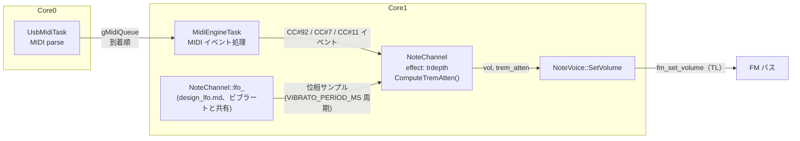
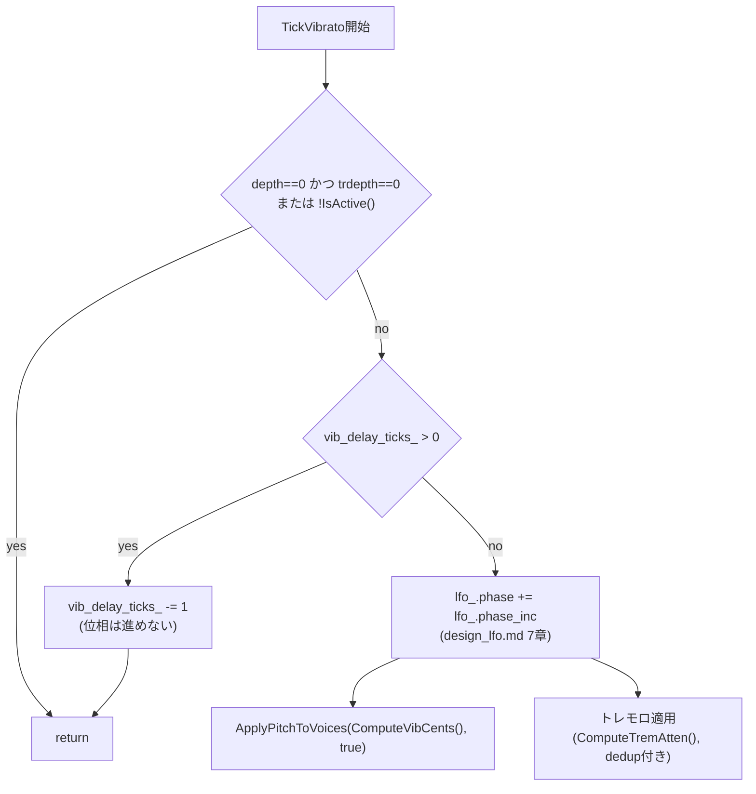

# トレモロ設計仕様（CC#92 振幅変調）

MIDI CC#92（GM2 Effects 2 Depth / Tremolo Depth）によるチャンネル単位の振幅エフェクトの設計を定義する。

トレモロの位相・レートを生成するソフトウェア LFO そのものは [design_lfo.md](design_lfo.md) が扱う。ピッチ側の変調（Pitch Bend・ビブラート）は [design_pitch_effect.md](design_pitch_effect.md) が扱う。本書は、design_lfo.md の LFO が生成する変調サンプルを、FM Total Level（TL、音量）へどう合成するか、MIDI からどう設定するかを定義する。

基本方針:

- トレモロはビブラートと同じ [design_lfo.md](design_lfo.md) のソフトウェア LFO（位相・レート）を共有する。専用のレート・遅延パラメータは持たない
- 深さは FM TL の追加減衰ステップ（0.75 dB 単位）で線形合成する。ピッチのような音程依存の変換は不要
- 音量適用経路を 1 本に統合する（MIDI Volume/Expression 由来の減衰とトレモロ由来の減衰を同じ計算で `fm_set_volume` へ）

関連: [design_lfo.md](design_lfo.md)、[design_pitch_effect.md](design_pitch_effect.md)、[design_concurrency.md](design_concurrency.md)、[spec_opn.md](spec_opn.md)

---

## 目次

1. [背景と設計判断](#1-背景と設計判断)
2. [スコープ](#2-スコープ)
3. [アーキテクチャ](#3-アーキテクチャ)
4. [データ構造](#4-データ構造)
5. [CC#92 トレモロ深さ](#5-cc92-トレモロ深さ)
6. [振幅合成](#6-振幅合成)
7. [イベント処理](#7-イベント処理)
8. [Note On / Retrigger 時の適用](#8-note-on--retrigger-時の適用)
9. [ビルド設定](#9-ビルド設定)

---

## 1. 背景と設計判断

### 1.1 本書の範囲

LFO の生成（位相・レート・ライフサイクル）は [design_lfo.md](design_lfo.md) が扱う。本書が定義するのは、その LFO が生成する位相サンプルを **どのくらいの深さで** FM TL（音量）に反映するか、という消費側の設計である。ピッチ側の消費（ビブラート）を扱う [design_pitch_effect.md](design_pitch_effect.md) とは兄弟関係にあり、同じ LFO を異なる合成先（ピッチ／振幅）に使う。

トレモロの深さは MIDI チャンネル共通（同一 ch の和音は同じ深さで鳴る）。レート・位相の共有ルールは LFO 側の設計であり、[design_lfo.md 1章](design_lfo.md#1-背景と設計判断)を参照する。チャンネル間はすべて独立する。

### 1.2 主要な設計判断

| ID | 内容 |
|----|------|
| D1 | トレモロはビブラートと同じ共有 LFO（位相・レート）を使い、専用のレート・遅延パラメータは持たない。GM/XG にトレモロ専用のレート・遅延コントローラが定義されていないため（[2.2節](#22-非対象)） |
| D2 | 深さは FM TL の追加減衰ステップ（0.75 dB 単位）で直接表現する。ピッチの `PitchCalcVibDiff` のような音程依存の変換テーブルは不要（TL 1 ステップ = 0.75 dB は全音域で一定、[6章](#6-振幅合成)） |
| D3 | 音量合成時、MIDI Volume 由来の減衰ステップ（`opn_attenuation[vol]`）とトレモロ由来の減衰ステップを加算後、`[0, 127]` にクランプしてから `fm_set_volume`（`uint8_t` 引数）へ渡す。ドライバ層の既存 API 境界は変更しない（[6.2節](#62-tl-への合成notevoicesetvolume)） |
| D4 | ビブラート遅延（`vib_delay_ticks_`、[design_pitch_effect.md 8章](design_pitch_effect.md#8-nrpn-110-ビブラート遅延)）はトレモロには適用しない。ただし位相共有の副次効果として、遅延中は位相が 0 に凍結され `sin_lut[0]=0` となるため、トレモロも遅延中は自然に無音相当（`trem_atten=0`）になる。トレモロ専用の遅延判定は持たない（[7.2節](#72-周期実行tickvibrato-の拡張)） |

---

## 2. スコープ

### 2.1 対象

- `NoteChannel`（MIDI ch 1〜16、ch 10 を除く）
- 発音中の `NoteVoice`（`activeQueue` / `holdQueue`）
- CC#92 の MIDI からの設定と、既存の Volume/Expression 経路（`fm_set_volume` / FM TL）への合成

### 2.2 非対象

| 項目 | 理由 |
|------|------|
| `RhythmChannel`（MIDI ch 10） | リズム専用。RTL/IL という別の音量体系を使い、FM TL モデルとは異なる（[spec_opn.md](spec_opn.md)） |
| `CsmVoice` | 独自の `SetVolume` 経路を持ち、CH3 複数モジュール制約下にあるため、ビブラート・PB と同様にトレモロも非対応 |
| トレモロ専用のレート・遅延コントローラ | GM/XG にトレモロ専用のレート・遅延 NRPN は定義されていない。ビブラートの共有 LFO（レート）をそのまま使い、遅延は非対応（D1・D4） |
| LFO の位相・レート生成そのもの | [design_lfo.md](design_lfo.md) を参照 |

---

## 3. アーキテクチャ



| コンポーネント | 責務 |
|----------------|------|
| `MidiChannel::effect`（`ChannelEffects`） | MIDI 論理値に `trdepth` を追加保持（[design_pitch_effect.md 4.1節](design_pitch_effect.md#41-チャンネルエフェクトvoiceh-の-channeleffects)の拡張） |
| `NoteChannel` | イベント時の状態更新、`ComputeTremAtten()` による TL ステップ変換、全発音 Voice への音量再適用 |
| `MidiEngineTask` | MIDI イベント処理。LFO の周期呼び出し（`ServiceVibratoIfDue` / `TickVibrato`）はビブラートと共通で変更不要 |
| `NoteVoice` | `SetVolume(vol, trem_atten)` に音量合成を集約 |

`NoteChannel::TickVibrato()` の早期 return 条件は、ビブラート深さとトレモロ深さの両方が 0 の場合のみ return する形に一般化されている（[design_lfo.md 7章](design_lfo.md#7-周期実行midienginetask)、[7.2節](#72-周期実行tickvibrato-の拡張)）。

FM バス書き込みについて: Core1 では `MidiEngineTask`・`CsmFrameTask` が `fm_set_*` を呼ぶが、PIO バス spinlock で直列化される（[design_concurrency.md](design_concurrency.md#5-single-writer-rule) 参照）。

---

## 4. データ構造

### 4.1 チャンネルエフェクト（`Voice.h` の `ChannelEffects` 拡張）

```cpp
struct ChannelEffects {
    int16_t pbv;          // Pitch Bend（design_pitch_effect.md）
    uint8_t pbs;
    uint8_t vbrate;
    uint8_t vbdepth;
    uint8_t vbdelay;
    uint8_t trdepth;      // 0..127 → tremolo depth（CC#92、本書）
    int8_t  coarse_tune;

    void Init();  // 既存フィールドに加え trdepth = 0
};
```

`trdepth` は既存の `ChannelEffects` に 1 フィールド追加するのみ。ピッチ側フィールドとは独立に扱う。

### 4.2 NoteVoice 側の追加状態

```cpp
// NoteVoice 私有メンバ。last_fm_vib_cents_ と対になる音量側のキャッシュ。
int16_t last_fm_trem_atten_;  // 直前に FM へ書き込んだ trem_atten（INT16_MIN=未設定）
```

`vol`（MIDI Volume 由来）と `trem_atten`（トレモロ由来）の組が直前と同じなら FM 書き込みを省略する（[6.2節](#62-tl-への合成notevoicesetvolume)）。ピッチの `allow_vib_dedup` と異なり、イベント駆動／周期実行を区別するフラグは持たない。

### 4.3 データの向き

sin LUT・位相は [design_lfo.md](design_lfo.md) が定義する生成側の資産で、`NoteChannel::ComputeTremAtten()`（本書、消費側）が参照する。dB → TL ステップの変換は音程に依存しないため、ピッチの `PitchCalcVibDiff` のような専用変換関数を必要とせず、深さそのものを TL ステップ単位で表現する（[6章](#6-振幅合成)）。音量合成（MIDI Volume 由来の減衰 + トレモロ由来の減衰）は `NoteVoice.cpp` の `SetVolume` に集約する。

---

## 5. CC#92 トレモロ深さ

| MIDI | フィールド | 値の扱い |
|------|------------|----------|
| CC#92（Effects 2 Depth / Tremolo Depth） | `trdepth` | 受信値 `val`（0〜127）をそのまま `trdepth` に格納する |

CC#1（ビブラート深さ）と同様、64 中心の相対値ではなく直接値として扱う。対応する NRPN は定義しない（[2.2節](#22-非対象)）。

---

## 6. 振幅合成

### 6.1 `ComputeTremAtten`（LFO サンプル → TL ステップ）

LFO の位相サンプル（[design_lfo.md 4章](design_lfo.md#4-波形と位相)の `index`、ビブラートと共有）を、`trdepth` に応じた符号付き TL ステップへ変換する。

```
peak_steps = (trdepth * TREMOLO_DEPTH_MAX_STEPS) / 127
trem_atten = (peak_steps * sin_lut[index]) >> 15   // 符号付き、TL ステップ単位（0.75 dB/step）
```

```cpp
int16_t NoteChannel::ComputeTremAtten() const {
    if (effect.trdepth == 0) {
        return 0;
    }
    const uint32_t index = (lfo_.phase >> 24) & 0xFFu;
    const int32_t peak_steps =
        (static_cast<int32_t>(effect.trdepth) * TREMOLO_DEPTH_MAX_STEPS) / 127;
    return static_cast<int16_t>((peak_steps * kSinLut[index]) >> 15);
}
```

`ComputeVibCents()`（[design_pitch_effect.md 7.2節](design_pitch_effect.md#72-セント変換)）と同じ形の関数だが、ビブラート遅延のゲートは持たない（D4、位相凍結による副次効果で足りるため）。

### 6.2 TL への合成（`NoteVoice::SetVolume`）

MIDI Volume/Expression/Velocity 由来の減衰ステップ（`opn_attenuation[vol]`、[spec_opn.md](spec_opn.md#tl)）とトレモロ由来の減衰ステップを加算し、`fm_set_volume` の引数範囲 `[0, 127]`（`uint8_t`）にクランプする。

```cpp
void NoteVoice::SetVolume(int vol, int16_t trem_atten) {
    if (vol < 0) return;
    if (volume == vol && trem_atten == last_fm_trem_atten_) {
        return;
    }
    const int32_t combined =
        static_cast<int32_t>(opn_attenuation[vol]) + trem_atten;
    const uint8_t clamped = static_cast<uint8_t>(
        combined < 0 ? 0 : (combined > 127 ? 127 : combined));
    module.fm_set_volume(fm_ch, bk_program, clamped);
    volume = vol;
    last_fm_trem_atten_ = trem_atten;
}
```

以降、`OpnBase::fm_set_volume` 内の既存クランプ（音色テーブルの基準 TL に加算後、`0x7f` で飽和。[spec_opn.md](spec_opn.md#midi値からtl追加減衰への変換)）がそのまま働く。トレモロ側で追加のクランプ処理をドライバ層に足す必要はない。

`vol` と `trem_atten` の組が変化した場合のみ書き込む dedup を**無条件**で行う。ピッチの `allow_vib_dedup`（[design_pitch_effect.md 9.1節](design_pitch_effect.md#91-合成順序と-applypitch1-voice)）はイベント駆動呼び出しでフラグを立てないが、これは `ApplyPitch` の dedup 判定が `vib_cents` だけを見ており、同時に変化しうる `pbv`/`coarse_tune` を見落とすためである。音量合成にはそのような「見落とされる別入力」が存在しない（`bk_program` 由来の TL 変化は `SetProgram` が `volume = -1` を立てて別途無効化する、既存の仕組みのまま）ため、`SetVolume` の dedup は常時有効にできる。フラグは持たない。

---

## 7. イベント処理

いずれも `MidiEngineTask`（Core1）内。

| イベント | 状態更新 | 即時適用 |
|----------|----------|----------|
| CC#92 | `trdepth` | active + hold へ即時 1 回 `ApplyVolumeToVoices()` |
| CC#7 / CC#11（Volume / Expression） | `volume` / `expression`（既存） | active + hold へ `ApplyVolumeToVoices()`。トレモロの `trem_atten` も毎回 `ComputeTremAtten()` で再計算し、瞬断させない |
| ResetAllController | `effect.Init()` で `trdepth = 0` | active + hold へ再適用 |
| 周期実行（`TickVibrato`） | — | `ComputeTremAtten()` を計算し、直前と異なれば FM 書き込み（[7.2節](#72-周期実行tickvibrato-の拡張)） |

### 7.1 `ApplyVolumeToVoices` の変更

既存の `NoteChannel::ApplyVolumeToVoices()` は Voice ごとの velocity から `EffectiveVolume()` を都度計算する。`trem_atten` は velocity に依存しないため、チャンネルで 1 回計算して全 Voice で共有する。

```cpp
void NoteChannel::ApplyVolumeToVoices() {
    const int16_t trem_atten = ComputeTremAtten();
    for (auto& voice : activeQueue) {
        voice->SetVolume(EffectiveVolume(voice->GetVelocity()), trem_atten);
    }
    for (auto& voice : holdQueue) {
        voice->SetVolume(EffectiveVolume(voice->GetVelocity()), trem_atten);
    }
}
```

### 7.2 周期実行（`TickVibrato`）の拡張

`NoteChannel::TickVibrato()` の早期 return 条件を、ビブラート深さとトレモロ深さの両方を見るように一般化する（[3章](#3-アーキテクチャ)の design_lfo.md への影響を参照）。



ビブラート遅延中（`vib_delay_ticks_ > 0`）は位相そのものが進まない。無音からの Note On で位相は 0 にリセットされ（[design_lfo.md 6章](design_lfo.md#6-位相ライフサイクル)）、`sin_lut[0]=0` であるため、`ComputeTremAtten()` も遅延中は自然に 0 を返す（D4）。トレモロ専用の遅延判定を別途持つ必要はない。

トレモロが有効でビブラートが無効（`vbdepth==0` かつ `trdepth>0`）なチャンネルでも、`ComputeVibCents()` は 0 を返し続け、`NoteVoice::ApplyPitch` 側の dedup により無駄な FM 書き込みは発生しない。

---

## 8. Note On / Retrigger 時の適用

KeyOn 時点でトレモロ込みの音量に揃える。`NoteChannel` が `ComputeTremAtten()` を計算して `NoteOn` / `TryRetrigger` に渡す（[design_pitch_effect.md 8章](design_pitch_effect.md#8-nrpn-110-ビブラート遅延)の `vib_cents` の扱いと同じパターン）。

```cpp
// NoteChannel::NoteOn（CSM モード除く）
const int16_t vib_cents  = ComputeVibCents();
const int16_t trem_atten = ComputeTremAtten();
voice->NoteOn(..., vib_cents, trem_atten);   // または TryRetrigger
```

CSM モード（`bCsmVoiceMode`）は `vib_cents=0` と同様に `trem_atten=0` を渡す。`CsmVoice` は独自の `SetVolume` 経路を持ち、トレモロは適用しない（[2.2節](#22-非対象)）。

---

## 9. ビルド設定

`src/app/config.h` にトレモロ深さ関連定数を追加する:

```c
#define TREMOLO_DEPTH_MAX_STEPS      8   // trdepth=127 のときの最大追加減衰（0.75dB/step、約6dB）
```

LFO のレート・周期関連定数（`VIBRATO_PERIOD_MS` 等）は [design_lfo.md 9章](design_lfo.md#9-ビルド設定)を参照。トレモロ専用のレート・遅延定数は持たない（D1・D4）。
