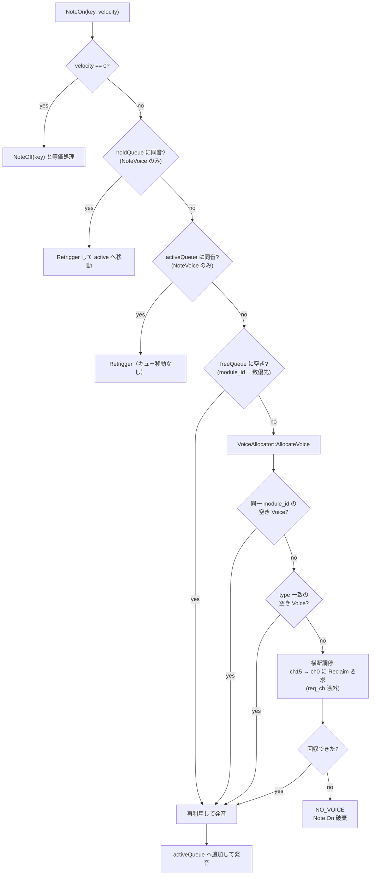

# 動的ボイスアロケーション設計仕様

`VoiceAllocator` と `NoteChannel` による Voice（発音単位）の動的割り当てを定義する。実装は `src/synth/voice/VoiceAllocator.cpp` と `src/synth/channel/NoteChannel.cpp`。

## 目次

1. [前提](#1-前提)
2. [目的](#2-目的)
3. [システム構成](#3-システム構成)
4. [動作フェーズ](#4-動作フェーズ)
5. [調停ポリシー](#5-調停ポリシー)
6. [状態と不変条件](#6-状態と不変条件)
7. [イベント処理](#7-イベント処理)
8. [検証観点](#8-検証観点)
9. [実装時の注意](#9-実装時の注意)

---

## 1. 前提

この仕様の前提は次の 3 点である。

1. 起動直後、全 Voice はどの MIDI チャンネルにも割り当てられていない
2. 全 Voice インスタンスは VoiceAllocator が所有している
3. 各 MIDI Channel の Active/Hold/Free キューは初期状態で空である

したがって、最初の Note On は必ず VoiceAllocator から Voice を取得し、要求元チャンネルの Active キューに追加して開始する。

## 2. 目的

FM 音源における音色変更コストを抑えるため、同一チャンネル内再利用を優先しつつ、Voice 枯渇時には VoiceAllocator がチャンネル横断で調停する手順を明確化する。

割り当ての優先順位は次の 3 段階とする。

1. 同一チャンネル内の再利用
2. 同一 FM 音源（`module_id` 一致）の空き Voice
3. それ以外の空き Voice

## 3. システム構成

### 3.1 VoiceAllocator

- 全 Voice の所有権を持つ唯一の管理主体
- 未割り当て Voice プールを保持
- NoteChannel からの割り当て要求を受け付け
- 必要時にチャンネル横断調停を実行

### 3.2 NoteChannel (ch=0..15)

各チャンネルは割り当て済み Voice だけを管理する。

| キュー | 内容 |
|--------|------|
| `activeQueue[ch]` | 発音中 Voice |
| `holdQueue[ch]` | Hold1（CC64）により保持中の Voice |
| `freeQueue[ch]` | 同一チャンネル内で再利用可能な Voice |

初期状態では 3 キューはすべて空。

## 4. 動作フェーズ

### 4.1 フェーズ A: 初期割り当て

1. `NoteChannel::NoteOn(key, velocity)` を受信
2. 要求元チャンネルの freeQueue/holdQueue/activeQueue を探索
3. 初期状態では全キュー空なのでローカル再利用不可
4. `VoiceAllocator::AllocateVoice(channel, mid, type)` へ要求
5. 取得した Voice を Active へ追加して発音開始

### 4.2 フェーズ B: 通常運用

Note On ごとに以下を実施する。

1. 同一チャンネル内再利用を優先する。優先順は holdQueue の同音再利用（NoteVoice のみ）、activeQueue の同音再利用（NoteVoice のみ）、freeQueue からの再利用（`module_id` 一致優先）の順
2. 失敗時のみ `VoiceAllocator::AllocateVoice()` を呼び出す
3. Allocator 内では `module_id` 一致を優先探索し、一致がなければ type 一致の空き Voice を割り当てる
4. 未割り当ての空きが確保できた場合は、横断調停を行わない
5. 未割り当ての空きが尽きた場合のみ、横断調停へ進む
6. Note Off / CC64 により Voice は hold/free へ遷移する。ローカル free が育つほど Allocator への依存は減る

### 4.3 フェーズ C: 枯渇と調停開始

以下を満たすと調停フェーズに入る。

1. 要求元チャンネル内で再割り当て不能
2. VoiceAllocator の未割り当て空き Voice が枯渇している

この時点で VoiceAllocator はチャンネル横断調停を開始する。

## 5. 調停ポリシー

要求元チャンネルを req_ch とする。

1. 調停順序は固定で ch=15 → ch=0 とする
2. 実装では `AddReclaimTarget()` を ch=0..15 の昇順で登録し、`AllocateVoice()` で逆順走査する
3. この登録順序が崩れる変更は禁止する。変更時は調停順序の回帰試験を必須とする
4. req_ch は調停対象から除外する
5. 各チャンネルに対し `IVoiceReclaimable::Reclaim(mid, type)` を 1 件ずつ要求する
6. `Reclaim` は同一チャンネル内で freeQueue（未使用・KeyOff 不要）、holdQueue 先頭（最古のサステイン保持 Voice を KeyOff して奪取）、activeQueue 先頭（最古の発音中 Voice を KeyOff して奪取）の順に Voice を返す
7. 回収できた時点で req_ch に再割り当てする
8. 全チャンネル走査後も回収できなければ失敗とする

失敗時は NO_VOICE を返し、当該 Note On は破棄する。

## 6. 状態と不変条件

Voice の状態は ACTIVE / HOLD / FREE の 3 つ。補助属性として `midi_ch`, `note_no`, `note_on_count`, `module_id` を持つ。

不変条件:

- `note_on_count >= 0`
- HOLD/FREE では `note_on_count == 0`
- ACTIVE では `note_on_count >= 1`
- CsmVoice は同音再利用（Retrigger）の対象外とする

## 7. イベント処理

### 7.1 Note On

### 7.2 Note Off

1. activeQueue から一致 Voice を取得する
2. `note_on_count` を減算する
3. 0 より大きければ発音を継続する
4. 0 なら Hold1 状態に応じて holdQueue（Hold1 ON）または freeQueue（Hold1 OFF、KeyOff 実行）へ遷移する

### 7.3 CC64 (Hold1)

1. ON 中は Note Off 済み Voice を holdQueue へ退避する
2. OFF 遷移時は holdQueue を freeQueue へ移動する

## 8. 検証観点

1. 起動直後の最初の Note On が必ず Allocator 経由になる
2. チャンネルローカルの free が空でも動作継続できる
3. 未割り当て空き Voice 枯渇時のみ横断調停が開始される
4. 調停順序が ch=15 → ch=0 で安定している
5. CsmVoice が同音再利用経路に入らない
6. `module_id` 一致がない場合に未割り当ての他候補へフォールバックできる
7. 全走査失敗で NO_VOICE になる

## 9. 実装時の注意

- 本実装のチャンネル番号は 0..15 前提で扱う
- 調停対象から req_ch を除外する条件を必ず保持する
- `note_on_count` の下限ガードを省略しない
- キュー操作はクリティカルセクションで保護する
- `AddReclaimTarget()` の登録順は ch 昇順を維持し、調停順序 ch=15 → ch=0 を不変に保つ
- 同音再利用で Retrigger を使うのは NoteVoice のみに限定する
