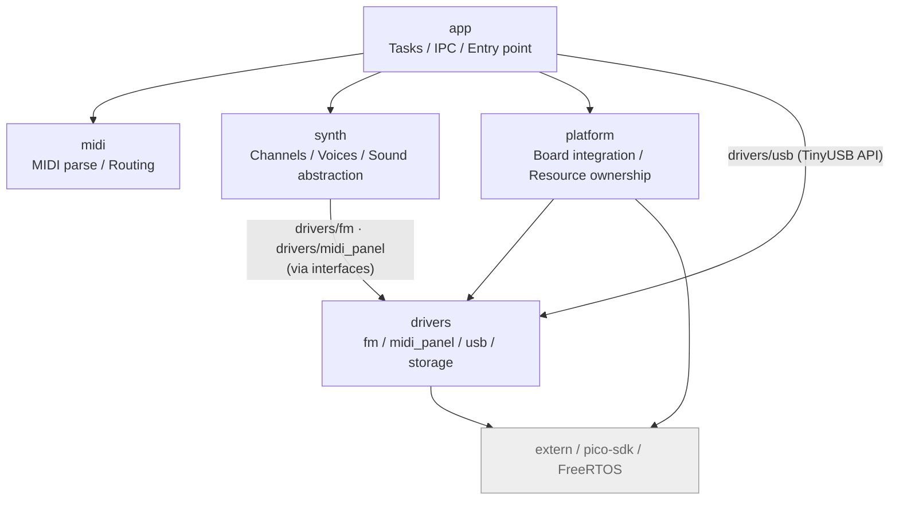

# ドメイン図

`src/` 配下の 5 パッケージ（`app` / `midi` / `synth` / `platform` / `drivers`）をドメインとみなし、依存関係と各ドメインの主要クラスを示す。レイヤの役割と依存制約の背景は [architecture.md](../architecture.md) を参照。

## 全体ドメインチャート

依存制約（[AGENTS.md](../../AGENTS.md) と同一）:

- `app` → `midi`, `synth`, `platform`, `drivers/usb`
- `synth` → `drivers/fm`, `drivers/midi_panel`（インターフェース経由）
- `platform` → `drivers`, `extern`, pico-sdk
- `drivers` → `extern`, pico-sdk（`platform` には依存しない）
- `midi` → pico-sdk・FreeRTOS・ドライバに非依存

## 各ドメインのクラス図

| ドキュメント | 内容 |
|---|---|
| [domain_app.md](domain_app.md) | タスク・IPC・デバッガ・設定 |
| [domain_midi.md](domain_midi.md) | MidiMessage / MidiParser / MidiRoutingPolicy |
| [domain_synth.md](domain_synth.md) | MidiProcessor / チャンネル / Voice / アロケータ |
| [domain_platform.md](domain_platform.md) | 初期化 / VolumeController / ISR |
| [domain_drivers.md](domain_drivers.md) | OpnBase 系 / opn_piolib / MIDI パネル / USB |
