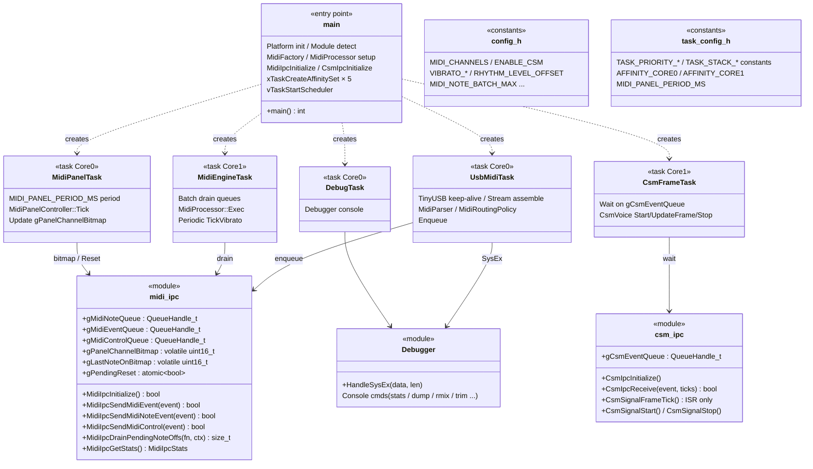

# app ドメイン

アプリケーションレイヤ（`src/app/`）。エントリポイント、FreeRTOS タスク、Core 間 IPC、デバッガを持つ。ハードウェアは直接操作せず、`Platform::*` と `synth` の API のみ使用する。

関連設計書: [design_concurrency.md](../design_concurrency.md)、[design_midi_message.md](../design_midi_message.md)、[design_csm_frame.md](../design_csm_frame.md)

## タスクと IPC

app ドメインの中心はクラスではなく、タスク関数と IPC モジュールである。

| 要素 | ファイル | 責務 |
|---|---|---|
| `main` | `main.cpp` | 初期化・マスターボリューム復帰・タスク生成・スケジューラ起動 |
| `midi_ipc` | `midi_ipc.h/cpp` | MIDI 用 Core 間キュー、NoteOff 保護、統計 |
| `csm_ipc` | `csm_ipc.h/cpp` | CSM フレームイベントキューとシグナル API |
| 各タスク | `*_task.h/cpp` | [design_concurrency.md](../design_concurrency.md) のタスク構成を実装 |
| `Debugger` | `debugger.h/cpp` | 対話型デバッガ・独自 SysEx 処理 |
| `config.h` / `task_config.h` | — | 実行時ポリシー定数とタスク設定の唯一の定義元 |
