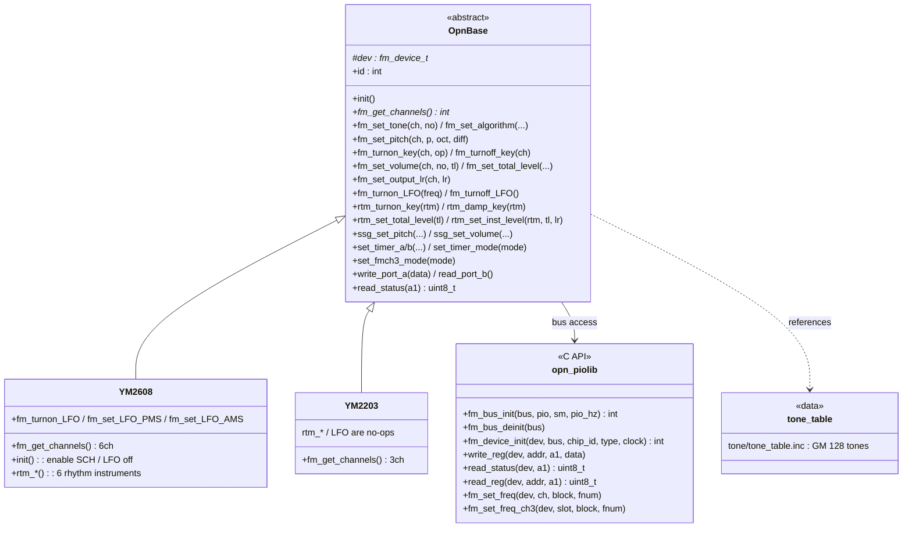
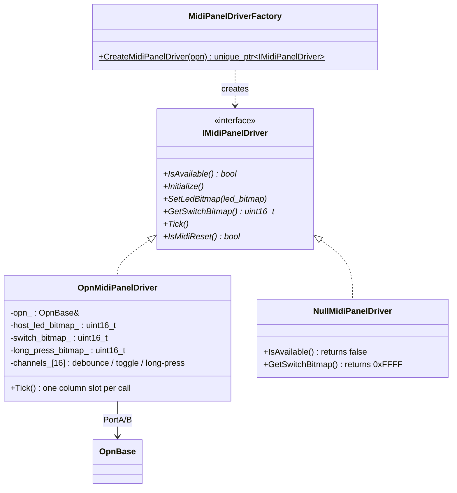

# drivers ドメイン

低レベルデバイスドライバレイヤ（`src/drivers/`）。個別 IC・バス・周辺機能を操作する再利用可能な部品を格納する。ボード固有のピン割り当て・初期化順・所有ポリシーは持たない（`platform` 側の責務）。`platform` に依存しない。

## drivers/fm — FM 音源ドライバ

`opn_piolib` は PIO0 上の単一ステートマシン（`fm_bus`）とスピンロックで FM バスのトランザクション境界を保証する。詳細は [piolib_spec.md](../../src/drivers/fm/opn_piolib/doc/piolib_spec.md)。

## drivers/midi_panel — MIDI パネルドライバ

設計は [design_midi_panel.md](../design_midi_panel.md)、ハードウェア仕様は [spec_midi_panel.md](../spec_midi_panel.md)。

## drivers/usb / drivers/storage

クラスを持たない設定・コールバック実装のみのパッケージ。

| パッケージ | ファイル | 責務 |
|---|---|---|
| `usb/` | `tusb_config.h` | TinyUSB 設定（USB MIDI デバイスクラス、OSAL モード） |
| `usb/` | `usb_descriptors.cpp` | USB ディスクリプタ（VID/PID・string） |
| `storage/` | `hw_config.c` | no-OS-FatFS 向け SD カード SPI ピン設定コールバック |

TinyUSB の `tud_task()` 呼び出しと MIDI ストリーム読み出しは `app/UsbMidiTask` の責務であり、ドライバ層は設定とディスクリプタのみを提供する。
