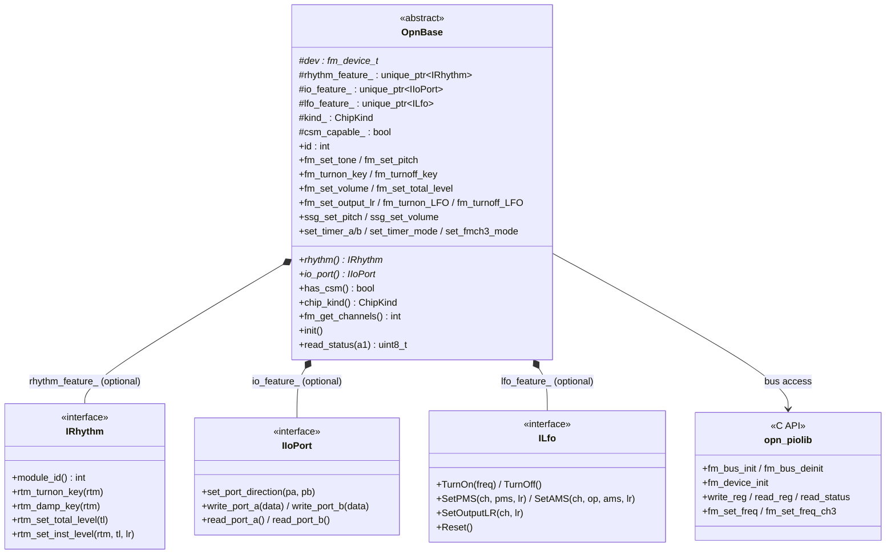
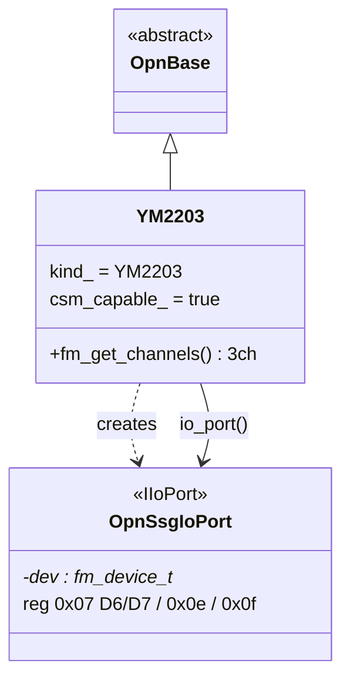
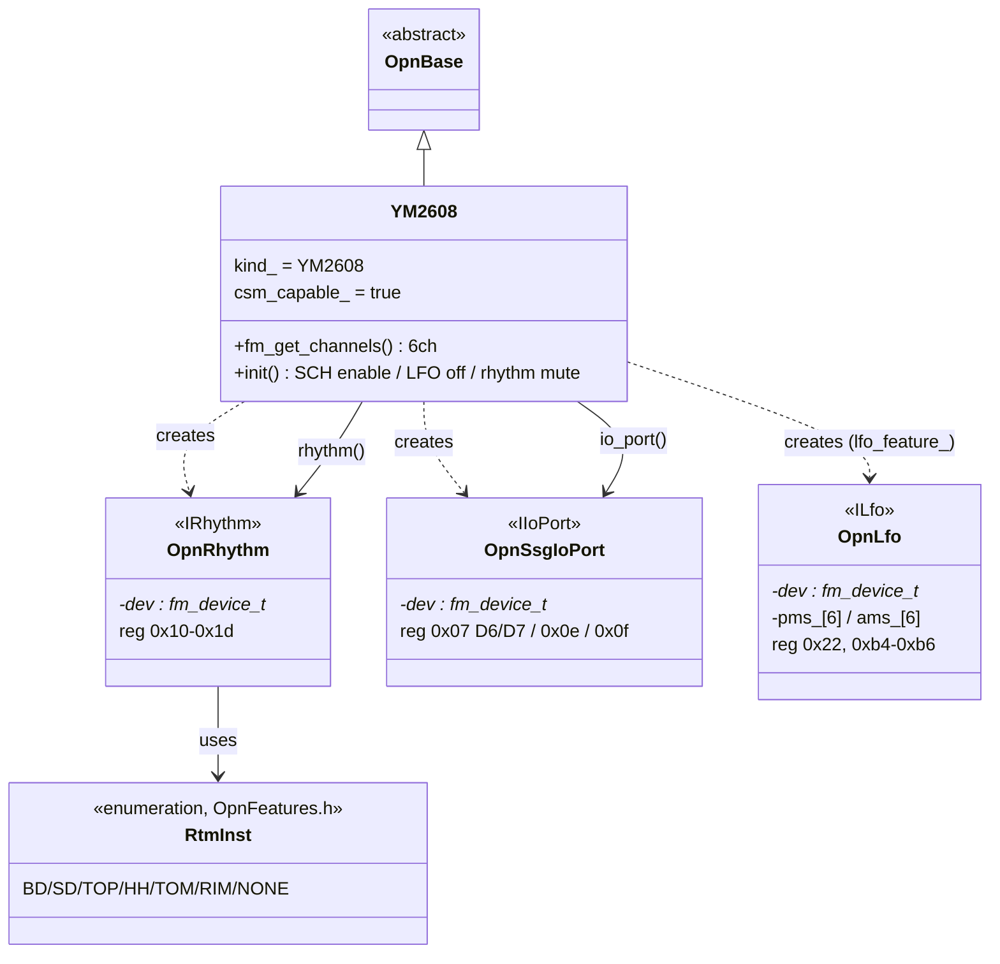
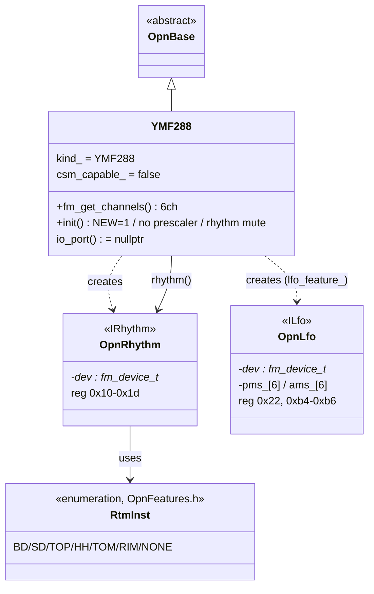
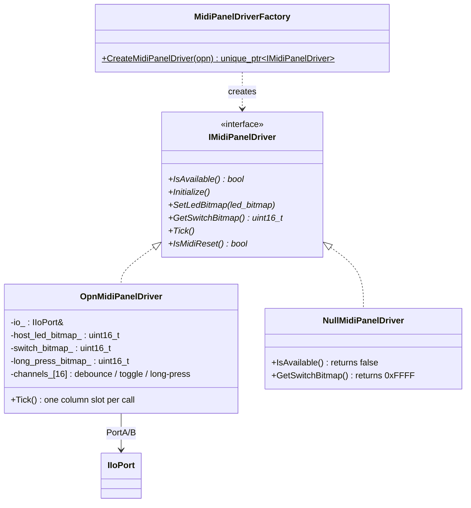

# drivers ドメイン

低レベルデバイスドライバレイヤ（`src/drivers/`）。個別 IC・バス・周辺機能を操作する再利用可能な部品を格納する。ボード固有のピン割り当て・初期化順・所有ポリシーは持たない（`platform` 側の責務）。`platform` に依存しない。

## drivers/fm — FM 音源ドライバ

### 共通構造

`OpnBase` が FM/SSG/Timer/Status の共通実装を持つ。オプション機能（リズム・I/O ポート・LFO）はフィーチャとしてコンポジションで保持する。リズム・I/O ポートは `rhythm()` / `io_port()` で能力を確認する。LFO は `fm_turnon_LFO` 等の OpnBase メソッドが `lfo_feature_` へ無条件で転送し（null なら no-op）、専用の照会アクセサは持たない。

```mermaid
classDiagram
    class OpnBase {
        <<abstract>>
        #dev : fm_device_t*
        #rhythm_feature_ : unique_ptr~IRhythm~
        #io_feature_ : unique_ptr~IIoPort~
        #lfo_feature_ : unique_ptr~ILfo~
        #kind_ : ChipKind
        #csm_capable_ : bool
        +id : int
        +rhythm() IRhythm*
        +io_port() IIoPort*
        +has_csm() bool
        +chip_kind() ChipKind
        +fm_get_channels() int
        +init()
        +fm_set_tone / fm_set_pitch
        +fm_turnon_key / fm_turnoff_key
        +fm_set_volume / fm_set_total_level
        +fm_set_output_lr / fm_turnon_LFO / fm_turnoff_LFO
        +ssg_set_pitch / ssg_set_volume
        +set_timer_a/b / set_timer_mode / set_fmch3_mode
        +read_status(a1) uint8_t
    }

    class IRhythm {
        <<interface>>
        +module_id() int
        +rtm_turnon_key(rtm)
        +rtm_damp_key(rtm)
        +rtm_set_total_level(tl)
        +rtm_set_inst_level(rtm, tl, lr)
    }

    class IIoPort {
        <<interface>>
        +set_port_direction(pa, pb)
        +write_port_a(data) / write_port_b(data)
        +read_port_a() / read_port_b()
    }

    class ILfo {
        <<interface>>
        +TurnOn(freq) / TurnOff()
        +SetPMS(ch, pms, lr) / SetAMS(ch, op, ams, lr)
        +SetOutputLR(ch, lr)
        +Reset()
    }

    class opn_piolib {
        <<C API>>
        +fm_bus_init / fm_bus_deinit
        +fm_device_init
        +write_reg / read_reg / read_status
        +fm_set_freq / fm_set_freq_ch3
    }

    OpnBase *-- IRhythm : rhythm_feature_ (optional)
    OpnBase *-- IIoPort : io_feature_ (optional)
    OpnBase *-- ILfo : lfo_feature_ (optional)
    OpnBase --> opn_piolib : bus access
```

### YM2203 (OPN)

3ch FM + SSG。リズムなし、I/O ポートあり、CSM あり。

```mermaid
classDiagram
    class OpnBase {
        <<abstract>>
    }

    class YM2203 {
        +fm_get_channels() 3ch
        kind_ = YM2203
        csm_capable_ = true
    }

    class OpnSsgIoPort {
        <<IIoPort>>
        -dev : fm_device_t*
        reg 0x07 D6/D7 / 0x0e / 0x0f
    }

    OpnBase <|-- YM2203
    YM2203 ..> OpnSsgIoPort : creates
    YM2203 --> OpnSsgIoPort : io_port()
```

### YM2608 (OPNA)

6ch FM + SSG + リズム + I/O ポート + CSM + LFO。

```mermaid
classDiagram
    class OpnBase {
        <<abstract>>
    }

    class YM2608 {
        +fm_get_channels() 6ch
        +init() SCH enable / LFO off / rhythm mute
        kind_ = YM2608
        csm_capable_ = true
    }

    class RtmInst {
        <<enumeration, OpnFeatures.h>>
        BD/SD/TOP/HH/TOM/RIM/NONE
    }

    class OpnRhythm {
        <<IRhythm>>
        -dev : fm_device_t*
        reg 0x10-0x1d
    }

    class OpnSsgIoPort {
        <<IIoPort>>
        -dev : fm_device_t*
        reg 0x07 D6/D7 / 0x0e / 0x0f
    }

    class OpnLfo {
        <<ILfo>>
        -dev : fm_device_t*
        -pms_[6] / ams_[6]
        reg 0x22, 0xb4-0xb6
    }

    OpnBase <|-- YM2608
    YM2608 ..> OpnRhythm : creates
    YM2608 ..> OpnSsgIoPort : creates
    YM2608 ..> OpnLfo : creates (lfo_feature_)
    YM2608 --> OpnRhythm : rhythm()
    YM2608 --> OpnSsgIoPort : io_port()
    OpnRhythm --> RtmInst : uses
```

### YMF288 (OPN3-L)

6ch FM + SSG + リズム + LFO。I/O ポートなし、CSM なし。

```mermaid
classDiagram
    class OpnBase {
        <<abstract>>
    }

    class YMF288 {
        +fm_get_channels() 6ch
        +init() NEW=1 / no prescaler / rhythm mute
        kind_ = YMF288
        csm_capable_ = false
        io_port() = nullptr
    }

    class RtmInst {
        <<enumeration, OpnFeatures.h>>
        BD/SD/TOP/HH/TOM/RIM/NONE
    }

    class OpnRhythm {
        <<IRhythm>>
        -dev : fm_device_t*
        reg 0x10-0x1d
    }

    class OpnLfo {
        <<ILfo>>
        -dev : fm_device_t*
        -pms_[6] / ams_[6]
        reg 0x22, 0xb4-0xb6
    }

    OpnBase <|-- YMF288
    YMF288 ..> OpnRhythm : creates
    YMF288 ..> OpnLfo : creates (lfo_feature_)
    YMF288 --> OpnRhythm : rhythm()
    OpnRhythm --> RtmInst : uses
```

### チップ別フィーチャ一覧

| チップ | `rhythm()` | `io_port()` | `has_csm()` | FM ch |
|--------|-----------|------------|-----------------|-------|
| YM2203 | nullptr   | OpnSsgIoPort | true  | 3 |
| YM2608 | OpnRhythm | OpnSsgIoPort | true  | 6 |
| YMF288 | OpnRhythm | nullptr      | false | 6 |

`opn_piolib` は PIO0 上の単一ステートマシン（`fm_bus`）とスピンロックで FM バスのトランザクション境界を保証する。詳細は [piolib_spec.md](../../src/drivers/fm/opn_piolib/doc/piolib_spec.md)。

## drivers/midi_panel — MIDI パネルドライバ

```mermaid
classDiagram
    class IMidiPanelDriver {
        <<interface>>
        +IsAvailable() bool*
        +Initialize()*
        +SetLedBitmap(led_bitmap)*
        +GetSwitchBitmap() uint16_t*
        +Tick()*
        +IsMidiReset() bool*
    }

    class OpnMidiPanelDriver {
        -io_ : IIoPort&
        -host_led_bitmap_ : uint16_t
        -switch_bitmap_ : uint16_t
        -long_press_bitmap_ : uint16_t
        -channels_[16] : debounce / toggle / long-press
        +Tick()  one column slot per call
    }

    class NullMidiPanelDriver {
        +IsAvailable() returns false
        +GetSwitchBitmap() returns 0xFFFF
    }

    class MidiPanelDriverFactory {
        +CreateMidiPanelDriver(opn) unique_ptr~IMidiPanelDriver~$
    }

    IMidiPanelDriver <|.. OpnMidiPanelDriver
    IMidiPanelDriver <|.. NullMidiPanelDriver
    MidiPanelDriverFactory ..> IMidiPanelDriver : creates
    OpnMidiPanelDriver --> IIoPort : PortA/B
```

設計は [design_midi_panel.md](../design_midi_panel.md)、ハードウェア仕様は [spec_midi_panel.md](../spec_midi_panel.md)。

## drivers/usb / drivers/storage

クラスを持たない設定・コールバック実装のみのパッケージ。

| パッケージ | ファイル | 責務 |
|---|---|---|
| `usb/` | `tusb_config.h` | TinyUSB 設定（USB MIDI デバイスクラス、OSAL モード） |
| `usb/` | `usb_descriptors.cpp` | USB ディスクリプタ（VID/PID・string） |
| `storage/` | `hw_config.c` | no-OS-FatFS 向け SD カード SPI ピン設定コールバック |

TinyUSB の `tud_task()` 呼び出しと MIDI ストリーム読み出しは `app/UsbMidiTask` の責務であり、ドライバ層は設定とディスクリプタのみを提供する。
