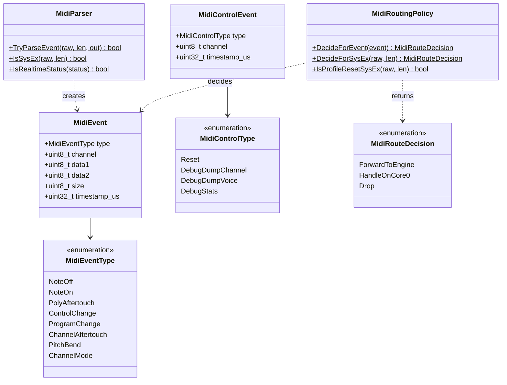

# midi ドメイン

MIDI バイト列の解釈と転送先決定を担うレイヤ（`src/midi/`）。pico-sdk・FreeRTOS・ドライバに依存せず、静的メソッドと固定長構造体のみで構成する。設計は [design_midi_message.md](../design_midi_message.md) を参照。

| 要素 | ファイル | 責務 |
|---|---|---|
| `MidiEvent` / `MidiControlEvent` | `MidiMessage.h` | Core 間転送用の固定長イベント |
| `MidiParser` | `MidiParser.h/cpp` | バイト列 → `MidiEvent` 変換、SysEx / Realtime 判定 |
| `MidiRoutingPolicy` | `MidiRoutingPolicy.h/cpp` | 転送先（Engine / Core0 / Drop）の決定 |
