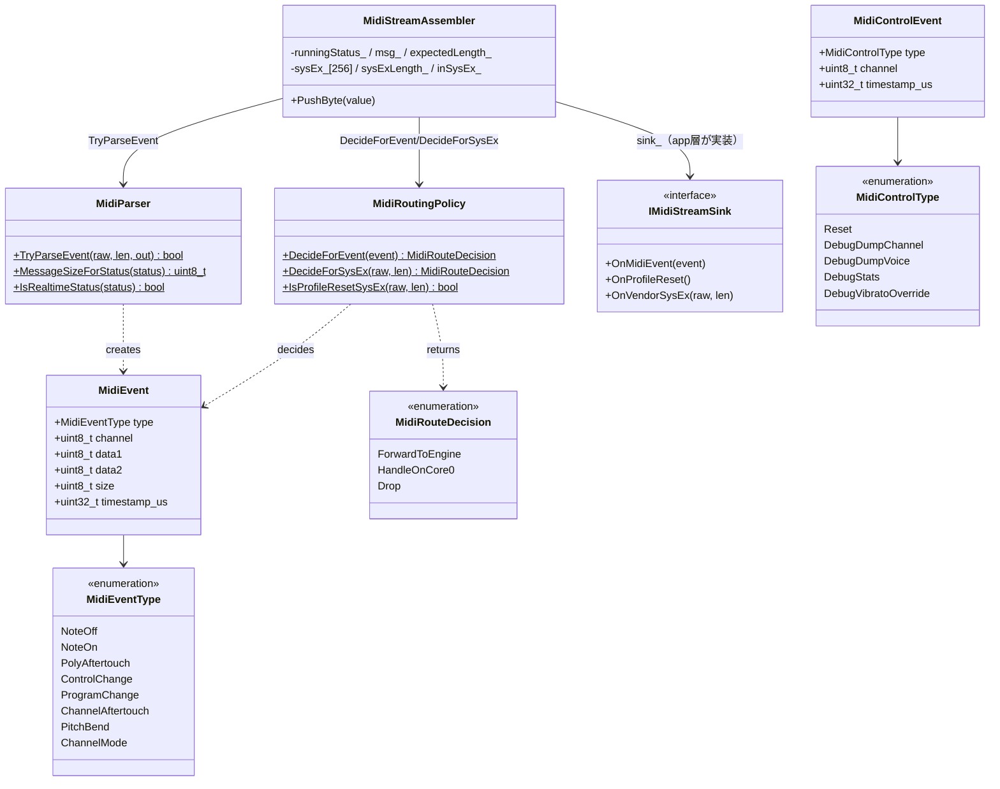

# midi ドメイン

MIDI バイト列の解釈と転送先決定を担うレイヤ（`src/midi/`）。pico-sdk・FreeRTOS・ドライバに依存しない。`MidiParser`/`MidiRoutingPolicy` は静的メソッドのみ、`MidiStreamAssembler` はバイトストリームの状態（runningStatus・SysExバッファ）を持つインスタンスクラス。設計は [design_midi_message.md](../design_midi_message.md) を参照。

```mermaid
classDiagram
    class MidiEventType {
        <<enumeration>>
        NoteOff
        NoteOn
        PolyAftertouch
        ControlChange
        ProgramChange
        ChannelAftertouch
        PitchBend
        ChannelMode
    }

    class MidiEvent {
        +MidiEventType type
        +uint8_t channel
        +uint8_t data1
        +uint8_t data2
        +uint8_t size
        +uint32_t timestamp_us
    }

    class MidiParser {
        +TryParseEvent(raw, len, out) bool$
        +MessageSizeForStatus(status) uint8_t$
        +IsRealtimeStatus(status) bool$
    }

    class MidiRouteDecision {
        <<enumeration>>
        ForwardToEngine
        HandleOnCore0
        Drop
    }

    class MidiRoutingPolicy {
        +DecideForEvent(event) MidiRouteDecision$
        +DecideForSysEx(raw, len) MidiRouteDecision$
        +IsProfileResetSysEx(raw, len) bool$
    }

    class MidiControlType {
        <<enumeration>>
        Reset
        DebugDumpChannel
        DebugDumpVoice
        DebugStats
        DebugVibratoOverride
    }

    class MidiControlEvent {
        +MidiControlType type
        +uint8_t channel
        +uint32_t timestamp_us
    }

    class IMidiStreamSink {
        <<interface>>
        +OnMidiEvent(event)
        +OnProfileReset()
        +OnVendorSysEx(raw, len)
    }

    class MidiStreamAssembler {
        -runningStatus_ / msg_ / expectedLength_
        -sysEx_[256] / sysExLength_ / inSysEx_
        +PushByte(value)
    }

    MidiEvent --> MidiEventType
    MidiControlEvent --> MidiControlType
    MidiParser ..> MidiEvent : creates
    MidiRoutingPolicy ..> MidiEvent : decides
    MidiRoutingPolicy ..> MidiRouteDecision : returns
    MidiStreamAssembler --> MidiParser : TryParseEvent
    MidiStreamAssembler --> MidiRoutingPolicy : DecideForEvent/DecideForSysEx
    MidiStreamAssembler --> IMidiStreamSink : sink_（app層が実装）
```

| 要素 | ファイル | 責務 |
|---|---|---|
| `MidiEvent` / `MidiControlEvent` | `MidiMessage.h` | Core 間転送用の固定長イベント |
| `MidiParser` | `MidiParser.h/cpp` | バイト列 → `MidiEvent` 変換、SysEx / Realtime 判定 |
| `MidiRoutingPolicy` | `MidiRoutingPolicy.h/cpp` | 転送先（Engine / Core0 / Drop）の決定 |
| `MidiStreamAssembler` / `IMidiStreamSink` | `MidiStreamAssembler.h/cpp` | USBバイトストリームの組立（runningStatus・SysEx）。確定したイベント/SysExは`IMidiStreamSink`経由でapp層（`UsbMidiTask`）へ通知 |
