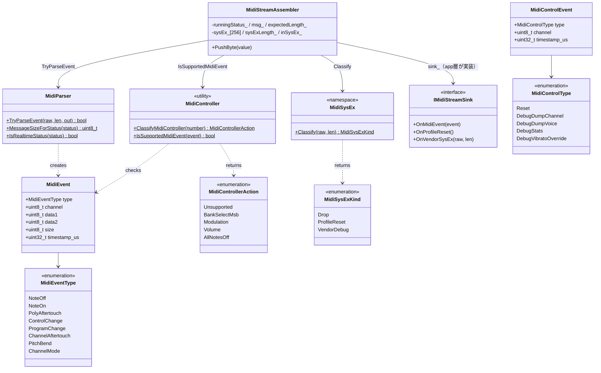

# midi ドメイン

MIDI バイト列の解釈、対応 Controller の分類、SysEx 分類を担うレイヤ（`src/midi/`）。pico-sdk・FreeRTOS・ドライバに依存しない。`MidiController` は Core0 の転送判定と Core1 の実行で共有する純粋な意味定義、`MidiStreamAssembler` はバイトストリームの状態（runningStatus・SysExバッファ）を持つインスタンスクラス。設計は [design_midi_message.md](../design_midi_message.md) を参照。

```mermaid
classDiagram
    class MidiEventType {
        <<enumeration>>
        NoteOff
        NoteOn
        PolyAftertouch
        ControlChange
        ProgramChange
        ChannelAftertouch
        PitchBend
        ChannelMode
    }

    class MidiEvent {
        +MidiEventType type
        +uint8_t channel
        +uint8_t data1
        +uint8_t data2
        +uint8_t size
        +uint32_t timestamp_us
    }

    class MidiParser {
        +TryParseEvent(raw, len, out) bool$
        +MessageSizeForStatus(status) uint8_t$
        +IsRealtimeStatus(status) bool$
    }

    class MidiControllerAction {
        <<enumeration>>
        Unsupported
        BankSelectMsb
        Modulation
        Volume
        AllNotesOff
    }

    class MidiController {
        <<utility>>
        +ClassifyMidiController(number) MidiControllerAction$
        +IsSupportedMidiEvent(event) bool$
    }

    class MidiSysExKind {
        <<enumeration>>
        Drop
        ProfileReset
        VendorDebug
    }

    class MidiSysEx {
        <<namespace>>
        +Classify(raw, len) MidiSysExKind$
    }

    class MidiControlType {
        <<enumeration>>
        Reset
        DebugDumpChannel
        DebugDumpVoice
        DebugStats
        DebugVibratoOverride
    }

    class MidiControlEvent {
        +MidiControlType type
        +uint8_t channel
        +uint32_t timestamp_us
    }

    class IMidiStreamSink {
        <<interface>>
        +OnMidiEvent(event)
        +OnProfileReset()
        +OnVendorSysEx(raw, len)
    }

    class MidiStreamAssembler {
        -runningStatus_ / msg_ / expectedLength_
        -sysEx_[256] / sysExLength_ / inSysEx_
        +PushByte(value)
    }

    MidiEvent --> MidiEventType
    MidiControlEvent --> MidiControlType
    MidiParser ..> MidiEvent : creates
    MidiController ..> MidiEvent : checks
    MidiController ..> MidiControllerAction : returns
    MidiSysEx ..> MidiSysExKind : returns
    MidiStreamAssembler --> MidiParser : TryParseEvent
    MidiStreamAssembler --> MidiController : IsSupportedMidiEvent
    MidiStreamAssembler --> MidiSysEx : Classify
    MidiStreamAssembler --> IMidiStreamSink : sink_（app層が実装）
```

| 要素 | ファイル | 責務 |
|---|---|---|
| `MidiEvent` / `MidiControlEvent` | `MidiMessage.h` | Core 間転送用の固定長イベント |
| `MidiParser` | `MidiParser.h/cpp` | バイト列 → `MidiEvent` 変換、SysEx / Realtime 判定 |
| `MidiController` | `MidiController.h` | 対応 CC の番号と意味を集中管理し、Channel Voice の転送可否を判定 |
| `MidiSysEx` | `MidiSysEx.h/cpp` | SysEx を Profile Reset / Vendor Debug / Drop に分類 |
| `MidiStreamAssembler` / `IMidiStreamSink` | `MidiStreamAssembler.h/cpp` | USBバイトストリームの組立（runningStatus・SysEx）。確定したイベント/SysExは`IMidiStreamSink`経由でapp層（`UsbMidiTask`）へ通知 |
