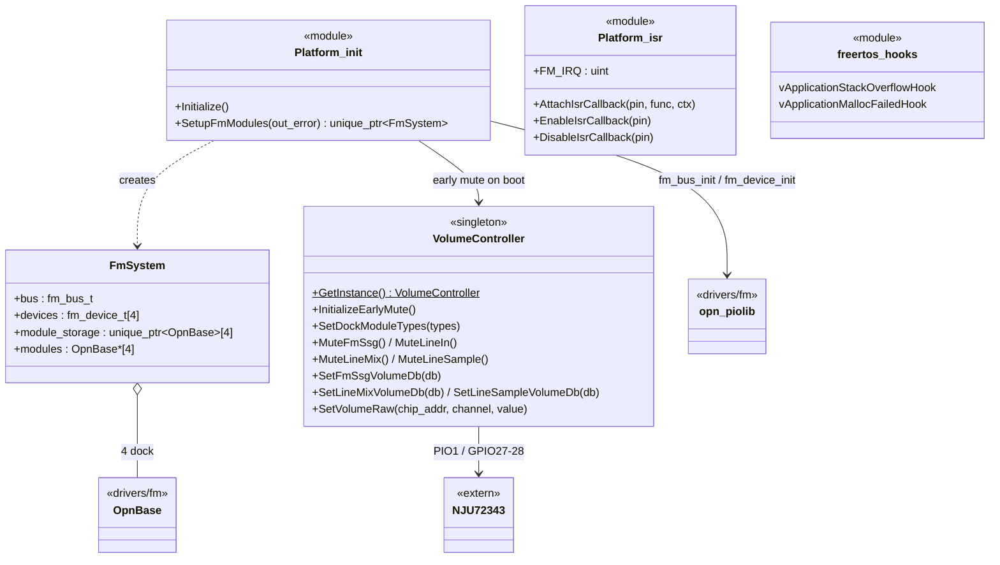

# platform ドメイン

ボード統合レイヤ（`src/platform/`）。この基板で使うハードウェア資源の所有、初期化順、GPIO/PIO 割り当てを集約する。`drivers` / `extern` / pico-sdk に依存してよいが、`synth` / `app` には依存しない。

関連設計書: [design_volume_controller.md](../design_volume_controller.md)、[system_spec.md](../system_spec.md)

`NJU72343` は `extern/` の外部ライブラリ、`opn_piolib` / `OpnBase` は `drivers/fm` に属する（灰色の外部要素として `<<extern>>` / `<<drivers/fm>>` を注記）。

| 要素 | ファイル | 責務 |
|---|---|---|
| `Platform::Initialize` | `init.cpp` | stdio・GPIO・FM リセット・電子ボリューム早期ミュート・SD・USB の初期化 |
| `Platform::SetupFmModules` | `init.cpp` | FM バス（PIO0）初期化、モジュール自動識別（YM2608/YM2203/未接続）、`FmSystem` 構築 |
| `Platform::VolumeController` | `volume_controller.h/cpp` | NJU72343 のボード固有ラッパー。PIO1/GPIO27/28 の所有、dock 状態管理、dB 指定 API |
| `Platform::AttachIsrCallback` 等 | `isr.h/cpp` | GPIO 割り込み登録（`FM_IRQ` = 全 Dock /IRQ の Wired-OR） |
| FreeRTOS フック | `freertos_hooks.cpp` | スタックオーバーフロー・ヒープ枯渇時の記録 |
| `FreeRTOSConfig.h` | — | FreeRTOS カーネル設定（[design_concurrency.md](../design_concurrency.md#6-freertos-設定)） |
