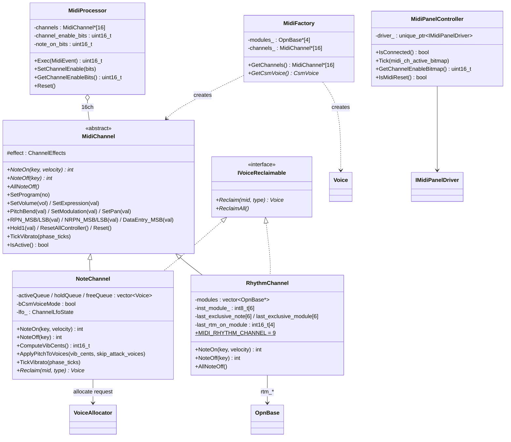
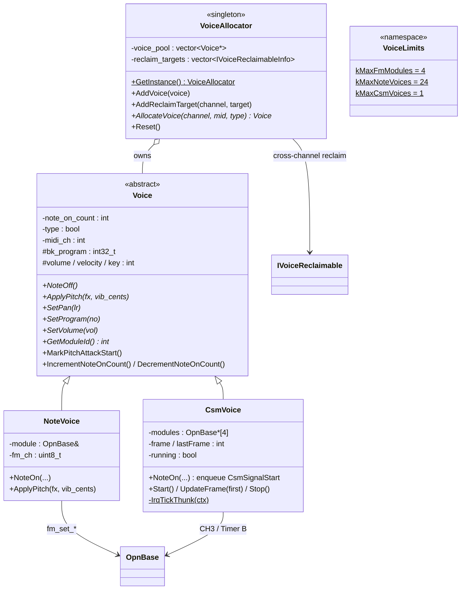

# synth ドメイン

MIDI メッセージをハードウェア非依存な形で FM 音源に変換するレイヤ（`src/synth/`）。FM デバイスへのアクセスは `drivers/fm` の `OpnBase`、パネルへのアクセスは `drivers/midi_panel` の `IMidiPanelDriver` を経由する。

関連設計書: [design_voice_allocation.md](../design_voice_allocation.md)、[design_effect.md](../design_effect.md)、[design_rhythm.md](../design_rhythm.md)、[design_csm_frame.md](../design_csm_frame.md)

## チャンネル・プロセッサ

## Voice・アロケータ

| 要素 | ファイル | 責務 |
|---|---|---|
| `MidiProcessor` | `MidiProcessor.h/cpp` | `MidiEvent` のディスパッチ、チャンネル有効管理 |
| `MidiFactory` | `MidiFactory.h/cpp` | チャンネルと Voice の生成・接続（静的ストレージ） |
| `MidiChannel` | `channel/MidiChannel.h/cpp` | チャンネル共通の CC / RPN / NRPN 状態機械 |
| `NoteChannel` | `channel/NoteChannel.h/cpp` | メロディ発音、Voice キュー、ソフトウェア LFO |
| `RhythmChannel` | `channel/RhythmChannel.h/cpp` | ch10 リズム。Voice を使わずチップを直接操作 |
| `Voice` / `NoteVoice` / `CsmVoice` | `voice/` | 発音単位の抽象と FM / CSM 実装 |
| `VoiceAllocator` | `voice/VoiceAllocator.h/cpp` | Voice プール所有と横断調停（シングルトン） |
| `MidiPanelController` | `MidiPanelController.h/cpp` | `IMidiPanelDriver` API の仲介 |
