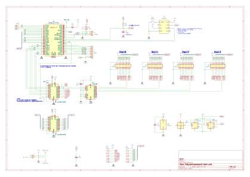
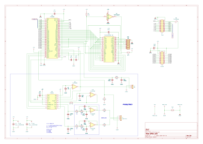
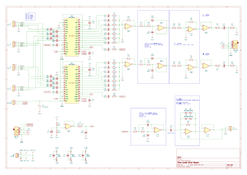
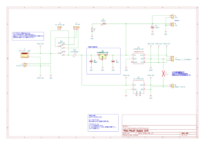
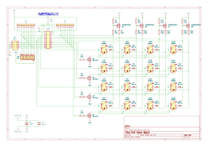

# 回路図一覧

| 回路 | 内容 |
|---|---|
| [Main](#main) | コントローラモジュール　(RaspberryPi Pico) |
| [OPNA_Unit](#opna_unit) | OPNA(YM2608) FM音源モジュール |
| [Mixer](#mixer) | オーディオミキサモジュール |
| [PowerSupply_Unit](#power_supply_unit) | 電源モジュール |
| [PanelSubsystem](#panel_subsystem) | MIDI パネルサブシステム（[spec_midi_panel.md](../spec_midi_panel.md) 参照） |

### Main — コントローラモジュール

[Main.pdf](./Main.pdf)

### OPNA_Unit — OPNA FM音源モジュール

[OPNA_Unit.pdf](./OPNA_Unit.pdf)

### Mixer — オーディオミキサモジュール

[Mixer.pdf](./Mixer.pdf)

### PowerSupply_Unit — 電源モジュール

[PowerSupply_Unit.pdf](./PowerSupply_Unit.pdf)

### PanelSubsystem — MIDI パネルサブシステム

[PanelSubsystem.pdf](./PanelSubsystem.pdf)
