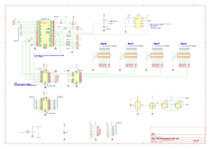
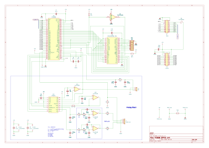
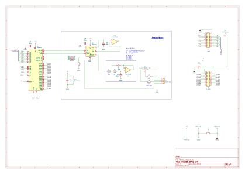
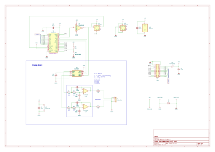
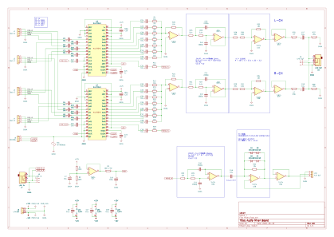
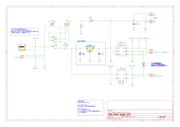
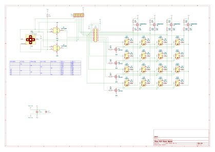

# 回路図一覧

| 回路 | 内容 |
|---|---|
| [Main](#main) | コントローラモジュール　(RaspberryPi Pico) |
| [YM2608_Unit](#YM2608_Unit) | YM2608(OPNA) FM音源モジュール |
| [YM2203_Unit](#YM2203_Unit) | YM2203(OPN) FM音源モジュール |
| [YMF288_Unit](#YMF288_Unit) | YMF288(OPN3-L) FM音源モジュール |
| [Mixer](#mixer) | オーディオミキサモジュール |
| [PowerSupply_Unit](#power_supply_unit) | 電源モジュール |
| [PanelSubsystem](#panel_subsystem) | MIDI パネルサブシステム（[spec_midi_panel.md](../spec_midi_panel.md) 参照） |

### Main — コントローラモジュール

[Main.pdf](./Main.pdf)

### YM2608_Unit — OPNA FM音源モジュール

[YM2608_Unit.pdf](./YM2608_Unit.pdf)

### YM2203_Unit — OPN FM音源モジュール

[YM2203_Unit.pdf](./YM2203_Unit.pdf)

### YMF288_Unit — OPN3-L FM音源モジュール

[YMF288_Unit.pdf](./YMF288_Unit.pdf)

### Mixer — オーディオミキサモジュール

[Mixer.pdf](./Mixer.pdf)

### PowerSupply_Unit — 電源モジュール

[PowerSupply_Unit.pdf](./PowerSupply_Unit.pdf)

### PanelSubsystem — MIDI パネルサブシステム

[PanelSubsystem.pdf](./PanelSubsystem.pdf)
