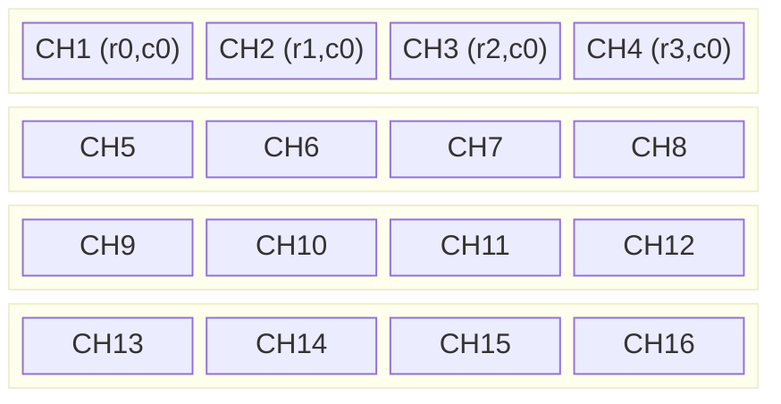
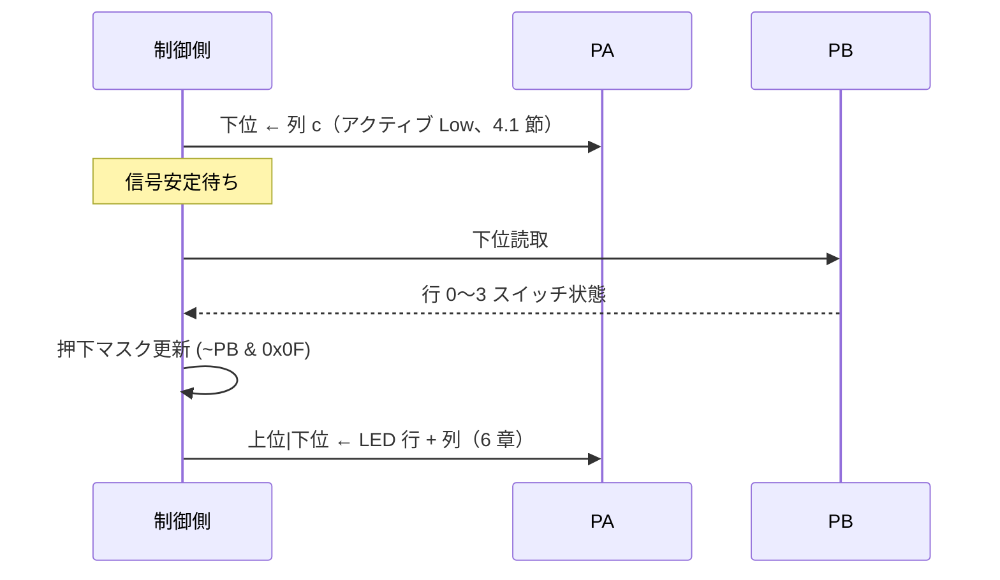
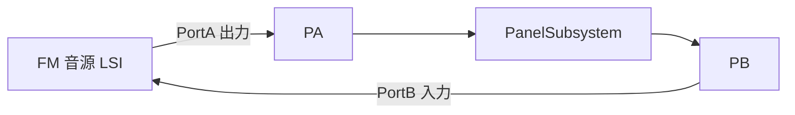

# MIDI Panel ハードウェア仕様書

PanelSubsystem（MIDI Panel）の回路・信号・制御上のハード制約を定義する。ソフトウェア設計・実装は [design_midi_panel.md](design_midi_panel.md) を正とする。

回路図: `FMSynthEnsembleV3-HW/PanelSubsystem/PanelSubsystem.kicad_sch`（KiCad 10, rev 1.0）

---

## 目次

1. [呼称](#1-呼称)
2. [回路概要](#2-回路概要)
3. [マトリックス配置](#3-マトリックス配置)
4. [PA / PB 信号定義](#4-pa--pb-信号定義panelsubsystem-仕様)
5. [マトリックススキャン手順](#5-マトリックススキャン手順)
6. [LED ダイナミック点灯](#6-led-ダイナミック点灯)
7. [制御上の考慮事項](#7-制御上の考慮事項)
8. [用語集](#8-用語集)
9. [システム接続](#9-システム接続fmsynthensemble-想定参考)

---

## 1. 呼称

| 名称 | 内容 |
|------|------|
| **PanelSubsystem** | MIDI Panel を含む独立したハードウェアボード（本仕様の対象） |
| **MIDI Panel** | PanelSubsystem ボード上の、16 個の LED 付き押しボタンを 4×4 マトリックスで制御する回路部 |

### 1.1 PA・PB と PortA・PortB

本書で **PA**・**PB** は **PanelSubsystem コネクタ上の信号名**であり、FM 音源 LSI のレジスタ名ではない。

| 名称 | 所属 | 意味 |
|------|------|------|
| **PA** | PanelSubsystem（J3） | パネル駆動用 **10 pin** 信号。下位/上位 4bit の意味は [4 章](#4-pa--pb-信号定義panelsubsystem-仕様)で定義 |
| **PB** | PanelSubsystem（J1） | パネル読取り用 **10 pin** 信号。下位/上位 4bit の意味は 4 章で定義 |
| **PortA** | FM 音源 LSI | LSI の汎用 I/O ポート A（本仕様の主題ではない） |
| **PortB** | FM 音源 LSI | LSI の汎用 I/O ポート B（本仕様の主題ではない） |

2〜8 章は PanelSubsystem の **PA / PB 仕様**およびハード由来の制約を記述する。PortA / PortB との接続関係は [9 章](#9-システム接続fmsynthensemble-想定参考)に分離して記載する。

---

## 2. 回路概要

### 2.1 機能

- 16 個の **LED 付きモーメンタリスイッチ**（MP86A1）を **4×4 マトリックス**で時分割制御する
- コネクタ **PA**（J3）・**PB**（J1）の 2 系統で、**スイッチスキャン**と **LED ダイナミック点灯**を同時に行う

### 2.2 主要部品

| 部品 | 数量 | 役割 |
|------|------|------|
| CH1〜CH16 | 16 | MP86A1（LED 付き SPST スイッチ） |
| Q1〜Q4 | 4 | 2SK4017（N-MOS FET）**行**（カソード側）ドライバ |
| Q5〜Q8 | 4 | MTB060P06I3（P-MOS FET）**列**（アノード側）ドライバ。S=VCC、D=アノードバス（R7 等） |
| D1〜D16 | 16 | BAT43（スイッチ読取と LED 駆動の分離） |
| RN1 | 1 | 10 kΩ SIP9（PB 行・列ラインのプルアップ） |
| SW1 | 1 | 4 連スイッチ（PB4-7 に接続、信号名 `PB4_7`） |
| J1 | 1 | **PB**（10 pin JST PH） |
| J3 | 1 | **PA**（10 pin JST PH） |
| J2 | 1 | **GPIO**（2×10 IDC、PA/PB 統合アクセス用） |
| R7,R10,R13,R16 | 4 | LED 電流設定用（100 Ω 前後を目視調整、BOM 上は未確定） |

### 2.3 コネクタ電源（J1 / J3 共通）

| ピン | 電気 |
|------|------|
| 1 | GND |
| 2 | +5 V |

---

## 3. マトリックス配置

論理座標は **行 0〜3（横）× 列 0〜3（縦）**。CH 番号は次の配置とする。



### 3.1 座標と CH 番号

行 `r`、列 `c`（いずれも 0 始まり）のスイッチ:

```
CH番号 = 4 × c + r + 1
```

逆変換（CH `n`、1 始まり）:

```
r = (n - 1) % 4
c = (n - 1) / 4   （整数除算）
```

### 3.2 ハードウェア配線との対応

| 論理 | ハード側 | PA ビット |
|------|----------|-----------|
| **列 c**（アノード） | P-MOS FET Q5〜Q8 | **下位** bit0〜3 |
| **行 r**（カソード） | N-MOS FET Q1〜Q4 | **上位** bit4〜7 |

PortA レジスタの bit0〜7 は J3 PA に対応する（[9.3 節](#93-porta-レジスタと-pa-信号の対応)）。

---

## 4. PA / PB 信号定義（PanelSubsystem 仕様）

本章は PanelSubsystem コネクタ **PA（J3）**・**PB（J1）** の電気的・論理的仕様である。

### 4.1 PA（J3・出力）

| ビット | J3 信号（参考） | 駆動先 | 役割 | 極性 |
|--------|----------------|--------|------|------|
| bit0 | D1-K | Q5 ゲート | 列 0（アノード） | アクティブ **Low** |
| bit1 | D5-K | Q6 ゲート | 列 1 | アクティブ **Low** |
| bit2 | D10-K | Q7 ゲート | 列 2 | アクティブ **Low** |
| bit3 | D13-K | Q8 ゲート | 列 3 | アクティブ **Low** |
| bit4 | — | Q1 ゲート | 行 0（カソード） | アクティブ **High** |
| bit5 | — | Q2 ゲート | 行 1 | アクティブ **High** |
| bit6 | — | Q3 ゲート | 行 2 | アクティブ **High** |
| bit7 | — | Q4 ゲート | 行 3 | アクティブ **High** |

P-MOS FET（Q5〜Q8）のゲートには VCC 側プルアップがあり、**bit = 0 のときのみ ON** する。N-MOS FET（Q1〜Q4）は **bit = 1 のとき ON** する。

#### 列選択パターン（下位 4bit・アクティブ Low ワンホット）

対象列の bit **だけ 0**、他は 1 にする。同時に複数列を 0 にしない。

| 列 c | 下位 4bit（MSB←→LSB: bit3 bit2 bit1 bit0） | 値 |
|------|---------------------------------------------|-----|
| 0 | `1 1 1 0` | `0x0E` |
| 1 | `1 1 0 1` | `0x0D` |
| 2 | `1 0 1 1` | `0x0B` |
| 3 | `0 1 1 1` | `0x07` |
| 全列 OFF（ブランク） | `1 1 1 1` | `0x0F` |

**注意:** 下位 4bit を `0x00` にすると **全 P-MOS FET が同時 ON** になる。ブランクは `0x0F` を使う。

### 4.2 PB（J1・入力）

| ビット | 役割 | 極性 |
|--------|------|------|
| **下位 4bit**（bit0〜3） | 現在スキャン中の **列**における **行 0〜3** のスイッチ状態 | アクティブ **Low**（押下 = 0、非押下 = 1） |
| **上位 4bit**（`PB4_7`） | SW1 の設定値 | Active Low（ON = 0、OFF = 1 と想定） |

### 4.3 SW1 割り当て（PB4-7）

| PB4-7 | 割り当て |
|-------|----------|
| bit4〜6 | 未割当 |
| **bit7** | **LED 表示モード**（Low = モード B / MIDI 発音反映、High = モード A / トグル状態反映） |

### 4.4 ビット順

**MSB を左**とする表記では、PB 下位 4bit（スイッチ読取）の対応は:

```
bit3  bit2  bit1  bit0
行3   行2   行1   行0
```

PA 上位 4bit（LED カソード行）も同じ bit 順（bit4 = 行0 … bit7 = 行3）。PA 下位 4bit は **列**（bit0 = 列0 … bit3 = 列3）であり行ではない（[4.1 節](#41-paj3出力)）。

列 `c` をスキャン中に読んだ PB 下位 4bit と CH の対応:

| bit | 行 | 対応 CH |
|-----|-----|---------|
| 0（LSB） | 行0 | `4×c + 1` |
| 1 | 行1 | `4×c + 2` |
| 2 | 行2 | `4×c + 3` |
| 3（MSB） | 行3 | `4×c + 4` |

列ごとの MSB←→LSB 表記:

| スキャン列 | PB 下位4bit（MSB ← → LSB） |
|-----------|---------------------------|
| 列0 | `CH4` `CH3` `CH2` `CH1` |
| 列1 | `CH8` `CH7` `CH6` `CH5` |
| 列2 | `CH12` `CH11` `CH10` `CH9` |
| 列3 | `CH16` `CH15` `CH14` `CH13` |

---

## 5. マトリックススキャン手順

1 フレームで列 0〜3 を順に処理する。列 `c` の 1 スロット:



### 5.1 押下時の論理

```
pressed_mask[c] = ~PB_lower & 0x0F
```

`pressed_mask[c]` の bit `r` が 1 なら、座標 `(r, c)` のスイッチが押下中。

### 5.2 フレーム周期

- 4 列分を 1 周した周期を **スキャンフレーム**と呼ぶ
- 1 列スロットの周期を `T_tick`、スキャンフレーム周期を `T_frame` = `4 × T_tick` とする
- **現行設定**（[design_midi_panel.md](design_midi_panel.md#533-tick-周期)）: `T_tick` = **4 ms**、`T_frame` = **16 ms**（LED 多重化 **62.5 Hz**）。FM バス占有の低減を優先した値

---

## 6. LED ダイナミック点灯

スキャンと同じタイムスロットで、列 `c` の LED を駆動する。

### 6.1 出力フォーマット

列 `c` のスロット。`column_pattern[c]` は [4.1 節](#41-paj3出力)の列選択値（`0x0E`, `0x0D`, `0x0B`, `0x07`）。

```
PA_lower = column_pattern[c]              // 列 c の P-MOS FET を 1 本だけ ON（Active Low）
PA_upper = led_row_pattern << 4           // 行0〜3 のカソード（Active High）
PortA    = PA_upper | PA_lower
```

- `led_row_pattern` の bit `r` が 1 → 座標 `(r, c)` の LED を点灯
- bit 順は PB 下位と同じ（bit0 = 行0、bit3 = 行3）
- 点灯する LED がないスロットでは `PA_upper = 0` とし、下位は `0x0F`（全 P-MOS FET OFF）にする。`PortA = 0x00` は全 P-MOS FET ON になるため使わない
- スキャン専用フェーズ（LED 未更新）でも下位は `0x0F` でブランクする

### 6.2 `led_row_pattern` の内容（モード A / B）

PB bit7（[4.3 節](#43-sw1-割り当てpb4-7)）で **モード A**（トグル状態反映）か **モード B**（MIDI 発音反映）かを選択する。判定・MIDI 状態の反映方法は [design_midi_panel.md](design_midi_panel.md#11-led-表示モード) を参照。

---

## 7. 制御上の考慮事項

制御プログラムがハードウェアの性質に合わせて考慮すべき事項。振る舞いの詳細はソフト設計書に委ねる。

| 項目 | 内容 |
|------|------|
| スイッチ種別 | **モーメンタリ**（押している間だけ閉）。ラッチトグルはソフトで実現する |
| 時分割 | 16 スイッチ・16 LED を 4 列マトリックスでスキャンする（[5 章](#5-マトリックススキャン手順)）。列スロット周期 **4 ms**、スキャンフレーム **16 ms**（[5.2 節](#52-フレーム周期)） |
| LED モード | **PB bit7**（[4.3 節](#43-sw1-割り当てpb4-7)）で **モード A / B** を選択。ソフトが毎スキャン読取 |
| MIDI Reset | CH10 長押し（[design_midi_panel.md](design_midi_panel.md#33-ソフトウェア機能要件)） |
| 列切替待ち | PA 列切替後、PB 読取前に安定待ちが必要（プルアップ・配線容量） |

---

## 8. 用語集

| 用語 | 意味 |
|------|------|
| **スキャンフレーム** | 列 0〜3 を 1 周した周期 |
| **スロット** | 1 列分のスキャン・LED 更新時間帯 |
| **論理行 / 論理列** | [3 章](#3-マトリックス配置)のマトリックス座標（行 0〜3、列 0〜3） |
| **PA / PB** | PanelSubsystem コネクタ信号（[4 章](#4-pa--pb-信号定義panelsubsystem-仕様)） |
| **PortA / PortB** | FM 音源 LSI の I/O ポート（[9 章](#9-システム接続fmsynthensemble-想定参考)） |

---

## 9. システム接続

本章は PanelSubsystem 基板単体の仕様の延長として、ホストシステムとの接続を記す。

### 9.1 接続関係



- PortA は **出力**、PortB は **入力** に設定する想定
- 信号のビット意味（下位 4bit = 列、上位 4bit = LED 行など）は [4 章](#4-pa--pb-信号定義panelsubsystem-仕様)の PA / PB 定義に従う

### 9.2 電源ピン（コネクタ共通）

| ピン | 電気 |
|------|------|
| 1 | GND |
| 2 | +5 V |

### 9.3 PortA レジスタと PA 信号の対応

- スキャン手順・ビットパターンは PA / PB 信号の観点（4〜6 章）で記述する
- LSI の `write_port_a(data)` の bit0〜7 が J3 PA の bit0〜7 に対応する。上位 = 行（カソード）、下位 = 列（アノード）
- PB 読取は Active Low のため、論理反転して押下を解釈する（[5.1 節](#51-押下時の論理)）
