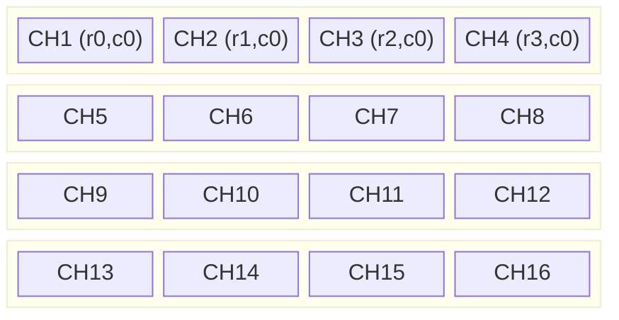
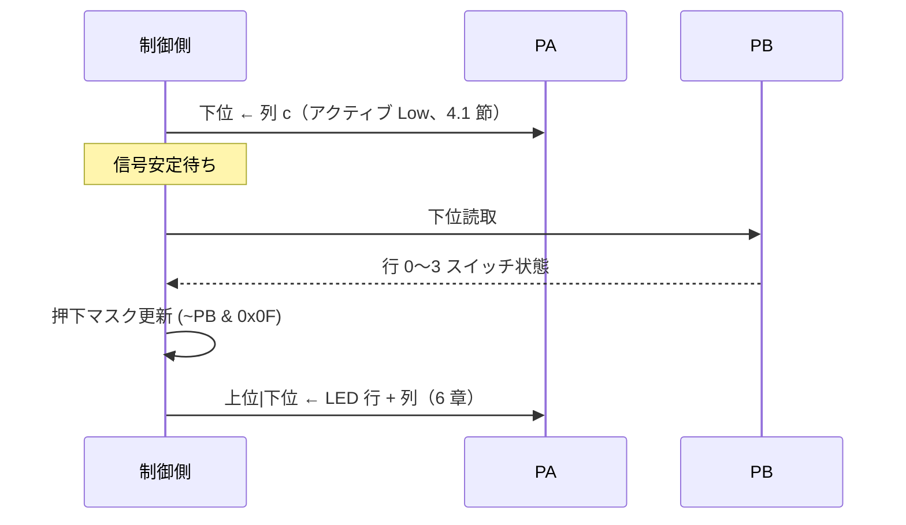
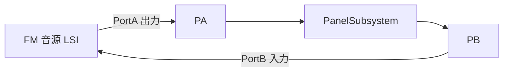

# MIDI Panel ハードウェア仕様書

PanelSubsystem（MIDI Panel）の回路・信号・制御上のハード制約を定義する。ソフトウェア設計・実装は [design_midi_panel.md](design_midi_panel.md) を正とする。

---

## 目次

1. [呼称](#1-呼称)
2. [回路概要](#2-回路概要)
3. [マトリックス配置](#3-マトリックス配置)
4. [PA / PB 信号定義](#4-pa--pb-信号定義panelsubsystem-仕様)
5. [マトリックススキャン手順](#5-マトリックススキャン手順)
6. [LED ダイナミック点灯](#6-led-ダイナミック点灯)
7. [ジョイスティック（SW1）](#7-ジョイスティック)
8. [制御上の考慮事項](#8-制御上の考慮事項)
9. [用語集](#9-用語集)
10. [システム接続](#10-システム接続)

---

## 1. 呼称

| 名称 | 内容 |
|------|------|
| **PanelSubsystem** | MIDI Panel を含む独立したハードウェアボード（本仕様の対象） |
| **MIDI Panel** | PanelSubsystem ボード上の、16 個の LED 付き押しボタンを 4×4 マトリックスで制御する回路部 |

### 1.1 PA・PB と PortA・PortB

本書で **PA**・**PB** は **PanelSubsystem コネクタ上の信号名**であり、FM 音源 LSI のレジスタ名ではない。

| 名称 | 所属 | 意味 |
|------|------|------|
| **PA** | PanelSubsystem（J1 奇数ピン） | パネル駆動用 **8 bit** 出力信号。下位/上位 4bit の意味は [4 章](#4-pa--pb-信号定義panelsubsystem-仕様)で定義 |
| **PB** | PanelSubsystem（J1 偶数ピン） | パネル読取り用 **8 bit** 入力信号。下位/上位 4bit の意味は 4 章で定義 |
| **PortA** | FM 音源 LSI | LSI の汎用 I/O ポート A（本仕様の主題ではない） |
| **PortB** | FM 音源 LSI | LSI の汎用 I/O ポート B（本仕様の主題ではない） |

2〜8 章は PanelSubsystem の **PA / PB 仕様**およびハード由来の制約を記述する。PortA / PortB との接続関係は [10 章](#10-システム接続)に分離して記載する。

---

## 2. 回路概要

### 2.1 機能

- 16 個の **LED 付きモーメンタリスイッチ**（MP86A1）を **4×4 マトリックス**で時分割制御する
- コネクタ **J1** の **PA**（奇数ピン）・**PB**（偶数ピン）の 2 系統で、**スイッチスキャン**と **LED ダイナミック点灯**を同時に行う

### 2.2 主要部品

| 部品 | 数量 | 役割 |
|------|------|------|
| CH1〜CH16 | 16 | MP86A1（LED 付き SPDT モーメンタリスイッチ。N.C. 端子は未接続） |
| Q1〜Q4 | 4 | 2SK4017（N-MOS FET, TO-251）**行**（カソード側）ドライバ。G=PA bit4〜7、S=GND |
| Q5〜Q8 | 4 | MTB060P06I3（P-MOS FET, TO-251）**列**（アノード側）ドライバ。S=VCC、D=アノードバス（R8/R11/R14/R17 経由） |
| D1〜D16 | 16 | BAT43（ショットキー。スイッチ読取と LED 駆動の分離＋ゴースト防止） |
| RN1 | 1 | 10 kΩ SIP9（PB 下位 4bit のプルアップ 4 本 + ジョイスティック `/A` `/B` `/D` `/Center` のプルアップ 4 本、[7 章](#7-ジョイスティック)） |
| R1 | 1 | 10 kΩ（ジョイスティック `/C` のプルアップ。RN1 が 8 素子で足りないため単体で追加） |
| SW1 | 1 | ジョイスティック（**K1-5202UA-01** / ALPS [SKRHAAE010](https://tech.alpsalpine.com/j/products/detail/SKRHAAE010/) 相当、4 方向 + センタープッシュ）。PB4-7 に接続（[7 章](#7-ジョイスティック)） |
| U1,U2 | 2 | 74AHC1G08（2 入力 AND）。ジョイスティック方向コード合成用（[7 章](#7-ジョイスティック)） |
| R2〜R5 | 4 | 100 Ω（Q1〜Q4 のゲート直列抵抗） |
| R6,R9,R12,R15 | 4 | 10 kΩ（Q5〜Q8 のゲート → VCC プルアップ。PA が Hi-Z の間 P-MOS を OFF に保つ） |
| R7,R10,R13,R16 | 4 | 100 Ω（PA 列ライン → Q5〜Q8 ゲートの直列抵抗） |
| **R8,R11,R14,R17** | 4 | **100 Ω（LED 電流制限）**。Q5〜Q8 のドレインと各アノードバスの間に入る |
| C1,C2 | 2 | 100 µF / 0.1 µF（電源デカップリング） |
| J1 | 1 | **GPIO**（2×10 IDC）。PA・PB を統合した唯一のコネクタ |

### 2.3 コネクタ電源（J1）

| ピン | 電気 |
|------|------|
| 1, 2 | GND |
| 3, 4 | +5 V |

---

## 3. マトリックス配置

論理座標は **行 0〜3（横）× 列 0〜3（縦）**。CH 番号は次の配置とする。


```mermaid
block-beta
    columns 4
    block:col0:4
        CH1["CH1 (r0,c0)"]
        CH2["CH2 (r1,c0)"]
        CH3["CH3 (r2,c0)"]
        CH4["CH4 (r3,c0)"]
    end
    block:col1:4
        CH5["CH5"]
        CH6["CH6"]
        CH7["CH7"]
        CH8["CH8"]
    end
    block:col2:4
        CH9["CH9"]
        CH10["CH10"]
        CH11["CH11"]
        CH12["CH12"]
    end
    block:col3:4
        CH13["CH13"]
        CH14["CH14"]
        CH15["CH15"]
        CH16["CH16"]
    end
```

### 3.1 座標と CH 番号

行 `r`、列 `c`（いずれも 0 始まり）のスイッチ:

```
CH番号 = 4 × c + r + 1
```

逆変換（CH `n`、1 始まり）:

```
r = (n - 1) % 4
c = (n - 1) / 4   （整数除算）
```

### 3.2 ハードウェア配線との対応

| 論理 | ハード側 | PA ビット |
|------|----------|-----------|
| **列 c**（アノード） | P-MOS FET Q5〜Q8 | **下位** bit0〜3 |
| **行 r**（カソード） | N-MOS FET Q1〜Q4 | **上位** bit4〜7 |

PortA レジスタの bit0〜7 は PA（J1 奇数ピン）に対応する（[10.3 節](#103-porta-レジスタと-pa-信号の対応)）。

---

## 4. PA / PB 信号定義（PanelSubsystem 仕様）

本章は PanelSubsystem コネクタ J1 上の **PA**（奇数ピン・出力）・**PB**（偶数ピン・入力）の電気的・論理的仕様である。

### 4.0 J1 ピンアサイン

PA / PB は **単一の 2×10 IDC コネクタ J1** に統合されている。奇数ピン列が PA（出力 8 本）、偶数ピン列が PB（入力 8 本）。
FM 音源モジュール側（YM2203: `J3` / YM2608: `J4`）とは**ピン番号 1:1 のストレート結線**である。

| J1 ピン | 信号 | LSI 側 |
|---------|------|--------|
| 1, 2 | GND | GND |
| 3, 4 | +5 V | +5 V |
| 5, 7, 9, 11 | PA bit0〜3（列選択・アクティブ Low） | IOA0〜IOA3 |
| 13, 15, 17, 19 | PA bit4〜7（LED 行・アクティブ High） | IOA4〜IOA7 |
| 6, 8, 10, 12 | PB bit0〜3（スイッチ読取・アクティブ Low） | IOB0〜IOB3 |
| 14, 16, 18, 20 | PB bit4〜7（ジョイスティック） | IOB4〜IOB7 |

この配置により **PA が LSI の PortA（全ビット出力）、PB が PortB（全ビット入力）**にちょうど収まる。
YM2203 / YM2608 の SSG I/O ポートは**ポート単位でしか入出力方向を設定できない**ための構成である。
なお **YMF288 は I/O ポートを持たない**ため、本ボードは YM2203 / YM2608 でのみ動作する。

### 4.1 PA（J1 奇数ピン・出力）

| ビット | ネット名（参考） | 駆動先 | 役割 | 極性 |
|--------|----------------|--------|------|------|
| bit0 | D1-K | Q5 ゲート | 列 0（アノード） | アクティブ **Low** |
| bit1 | D5-K | Q6 ゲート | 列 1 | アクティブ **Low** |
| bit2 | D10-K | Q7 ゲート | 列 2 | アクティブ **Low** |
| bit3 | D13-K | Q8 ゲート | 列 3 | アクティブ **Low** |
| bit4 | — | Q1 ゲート | 行 0（カソード） | アクティブ **High** |
| bit5 | — | Q2 ゲート | 行 1 | アクティブ **High** |
| bit6 | — | Q3 ゲート | 行 2 | アクティブ **High** |
| bit7 | — | Q4 ゲート | 行 3 | アクティブ **High** |

P-MOS FET（Q5〜Q8）のゲートには VCC 側プルアップがあり、**bit = 0 のときのみ ON** する。N-MOS FET（Q1〜Q4）は **bit = 1 のとき ON** する。

#### 列選択パターン（下位 4bit・アクティブ Low ワンホット）

対象列の bit **だけ 0**、他は 1 にする。同時に複数列を 0 にしない。

| 列 c | 下位 4bit（MSB←→LSB: bit3 bit2 bit1 bit0） | 値 |
|------|---------------------------------------------|-----|
| 0 | `1 1 1 0` | `0x0E` |
| 1 | `1 1 0 1` | `0x0D` |
| 2 | `1 0 1 1` | `0x0B` |
| 3 | `0 1 1 1` | `0x07` |
| 全列 OFF（ブランク） | `1 1 1 1` | `0x0F` |

**注意:** 下位 4bit を `0x00` にすると **全 P-MOS FET が同時 ON** になる。ブランクは `0x0F` を使う。

### 4.2 PB（J1 偶数ピン・入力）

| ビット | 役割 | 極性 |
|--------|------|------|
| **下位 4bit**（bit0-3） | 現在スキャン中の **列**における **行 0〜3** のスイッチ状態 | アクティブ **Low** |
| **上位 4bit**（bit4-7） | ジョイスティックの押下状態（4bit エンコード、[7 章](#7-ジョイスティック)） | アクティブ **Low** |

上位 4bit はジョイスティック（SW1）に割り当てられている。エンコード・方向対応・制約は [7 章](#7-ジョイスティック)を参照。
bit7 は Center Push で、LED モード切替に使える入力は無い（[7.5 節](#75-既知の制約)）。

### 4.3 ビット順

**MSB を左**とする表記では、PB 下位 4bit（スイッチ読取）の対応は:

```
bit3  bit2  bit1  bit0
行3   行2   行1   行0
```

PA 上位 4bit（LED カソード行）も同じ bit 順（bit4 = 行0 … bit7 = 行3）。PA 下位 4bit は **列**（bit0 = 列0 … bit3 = 列3）であり行ではない（[4.1 節](#41-paj1-奇数ピン出力)）。

列 `c` をスキャン中に読んだ PB 下位 4bit と CH の対応:

| bit | 行 | 対応 CH |
|-----|-----|---------|
| 0（LSB） | 行0 | `4×c + 1` |
| 1 | 行1 | `4×c + 2` |
| 2 | 行2 | `4×c + 3` |
| 3（MSB） | 行3 | `4×c + 4` |

列ごとの MSB←→LSB 表記:

| スキャン列 | PB 下位4bit（MSB ← → LSB） |
|-----------|---------------------------|
| 列0 | `CH4` `CH3` `CH2` `CH1` |
| 列1 | `CH8` `CH7` `CH6` `CH5` |
| 列2 | `CH12` `CH11` `CH10` `CH9` |
| 列3 | `CH16` `CH15` `CH14` `CH13` |

---

## 5. マトリックススキャン手順

1 フレームで列 0〜3 を順に処理する。列 `c` の 1 スロット:


```mermaid
sequenceDiagram
    participant Host as 制御側
    participant PA as PA
    participant PB as PB

    Host->>PA: 下位 ← 列 c（アクティブ Low、4.1 節）
    Note over Host: 信号安定待ち
    Host->>PB: 下位読取
    PB-->>Host: 行 0〜3 スイッチ状態
    Host->>Host: 押下マスク更新 (~PB & 0x0F)
    Host->>PA: 上位|下位 ← LED 行 + 列（6 章）
```

### 5.1 押下時の論理

```
pressed_mask[c] = ~PB_lower & 0x0F
```

`pressed_mask[c]` の bit `r` が 1 なら、座標 `(r, c)` のスイッチが押下中。

### 5.2 フレーム周期

- 4 列分を 1 周した周期を **スキャンフレーム**と呼ぶ
- 1 列スロットの周期を `T_tick`、スキャンフレーム周期を `T_frame` = `4 × T_tick` とする
- **現行設定**（[design_midi_panel.md](design_midi_panel.md#533-tick-周期)）: `T_tick` = **4 ms**、`T_frame` = **16 ms**（LED 多重化 **62.5 Hz**）。FM バス占有の低減を優先した値

---

## 6. LED ダイナミック点灯

スキャンと同じタイムスロットで、列 `c` の LED を駆動する。

### 6.1 出力フォーマット

列 `c` のスロット。`column_pattern[c]` は [4.1 節](#41-paj1-奇数ピン出力)の列選択値（`0x0E`, `0x0D`, `0x0B`, `0x07`）。

```
PA_lower = column_pattern[c]              // 列 c の P-MOS FET を 1 本だけ ON（Active Low）
PA_upper = led_row_pattern << 4           // 行0〜3 のカソード（Active High）
PortA    = PA_upper | PA_lower
```

- `led_row_pattern` の bit `r` が 1 → 座標 `(r, c)` の LED を点灯
- bit 順は PB 下位と同じ（bit0 = 行0、bit3 = 行3）
- 点灯する LED がないスロットでは `PA_upper = 0` とし、下位は `0x0F`（全 P-MOS FET OFF）にする。`PortA = 0x00` は全 P-MOS FET ON になるため使わない
- スキャン専用フェーズ（LED 未更新）でも下位は `0x0F` でブランクする

### 6.2 `led_row_pattern` の内容（モード A / B）

**モード A**（トグル状態反映）か **モード B**（MIDI 発音反映）かはソフトウェアで切り替える。PB bit7 はジョイスティックの Center Push であり、モード選択用のハード入力は無い（[7.5 節](#75-既知の制約)）。判定・MIDI 状態の反映方法は [design_midi_panel.md](design_midi_panel.md#11-led-表示モード) を参照。

---

## 7. ジョイスティック

PB 上位 4bit（[4.2 節](#42-pbj1-偶数ピン入力)）に接続されるジョイスティック **K1-5202UA-01**（ALPS [SKRHAAE010](https://tech.alpsalpine.com/j/products/detail/SKRHAAE010/) 相当、4 方向 + センタープッシュ、モーメンタリ）の押下状態を反映する。

| 参照 | 内容 |
|------|------|
| [ALPS SKRHAAE010 製品ページ](https://tech.alpsalpine.com/j/products/detail/SKRHAAE010/) | 外形図（方向記号 a/b/c/d と端子位置）・内部回路図（端子 ①=A ②=Center ③=C ④=B ⑤=Common ⑥=D）。本章の端子機能・方向規則の根拠 |
| K1-5202UA-01（Korean Hroparts Elec） | 実装部品。SKRHAAE010 相当だが**パッド番号の回り方が外形図と一致しない**ため、方向対応は基板実座標から導出している（[7.1 節](#71-スイッチ構造とピン対応)） |

### 7.1 スイッチ構造とピン対応

| ピン | 接点名 | 方向 |
|------|--------|------|
| ① | A | **UP** |
| ③ | C | **LEFT** |
| ④ | B | **DOWN** |
| ⑥ | D | **RIGHT** |
| ② | Center | PUSH |
| ⑤ | Common | GND |

Common（⑤）は GND に直結。A・B・C・D・Center の 5 ラインはそれぞれ 10 kΩ で VCC にプルアップする
（`/A` `/B` `/D` `/Center` は **RN1**、`/C` のみ **R1**）。全ラインともアクティブ **Low**（押下 = 0、非押下 = 1）。

> ⚠️ **接点名 A/B/C/D は方向名ではない。`/B` = 下、`/D` = 右 である。**
> ALPS 外形図の方向記号 b / d をそのまま右 / 下と読むと **B と D が入れ替わる**ので注意。

#### 方向対応の根拠

「上」の定義は **① 番ピンと MP2 の間の方向にスティックを倒したとき**（ALPS [SKRHAAE010 外形図](https://tech.alpsalpine.com/j/products/detail/SKRHAAE010/)の方向 **a**）。

本スイッチは「**倒した先の角にある端子が閉じる**」構造で（ALPS 外形図で方向 a = 左上 ↔ 端子 ① が左上、b = 右上 ↔ 端子 ④ が右上）、
各列の中央の端子（② Center・⑤ Common）は方向接点ではなく、**両端の端子が 2 つの角にそれぞれ対応する**。

実装部品は ALPS ではなく K1-5202UA-01 で、SparkFun フットプリントのパッド番号の回り方が ALPS 外形図と一致しない。
そのため外形図の記号からではなく、`PanelSubsystem.kicad_pcb` の **SW1 パッド実座標**（パネル正面視での方位、0° = 上、90° = 右）から導出している。

| 要素 | ネット | 方位 |
|------|--------|------|
| MP2 | — | 45° |
| ⑥ | `/D` | 112° |
| ⑤ | `GND` | 135° |
| ④ | `/B` | 158° |
| MP1 | — | 225° |
| ③ | `/C` | 292° |
| ② | `/Center` | 315° |
| ① | `/A` | 338° |

4 方向はいずれもパネルの上下左右軸に一致する（フットプリントが 45° 回転配置されているため斜めにならない）。
各レバー方向を挟む要素は以下のとおり:

| レバー方向 | 挟む要素 | 対応端子 |
|-----------|----------|----------|
| **上** (0°) | ①(338°) ↔ MP2(45°) | ① `/A` |
| **右** (90°) | MP2(45°) ↔ ⑥(112°) | ⑥ `/D` |
| **下** (180°) | ④(158°) ↔ MP1(225°) | ④ `/B` |
| **左** (270°) | MP1(225°) ↔ ③(292°) | ③ `/C` |

### 7.2 方向コードの合成（AND ゲート）

I/O ピン節約のため、`/A`・`/C`・`/D` の 3 ライン（= **UP・LEFT・RIGHT**）を 2 個の 2 入力 AND ゲート
（**U1, U2** = 74AHC1G08）で PB 上位 4bit の下位 2bit（bit4, bit5）に合成する。
`/B`（DOWN）と `/Center`（PUSH）はゲートを介さず直結する。

| PB ビット | 信号源 | 論理 |
|-----------|--------|------|
| bit4 | U1 出力 | `/A` **AND** `/C` |
| bit5 | U2 出力 | `/D` **AND** `/C` |
| bit6 | `/B` | 直結 |
| bit7 | `/Center` | 直結 |

信号が負論理のため、正論理の AND ゲートは**負論理の OR** として働く。
`/C` を両方のゲートに共通入力することで、「A のみ」「D のみ」「C（= 両方 Low）」の 3 状態を 2bit で一意に識別できる。

### 7.3 真理値表（アクティブ Low・生値）

| 押下 | bit7 | bit6 | bit5 | bit4 | PB7-4 |
|------|------|------|------|------|-------|
| なし | 1 | 1 | 1 | 1 | `0xF` |
| UP（A） | 1 | 1 | 1 | 0 | `0xE` |
| RIGHT（D） | 1 | 1 | 0 | 1 | `0xD` |
| LEFT（C） | 1 | 1 | 0 | 0 | `0xC` |
| DOWN（B） | 1 | 0 | 1 | 1 | `0xB` |
| PUSH（Center） | 0 | 1 | 1 | 1 | `0x7` |
| PUSH+UP | 0 | 1 | 1 | 0 | `0x6` |
| PUSH+RIGHT | 0 | 1 | 0 | 1 | `0x5` |
| PUSH+LEFT | 0 | 1 | 0 | 0 | `0x4` |
| PUSH+DOWN | 0 | 0 | 1 | 1 | `0x3` |

### 7.4 ソフトウェアでのデコード

上位ニブルを 4bit 反転（`^ 0x0F`）すると、アクティブ **High** の直感的な値が得られる。

```
decoded = (PB >> 4) ^ 0x0F
```

| decoded | 意味 |
|---------|------|
| 0 | 中立 |
| 1 | UP |
| 2 | RIGHT |
| 3 | LEFT |
| 4 | DOWN |
| 8 | PUSH |
| 9〜12 | PUSH + UP/DOWN/LEFT/RIGHT の組み合わせ |

### 7.5 既知の制約

#### 「UP + RIGHT」の AND 合成について

AND 合成の対象は `/A`（UP）・`/C`（LEFT）・`/D`（RIGHT）で、回路トポロジ上は**`/A` と `/D` が同時に ON になると `/C` と同一コード**になる。

```
UP(/A) + RIGHT(/D) 同時: bit4 = 0 AND 1 = 0
                         bit5 = 0 AND 1 = 0    →  0xC = LEFT と区別不能
```

ただしレバー機構上、UP と RIGHT の接点が同時に閉じることは無い（単一レバーが同時に2方向の接点へ倒れることは機構上あり得ない）。したがって、この組み合わせに対するソフトウェア側の特別な誤認識対策（安定待ち等）は不要（[design_display_menu.md 5.2節](design_display_menu.md#52-チャタリング対策)）。

#### その他

- **bit7 は Center Push であり、LED 表示モード切替（[6.2 節](#62-led_row_pattern-の内容モード-a--b)、[8 章](#8-制御上の考慮事項)）には使えない。** モード切替は`IMidiPanelDriver::SetLedMode()`によるソフトウェア制御で行う（[design_display_menu.md 5.4節](design_display_menu.md#54-led表示モード切替settings--led-mode)）
- ハードウェアのチャタリング除去回路は無い（プルアップのみ）。**ソフトウェアでのデバウンスが必須**
- **bit6（`/B`）と bit7（`/Center`）は AND ゲートを介さない直結**で、10 kΩ プルアップのみでリボンケーブルを経由し LSI のポートピンに入る。bit4 / bit5（74AHC1G08 のプッシュプル出力駆動）より高インピーダンスでノイズに弱いため、デバウンスは特にこの 2bit で効かせること
- ジョイスティックは**マトリックススキャンに関与しない静的配線**であり、PA の列選択状態と無関係に常時有効。PB 上位 4bit はどのスロットで読んでも valid（下位 4bit は列選択とセットでのみ意味を持つ）

### 7.6 初回実機確認

方向対応は基板の実座標から導出したものであり、実機 1 台で各方向 1 回押して確認することを推奨する。

| レバー操作 | 期待値 `PB & 0xF0` |
|-----------|-------------------|
| 上 | `0xE0` |
| 右 | `0xD0` |
| 下 | `0xB0` |
| 左 | `0xC0` |
| 中央押し込み | `0x70` |
| 無操作 | `0xF0` |

- **上・左・中央が表どおりなら、下・右も表どおり**（残り 2 方向は消去法で確定する）
- 万一「右」で `0xB0`、「下」で `0xD0` が返る場合は `/B` と `/D` が入れ替わっているだけなので、[7.1 節](#71-スイッチ構造とピン対応)・[7.3 節](#73-真理値表アクティブ-low生値)・[7.4 節](#74-ソフトウェアでのデコード)の該当行を入れ替えれば足りる（他ビットに影響しない）
- **全方向が無反応で中央押しだけ効く**場合は SW1 が 180° 回転実装されている可能性がある。フットプリント外形が 180° 対称でキーが無いため、Common と Center が入れ替わり、方向接点がプルアップ同士の接続になって Low に落ちない

---

## 8. 制御上の考慮事項

制御プログラムがハードウェアの性質に合わせて考慮すべき事項。振る舞いの詳細はソフト設計書に委ねる。

| 項目 | 内容 |
|------|------|
| スイッチ種別 | **モーメンタリ**（押している間だけ閉）。ラッチトグルはソフトで実現する |
| 時分割 | 16 スイッチ・16 LED を 4 列マトリックスでスキャンする（[5 章](#5-マトリックススキャン手順)）。列スロット周期 **4 ms**、スキャンフレーム **16 ms**（[5.2 節](#52-フレーム周期)） |
| LED モード | **モード A / B** はソフトウェアで切り替える。PB bit7 はジョイスティックの Center Push でモード選択用のハード入力は無い（[7.5 節](#75-既知の制約)） |
| ジョイスティック | PB4-7 の 4bit エンコード（[7 章](#7-ジョイスティック)）。**UP + RIGHT の同時 ON は LEFT と同一コードになる**（[7.5 節](#75-既知の制約)）。マトリックススキャンとは独立で常時読取り可 |
| MIDI Reset | CH10 長押し（[design_midi_panel.md](design_midi_panel.md#33-ソフトウェア機能要件)） |
| 列切替待ち | PA 列切替後、PB 読取前に安定待ちが必要（プルアップ・配線容量） |

---

## 9. 用語集

| 用語 | 意味 |
|------|------|
| **スキャンフレーム** | 列 0〜3 を 1 周した周期 |
| **スロット** | 1 列分のスキャン・LED 更新時間帯 |
| **論理行 / 論理列** | [3 章](#3-マトリックス配置)のマトリックス座標（行 0〜3、列 0〜3） |
| **PA / PB** | PanelSubsystem コネクタ信号（[4 章](#4-pa--pb-信号定義panelsubsystem-仕様)） |
| **PortA / PortB** | FM 音源 LSI の I/O ポート（[10 章](#10-システム接続)） |

---

## 10. システム接続

本章は PanelSubsystem 基板単体の仕様の延長として、ホストシステムとの接続を記す。

### 10.1 接続関係


```mermaid
flowchart LR
    LSI["FM 音源 LSI"]
    PA["PA"]
    PB["PB"]
    Panel["PanelSubsystem"]

    LSI -->|PortA 出力| PA
    PB -->|PortB 入力| LSI
    PA --> Panel
    Panel --> PB
```

- PortA は **出力**、PortB は **入力** に設定する想定
- 信号のビット意味（下位 4bit = 列、上位 4bit = LED 行など）は [4 章](#4-pa--pb-信号定義panelsubsystem-仕様)の PA / PB 定義に従う

### 10.2 電源ピン（J1）

| ピン | 電気 |
|------|------|
| 1, 2 | GND |
| 3, 4 | +5 V |

### 10.3 PortA レジスタと PA 信号の対応

- スキャン手順・ビットパターンは PA / PB 信号の観点（4〜6 章）で記述する
- LSI の `write_port_a(data)` の bit0〜7 が PA（J1 奇数ピン）の bit0〜7 に対応する。上位 = 行（カソード）、下位 = 列（アノード）
- `0x07` の bit6（IOA 方向）= 1（出力）、bit7（IOB 方向）= 0（入力）を初期化時に必ず設定する。AY-3-8910 互換仕様では出力設定のポートを読むとラッチ値が返るため、設定漏れがあると PB の読み値が固定になる
- PB 読取は Active Low のため、論理反転して押下を解釈する（[5.1 節](#51-押下時の論理)）
